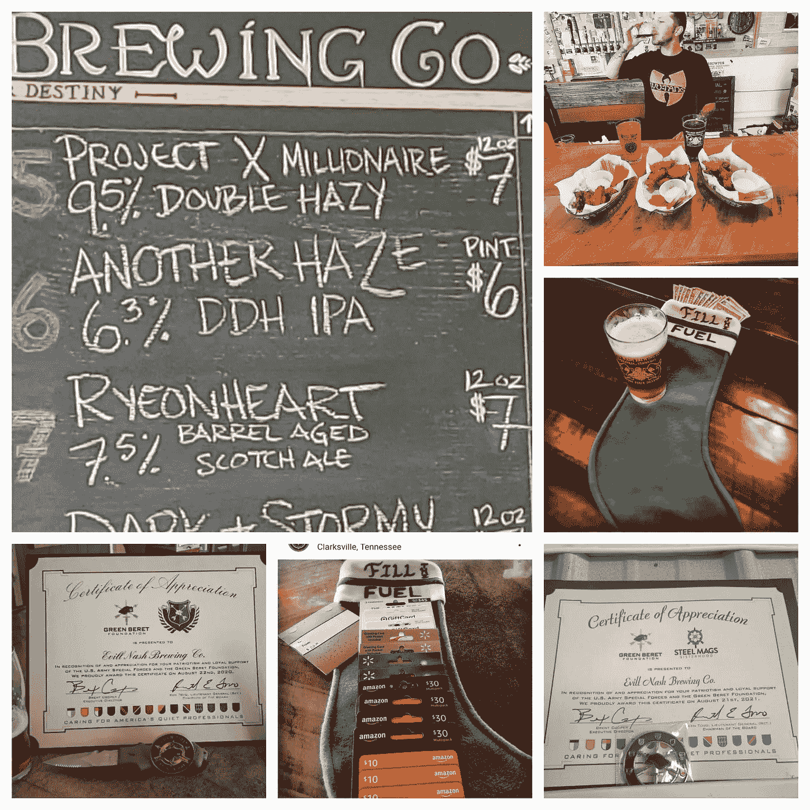

# 隐性被动收入如何发挥作用

> 原文：<https://medium.com/coinmonks/how-crypto-passive-income-makes-a-difference-67a37ec9016c?source=collection_archive---------4----------------------->

随着 COVID 猖獗，政府被迫关闭正在扼杀全球各地的小企业，我发现自己处于一个有趣的位置。幸运的是，我得到了一份被归类为“关键基础设施”的好工作，同时也是两个伟大的被动创收加密游戏的一部分，我非常幸运。

当我与我的一位朋友聊天时，他曾在我们共同的朋友拥有的一家啤酒厂兼职，他告诉我，由于停工，他们很可能不得不关闭啤酒厂并永远关门，因为外卖订单来得太慢，他们无法负担得起订购更多啤酒酿造所需的啤酒花…

> 所以，我问这个订单要花多少钱，考虑了一会儿，想象着一个人带着一个家庭失去了他的生意，其他几个人也失去了工作……这是一个简单的选择。我付了运费。

这家企业挺过了余下的停工期，随着某种“常态”开始回归 TN，这家企业开始比以前更加繁荣。他们之前联系过我以回报我，对此我告诉他们要像以前一样继续回报他们的社区。最近，他们找到我，说他们正在为我酿造一种啤酒，并让我给这种啤酒命名。非常谦卑，我选择将其命名为 ***项目 X 百万富翁*** ，因为这是最新的项目，让我能够继续我所珍视的捐赠方式。

这里有几张田纳西州克拉克斯维尔市令人惊叹的 Evill Nash 酿酒公司的照片，以及他们为社区做的一些令人惊叹的事情。现在只要记住，这篇文章不是为了吹嘘或炫耀任何人，但我真的希望这能让你感觉良好，并有动力去帮助你周围的人。分享祝福，永远向前付出。

> 加入 Coinmonks [电报频道](https://t.me/coincodecap)和 [Youtube 频道](https://www.youtube.com/c/coinmonks/videos)了解加密交易和投资

# 另外，阅读

*   [如何开始通过加密贷款赚取被动收入](https://coincodecap.com/passive-income-crypto-lending)
*   [加密货币储蓄账户](/coinmonks/cryptocurrency-savings-accounts-be3bc0feffbf) | [加密交易机器人](https://coincodecap.com/best-crypto-trading-bots)
*   [BigONE 交易所评论](/coinmonks/bigone-exchange-review-64705d85a1d4) | [CEX。IO 审查](https://coincodecap.com/cex-io-review) | [Swapzone 审查](/coinmonks/swapzone-review-crypto-exchange-data-aggregator-e0ad78e55ed7)
*   [最佳比特币保证金交易](/coinmonks/bitcoin-margin-trading-exchange-bcbfcbf7b8e3) | [比特币保证金交易](https://coincodecap.com/bityard-margin-trading)
*   [加密保证金交易交易所](/coinmonks/crypto-margin-trading-exchanges-428b1f7ad108) | [赚取比特币](/coinmonks/earn-bitcoin-6e8bd3c592d9)
*   [WazirX vs CoinDCX vs bit bns](/coinmonks/wazirx-vs-coindcx-vs-bitbns-149f4f19a2f1)|[block fi vs coin loan vs Nexo](/coinmonks/blockfi-vs-coinloan-vs-nexo-cb624635230d)

# 关于 ProjectX

ProjectX 旨在成为一个核心的 Defi 生态系统，为所有实体提供可持续的被动收入机会。ProjectX 最初是作为 NaaS(节点即服务)/DaaS (DeFi 即服务)的混合体而构建的，现在正迅速扩展到游戏化的公用事业和区块链的 TradFi/FIAT 访问。ProjectX 目前有超过 350，000 个节点运行并保护 AVAX 网络。

通过访问 [projectx.financial](https://projectx.financial/) 或阅读我们在[projectxbook.gitbook.io/whitepaper](https://projectxbook.gitbook.io/whitepaper/)的白皮书来了解更多关于 ProjectX 的信息。

通过不和谐加入讨论[discord.gg/projectxfinance](http://discord.gg/projectxfinance)

在 twitter.com/projectxfinance 的推特上关注我们