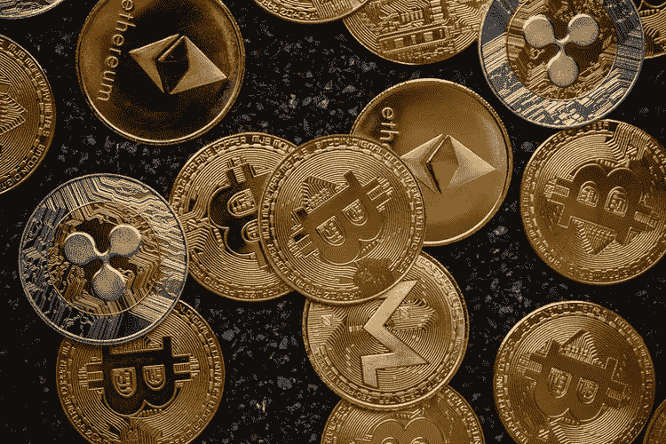
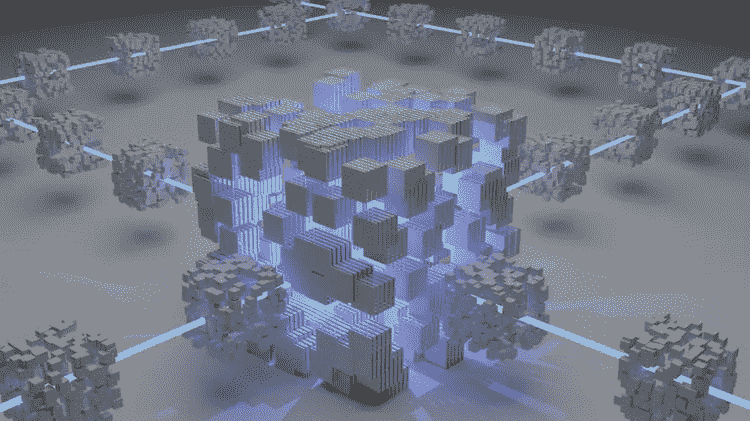
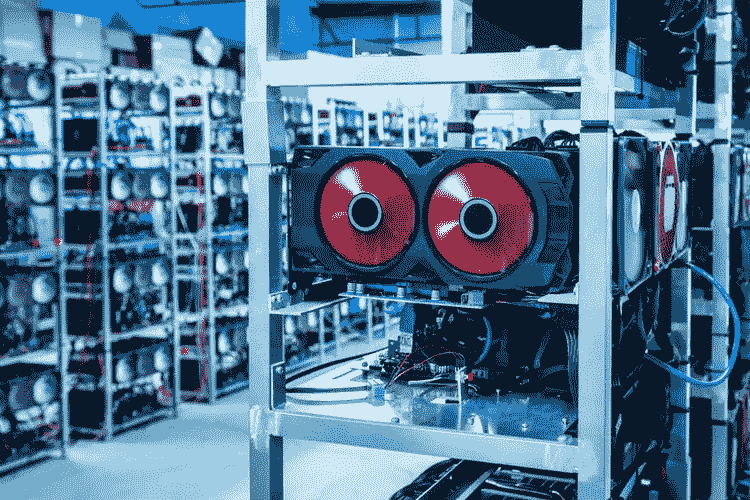
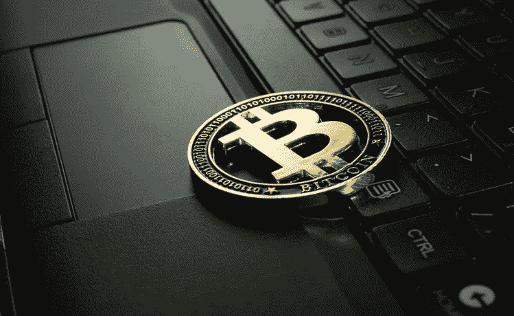
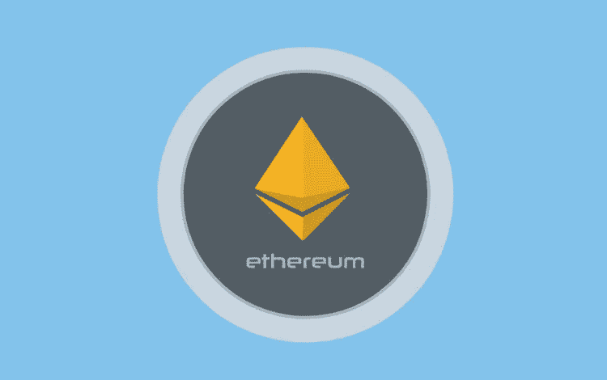
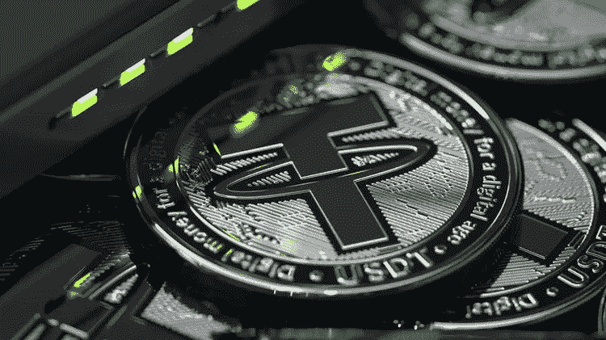
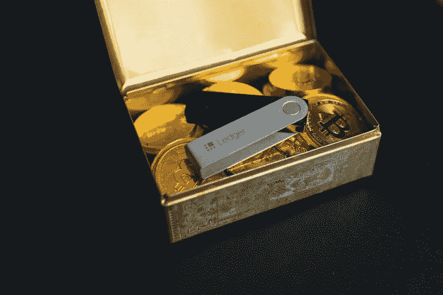

# 加密货币如何为初学者工作:你需要知道的一切

> 原文：<https://medium.com/coinmonks/how-cryptocurrency-works-for-beginners-754b1c4eae89?source=collection_archive---------29----------------------->

每次你打开新闻、阅读报纸或浏览你的推特，你很可能会看到关于比特币价格的故事。我知道我有。你甚至可能有朋友投资于这种旗舰加密货币。或者你自己可能已经在游戏中有一些皮肤。不管是哪种情况，加密货币的世界不仅仅是最初的硬币引发了加密热潮。随着对加密投资的热情越来越高，小投资者和首次投资者获得一些关于这项革命性金融技术如何工作的宝贵见解非常重要。在这里，我谈论的是这一革命性技术的所有版本:从比特币和以太坊等久经考验的大人物，到新兴的 NFT 市场。

本文将分解 crypto 的基本概念，以帮助您理解这项创新技术。

# 什么是加密货币？

尽管听起来复杂得多，但加密货币本质上只是数字现金。为了应对 2008 年的大金融危机，一名程序员或一群程序员(没有人能 100%确定是谁创造了比特币)决定发明一种数字货币，这种货币将不再需要银行或金融机构。程序员希望设计一种新的点对点的货币交换方式，而不是依赖第三方来监督金融交易。于是最初的加密货币比特币诞生了。加密货币依赖于区块链技术，该技术本质上类似于存储加密货币交易的公共 Excel 电子表格。每个人都可以看到区块链上正在进行的交易，这些交易的记录将永久保存。简而言之，加密货币是一种不需要银行的数字化交易方式。

# 加密货币是如何工作的？

网络中的每个人都可以访问不断发展的公共记录，称为分类账。只有当复杂的密码难题被解决并且网络中的其他用户/计算机达成共识时，才能将交易添加到分类帐中，这需要大量的计算能力。以至于通过伪造交易进行欺诈所需的电力使欺诈变得不经济，因此，欺诈不会真的发生。

假设你想买一些比特币。你将连接到网络，网络上的计算机将通过让网络用户解决密码难题来验证你的交易。一旦这个难题被解决，并且工作被其他网络用户的共识所验证，该事务被添加到一个数据块，并且该数据块被添加到现有的先前事务的链中，这被称为区块链。解决复杂的密码难题，网络中许多用户/计算机的共识，以及完成所有这些工作所需的能量，这些都被称为“工作证明”它保证了区块链的安全。

# 区块链是如何工作的？

简而言之，区块链是一系列相互关联的信息块。将这些块视为存储事务记录的容器会有所帮助。平均每个区块存储 500 笔加密货币交易。所有模块以验证链序列正确的方式连接。这是什么意思？在将最新的信息块添加到链中之前，它会检查前一个块中的信息，这也会对前一个块进行同样的检查，依此类推。那么，区块链就是一系列完整的存储信息。它的美妙之处在于，它使得存储在区块链的所有东西都是可追踪的、永久的、不可改变的。因此，它使加密货币成为一种高度透明和可信的货币。

# 什么是加密货币挖矿？

正如其名称中的“挖掘”部分所暗示的那样，加密货币挖掘是精心处理比特币的过程，以期获得经济回报。比特币依靠挖掘来确认新交易和更新区块链账本。比特币矿工使用复杂的计算系统来审计非常复杂的交易“块”。如果他们是第一个处理信息块的人，比特币矿工将获得比特币形式的奖励。然后这个过程重新开始。从本质上说，他们获得报酬是为了保持整个系统的诚实。正是这个挖矿系统，让比特币保持了去中心化和点对点，并独立于第三方金融机构。加密货币挖掘不仅有助于认证比特币交易的合法性，也是将新比特币带入流通的唯一途径。

# 加密货币的主要优势

由于其分散的结构，加密货币可能能够提供许多解决方案:

**减少腐败:**加密货币寻求通过在大量网络参与者之间共享权力来克服绝对权力的问题。毕竟，这是区块链技术的基本概念。

**让人们控制自己的财务:**加密货币没有中央权威，这意味着只有你可以访问你的资金。

**消除中间人:**当你转移传统货币时，银行或数字支付服务等中介机构会获得一定比例的佣金。对于加密货币，区块链的所有网络参与者都充当中介；他们的薪酬结构与法定货币中介不同，因此相比之下微不足道。

**为没有银行账户的人服务:**世界上很大一部分人缺乏银行等金融机构的服务，或者服务有限。加密货币旨在通过将分散金融带到全球每个角落来解决这一问题，让任何拥有手机的人都可以开始参与金融系统。

# 你必须知道的三大加密货币

## 1.比特币(BTC)

*市值:超过 7420 亿美元*

比特币是一种以电子方式创建、持有和转移的数字货币。

它是第一个分散的点对点支付网络，由用户驱动，没有中央机构或中间人。

## 2.以太坊

市值:超过 3080 亿美元

以太坊是一个运行智能合同的去中心化平台，智能合同是自动执行的合同，双方之间的协议条款直接写入代码。

以太坊旨在实现点对点交易，而无需中间人，如银行和其他金融机构。以太坊的联合创始人维塔利克·布特林(Vitalik Buterin)将它描述为“第一个实际的区块链应用”。

## 比特币 vs 以太坊:有什么区别？

虽然两者都是虚拟、分散的货币形式，也称为加密货币，并且都利用区块链技术来推动金融交易，但比特币和以太坊之间存在一些主要差异。这两种加密货币之间最大的区别之一是所谓的“块时间”——比特币交易需要几分钟才能得到验证和处理，而以太坊则需要几秒钟。为了进一步区分自己，以太坊将在 2022 年转向“利益证明”(POS)协议。POS 使用[标桩](https://www.thecryptopie.com/post/proof-of-work-vs-proof-of-stake)而不是挖掘来验证交易。这与比特币的“工作证明”(POW)协议不同，后者耗费的精力和时间要多得多。

## 3.系绳(USDT)

*市值:超过 800 亿美元*

Tether 是最大的稳定币，也是市值第三大的加密货币。你可以把稳定币看作是加密货币和传统货币之间的桥梁。稳定硬币是数字货币，其价值由现实世界的资产支持，通常是美元。稳定硬币之所以得名，是因为它们的价值是通过它们所代表的现实世界的资产来稳定的。除了与其他加密形式的易失性相比具有相对稳定性之外，稳定硬币的其他优势还包括:

*   更容易理解的概念。
*   它们是现有法定支持货币的数字化形式。
*   与传统的真实世界货币不同，它们可以在加密钱包之间即时转移。

然而，与传统加密不同，稳定硬币受到第三方机构的严格监管和监督。

# 加密硬币与代币

一些人可能会对加密货币硬币和代币之间的区别感到困惑。这是因为这两个术语经常互换使用。然而，两者之间有一些重要的区别。

加密硬币和代币的主要区别在于加密硬币使用自己的区块链，而加密代币不使用。

本质上，硬币是一种加密货币，在其自身的区块链网络中充当记账单位。例如，比特币在自己的区块链上运行，以太网也是如此，以太网在自己的以太坊区块链上运行。

硬币开发了自己的基础设施，可以选择如何保护自己免受攻击，如何管理它们的供应，如何处理或记录它们的交易，以及奖励谁。

另一方面，加密令牌通常是一种资产的表示，而不是一种交易手段。一种常见的代币是 Tether，这是一种稳定的硬币，最初建于以太坊区块链，是美元的加密表示。它最常用于交易其他加密货币，而不必担心价格波动。因此，与硬币不同，代币可以选择不“绑定”于特定的区块链，这给了它们更多的自由，也让交易变得更简单。

# 什么是 NFT？

不可替代的代币，或 NFT 是数字资产，可以创建、购买和出售，用于现实世界的货币。他们名字中“不可替代”的部分意味着他们实际上是 1 对 1。它们是独一无二的，拥有经过认证的所有权，是不可替代的。另一方面，可替代资产可以与同类资产互换。这里有一个例子来进一步说明这一点。假设我借给你 1 美元，请你明天还我。我不指望得到和我昨天给你的一美元一模一样的钞票。因为现金是可替代的，你可以给我任何旧的 1 美元，我会很高兴。NFT 就不是这样了！这使得他们成为在元宇宙做生意的一个非常有吸引力的选择。它们是独特的数字资产，具有商定的价值，其所有权是经过认证的。完美的未来数字世界，在那里现金交易是不可能的！

# 元宇宙看了一眼

《冰雪奇缘》的作者尼尔·斯蒂芬森(Neal Stephenson)的工作设想了一个基于虚拟现实的互联网的继任者，这在今天看来要现实得多。技术通常为人类提供一个新的视野，并且总是随着时间的推移而进步。许多专家指出，元宇宙是我们可以朝着这个方向迈出的下一步。通俗地说，元宇宙就是一个不断模拟信息的共享虚拟世界。在未来，我们将能够用 VR 工具创建我们自己的宇宙，即使我们离线，也能让它们持续存在。这些世界将是持久的，独立于我们的设备而存在。据预测，元宇宙将成为我们未来日常生活的一部分，因为它将为我们提供一个与来自世界各地的其他人交往和探索不同现实的机会。

这一概念现在正由脸书和苹果等公司开发，它们正在激烈竞争，以率先发布可行的产品。据预测，到 2025 年，元宇宙将成为一个万亿美元的产业。

# 如何避免被 NFT 骗局愚弄

拉拽。抽水和倾倒。抄袭的 NFTs。如果你不知道这些是什么，或者你没有遇到过这些事情，那你应该觉得自己很幸运。NFT 骗局在加密领域越来越常见。有些人甚至赚了数百万美元，愚弄了很多人。在这一部分，我们将分析一些最常见的 NFT 骗局，以及如何避免它们。这样，你就可以知道要注意什么，这样你就不会成为 NFT 骗局的下一个受害者。

## 地毯拉手

一个 NFT 地毯拉本质上是一个 NFT 骗局，开始于开发商作出大量的声明，甚至可能在市场上发布看起来非常有前途的数字资产。随着越来越多的投资者卷入这场骗局，创始人只是带着资金跑路。承诺的项目从未实现。

## 如何避免这个 NFT 骗局

投资前做足功课！调查项目背后的开发商的资质和声誉。此外，请注意以下事项:

*   较长的流动性锁定期。
*   项目白皮书。
*   少数投资者拥有 NFT 的大部分资产。
*   可疑的高额赌注奖励。
*   可疑的网站。

## 哄抬股价

令人失望的是，泵和转储方案现在在密码世界中司空见惯。现在他们是无良经营者的一个有利可图的 NFT 骗局。这种类型的 NFT 骗局运作时，一个集团购买了大量的 NFT，以人为抬高其价值，推动需求。在此之后，骗子会在知道价格处于峰值时抛售，给投资者留下一文不值的资产。

## 如何避免这个 NFT 骗局

你需要检查历史和 NFT 项目的记录。OpenSea 可以让你找到 NFT 收藏的总交易量和买家数量。你要找的是很多投资人。这意味着良好的[流动性](https://www.investopedia.com/terms/l/liquidity.asp)。在脸书、Twitter、Discord 等网站上关注 NFT 项目。它是否有一个积极参与、真实可信的社区来确保其价值有机增长？

## 抄袭的 NFT

不幸的是，这个 NFT 骗局越来越受欢迎。越来越多的艺术家[报告](https://dnyuz.com/2022/02/08/the-counterfeit-nft-problem-is-only-getting-worse/#:~:text=For%20as%20long%20as%20NFTs%20have%20existed%2C%20artists,to%20rack%20up%20billions%20of%20dollars%20in%20sales)他们的作品被骗子窃取并转化为非功能性作品。然后，这些股票被出售给投资者，他们认为自己是在购买真实交易的所有权。将一件艺术品铸造成 NFT 是一个非常简单的过程。但这并不意味着这个人拥有知识产权。骗子正在窃取艺术家的知识产权，并创建假的 OpenSea 帐户来销售他们伪造的 NFT。

## 如何避免这个 NFT 骗局

同样，在购买 NFT 之前做必要的背景调查是很重要的。艺术家是否有一个蓝色勾号来表示他们在 OpenSea 上的验证状态？你甚至可以通过 Twitter、Instagram、在线等方式“跟踪”这位艺术家。看看你能否证明这些艺术品是属于他们的。最后，你甚至可以直接联系他们，询问 NFT 的艺术品是否是他们的。

谁也不想被骗走自己的血汗钱。同时，谁也不想错过下一笔大投资。骗子们正在利用投资者在 NFT 市场一夜暴富的希望。这就是为什么做自己的研究很重要。只有当你 100%确定这是一个真正的机会时，才投资。哦，永远保护你的私人信息的安全。

# 保护您的密码安全

## 什么是加密钱包？

乍一看，加密钱包似乎很简单。对于外行人来说，合乎逻辑的结论是，加密钱包是存储加密货币的数字钱包。但这并不完全正确，因为你的密码资产位于区块链。那么，加密钱包意味着什么呢？好吧，加密钱包保存你的钥匙，而不是加密货币。

此时，解释一下这些键是什么可能会有所帮助。“密钥”是一串字母数字字符，用于接收和发送加密货币。它就像是你银行账户的账号，但是它没有附加任何个人信息。它们证明了你对数字货币的所有权，并允许你进行交易。这些密钥可以是公钥，也可以是私钥。公钥允许您接收加密货币交易。任何人都可以向公钥发送交易，但你需要私钥来证明你是交易中收到的加密货币的所有者。

## 为什么加密钱包很重要？

答案很简单:安全。这是因为您的私钥证明了您的所有权，并且因为没有附加个人信息，所以您希望尽可能地保持它的安全性和可访问性。请始终记住，如果您丢失了您的私钥，您将无法使用您的资金！

## 如何使用加密钱包？

第一步是找到你想使用的加密货币钱包。

加密货币钱包主要有三种类型:

**纸钱包:**钥匙写在纸上，存放在安全的地方。这将是最安全的选择，但不是最实用的，因为它使使用您的加密变得困难。

**硬钱包:**密钥保存在一个硬件设备上，保存在一个安全的地方，只有当你需要使用密码时才会连接到电脑。这里的主要目标是在安全性和便利性之间取得平衡。

**软钱包:**钥匙存储在应用程序或其他软件中。这比其他两个选项安全性低，因为它更容易被黑客攻击，但它对用户更友好，你不必担心钱包放错地方。

**#2:第二步是按照提供商的指示，按照指示设置你的钱包。**

第三步也是最后一步是开始发送和接收加密！

# 加密货币的风险

加密货币的世界充满了风险和机遇。有这么多的硬币和代币可供选择，很难知道哪些值得投资。投资前做研究是确保你不会赔钱的一种方法。

对于那些看到研究价值但不确定从哪里开始的人，我在下面用三个简单的步骤解释了我的研究方法。

## 第一步。确定你需要什么类型的信息。

研究加密硬币或代币的第一步是确定你想了解它的什么。您需要快速了解市场概况，还是需要更深入的信息？如果你想快速浏览一下，那么 [CoinDesk](https://www.coindesk.com/) 和 [CoinTelegraph](https://cointelegraph.com/) 是很好的资源，因为它们对加密货币有很好的指导。如果你想要更深入的信息，那么[比特币杂志](https://bitcoinmagazine.com/)和[比特币论坛](https://bitcointalk.org/)是很好的起点。

这是一个帮助你研究你感兴趣的加密硬币或代币的列表。

*   *查看*[*Coinmarketcap*](https://coinmarketcap.com/)*了解硬币的价格、交易量和市值。*
*   *查看*[*GitHub*](https://github.com/)*库中的硬币代码。*
*   *检查电报组的硬币或代币更新。*
*   找出硬币或代币的作用。
*   找出它是如何工作的。
*   找出谁是这个项目的幕后黑手。
*   *找出一个*[*ICO*](https://www.investopedia.com/news/what-ico/)*(初始投币)筹集了多少钱。*
*   人们对它有哪些评价？

## 第二步。为你的研究找到最好的信息来源。

有很多地方可以找到关于加密货币的信息。然而，并不是所有的都可靠。因此，了解哪些信息来源可以信任，哪些应该避免是很重要的。

这里有一些很好的加密研究资源:

*   *CoinMarketCap:它拥有任何给定加密货币性能的最新数据。它还提供关于市值、交易量等有价值的信息。*
*   [*coincheck up*](https://coincheckup.com/)*:这是一个提供各种加密货币深度研究报告的在线平台。*
*   BitcoinTalk 论坛:这是现存最古老的加密货币论坛之一，自 2009 年成立以来一直是爱好者讨论的中心。

## 第三步。当涉及到冒险时，检查你的舒适程度。

所有投资，包括加密硬币和代币，都有一定程度的风险。如果你想投资加密货币，你应该意识到你可能会损失部分或全部资金。

> 做自己的研究有助于减轻这些风险，但它不会完全保护你。然而，承担风险的回报是更大投资回报的潜力。

# 最后的想法

加密货币市场是一个不稳定的市场。它不适合胆小的人。很多人都亏了钱，还有更多的人因此被市场吓跑了。

在投资任何加密货币之前进行研究并了解与之相关的风险非常重要。你也应该意识到没有保证，如果你不采取适当的预防措施，你可能会失去你所有的钱。

# 推荐书籍

如果你想要更多的资源，我提供了一些帮助我理解上面讨论的概念的书的链接。它们是附属链接，所以如果你决定使用它们并购买，我会在不增加你的成本的情况下赚取一小笔佣金。但老实说，我推荐这些书，因为它们有助于建立我的密码知识，并且已经是我个人图书馆的一部分。

《金钱:虚构事物的真实故事》雅各布·戈尔斯蒂安著

[区块链泡沫或革命:比特币、区块链和加密货币的未来](https://www.amazon.ca/gp/product/0578528150/ref=as_li_tl?ie=UTF8&camp=15121&creative=330641&creativeASIN=0578528150&linkCode=as2&tag=fusuy-20&linkId=94d745cf7e56662d00b28b0c36416c0d)Neel Mehta、Aditya Agashe 等人。

[数字现金:创造加密货币的无政府主义者、乌托邦主义者和技术专家的不为人知的历史](https://www.amazon.ca/gp/product/0691209162/ref=as_li_tl?ie=UTF8&camp=15121&creative=330641&creativeASIN=0691209162&linkCode=as2&tag=fusuy-20&linkId=1c63880ff51c9804a543ca0e75e0038c)作者普林斯顿大学出版社

加密货币时代:比特币和区块链如何挑战全球经济秩序

[炒作:骗子、诈骗犯和骗子是如何接管互联网的――以及我们为什么要关注加布里埃尔·蓝石的](https://www.amazon.ca/gp/product/B0886GP76M/ref=as_li_tl?ie=UTF8&camp=15121&creative=330641&creativeASIN=B0886GP76M&linkCode=as2&tag=fusuy-20&linkId=e6f813f2a8f20cc87fe2036e4ba2fb20)

[比特币标准:中央银行的分散化替代方案](https://www.amazon.ca/gp/product/B07D82KD3X/ref=as_li_tl?ie=UTF8&camp=15121&creative=330641&creativeASIN=B07D82KD3X&linkCode=as2&tag=fusuy-20&linkId=d8fa39558941ab87f3f957c588060146)

[NFT 手册:如何创造、销售和购买不可替代代币](https://www.amazon.ca/NFT-Handbook-Create-Non-Fungible-Tokens/dp/111983838X?_encoding=UTF8&qid=&sr=&linkCode=ll1&tag=fusuy-20&linkId=b8b3d6e890405796dcdf9a36ac75c96b&language=en_CA&ref_=as_li_ss_tl)

 [## 你准备好迎接加密经济了吗？加密派

### 每次你打开新闻，阅读报纸，或者浏览你的推特，你很可能会看到一些故事…

www.thecryptopie.com](https://www.thecryptopie.com/) 

> 加入 Coinmonks [电报频道](https://t.me/coincodecap)和 [Youtube 频道](https://www.youtube.com/c/coinmonks/videos)了解加密交易和投资

# 另外，阅读

*   [币安交易机器人](/coinmonks/binance-trading-bots-d0d57bb62c4c) | [OKEx 评论](/coinmonks/okex-review-6b369304110f) | [Atani 评论](https://coincodecap.com/atani-review)
*   [最佳加密交易信号电报](/coinmonks/best-crypto-signals-telegram-5785cdbc4b2b) | [MoonXBT 评论](/coinmonks/moonxbt-review-6e4ab26d037)
*   如何在 Bitbns 上购买柴犬(SHIB)币？ | [买弗洛基](https://coincodecap.com/buy-floki-inu-token)
*   [CoinFLEX 评论](https://coincodecap.com/coinflex-review) | [AEX 交易所评论](https://coincodecap.com/aex-exchange-review) | [UPbit 评论](https://coincodecap.com/upbit-review)
*   [十大最佳加密货币博客](https://coincodecap.com/best-cryptocurrency-blogs) | [YouHodler 评论](https://coincodecap.com/youhodler-review)
*   [AscendEx 保证金交易](https://coincodecap.com/ascendex-margin-trading) | [Bitfinex 赌注](https://coincodecap.com/bitfinex-staking)