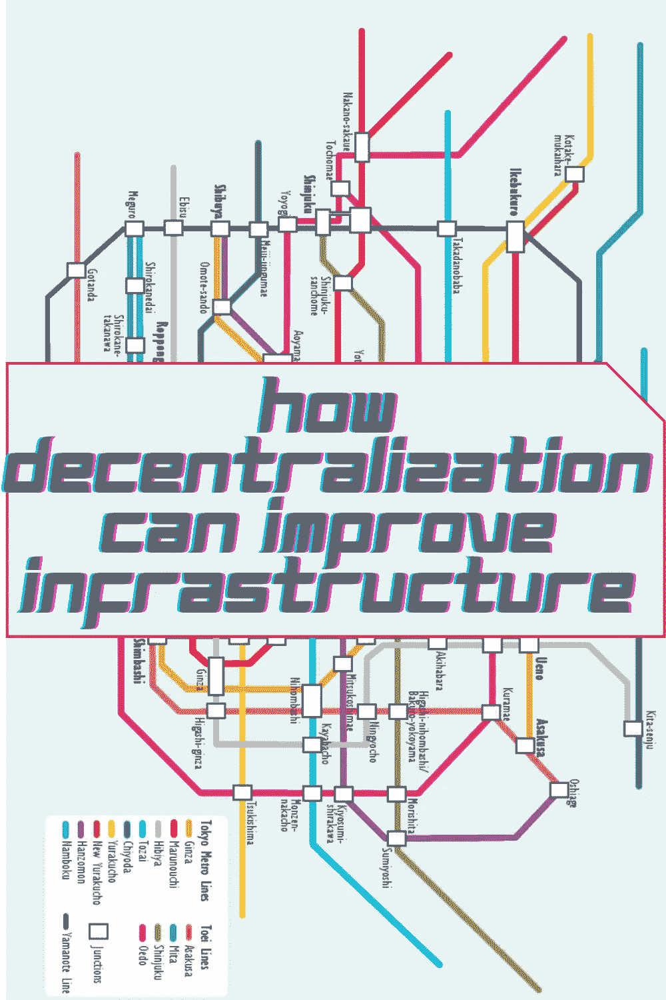

# 权力下放如何改善基础设施

> 原文：<https://medium.com/coinmonks/how-decentralization-can-improve-infrastructure-4fd9f235f680?source=collection_archive---------36----------------------->

Tokyo Train Map

# 介绍

新技术承诺以前所未有的方式将人类联系在一起。但是，尽管我们现在可以在世界各地即时通信(有时甚至跨越时区)，但物理移动仍然受到地理上受限制的基础设施的限制。问题不在于基础设施本身(尽管这肯定需要一些工作)，而在于我们如何以集中的方式组织它。去中心化的基础设施正在到来；这就是为什么它会比我们现在拥有的更好:

# 问题

主导世界数十年的既定基础设施模式效率低下、成本高昂且不可扩展。在这种模式中，所有的权力都集中在一个控制一切的中央机构中。这使得它很容易被利用:你可以让一家公司通过利用它对你的信息的垄断来控制你的所有数据；你可以为水电等基本服务支付超出必要的费用，因为没有竞争压低价格；即使您认为您的数据在这个系统中是安全的，它们仍然容易受到黑客攻击和破坏，因为有太多的访问点，攻击者可以进入您的网络。

解决办法？去中心化！

# 集权问题

是时候真正了解权力下放能为你带来什么了。

*   效率低下。当一个组织完全负责整个系统时，就没有制衡了。它可能会犯错误，或者试图在没有任何人帮助的情况下玩弄系统。
*   缺乏创新。另一方面，当许多不同的组织或利益相关者有自己的利益时，他们可能更愿意尝试新的想法——如果成功实施，可以为你的生活增加价值的想法！
*   缺乏透明度:对于没有直接参与中央集权系统的人(比如纳税人)来说，很难理解关起门来发生了什么——以及为什么某些决定有时看起来如此不透明！

# 复杂性增加=更多问题

虽然复杂性可能会增加可能出错的事情的数量，但它也增加了解决问题所需的时间和成本。一个复杂的系统有更多的活动部件，因此会有更多的变量导致出错。当问题出现时，这可能会导致识别和修复问题的延迟。这也意味着培训新员工将需要更长的时间，因为每个人都必须接受复杂系统各方面的培训，而不仅仅是他们在系统中的特定角色。

与更大的复杂性相关的成本增加是相似的:因为在生产或服务交付的每一步都有更多的参与者，所以运营成本也相应增加。例如，当通过中间供应商从另一家公司购买货物时，比如说一个管理两家制造商之间库存的中间人，每一方都需要支付费用(例如处理付款)才能完成交易；这些费用增加很快，因为在 A 点(制造商)和 B 点(客户)之间的每个阶段都有多方参与。

# 解决方法

例如，你可以分散你的发电厂和输电线路。这些昂贵的基础设施建在远离使用地点的地方，并且需要大量的维护。但是，如果你在有需要的人附近建造小型发电站，并通过更小的电线传输能量，你就可以通过降低成本和提高效率来省钱。

另一个选择是分散你的供水系统。对于城市来说，通过大直径管道(可能花费数亿美元)从远处的水库输水并不罕见，因为这比在离家和企业更近的地方建造小直径管道更容易——但这最终会提高消费者的价格，因为维护这样一个庞大的系统有固定成本，即使在任何给定的时间使用不到一半！

# 如何放权？

*   下放决策权。例如，假设你是一个市政府，你想修建一条新的道路。不要让所有的决定都由几个人做出，而是把责任分散到你社区的每个人身上。也许他们能够想出更好的办法来使用那块土地，或者如何更好地提供通过该地区的安全通道。
*   分散实施。不要自己修路，让人们自己修路——但要确保有一些基本标准，这样汽车仍然可以安全使用！
*   分散资金:除了你自己的委员会成员或党员之外，为其他人(或许多其他人)创造一种激励，他们希望他们的项目尽快得到资金，因为他们很快就要竞选连任(甚至可能是今年)。这里的激励措施可以包括，如果某些类型的开发发生在你所在城市范围内的某些地理区域，就可以降低税收；如果同样的事情在另一个地区没有发生，税收会更高；为愿意建造经济适用房的开发商提供税收减免；为那些需要帮助来开始他们自己的副业项目的公民提供资助…

# 做到这一点的最佳方式是分散基础设施，但保持规模经济

做到这一点的最佳方式是分散基础设施，但保持规模经济。虽然每个公司都运行自己的服务器是低效的，但是如果一个公司拥有所有的服务器也是低效的。

去中心化可以通过区块链技术(如以太坊或 Monero)来实现，它可以让遍布世界各地的独立设备相互交互，而不依赖于一个中央权威机构(如谷歌)。其结果是，计算机系统可以直接相互通信，也可以与用户通信，而不需要任何个人计算机来管理它们。这降低了成本并提高了安全性，因为不再有一个中心点可供攻击者攻击。

区块链还允许在全球不同企业或地点运行软件应用程序的计算机轻松共享数据；这意味着公司可以在任何地方使用人工智能工具，而不必担心数据的物理位置。"

# 结论

正如我们已经看到的，分散化可以在许多方面改善基础设施。它可以通过将资源从中央机构中释放出来用于其他需要的领域来提高效率。它还可以通过更好的交通流量管理来增加交通容量和减少拥堵。此外，由于集中化带来的管理成本的降低，它还将降低成本。

分散化是全球运输系统的未来，我们在这里帮助塑造它！

> 加入 Coinmonks [电报频道](https://t.me/coincodecap)和 [Youtube 频道](https://www.youtube.com/c/coinmonks/videos)了解加密交易和投资

# 另外，阅读

*   [5 款最佳加密交易终端](https://coincodecap.com/crypto-trading-terminals) | [最佳 DeFi 应用](https://coincodecap.com/best-defi-apps)
*   [最佳网上赌场](https://coincodecap.com/best-online-casinos) | [币安评论](/coinmonks/binance-review-ee10d3bf3b6e) | [BitMEX 评论](https://coincodecap.com/bitmex-review)
*   [麻雀交换评论](https://coincodecap.com/sparrow-exchange-review) | [纳什交换评论](https://coincodecap.com/nash-exchange-review)
*   [美国最佳加密交易机器人](https://coincodecap.com/crypto-trading-bots-in-the-us) | [变化回顾](https://coincodecap.com/changelly-review)
*   [在印度利用加密套利赚取被动收入](https://coincodecap.com/crypto-arbitrage-in-india)
*   [Godex.io 审核](/coinmonks/godex-io-review-7366086519fb) | [邀请审核](/coinmonks/invity-review-70f3030c0502) | [BitForex 审核](https://coincodecap.com/bitforex-review)