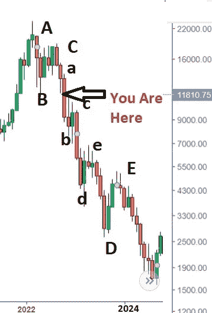
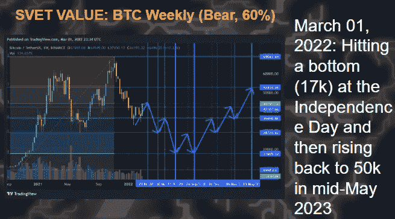

# 我们能潜入多深？

> 原文：<https://medium.com/coinmonks/how-deep-can-we-plunge-c571fdef2dd9?source=collection_archive---------65----------------------->

SVET is the Light, by Svet and Victor

人们在问:

> 我们能在加密市场中走多远？

自从 BTC 上线以来，我们从未处于如此大胆的宏观状态。因此，为了回答这个问题，我采用了 2000 年至 2002 年期间的纳斯达克 100 期货对数图(当时科技股暴跌，但宏观经济看起来没有现在这么糟糕),并绘制了经典的埃利奥特 5 波结构图。之后，我在新的图表上叠加了 2022-24 的刻度。

这是我得到的两张照片:

Projected 2022–2024 NASDAQ

2000 年至 2002 年，纳斯达克 100 指数从 5200 点跌至 780 点(下跌 85%)。

对 2022-2024 年的预测给出了 1500 英镑的底部(比当前水平减少 88%，比 2021 年顶部减少 94%)。

当然，我用的这个‘分析法’很粗糙。尽管如此，BTC 还是紧随纳斯达克之后。因此，我可能会将 BTC 在 2021 年牛市期间达到的顶部(约 69，000 美元)的 88%(或 **8，280** 美元)作为 2024 年预期熊市底部的近似值。

从好的方面来看，历史永远不会重演。让我们希望它不会押韵。

[另外，请注意，大多数分析师预计纳斯达克将在夏季中/结束时在大约 7000 点(3000 S&P 点)见底。

我的乐观预测是在 2022 年 3 月制定的:

I am still assigning to the optimistic one the ~60% probability.

我仍然认为这个乐观的预测有大约 60%的可能性。

然而，自 3 月份以来，宏的情况越来越糟。所以，现在，我也必须考虑到这一点。]

## 发布后评论:

我已经从本出版物的读者那里收到的后续问题是:

> 我们会重复 1929-1932 年引发大萧条的市场崩溃吗？

在 1929 年 10 月至 1932 年 7 月的大萧条期间，DJIA 从 10 月 24 日的水平下跌了 90%。这与我在预测中对纳斯达克的预测相差不远。此外，NSADAQ 在 2000 年至 2002 年间也遇到过这种情况(两年内下降了 85%)。因此，重复 1929 年至 1932 年的市场崩盘根本不是“不可想象的”。

然而，现在的宏观因素与 1930 年代大不相同。例如，2022 年美国实际国内生产总值(不包括通胀)为 18，384.7 万亿美元(而 1939 年为 1，110.2 万亿美元)。(来源:[https://www . statista . com/statistics/1031678/GDP-and-real-GDP-United States-1930-2019/](https://www.statista.com/statistics/1031678/gdp-and-real-gdp-united-states-1930-2019/))

因此，2021 年的人均(人口加权)约为 5 万美元(183.85 亿美元/3.31 亿人)。1939 年只有 8409 美元(11102 亿美元/132164569 人)。

这意味着如今人们从“实体”部门获得的收入是 100 年前的 5 倍(平均)。这使得股市崩盘(当股票升值的“账面利润”蒸发时)对美国家庭的损害比 1930 年代小得多。

*顺便说一句，这也让美联储过时了。技术进步已经在经济上赋予了“普通”美国消费者更多的权利，远远超出了我们需要一个“保姆”来控制我们如何花“午餐钱”的程度。*

[**欲知更多，请访问:**](https://svetrating.com/reports_all/Latest/)**[**【https://svetrating.com/reports_all/Latest/】**](https://svetrating.com/reports_all/Latest/)**

> **加入 Coinmonks [电报频道](https://t.me/coincodecap)和 [Youtube 频道](https://www.youtube.com/c/coinmonks/videos)了解加密交易和投资**

# **另外，阅读**

*   **[如何在印度购买比特币？](/coinmonks/buy-bitcoin-in-india-feb50ddfef94) | [瓦济克斯审查](/coinmonks/wazirx-review-5c811b074f5b)**
*   **[隐翅虫替代品](/coinmonks/cryptohopper-alternatives-d67287b16d27) | [HitBTC 审查](/coinmonks/hitbtc-review-c5143c5d53c2)**
*   **[CBET 评论](https://coincodecap.com/cbet-casino-review) | [库科恩 vs 比特币基地](https://coincodecap.com/kucoin-vs-coinbase)**
*   **[折叠 App 审核](https://coincodecap.com/fold-app-review) | [Kucoin 交易机器人](/coinmonks/kucoin-trading-bot-automate-your-trades-8cf0ca2138e0) | [Probit 审核](https://coincodecap.com/probit-review)**
*   **[如何匿名购买比特币](https://coincodecap.com/buy-bitcoin-anonymously) | [比特币现金钱包](https://coincodecap.com/bitcoin-cash-wallets)**
*   **[币安 vs FTX](https://coincodecap.com/binance-vs-ftx) | [最佳(索尔)索拉纳钱包](https://coincodecap.com/solana-wallets)**