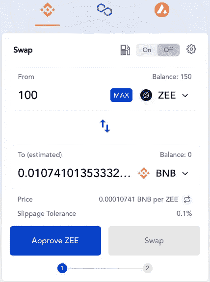
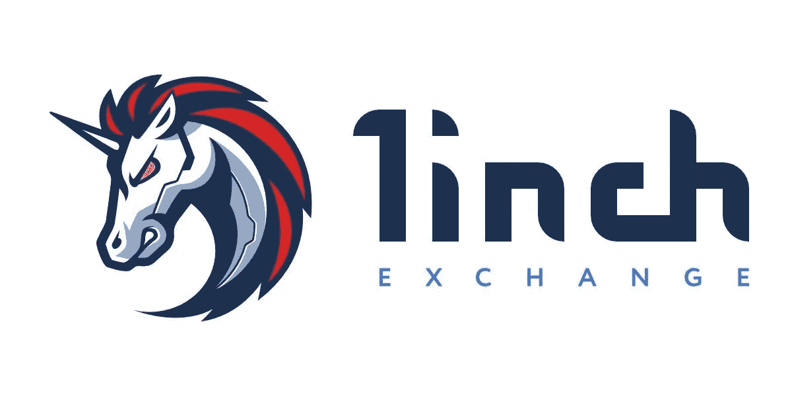
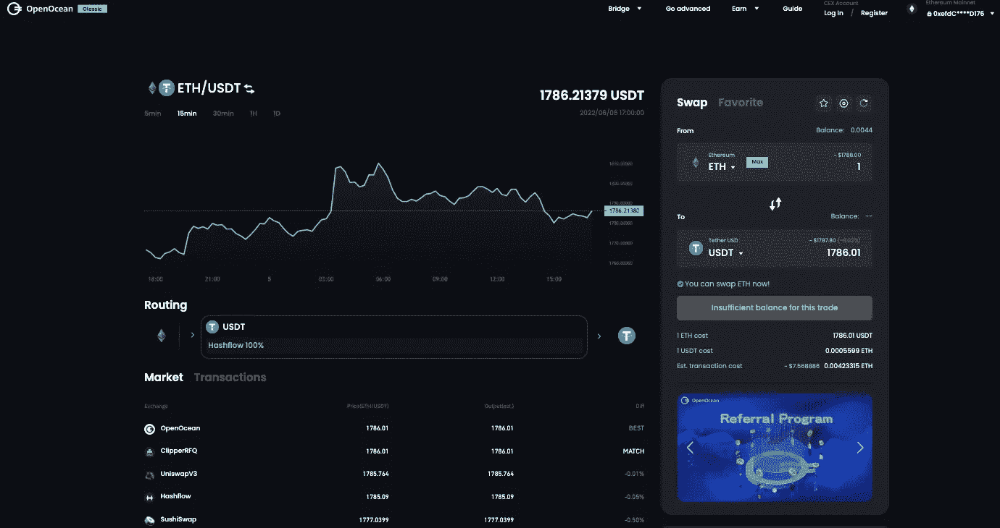
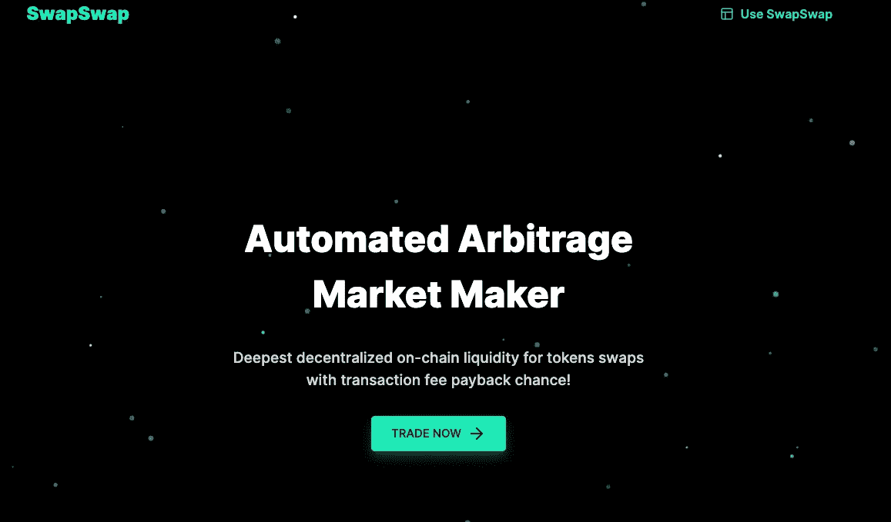
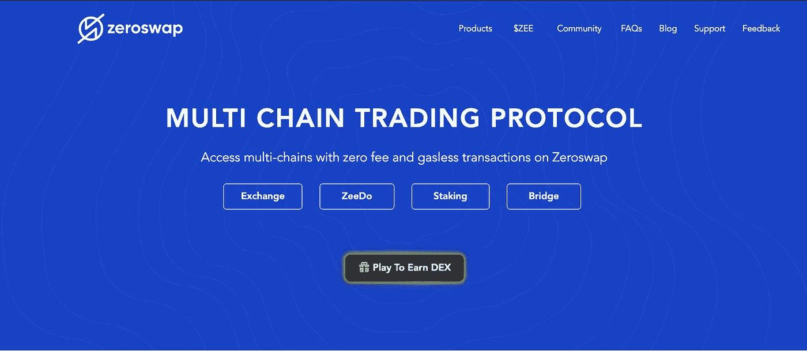
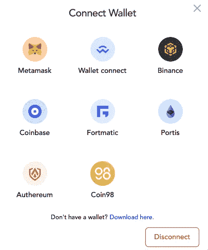
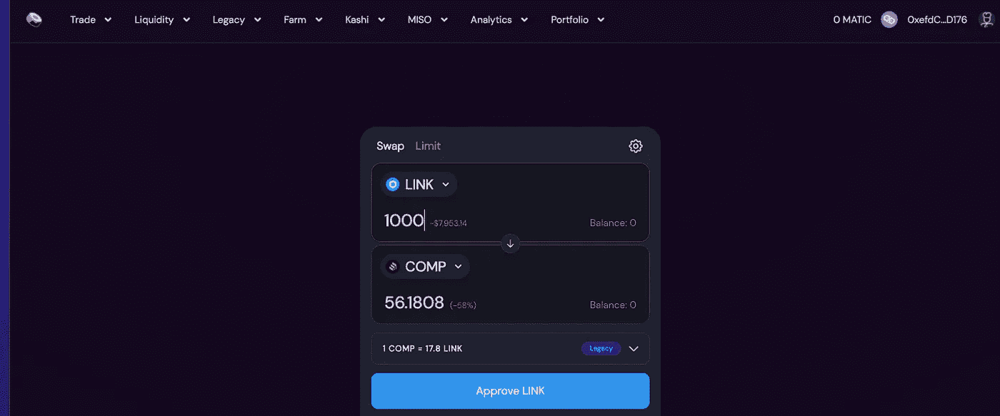
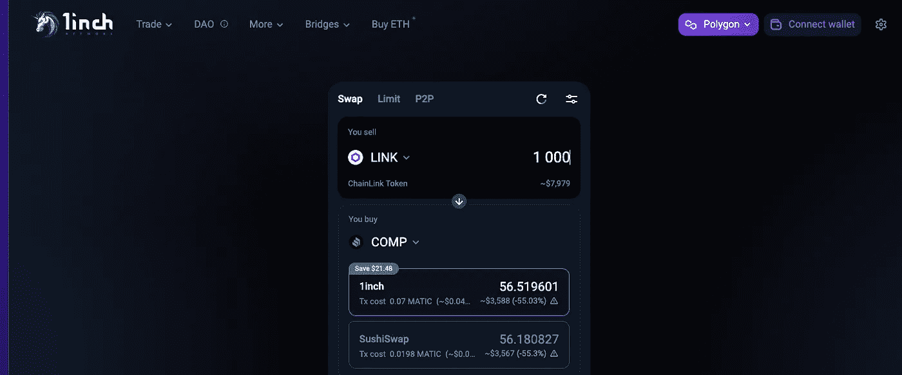

# DEX 聚合器如何席卷 DeFi 空间:一篇比较论文

> 原文：<https://medium.com/coinmonks/how-dex-aggregators-took-defi-space-by-storm-a-comparative-essay-66e9c5c8f6de?source=collection_archive---------40----------------------->

DEX Aggregators 是 bourgeoning DeFi 工具包的最新成员之一，帮助交易者享受更高的流动性和更好的交易。

在这篇博客中，我们将首先巩固我们对 DEX 和 DEX 聚合器的理解，然后继续比较一些最流行的 DEX 的产品。

从我们脑海中闪现的第一个问题开始…

# 什么是 dex？

dex，即分散式交换，利用 web3 协议的力量从交换过程中去除中央机构和中介。或者，他们抢夺自己的决策权，交给智能合约中的一些代码行。

在任何市场交易中，人们必须考虑两个重要的参与者——首先是**价格接受者**(交易者)，其次是**做市商**(交易对手)。

假设你想以每股 1000 英镑的价格购买 10 股 XYZ 股票。如果没有做市商，你就必须等待愿意以要价或更高的价格出售 10 股股票的卖家。卖方也是如此。你猜对了！这将是非常低效的🤕。

做市商为中央交易所提供流动性，提高其效率。然而，他们也可以利用[买卖价差](https://www.investopedia.com/terms/b/bid-askspread.asp)操纵证券价格😈。dex 使用订单簿模型、自动做市商(AMMs)和流动性池来促进*高效的*和*分散的*交易。你可以在这里阅读更多关于 dex[的内容](https://101blockchains.com/decentralized-exchanges/)。

dex 的另一个重要亮点是，与中央加密交易所(如比特币基地和币安)不同，dex 不将资金管理的责任委托给托管人或中介机构——我们，所有者，在我们所谓的非托管钱包中管理我们的资金，如 [Metamask](https://metamask.io/download/) 。

使用 dex，我们可以更安全、更匿名地交换加密货币。DEX 的例子包括 UniSwap、PancakeSwap、SushiSwap 等。(这个数字每周都在快速上升)。访问 [exchange.zeroswap.io](https://exchange.zeroswap.io/swap) 试试他们的 DEX！😀

A snapshot of token swap on ZeroSwap DEX.

然而，一些大的缺点来自于 dex 的低流动性和薄订单规模。结果？高价格波动和滑点。滑点是交易的显示成本和交易执行时的实际成本之间的差异。你可以在这里了解更多信息[。在大多数 dex 中，用户可以为交易设置滑点容差(百分比)。](https://coinsutra.com/glossary/slippage-tolerance/)

现在我们对 dex 有了一些了解，让我们看看什么是聚合器。

# 了解 DEX 聚合器

“我在哪里可以得到最好的交易价格？🤔"

*“我在哪里可以得到最低的交易滑点？*🤔*"*

在本文撰写之时，有 216 只指数在 [CoinMarketCap](https://coinmarketcap.com/rankings/exchanges/dex/) 上市。流动性不同的每个平台提供不同的汇率、交易费和汽油费(取决于网络，如 Avalanche、Polygon、币安智能链等。)

自然，我们想知道哪个平台提供的交易成本最低。然而，手动检查所有指标以获得最佳比率是没有效率的。

这就是 DEX 聚合器的用武之地。

有史以来第一个 DEX 聚合器， [1inch](https://app.1inch.io/) 是在 2019 年的 EthNewYork 黑客马拉松中建立的。正如他们的创始人所回忆的那样—*“1 inch 的建立是为了创造一种优雅的算法，来搜索每个指数，寻找最佳交易价格，并立即进行优化交易。”*

> *DEX Aggregators 可以用来找到价格最优、交易成本和滑点最低的密码。*

# 聚合器是如何工作的？

假设您想比较不同平台的航空公司价格。我们该怎么办？我们用谷歌搜索，谷歌航班为我们汇总了众多航空公司的数据，以找到对我们最有利的交易。

**聚合器没什么不同！**

他们从一系列指数中收集数据，为交易提供尽可能好的价格。如果交易量足够大，他们会让用户选择将交易分成小块，以获得优化的互换成本。还有许多其他金融工具，如收益农业、流动性挖掘、套利优化等。单个聚合器可以提供给交易者。

> *主要功能是在尽可能短的时间内，为用户提供比任何特定 DEX 更好的掉期利率。*

# DEX 聚合器的类型

**脱链**

*   它们提供了很大的灵活性，因为从大型网络集合数据很容易。
*   由于其集中的结构，它们提供的安全性较低。
*   抢先交易是交易员关心的一个问题。
*   例如 1 英寸、Paraswap 等。

**链上**

*   他们提供原子路由，即使用智能合约在一次交易中从一个区块链到另一个交换加密货币。
*   他们还提供套利服务。它包括利用不同平台上的不同掉期利率。
*   随着索引数量的增加，它们会变得非常低效。
*   例如 ZeroSwap、SwapSwap 等。

有了一些基础知识，让我们继续比较其中的一些吧！

# 1.1 英寸交换

1inch 在加密领域领先于 DEX 聚合器。**它是一个链外聚合器，提供最好的跨交易所流动性和掉期利率**。它目前支持一个 stag **2491** 不同的令牌对。它支持 **5 B** 锁链网络和 **16** 不同的钱包。你可以在[这篇](https://coinsutra.com/best-crypto-dex-aggregator/)帖子中找到更多关于他们的细节。

交易所对基金的买卖或提取不收取任何费用。但是，如果交易路线包括收取一些平台费用的指数，用户需要支付这些费用。

用户还需要支付煤气费。Gas 是所有以太坊网络的本地货币。你可以把这些网络看作一台世界计算机，拥有极其强大但有限的资源。因此，为了使用这些资源，我们需要支付汽油费。

*油费是使用(或不使用)平台的决定因素！*

为了保护贸易商免受高额汽油费的影响，1inch 推出了 **CHI 汽油代币**。如果用户使用 CHI 支付交易费用，他们可以减少高达 42%的交易成本。1inch 还允许用户通过向流动性池提供流动性，从**收益农业**中获得回报。

# 2.开阔海洋

OpenOcean Exchange 的快照

OpenOcean 是加密领域第一个完全聚合的交易所。**它是一家链外聚合商，从 dex 以及比特币基地和币安等 cex 获取流动性。**这有助于他们为用户提供最佳的交换率和最小的滑动成本。

它目前支持 **143** 不同的令牌对。它支持 **9** 区块链网络。要了解更多关于它所支持的 CEXs 和 dex 的信息，你可以访问这个页面。OpenOcean 向所有用户提供套利服务。

用户需要在 OpenOcean 上支付网络的**全额气费**。

除了通常的交换，OpenOcean 还向用户提供诸如农业生产、保险和贷款等服务。

访问他们的[文档](https://docs.openocean.finance/)页面，详细阅读 OceanOcean。

# 3.SwapSwap

**SwapSwap 是一个完全分散的链上 DEX 聚合器。它从 Uniswap 和 SushiSwap 获取流动性，为交易寻找最佳价格。**

SwapSwap 声称平均节省了 90%的交易费用。如何？嗯，他们是一个自动套利做市商，这基本上意味着我们在 SwapSwap 上做的每一笔交易，它都会在交换令牌的同时自动执行最佳套利。

访问 SwapSwap 的[主页](https://swapswap.org/)了解更多关于该项目的细节。

# 4.零交换

**ZeroSwap 是一个链上 DEX 聚合器，专注于通过使用** [**交易费用挖掘**](https://news.bitcoin.com/transaction-fee-mining-exchanges-highly-popular-highly-controversial/) (之前由 FCoin、BitForex、Coinsuper、Coinbene 等平台使用)**，使零费用交易成为可能。**它从多个指数中获取流动性，并向其用户提供尽可能好的费用。

它支持 4 个区块链网络—

1.  以太坊
2.  理科学士
3.  多边形
4.  雪崩

它还支持 8 种不同的钱包—

ZeroSwap 拥有自己的 ZEE 令牌。当用户在他们的平台上购买和购买 ZEE 令牌时，他们可以在不同的网络上享受无气交易。目前，用户每月可以获得 300 次交换，而无需使用 ZEE 令牌。

ZeroSwap 还提供类似 ZeeDo 的服务，ZeeDo 是 dex 推出自己令牌的平台。**随着免费交易，当用户入股 ZEE 时，他们可以获得高 APY，并有限访问优质项目的 IDO。**

# 那么指数聚集者真的比个体指数更好吗？

要回答这个问题，让我们动手尝试交换代币😃。

## 多边形网络上用复合物交换链接(链环)

1.  Uniswap 交换机

*2.75771 COMP for 1000 LINK on UniSwap*

2.SushiSwap 交换机

*56.1808 COMP for 1000 LINK on SushiSwap*

显然，SushiSwap 提供了更好的互换利率。现在让我们用两个聚合器来比较一下。

3.1 英寸指数聚合器

*56.5196 COMP for 1000 LINK on 1inch*

4.ZeroSwap 指数聚合器

*56.3456 COMP for 1000 LINK on ZeroSwap*

## 观察—

1.  由于深度流动性，各指数综合指数的掉期利率是相同的。
2.  单个 dex 的结果可能会因令牌对而有很大差异。这是因为指数中的流动性取决于有限合伙人贡献的令牌对的流动性池，这可能因平台而异。

**显然，与单个指数相比，指数综合指数提供了更一致、更可靠的掉期利率。**

DEX 聚合器也为用户提供了广泛的金融工具。

单个 dex 允许用户通过向像 LINK-COMP 池(如我们的案例中所使用的)这样的令牌对池提供流动性来获利。流动性提供者从每一笔代币互换中获得固定的百分比。

如前所述，DEX 聚合器还提供保险、借贷、桥梁等功能。成为所有 DeFi 相关服务的一站式解决方案。

# 结论

这个博客旨在让读者了解 dex 和聚合器，并比较一些著名的聚合器的交易成本。

我们可以看到大多数平台不仅仅是聚合器。这可能是因为这个领域还处于起步阶段。尽管许多交易者已经跳进了加密之旅，但大多数人还没有加入。

在一个降低交易成本一直是平台主要推动力的市场，ZeroSwap 通过提供 100%的汽油折扣赢得了交易。

在价格和功能的一致性方面，指数聚合器优于单个指数。

我希望这个博客已经提供了信息。

下次见。

# 进一步阅读

[买卖价差— Investopedia](https://www.investopedia.com/terms/b/bid-askspread.asp)

[流动性池——币安](https://academy.binance.com/en/articles/what-are-liquidity-pools-in-defi)

[交易费挖掘—比特币新闻](https://news.bitcoin.com/transaction-fee-mining-exchanges-highly-popular-highly-controversial/)

[什么是滑移— DexNetwork](https://dexenetwork.medium.com/what-is-slippage-and-why-does-it-matter-uniswap-example-43e32d712651)

> 加入 Coinmonks [电报频道](https://t.me/coincodecap)和 [Youtube 频道](https://www.youtube.com/c/coinmonks/videos)了解加密交易和投资

# 另外，阅读

*   [WazirX vs CoinDCX vs bit bns](/coinmonks/wazirx-vs-coindcx-vs-bitbns-149f4f19a2f1)|[block fi vs coin loan vs Nexo](/coinmonks/blockfi-vs-coinloan-vs-nexo-cb624635230d)
*   [本地比特币评论](/coinmonks/localbitcoins-review-6cc001c6ed56) | [加密货币储蓄账户](https://coincodecap.com/cryptocurrency-savings-accounts)
*   什么是融资融券交易
*   [支持卡审核](https://coincodecap.com/uphold-card-review) | [信任钱包 vs 元掩码](https://coincodecap.com/trust-wallet-vs-metamask)
*   [Exness 评测](https://coincodecap.com/exness-review)|[moon xbt Vs bit get Vs Bingbon](https://coincodecap.com/bingbon-vs-bitget-vs-moonxbt)