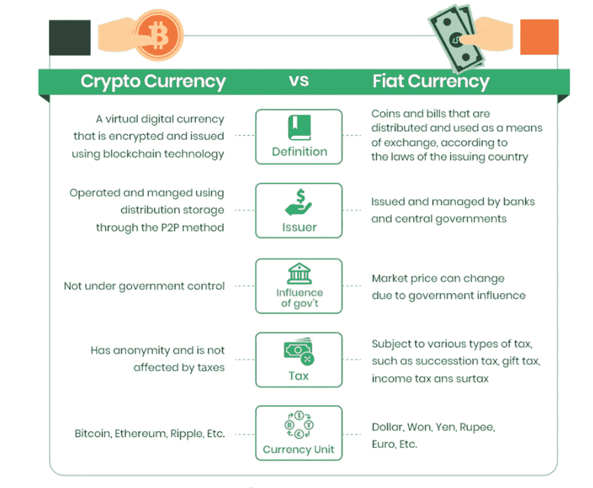

# 比特币是如何成为加密货币的代名词的？

> 原文：<https://medium.com/coinmonks/how-did-bitcoin-become-synonymous-with-cryptocurrency-d27ea398effd?source=collection_archive---------68----------------------->

**作者 SoFer Yashika Chugh，未来学校内容写作实习生**

**Crypto** 是这个时代的流行语。它一直在这里和那里制造出百万富翁，让我们其他人感到被遗忘在狂热之中。然而，有许多人在没有适当知识的情况下随波逐流，损失了金钱，提示*莱特币*信徒。

在这个 Web3.0 的世界里，我收到的最好的建议来自 CZ，他建议我们去 **DYOR** ( *自己做研究*)。对于那些不知道 CZ 的人来说，他就是币安的**创始人赵昌鹏**。这个 DYOR 计划很好地告诉了你你的钱去了哪里。

为了更好地了解这个主题，有必要首先了解加密货币与法定货币(*政府发行的货币*)的区别:

1.  菲亚特既可以数字交换**也可以物理交换*，而 crypto 只能数字交换*。**
2.  **法定货币由*纸币和硬币*代表，而加密货币由*一个单独的公共和私人代码*代表。**
3.  **加密货币是由计算机开采的，而法定货币是由政府铸造的。**
4.  **法定货币的价值由*市场和法规*决定，而加密货币的价值由*供求*决定。**
5.  **两者之间的主要区别在于，法定货币是集中的，这意味着它受法律 T33 管辖，并可以由银行控制，而加密货币是分散的，不受任何政府或银行 T35 管辖。**

**既然我们理解了 Fiat 和 Crypto 的区别，让我们看看比特币是如何发展到今天的。**

1.  **比特币是市场上最受欢迎的加密货币类型。它可以在没有政府干预的情况下实现快速和匿名的交易，并大大降低了中间商的角色。**
2.  **比特币原本打算用作数字支付系统，但任何熟悉其**价格波动**的人都明白，这是不可行的。**
3.  **比特币于 2009 年首次出现在市场上，尽管在此之前还有其他加密货币，但没有一种被证明是有用的。比特币也是在 2008 年金融危机期间推出的，当时人们对政府失去了信任，因为他们认为政府印刷了太多钞票，导致了危机。比特币作为政府监管的法定货币的解决方案获得了关注。**
4.  **这些交易确保了**高水平的安全性**,因为没有支付可以撤销，所有数据都存储在一个中央分类账中，任何人都不能更改，并且用户的数据不会在这个过程中泄露。**
5.  ****供给和需求的经济学是很好建立的**；只能开采 2100 万个比特币，开采激励每四年减半。目前有 1800 万比特币在流通，由于每天都有大量交易发生，需求每天都在增加。**

**由于这些因素，比特币能够在加密时代占据领先地位，并成为该术语本身的代名词。**

**然而，它也有许多缺点，从**由于**诈骗的增加而引起的安全顾虑**到可扩展性**本身。比特币尚未证明其作为长期投资的价值，其波动性使其**不适合短期投资**。**

**结果，我们又回到了我们开始的同一页， **DYOR** 。每当你进入加密货币投资和交易的世界时，这是一个你应该记住的术语。**

> **加入 Coinmonks [电报频道](https://t.me/coincodecap)和 [Youtube 频道](https://www.youtube.com/c/coinmonks/videos)了解加密交易和投资**

# **另外，阅读**

*   **[CryptoHopper 替代品](/coinmonks/cryptohopper-alternatives-d67287b16d27) | [HitBTC 审查](/coinmonks/hitbtc-review-c5143c5d53c2)**
*   **[CBET 评论](https://coincodecap.com/cbet-casino-review) | [库库恩 vs 比特币基地](https://coincodecap.com/kucoin-vs-coinbase)**
*   **[折叠 App 审核](https://coincodecap.com/fold-app-review) | [Kucoin 交易机器人](/coinmonks/kucoin-trading-bot-automate-your-trades-8cf0ca2138e0) | [Probit 审核](https://coincodecap.com/probit-review)**
*   **[如何匿名购买比特币](https://coincodecap.com/buy-bitcoin-anonymously) | [比特币现金钱包](https://coincodecap.com/bitcoin-cash-wallets)**
*   **[币安 vs FTX](https://coincodecap.com/binance-vs-ftx) | [最佳(索尔)索拉纳钱包](https://coincodecap.com/solana-wallets)**
*   **[比诺莫评论](https://coincodecap.com/binomo-review) | [斯多葛派 vs 3Commas vs TradeSanta](https://coincodecap.com/stoic-vs-3commas-vs-tradesanta)**