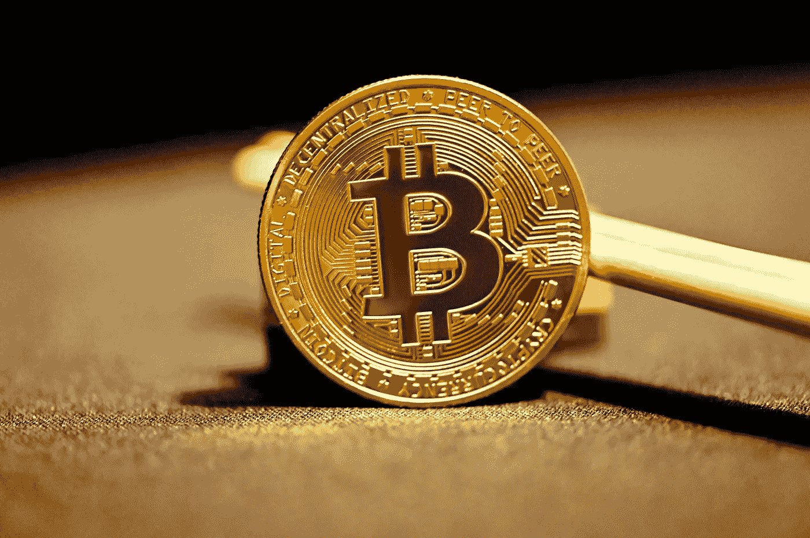

# 比特币是如何成为领先的加密货币的？

> 原文：<https://medium.com/coinmonks/how-did-bitcoin-become-the-leading-cryptocurrency-ab0a1327079e?source=collection_archive---------74----------------------->

Source photo Unsplash.com

在加密领域，比特币是王者。了解比特币如何保住其最受欢迎的加密货币的地位。"

作为世界上最受欢迎的加密货币，比特币可以用于支付全球各地的商品和服务。它独自催生了超过 3 万亿美元的秘密经济。比特币有时被称为世界的“储备货币”