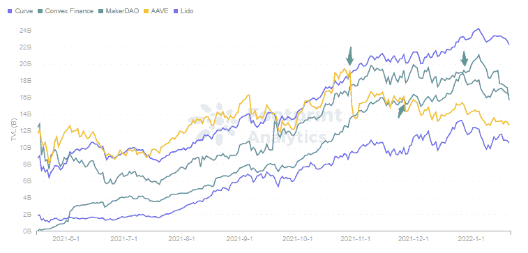
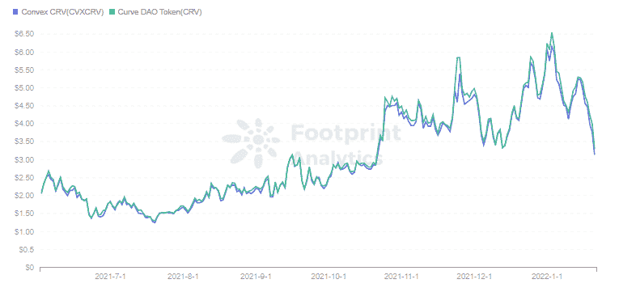
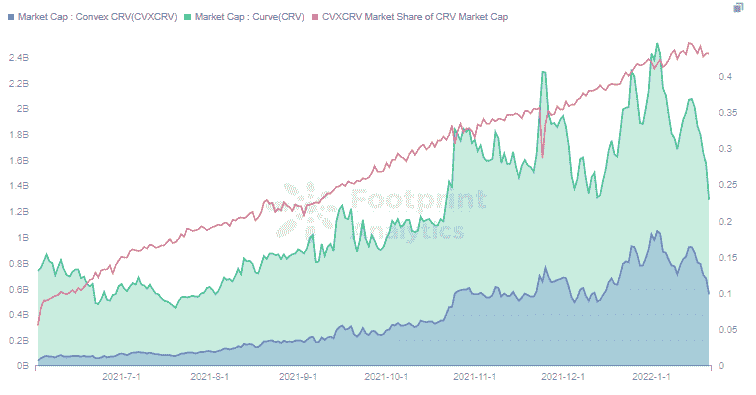
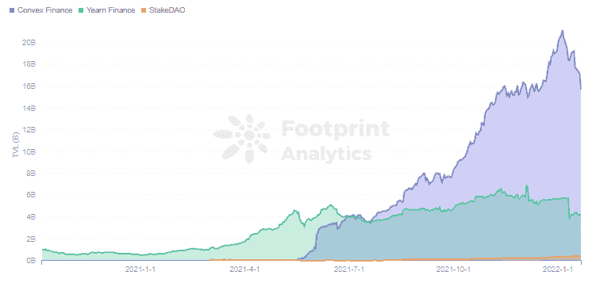
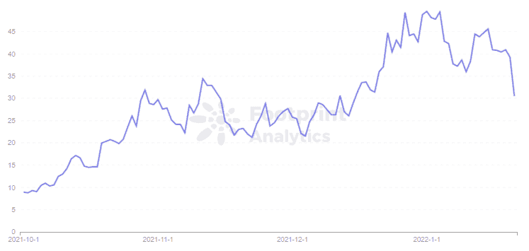
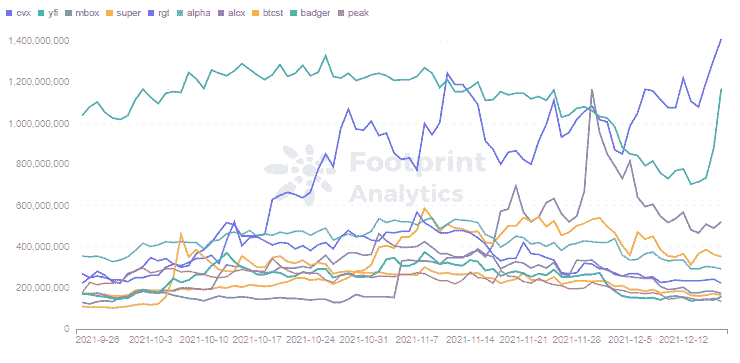

# Convex 是如何赶超 MakerDAO，Aave 和向往的？|足迹分析

> 原文：<https://medium.com/coinmonks/how-did-convex-overtake-makerdao-aave-and-yearn-footprint-analytics-e51118447d0b?source=collection_archive---------18----------------------->

描述:Convex 在 12 月底超越 MakerDAO，成为 Curve 之后的№2 项目。

2022 年 1 月 simon@footprint.network

数据来源:[足迹分析凸仪表盘](https://www.footprint.network/guest/dashboard/convex-dashboard-fp-0a32a016-e732-4680-a452-a8734f4c8a2f?days=past3months~&name=convex-finance&date=2021-12-17)

根据来自[足迹分析](https://www.footprint.network/)的数据，11 月和 12 月，曲线和[凸面](https://www.footprint.network/guest/dashboard/convex-dashboard-fp-0a32a016-e732-4680-a452-a8734f4c8a2f?days=past3months~&name=convex-finance&date=2021-12-17)的 tvl 都超过了 Aave，即之前的 1 [DeFi](https://www.footprint.network/guest/dashboard/de-fi-data-analytics-footprint-network-fp-102523be-d937-4133-bf2d-71b1c6c8886f?days=past30days&name=sushiswap) 协议。继续其强劲的势头，Convex 也在 12 月下旬超过了 MakerDAO，成为仅次于 Curve 的第二大项目。

*Footprint Analytics — TVL of Top 5 Projects*

Convex TVL 的增长与 Curve 高度相关，因为 Convex 最初是为了帮助在 Curve 上提供流动性的有限合伙人轻松赚取交易费，并在不锁定 CRV 的情况下要求增加回报。Convex 希望让有限合伙人在不损失流动性的情况下增加回报。

在本文中，我们将把 Convex 与同样被其超越的 Curve 和向往进行对比，从数据的角度分析 Convex 是如何攀升到 DeFi 第二名的。为什么向往？作为收益率聚合器中的佼佼者，[向往](https://www.footprint.network/guest/dashboard/yearn-dashboard-fp-62851bde-cc52-44a9-ae5b-5888dac32aea?days=past3months~&name=yearn-finance&date=2021-12-17)常被比作凸。

# 让每个人都可以使用曲线

在查看 Convex 之前，有必要了解一下[曲线](https://www.footprint.network/guest/dashboard/overview-of-curve-fp-f30918cf-fd44-4b26-ba6f-38c6b86b4b16?date_filter=past6months~)，这是 TVL 目前在 DEX 类别中的顶级项目，主要关注稳定点之间的互换。许多投资者喜欢曲线，因为它的低滑点，低费用和非永久性亏损。交易者和有限合伙人都在曲线上得到最好的费用。

Curve 通过发行代币 CRV 向有限合伙人提供激励。用户可以通过不可逆的 CRV 获得非循环 veCRV。获得的金额与赌注的时间长度挂钩，锁定 4 年，以 1:1 的比例获得 veCRV。

用户将为 veCRV 牺牲流动性，因为社区治理费的份额以及主要是将有限合伙人的回报提高 2.5 倍的能力。然而，最短 1 年的锁定期是一个障碍，而 Convex 可以解决这一差距。

将 LP 令牌从 Curve 存入 Convex 的用户将收到基础 Curve APR、增强 CRV APY 和 Convex 令牌 CVX。

用户还可以在 Convex 上下注 crv，并获得 CVX 作为奖励。这里的利害关系也是不可逆的。从股权中获得的 cvxCRV 就像是 veCRV 在 Convex 上的映射，但是可以在市场上交易。CRV 和 cvxCRV 的价格几乎相同，在 Uniswap 和 SushiSwap 上可以以接近 1:1 的比例交换。

*Footprint Analytics — Token Price CRV vsS cvxCRV*

用户在保持流动性的同时获得了收入的提升。对于收集了大量 CRV 的 Convex 来说，它将在 Curve 上获得足够的票数，用于跨池的激励分配。

通过足迹分析可以看出，与 CRV 相比，cvxCRV 的市值增长速度更快，达到了 CRV 的 43%。这意味着，随着近一半的用户将他们的 CRV 股份押在 Convex 上，Convex 将对 Curve 的激励分配产生重大影响。

*Footprint Analytics — Market Cap of CRV & CVXCRV*

除了解决流动性问题，凸简化了曲线复杂的操作流程，给用户带来便捷的体验。更深入的曲线分析可以在 Footprint Analytics 与 Blockchain NYC community 的联合演示中找到，“[*Defi&曲线金融分析简介*](https://www.youtube.com/watch?v=06Wxc75e1cM) ”。

# 与渴望争夺收益率聚合器的顶端

随着 DeFi 生态系统的发展，更多的令牌被添加到 Curve 的池中。Curve 目前有超过 100 个池，包括工厂池(允许任何人在 Curve 上部署而无需审查请求的无权限池)

项目要想在池中脱颖而出，争夺 veCRV 的投票是非常重要的。这导致了由[和](https://www.footprint.network/guest/dashboard/yearn-dashboard-fp-62851bde-cc52-44a9-ae5b-5888dac32aea?days=past3months~&name=yearn-finance&date=2021-12-17)领导的收益聚合平台之战。

对于项目方来说，拥有足够的 veCRV 可以让他们在社区中投票来权衡 CRV 的分配。因此，渴望也设立了 yeCRV 池，以吸收 CRV。与 Convex 类似，用户存款后将获得较高的 APY，以及可以在市场上流通的 veCRV。

但 Yield 的开创者，不到 2 个月就被凸超越了。虽然这些机制大体相同，但它们的令牌的用例略有不同。

*Footprint Analytics — Yearn vs Convex in TVL*

YFI 和 CVX 分别是渴望和凸的治理令牌，但锁定 CVX 也允许用户在 Curve 上对凸的治理决策进行投票。相当于通过 CVX 影响曲线池的激励分配，把与 CRV 的曲线上的决策移到 CVX。CVX 的价格也在攀升，截至 1 月 20 日已升至 39 美元。

*Footprint Analytics — CVX Price*

尽管 YFI 仅供应 3.3 万辆，导致价格远高于 CRV，但去年 12 月，CVX 的市值超过了 YFI。

*Footprint Analytics — Yield Token Market Cap*

截至 1 月底，看起来“渴望”已经输给了“凸”。但是，我们也可以看到，大量的向往池策略利用凸。为了提高自己厂池的收益，向往还将其 veCRV 委托给了 Convex。

# 摘要

Convex 通过以下方式成为 DeFi 的第二大项目:

1.  解决曲线桩民事登记系统的收入和流动性问题。
2.  简化曲线的复杂运算过程。
3.  通过 CVX 影响曲线池的激励分配，将侧重于曲线的投票权转移到 Convex。甚至连向往都把 Convex 纳入了自己的战略。

与曲线的紧密联系也将其风险与曲线联系在一起。一个完全依赖于其他项目的协议，无异于把自己的整个未来都交到别人手里。

在这一点上，渴望增长缓慢，但仍在利用 DeFi 世界的乐高属性继续向外建设。除了提供更多代币之外，它还在贷款方面与 Cream 建立了铁银行，并在保险方面与 Cover 合作。

对于曲线来说，凸似乎成了曲线的附属。由于 Convex 以更多票数持有更多 veCRV，似乎颠倒了主客双方的立场。

**什么是足迹分析**

足迹分析是一个一体化的分析平台，用于可视化区块链数据和发现见解。它清理和整合链上数据，因此任何经验水平的用户都可以快速开始研究令牌，项目和协议。凭借一千多个仪表板模板和一个拖放界面，任何人都可以在几分钟内构建自己的定制图表。发掘区块链数据，利用足迹进行更明智的投资。

*足迹网址:*[*https://www . Footprint . network*](https://www.footprint.network/)

*不和:*[*https://discord.gg/3HYaR6USM7*](https://discord.gg/3HYaR6USM7)

*推特:*[*https://twitter.com/Footprint_DeFi*](https://twitter.com/Footprint_DeFi)

*电报:*[https://t.me/joinchat/4-ocuURAr2thODFh](https://t.me/joinchat/4-ocuURAr2thODFh)

*Youtube:*[*https://www.youtube.com/channel/UCKwZbKyuhWveetGhZcNtSTg*](https://www.youtube.com/channel/UCKwZbKyuhWveetGhZcNtSTg)

> 加入 Coinmonks [电报频道](https://t.me/coincodecap)和 [Youtube 频道](https://www.youtube.com/c/coinmonks/videos)了解加密交易和投资

## 也阅读

 [## 2022 年 5 大最佳社交交易平台

### 5 个最佳社交交易平台阅读加密产品评论和比较，了解比特币交易和…

coincodecap.com](https://coincodecap.com/best-social-trading-platforms)  [## BlockFi 评论:2022 年的利弊和利率

### 今天，我们提出了一个全面的 BlockFi 评论，这是一个成立于 2017 年的加密贷款平台，拥有其…

coincodecap.com](https://coincodecap.com/blockfi-review)  [## 如何在印度购买比特币？2021 年购买比特币的 7 款最佳应用[手机版]

### 如何使用移动应用程序购买比特币印度

medium.com](/coinmonks/buy-bitcoin-in-india-feb50ddfef94)  [## 加密税务软件——五大最佳比特币税务计算器[2021]

### 不管你是刚接触加密还是已经在这个领域呆了一段时间，你都需要交税。

medium.com](/coinmonks/best-crypto-tax-tool-for-my-money-72d4b430816b)  [## 9 个 2022 年最值得购买的密码| CoinCodeCap

### 9 个 2022 年最值得购买的加密产品阅读加密产品评论和比较，了解比特币交易和…

coincodecap.com](https://coincodecap.com/crypto-to-buy-in-2022)  [## 存储比特币的最佳加密硬件钱包 2022 | CoinCodeCap

### 硬件钱包是我们存储加密资产的唯一可靠选择。在本文中，我们将讨论 8 个…

coincodecap.com](https://coincodecap.com/best-hardware-wallet-bitcoin)  [## Pionex 评论 2021 |免费加密交易机器人和交换

### Pionex 是为交易自动化提供工具的后起之秀。Pionex 上提供了 9 个加密交易机器人…

medium.com](/coinmonks/pionex-review-exchange-with-crypto-trading-bot-1e459d0191ea)  [## 2022 年密码交易员的三大电报渠道

### 加密信号是来自专业交易者的交易想法，以特定的价格或价格买卖特定的加密货币

medium.com](/coinmonks/top-3-telegram-channels-for-crypto-traders-in-2021-8385f4411ff4)  [## 2022 年 5 个最佳免费加密投资组合追踪器

### 在这篇文章中，我们将带你通过一些最好的免费加密投资组合追踪器，让你选择最好的…

coincodecap.com](https://coincodecap.com/free-crypto-portfolio-trackers)