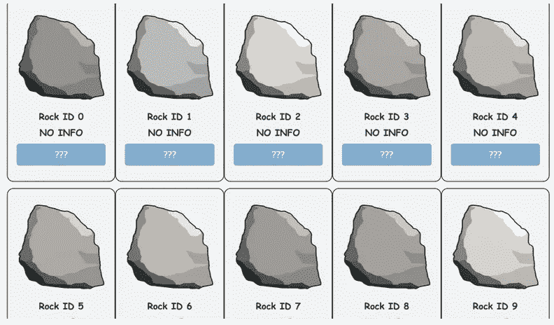
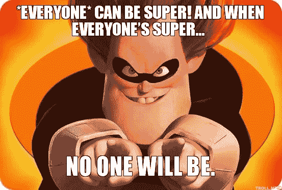
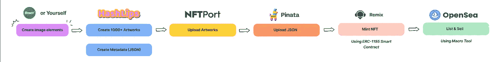
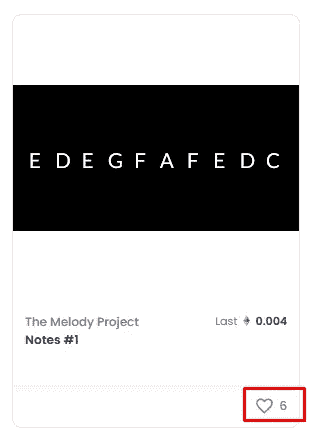

# 我是如何免费创建 NFT 收藏的(没有编码知识)

> 原文：<https://medium.com/coinmonks/how-did-i-create-nft-collection-for-free-without-coding-knowledge-65a02d4bada6?source=collection_archive---------14----------------------->

好吧，事实是，我必须付煤气费，仅此而已！不包括更多费用。

对于那些不爱阅读的人来说，下面是我展示如何阅读的视频

简单介绍一下我的收藏

> 旋律项目是随机生成的存储在链上的音乐字母音符。你可以随意使用笔记。您可以决定音符长度、拍号、调号等。
> 
> 拿到这里:[https://opensea.io/collection/the-melody-project](https://opensea.io/collection/the-melody-project)

# NFT 疯狂

我们都知道 NFT，它在去年风靡全球，直到今天，它仍然是最令人兴奋的话题之一。

虽然我们大多数人，像我一样，不知道为什么一堆图片可以卖到数百万美元，或者某人的自拍照值[100 万美元](https://www.straitstimes.com/asia/se-asia/indonesian-student%E2%80%99s-selfies-fetch-us1-million-in-nft-sales)，但不可否认的是，NFT 将留在这里，至少直到下一个“新”的东西出现。

我很想为自己设计一个 NFT 系列，因为这听起来很有趣，而且充满了“科技感”。

另一件事是，我想用尽可能少的成本。

但问题是，我不知道如何编写智能合同，或者部署它。我也不知道怎么编码。这意味着，大麻烦。

# 问题解决

为了制作 NFT 作品集，我必须解决 4 个问题

*   #1 —为本系列确定一个主题
*   #2 —让某人来绘制图层
*   #3 —通过组合图层创建图像集合。
*   # 4——把它们都铸造出来

# #1 —“如何为你的下一部大片想出一个主意？”这不再仅仅是想法的问题了。

我的第一个想法是:“拥有一个 NFT 系列很容易。只要想出一个主意，薄荷 10k 的东西，瞧，轻松赚钱！”。对吗？

不完全是！

我必须承认，为你的 NFT 提出一个想法是容易的，如何把它变成一个产生数百万美元的项目是纯粹的艰苦工作。

现在不是 2021 年初，也不是 2017 年，而一堆价值绝对为零的图片却可以价值百万。

EtherRock Collection — [https://etherrock.com/](https://etherrock.com/)

在 https://nftcalendar.io/这样的地方逛一逛，会给你下一个系列的灵感。

常见的公式是:[形容词]+[宾语]

*   【形容词】可能是“无聊”、“时髦”、“疯狂”、“酷”
*   [对象]可以是动物或东西，如“游戏机”，“猿”，“柴犬”，“伊隆”，“忍者”等。

在 OpenSea 上有几十个这样的 NFT 收藏。所以如果你想赚大钱，仅仅收藏是不够的，你必须有

*   #1 —质量:他们应该有独特的风格，使他们脱颖而出。
*   # 2——路线图:你必须超越销售 NFT，也许他们是即将到来的视频游戏的角色，或者是 web3-something 社交网络的化身，或者他们给你一份不错的被动收入。
*   # 3——营销计划:为自己创建一个不和谐的渠道，一份电报，开始通过使用赠品获得用户，向世界大声宣传你的项目，你的路线图，你的承诺。诸如此类的东西。
*   # 4——一个社区:你有一个有追随者的粉丝页面吗？很好，这样就更容易向全世界宣传你的项目，也更容易做成第一笔生意。如果你没有(像我一样)，那么考虑有一个营销计划

这些为什么重要？

因为打造 NFT 系列比以往任何时候都容易。

引用综合症最喜欢的一句话

一开始，铸造一个 NFT 很难，障碍太多，以前没有人做过。只有少数人成功了。这就是它们的特别之处。

但是当每个人都能找到一种方法去做的时候，突然就有了满满的 NFT 收藏。

不再那么特别了！

创建 NFT 系列的目的是什么？为了艺术，对吧？

不，是为了钱。

重要的是销售。

如果你什么都不是，那就没有销售。

卖，卖，卖。就这么简单。

最近我听说了一个叫做“[金字塔](https://cryptoslate.com/13-famous-artists-release-anonymous-artwork-as-an-nft-experiment-starting-at-0-33-eth/)的项目，一个试图解决这个问题的所谓“社会实验”

> “如果世界顶级艺术家把他们的名字从他们的作品中去掉，作为非艺术作品出售，他们会有任何价值吗？”

简而言之，如果你是匿名的，有没有可能有人为了艺术而购买你的 NFT 艺术品？

在我看来，这个项目很可笑，确实是营销伎俩。

它从一开始就说，金字塔计划包括来自“最喜欢的艺术家”的艺术品。

当买家已经知道你是著名的，不是最著名的，而是前 13 名艺术家之一时，还有什么是“匿名”的？

为什么他们不像其他人一样发布，然后再透露艺术家的名字？

# #2 —不会画画？问问自由职业者就知道了

NFT 作品集就是一堆由图层组合而成的图片。

例如:我们有三个选项的“眼睛”,然后与其他属性结合，一个 NFT 就诞生了。

如果你不知道如何画画，那么雇佣一个自由职业者是一种方法。

例如，跳上 [Fiverr](https://www.youtube.com/redirect?event=video_description&redir_token=QUFFLUhqa0gyS2dGNEVZaFhZSXRTeUFob2JqbE5lTl9sd3xBQ3Jtc0trSUowLWI4aERXLVhqUll4eVh3OUljenBpUTQ0eTJyOE11RWNXZjgzd1RQb0M0bldydldZWTd4dHBYakhHVDQzekoxTjQzbFNLMU1idWhyZ3M0TFNiVjhONmdZR3g5VDZfOEcxc0FWVUhUV1d0UTdGZw&q=https%3A%2F%2Fgo.fiverr.com%2Fvisit%2F%3Fbta%3D119008%26brand%3Dfiverrhybrid%26landingPage%3Dhttps%253A%252F%252Fwww.fiverr.com%252Fsearch%252Fgigs%253Fquery%253Dnft%252520art%2526pos%253D1%2526context%253Drecommendation%2526context_alg%253Drelated_search_terms%2526source%253Drelated_search_terms&v=u6NXqKUsQPs) ，你可以找到许多提供 NFT 绘画的演出。

价格从 50 美元到 1000 美元以上不等。

我只想用尽可能少的成本为自己铸造一个 NFT，所以这对我来说不是一个选项(但是如果你想要，给他们一个尝试)

"但你是如何设计出 NFT 系列的？"你问。

嗯，总结一下，我不会画画，也不想花钱也不想卖，只是想测试一下。

我得找些简单的东西。然后我就找出了“The n project”和“Loot”。

它们只有文本字符串和黑色背景，可以使用 Photoshop 或 Figma 轻松制作。

就这样[“旋律计划”](https://opensea.io/collection/the-melody-project)诞生了

# #3 —创建图像集合！是时候把手弄脏了

在谷歌上搜索了一段时间后，我发现了这个叫 codeSTACKr 的家伙的惊人的教程(他有一个完整项目的后续视频)

他牵着我的手，向我展示如何创建一个 NFT:从创建图像组合到上传图像和元数据，最后，铸造。

我学到了很多。

但只是一个小问题。

他正在使用 NFTPort.xyz，这是 NFT 造币的一站式服务，在制作那个视频的时候，NFTPort 允许你免费铸造 10k+ NFT。

现在，你可以用一个免费账户只铸造 100 英镑，要获得更多，你必须申请一个付费账户(50 美元)，每月再铸造 500 NFT，额外铸造费用为 0.075 美元

然后，一万 NFT 收集可以花费我大约

**$50 + $0.075x9500 = $761.5**

嗯，不酷。

然而，NFTPort 允许我免费上传图像，现在我只需找到另一种解决方案。

# #4-铸造变得简单

这一次，我要感谢 Neha Yadav 为我们提供了关于如何在 Polygon 上使用 ERC-1155 合约打造 NFT 系列的深入教程

她教我如何重新混合，并编制一份合同(事实证明这并不困难)。

然而，仅仅复制粘贴她的代码是不够的，因为它的方法不同于 codeSTACKss。

起初我不知道如何解决这个问题，在 [StackOverflow](https://stackoverflow.com/questions/71731951/how-to-remove-zeros-in-tokenid-in-solidity) 上提问也无济于事。

但是在几个小时的碰壁之后，我终于找到了解决办法，稍微修改了一下合同代码，然后我就可以铸造我的 NFT 了。

总结一下，这里是我的方法，以薄荷 NFT 免费。

Opensea 上的列表是使用宏工具自动完成的，因为它还不支持多边形上的 API 列表。列出一件物品，我需要大约 1 分钟，然后 15k+的收藏(是的，我有点兴奋)需要大约 10 天，用一台 24/24 运行宏软件的计算机。

顺便写这篇文章，我刚刚在 Opensea 上列出了大约 6k+ NFT。

# 你从这个实验中学到了什么？

实际上这很有趣，我花了将近一个月的时间才最终完成。

以下是我目前为止学到的东西

*   因为铸造一个 NFT 系列现在容易多了(如果我能做到，你也能！)，未来的 NFT 收藏一定会有更多有用的价值，而不仅仅是一堆图像。
*   如果你想卖掉你的 NFT，最好有一个营销计划、一个网站和一个粉丝页面(我在该系列上线的当天就卖出了 1 件，仅此而已。嗯，正如我所说，你不能指望从一个零营销，零粉丝页面的集合。:D)
*   NFT 上的赞通常来自机器人

I don’t trust this anymore

*   可以免费造币 NFT:)
*   越来越多的开发者进入智能合约开发。
*   如果你被某事卡住了，最好休息一下，睡一觉，散散步，然后再去做。

非常感谢您的关注。铸造愉快！

> *加入 Coinmonks* [*电报频道*](https://t.me/coincodecap) *和* [*Youtube 频道*](https://www.youtube.com/c/coinmonks/videos) *了解加密交易和投资*

# 另外，阅读

*   [Bookmap 评论](https://coincodecap.com/bookmap-review-2021-best-trading-software) | [美国 5 大最佳加密交易所](https://coincodecap.com/crypto-exchange-usa)
*   最佳加密[硬件钱包](/coinmonks/hardware-wallets-dfa1211730c6) | [Bitbns 评论](/coinmonks/bitbns-review-38256a07e161)
*   [新加坡十大最佳加密交易所](https://coincodecap.com/crypto-exchange-in-singapore) | [购买 AXS](https://coincodecap.com/buy-axs-token)
*   [红狗赌场评论](https://coincodecap.com/red-dog-casino-review) | [Swyftx 评论](https://coincodecap.com/swyftx-review) | [CoinGate 评论](https://coincodecap.com/coingate-review)
*   [投资印度的最佳密码](https://coincodecap.com/best-crypto-to-invest-in-india-in-2021)|[WazirX P2P](https://coincodecap.com/wazirx-p2p)|[Hi Dollar Review](https://coincodecap.com/hi-dollar-review)
*   [加拿大最好的加密交易机器人](https://coincodecap.com/5-best-crypto-trading-bots-in-canada) | [库币评论](https://coincodecap.com/kucoin-review)