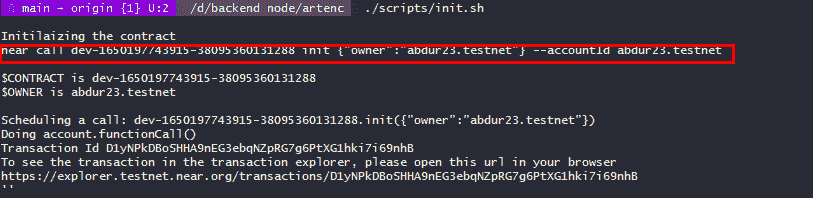
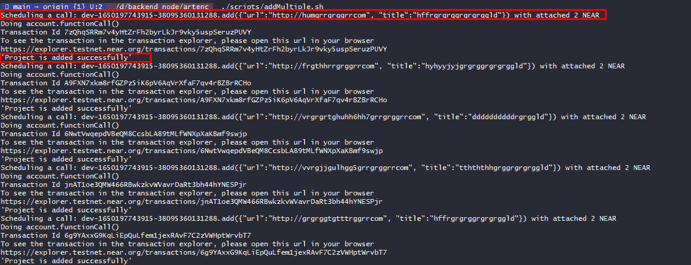
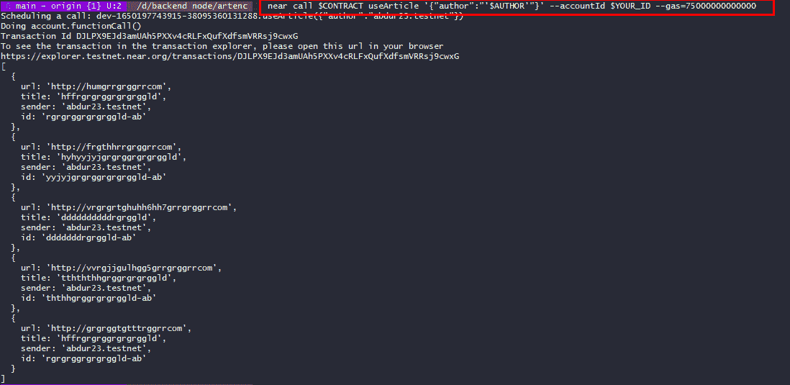
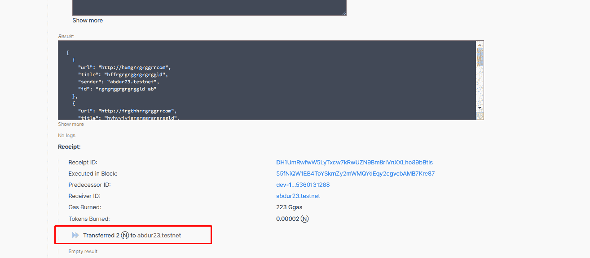
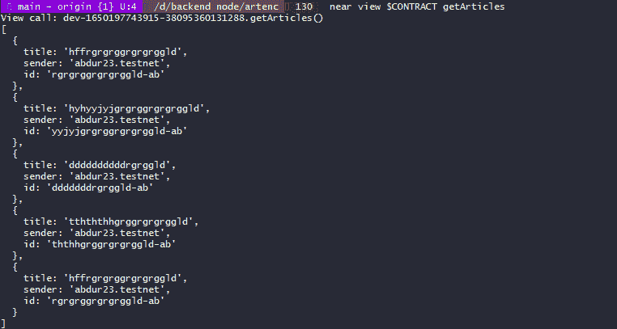
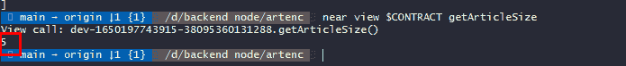
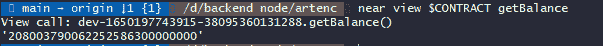
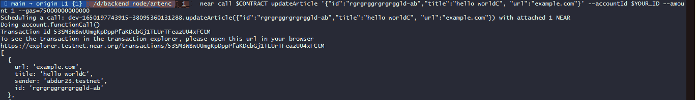
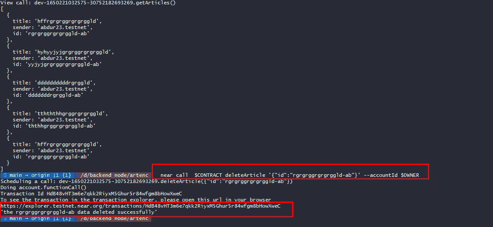

# 我是如何在 web3 中创建智能合同的？

> 原文：<https://medium.com/coinmonks/how-did-i-manage-to-create-a-smart-contract-in-web3-56ae8064bd9e?source=collection_archive---------21----------------------->


Photo by [Shubham Dhage](https://unsplash.com/@theshubhamdhage?utm_source=medium&utm_medium=referral) on [Unsplash](https://unsplash.com?utm_source=medium&utm_medium=referral)

我已经研究 web3 很长时间了。我不知道什么是 web3，也不知道为什么这个概念在今天如此流行。所以我决定进入并学习它。说实话，当我第一次面对这个新领域的许多复杂的话题时，我放弃了这个目标，并认为我学不会 web3，这个领域不适合我。因为为了在 web3 上开发一个真正的后端项目，有必要熟悉 web3 的基础理论。

在我的 web3 调查期间，我发现了 web3 领域中最好和最有结构的训练营之一，它是由 [**帕蒂卡**](https://www.patika.dev/) 创建的，之后，我决定将这个训练营用于学习 web3。

我通常不喜欢 web2 上的前端，所以我也想学习 web3 上的后端。Patika 为此创造了良好的条件，并教授如何通过近协议创建 web3 后端的智能合约。

# 我的旅程开始了…

在“Patika”训练营中，我首先学习了 web3 的基础知识，如区块链、去中心化术语、Dapp、智能合约、FT-NFT、DeFi、DAO、比特币、以太坊等等。学习完以上基础理论知识后，我开始在 SDK 附近学习创建智能合约。

# 什么是近？

NEAR 是对开发人员最友好的构建去中心化应用程序的平台，也是开发人员增长第三快的加密货币生态系统！

Near 为开发者提供了两种类型的 SDK 来创建去中心化的应用:Rust 和 AssemblyScript SDKs。

# 什么是汇编脚本？

> 它类似于 TypeScript，但具有 WebAssembly 类型，由于提前编译严格类型化的代码而具有一些约束，但也有一些源于 WebAssembly 功能集的附加功能。虽然不是所有的 TypeScript 都可以被支持，但是它与 JavaScript 的密切关系使它成为已经习惯于为 Web 编写代码的开发人员的熟悉选择，并且它还有可能与现有的 Web 平台概念无缝集成，以产生精简的 WebAssembly 模块

在申请 near Bootcamp 之前，我在 node.js 和 typescript 方面的技能一般，所以我很舒服地使用了 AssemblyScript。如果你想了解更多，你可以访问这个[链接](https://www.assemblyscript.org/introduction.html)。

# 我的智能合同

我创建了一个简单的 CRUD 智能契约，它的名字是“Artenc”**:**

## **想法:**

“Artenc”是付费百科。任何写文章的人都可以把他们的文章放在这个百科全书里。随着文章被用户使用，作者添加的文章数量增加，作者得到奖励。这样一来，合同持有者和文章作者都能获利。

**详情:**

首先，我们需要适当地构建项目。几乎不需要从头开始创建合同结构，因为它们是模板化的。您创建的合同的主要逻辑在**汇编文件夹**中。在这个文件夹中，您可以设置自己的逻辑和结构，使程序按照您想要的方式运行。所以我就直接解释一下基本逻辑，不涉及其他部分。我在程序集文件夹中创建了 3 个文件。

```
assembly
  ├── index.ts   # contains code for the contract
  └── model.ts #contains code for the model(s) accessible to the       contract
  └── utils.ts #contains code for helper functions
```

**指标**、**模型**和**效用**。

index.ts 文件是程序的主要入口点。就是我们的基本逻辑在这里被创造，其他方面在这里被调用。正如我前面提到的，单例模式在创建智能契约时更常用。这就是我在这里使用单例模式的原因。

我们首先从 near assembly script SDK 导入我们需要的 API。

1.  **上下文**包含执行上下文信息。例如，发送者、添加的令牌等。
2.  **ContractPromiseBatch** 类包含许多方法。我们将使用这个类的 **transfer** 方法。
3.  **PersistentSet** 是一种数据结构，它将存储包装成一个集合。

然后，我们从 model.ts 文件中导入所需的数据类，并从 util.ts 模块中导入必要的助手方法。我们将在后面创建这些函数。

# 模型. ts 文件。

这里我们创建了我们需要的两个主要数据类。这里，第一个类存储一篇文章的所有数据。第二类是没有`url` 属性但有其他公共属性的类。

你必须支付一定的 NEAR token 才能获得文章的 url。下面我展示了通用的 model.ts 文件:

# index.ts 文件

我们将首先在“index.ts”文件中创建我们的合同类。这个类是控制契约逻辑的主要部分。

我已将我们的合同数据存储在**持久集**中。这是 AssemblyScript 中的集合类型。PersistentSet 抽象了存储类，并为我们提供了许多连接到存储的有用方法。请注意，当我们将数据存储在 PersistentSet 上时，自动数据在部署到区块链时存储在存储中。

最初，我们在契约类内分配私有属性**契约 _ 所有者**、**最小 _ 费用**、**金额**。然后我们在构造函数中设置这些信息。当使用 **init** 函数初始化契约时，构造函数将运行并设置这些值。我们很快就会看到这一点。

这里的`@nearBindgen`是一个装饰器，用于在自定义类被保存到区块链上的存储之前对它们进行序列化。

The initial state of our contract class

一切都准备好了，我们可以继续我们的“crud 方法”了。NEAR 中有两类方法:**查看方法**和**调用方法**。视图方法只是只读操作，不会对区块链进行任何更改。调用方法对区块链进行更改，并且运行是有偿的。

# **添加方法。**

我们的第一个方法是`add` 方法，用于添加新文章。

`add`方法从用户处获取 url 和 title 参数，首先验证用户至少支付了 1 NEAR，然后提供所需信息。如果一切顺利，将从 article 类创建一个新的 Article 实例，并检查该对象是否已经存在于 **PersistentSet** 中。如果在这个阶段它是 OK 的，那么一个新的文章被添加到存储中。

# **更新文章方法**

`updateArticle`方法是一个调用方法，所以我们在这三个方法中都需要来自用户的令牌。该方法从用户处检索要更新的字段，并将它们传递给助手 **update** 方法，以更新存储中的文章并返回更新后的版本。

updateArticle method

`update` helper 方法在 **PersistentSet** 上的文章中搜索给定的 **id** ，并检查请求用户是否确实是文章的所有者，如果是，则进行更新。在这里使用 for 循环在性能方面是不好的，但是其他方法在 AssemblyScript 中不起作用，我不得不使用 for 循环。(需要改进)

update helper method

# **删除文章方法。**

`deleteArticle`方法只允许合同所有者删除文章。根据给定的 id 查找和删除文章。

# **使用 useArtice 方法。**

这是本文的主要方法。当用户调用这个方法时，它首先找到作者的文章并检查它们的编号。如果作者至少有 5 篇文章，它根据文章的数量确定金额并通过发送到帮助方法`sendNearToWriter,`来奖励作者，并将作者的所有文章返回给用户。

useArticle method

帮助器方法从存储中查找并返回作者的文章

方法 sendNearToWriter 将收到的金额作为参数从合同账户转移到作者的钱包。

# 其他查看方法。

# 让我们检查一下合同是否有效

您必须安装 near CLI 才能运行合同。让我们启动合同并指定合同的作者

我为项目的 scripts 文件夹中的每个方法编写了一个 bash 脚本。通过运行这些脚本，您可以很容易地测试所有的方法和契约。

让我们运行第一个`.scripts/init.sh`。该脚本通过运行 contract 类的构造函数来启动协定。可以在 [GitHub 上熟悉一下脚本的代码。](https://github.com/ebdurrehm/artenc/tree/main/scripts)



this command initiates the contract and assigns the contract owner (near-account)

那么我们在合同中增加 5 条吧



Here we add 5 articles to the contract by running a script.

然后运行脚本来测试 **useArticle** 方法:



This script returns all articles by abdur23.testnet. And also because the author has at least 5 articles, NEAR is transferred to his account.

如果我们打开终端中给定的链接，我们将看到如下所示:



In fact, 2 NEARs were transferred to the author’s account

要查看作者的所有常规文章，让我们运行以下脚本:



正如您所看到的，因为这是一个免费的方法，所以文章的 URL 对用户是不可见的。

让我们看看合同中目前有多少条款:



让我们看看该合同的余额中目前有多少个接近令牌:



让我们更新存储中的任何商品:



使用我们的最后一个方法，即 **deleteArticle** 方法，从存储中删除文章:



我推荐你关注项目的 GitHub repo，这样你就可以同时读取所有的脚本和 helper 方法。

你可以通过 testnet 区块链网络直接运行这个项目( **artenc.abdur23.testnet** )。同时，如果您愿意，您可以将这个项目直接部署到 mainnet 网络中。可以看 github repo 里的详细解释。

你也可以通过在这个后端项目上创建前端来创建一个全栈的 web3 应用。为此，您将需要 NEAR 的 javascript API。

谢谢你看完。我不是 web3 专业人士，所以我可能会在这篇文章中犯技术性错误。如果你发现任何错误，请让我知道。

[](https://github.com/ebdurrehm/artenc/) [## GitHub - ebdurrehm/artenc:作家文章百科|创作一篇文章挣钱…

### 作家文章百科|创作一篇文章，为你文章的数量和使用赚(近)钱…

github.com](https://github.com/ebdurrehm/artenc/) 

> 加入 Coinmonks [电报频道](https://t.me/coincodecap)和 [Youtube 频道](https://www.youtube.com/c/coinmonks/videos)了解加密交易和投资

# 另外，阅读

*   [如何在 Uniswap 上交换加密？](https://coincodecap.com/swap-crypto-on-uniswap) | [A-Ads 审查](https://coincodecap.com/a-ads-review)
*   [WazirX vs CoinDCX vs bit bns](/coinmonks/wazirx-vs-coindcx-vs-bitbns-149f4f19a2f1)|[block fi vs coin loan vs Nexo](/coinmonks/blockfi-vs-coinloan-vs-nexo-cb624635230d)
*   [本地比特币审核](/coinmonks/localbitcoins-review-6cc001c6ed56) | [加密货币储蓄账户](https://coincodecap.com/cryptocurrency-savings-accounts)
*   [什么是保证金交易](https://coincodecap.com/margin-trading) | [美元成本平均法](https://coincodecap.com/dca)
*   [支持卡审核](https://coincodecap.com/uphold-card-review) | [信任钱包 vs 元掩码](https://coincodecap.com/trust-wallet-vs-metamask)
*   [Exness 回顾](https://coincodecap.com/exness-review)|[moon xbt Vs bit get Vs Bingbon](https://coincodecap.com/bingbon-vs-bitget-vs-moonxbt)