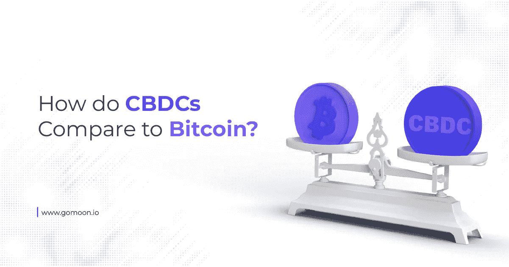

# Gomoon 关于 CBDCs 如何与比特币进行比较的指南

> 原文：<https://medium.com/coinmonks/how-do-cbdcs-compare-to-bitcoin-119e3f2fe179?source=collection_archive---------50----------------------->

过去两三年来，央行数字货币(CBDCs)已经成为各国央行的热门话题，加密货币的迅速普及引发了关于这种新型货币利弊的讨论。然而，隐私倡导者警告说，尽管旨在取代现金，CBDCs 将减少向用户提供的金融隐私量，预计一些国家将在技术证明可行时强制使用他们的 CBDC。

比特币的支持者长期以来一直支持加密货币，将其作为政府控制的法定货币的解毒剂，随着 CBDC 广泛使用的可能性逐年增加，他们表示比特币的用例终于出现了。但是到底什么是 CBDCs，它们是如何工作的，为什么有些人对它们感到担忧？让我们找出答案。

# 什么是 CBDCs？

CBDCs 旨在成为数千年来社会用于支付商品和服务的实物现金的数字形式。在一个迅速走向无现金化的世界，各国央行和政府正在开发各种方式，让公民通过智能设备而不是硬币、纸币和支票来发送和消费银行账户中的现金。

随着非接触式支付的出现，人们可能会认为这已经发生了，但 CBDCs 提出了一个完全不同的命题，基于不同的技术，目的略有不同。非接触式支付允许你在商店里购物，钱从关联的银行卡账户中支付，但你有不同银行的不同卡，甚至可能有不同的应用程序。你也可以使用应用程序向朋友和家人汇款，但还是要先将应用程序链接到你的银行账户。

# CBD 如何运作

CBD 旨在促进各种支付，从商店购物到向世界另一端的家人汇款，全部免费或接近免费。不同的是，完成旅程的不是你的钱，而是一种数字货币，它将在另一端被转换。

我们举个例子。Justin 是一名在伦敦工作的尼日利亚人，他每个月都会寄一部分薪水回家给尼日利亚的家人。目前，他不得不使用汇款服务将钱从他在英国的银行账户转到他妻子在尼日利亚的账户。汇款服务收取 5%的佣金，汇款需要 2-3 天才能到达。有了 CBDC，贾斯汀不用汇款，而是在他的手机上打开一个应用程序，在该国的 CBDC 购买等值的货币，我们称之为数字英镑。

这些数字英镑不是真正的货币，尽管它们具有价值，因为它们是由英国银行发行的，并且它们在区块链上运行——这与比特币使用的技术相同。把区块链想象成一条铁轨，把数字英镑代币想象成火车。在另一端，贾斯汀的妻子有一个名为 eNaira 的应用程序，允许她发送和接收尼日利亚 CBDC(已经存在)。贾斯汀将他的数字磅发送到他妻子的应用程序，在那里它们被转换成 eNaira。几秒钟后，他们和他的妻子一起到达，在那里她可以把他们换成普通的货币。

这只是 CBDC 好处的一个例子，但不难想象 CBDC 接管几乎所有支付形式的世界。毕竟，你不可能把一把 CBDC 丢在沙发后面或者在洗的时候弄坏它，而且在一部偷来的手机上花一个 CBDC 比花一叠从偷来的钱包里取出的现金要难得多。

从表面上看，很容易理解为什么世界超级大国在如此高的层面上讨论 CBD:这将使个人生活更容易，他们可以快速廉价地汇款；因刷卡手续费高而只接受现金的商家可以开始接受数字支付；政府可以在制造实物现金的过程中节省资金。

# 隐私问题可能会损害吸收

这也是一个事实，即使大多数政府不承认，CBDCs 将成为监视公众的一个很好的工具。现金仍然是洗钱者、贩毒者和一大堆其他黑暗行为的首选媒介，这是有原因的——它是不可追踪的。从你的钱包里拿出一张钞票，你不知道它在去你钱包的旅途中去了哪里，经过了谁的手。这对罪犯来说是好事，但对政府和执法机构来说却不是好事。

然而，数字货币有着完整的历史。区块链在账本中记录每一笔交易，允许任何人(在比特币等公共账本的情况下)或特权实体(在 CBDC 等私人账本的情况下)跟踪 CBDC 代币可以被分割成的每个部分的行程。因为每一个 CBDC 钱包都与一个人相关联，政府将能够公开你的个人资料，并确切地看到你是如何使用你的钱的。

当然，现在有些人会争辩说，他们已经可以通过查看你的银行账户来做到这一点，但你的银行活动并不包括你用你的现金做了什么——如果你从 ATM 机取出 100€现金，政府不知道你用它做了什么，这是应该的。毕竟，这是你的钱，所以只要你做的事情不违法，他们为什么要知道？有了 CBDC，他们*就会*知道，因为你只能向注册的钱包发送代币。简而言之，金融隐私这种东西将不复存在。

# 比特币提供了一种选择

尽管比特币与 CBCDs 运行在相同的技术上，但两者的精神特质却大相径庭。比特币旨在提供不受不必要监督的自由，这是一种享受一定程度隐私的方式，其创造者认为这应该是一项人权。与 CBDCs 不同，比特币钱包不需要注册，甚至不需要与个人联系——它们是一串数字和字母，所有者的财产归属于这些数字和字母。

在这方面，比特币比 CBD 更接近现金，尽管事实上 CBD 正被吹捧为比特币。比特币不是匿名的，但它比 CBDCs 更加隐私，随着现金的逐步淘汰，它可能成为那些强烈重视隐私的人的唯一选择。

# “免费”是有代价的

完全成型的 CBDC 的一个最好的例子是中国的数字元，它已经发展了六年多，并已经经历了现实世界的考验。隐私倡导者已经担心，通过推出数字人民币给当局带来的监督量超过了他们通过现有支付渠道支付宝和微信支付已经获得的监督量，在一个对公民的控制比西方国家更严格的国家，这不应该是一个意外。

比特币提供了一种只有现金才能与之匹敌的金融隐私和自由，但随着实物现金逐渐被数字支付选项取代，它将成为唯一一种真正免费的货币形式。2021 年 10 月在深圳进行的第一轮真实世界测试中，5 万名深圳居民注册了数字人民币钱包，中国人民银行向每位试用者空投 200 元人民币(€28)的“免费”资金，供其在参与的商店中消费，当全面推广时，他们可能会以某种方式采用这一策略，其他国家也是如此。

当然，正如我们现在所知道的，这些免费的钱确实有很高的价格。

有关比特币的更多信息，以及购买和持有比特币的安全、受监管的平台，请访问我们的[网站](https://www.gomoon.io/)，在我们上线之前了解最新进展。关于 Gomoon 平台的更新，注册我们的时事通讯，然后[在 Twitter 上关注我们](https://twitter.com/gomoon)。

> *加入 Coinmonks* [*电报频道*](https://t.me/coincodecap) *和* [*Youtube 频道*](https://www.youtube.com/c/coinmonks/videos) *了解加密交易和投资*

# 另外，阅读

*   [Bookmap 点评](https://coincodecap.com/bookmap-review-2021-best-trading-software) | [美国 5 大最佳加密交易所](https://coincodecap.com/crypto-exchange-usa)
*   最佳加密[硬件钱包](/coinmonks/hardware-wallets-dfa1211730c6) | [Bitbns 评论](/coinmonks/bitbns-review-38256a07e161)
*   [新加坡十大最佳加密交易所](https://coincodecap.com/crypto-exchange-in-singapore) | [购买 AXS](https://coincodecap.com/buy-axs-token)
*   [红狗赌场评论](https://coincodecap.com/red-dog-casino-review) | [Swyftx 评论](https://coincodecap.com/swyftx-review) | [CoinGate 评论](https://coincodecap.com/coingate-review)
*   [投资印度的最佳密码](https://coincodecap.com/best-crypto-to-invest-in-india-in-2021)|[WazirX P2P](https://coincodecap.com/wazirx-p2p)|[Hi Dollar Review](https://coincodecap.com/hi-dollar-review)
*   [加拿大最佳加密交易机器人](https://coincodecap.com/5-best-crypto-trading-bots-in-canada) | [库币评论](https://coincodecap.com/kucoin-review)