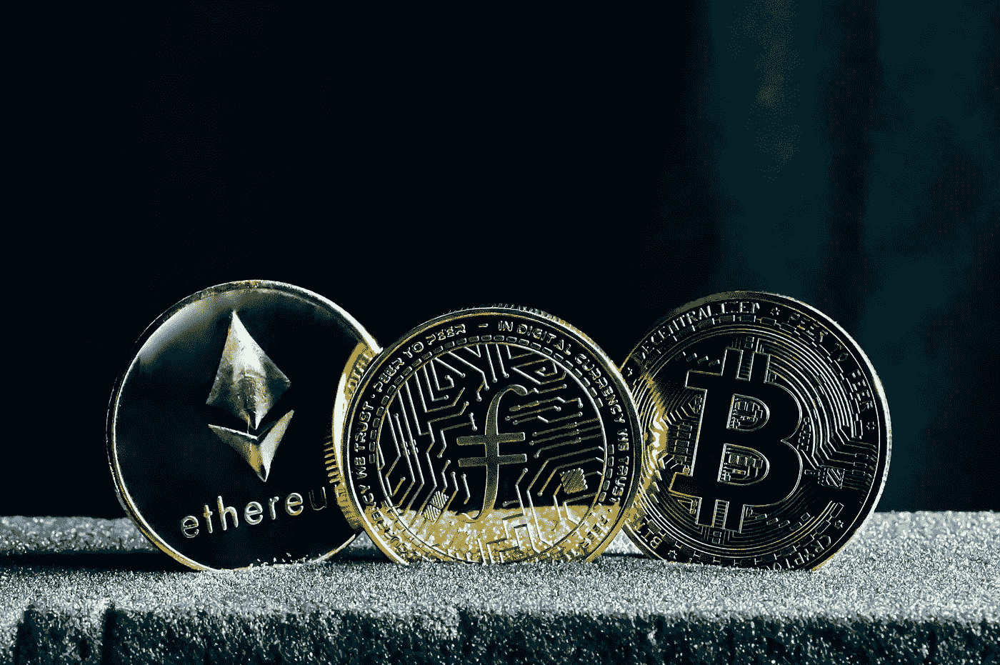
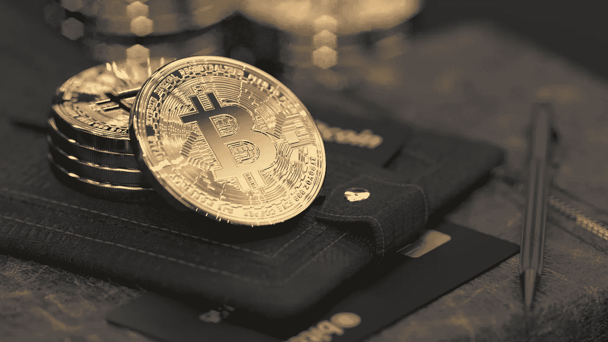
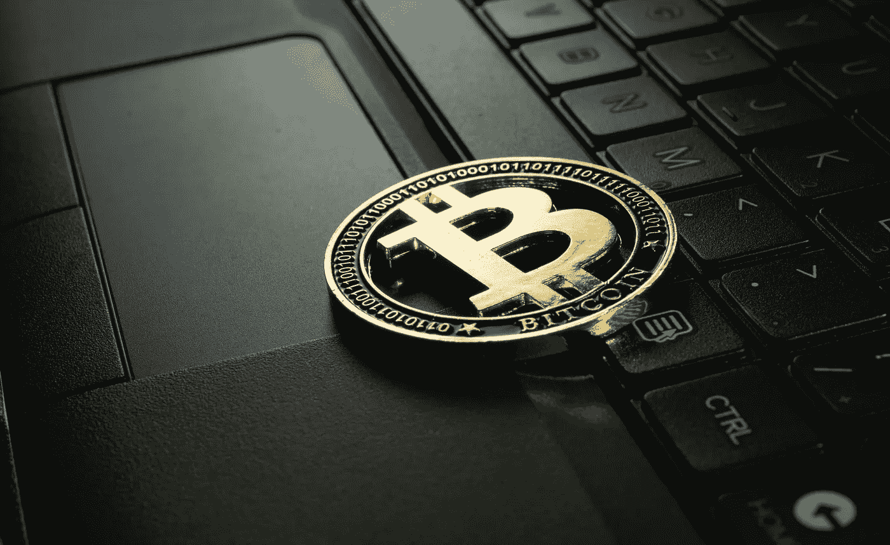
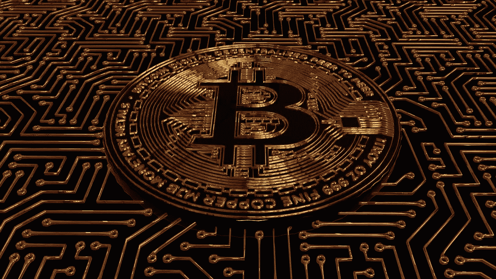

# 加密货币是如何工作的？加密货币初学者指南。

> 原文：<https://medium.com/coinmonks/how-do-cryptocurrencies-work-beginners-guide-to-cryptocurrencies-b1915189fd4f?source=collection_archive---------57----------------------->

Source: [https://news.bxmi.io/](https://news.bxmi.io/)

自 2009 年推出比特币以来，出现了一系列新的加密货币。一些人对加密货币的功能持怀疑态度，因为他们周围流传着宣传。

如果加密货币在这些通货膨胀和可怕的经济危机时期继续升值，就有必要进一步研究它们。在本帖中，你将了解加密货币是如何改变全球的，以及它们是如何运作的。

加密货币在几年前首次出现，并彻底改变了人们对货币的看法。即使其中一些的价值已经飙升，许多人仍然不知道什么是加密货币。其他人也在考虑如何投资这些资产。

> **另见:** [**需要用 Bitxmi 交易所交易的 8 个理由。**](/@bitxmiblog/8-reasons-you-need-to-trade-with-bitxmi-exchange-c4bff2ab3096)

**什么是加密货币？**

Source: [P](https://news.bxmi.io/)ixabay.com

加密货币是由 P2P(点对点)支付系统管理的虚拟或数字货币。这种数字货币的主要特点是没有物理媒介。换句话说，加密货币既不是有形的(以硬币或纸币的形式)，也不能通过支票转让。
此外，加密货币是一种替代货币，其价值在全球范围内不由任何政府或国家决定。加密货币的价值不受黄金或任何其他现代货币波动的影响。

此外，你不会发现任何加密货币，如比特币或以太坊，其价值取决于中央当局或金融机构。没有一家央行不监管加密货币，因为它们只依赖于一种称为区块链的技术。后者是存储在计算机内存中的一系列数字。它们以许多区块链的形式集成在一起来完成这一点。在前面的区块之后，每个区块都必须经过认证、注明日期并记录在登记簿中。

为了让加密货币发挥作用，任何人都必须能够访问账本。因此，我们获得了一个包含完整区块链的数据库。加密货币是一种计算机代码，旨在代表一个便于交易的单位。如果你想把它形象化，它会看起来像一系列的字母和数字，一个数据序列，非常类似于在屏幕上看到一个编程代码。加密货币是数字货币。它们没有实物形态，但它们有经济价值，因为它们在交易中作为一种货币形式被使用和接受。

**加密货币的历史**

Source: Pixabay.com

加密货币的存在有其密码学的理论基础，密码学是一门知识的技术学科，源于古代使用代码构建秘密消息的必要性。随着计算机科学的进步，这一点得到了显著加强。

由于互联网的出现，加密迷们在 20 世纪 80 年代开始提出个人通过网络进行交易的概念，互联网开辟了一个新的技术连接场景和一个虚拟的交流场所。这需要建立可以在同一媒介上流动的数字货币，并随后提供在全球范围内运营的额外价值。

此外，他们认为应该对其进行加密以确保安全，并且不受银行机构的监督，也就是说，它应该是分散的。这也意味着没有政府会统治它；这类似于提供“免费的钱”,由于技术的发展，这些钱可以用来造福人民。

但直到 2009 年，第一种加密货币比特币才得以建立，特别是因为支持这些货币存在的软件区块链的发明和开发，使得非常广泛的理论汇编成为必要。

另一个有趣的细节是，一年后的 2010 年，比特币被用作第一种与物理世界相关的支付货币；在美国购买了两份棒约翰披萨。也就是说，在那之前，它的存在和使用仅限于将加密货币归因于私人试验的极少数群体；因此，它仍然没有商业价值。

**什么是区块链？**

Source: Pixabay.com

所有加密货币都建立在一个称为区块链的单一前提上。这是一种基于存储在计算机中的一系列数字的技术。区块链用于存储这些数据。这是通过使用被称为挖掘的基本机制来完成的，该机制被分为许多阶段。
这就是区块链技术的工作方式，该技术旨在确保加密货币相关交易的透明度和安全性。

区块链是加密货币存在的基础。顾名思义，它是一系列的块，每个块提供关于所执行的活动的信息，并标识前一个块和到下一个块的链接。也就是说，它的功能就像一本会计账簿，每一块都代表一张纸，上面有与前一块相关的信息，并标明下一块应该是哪一块。

很大的好处是，那里存储的信息无法更改，因为有成千上万的节点(计算机终端)接收区块链的副本；一旦数据被修改，就会产生警报，因为这个网络是一致工作的，这意味着大多数副本必须具有相同的信息。

因此，当检测到变化时，网络将其指定为错误。此外，要说服大多数节点(51%)也调整它们的副本，即使不是不可能，也是非常困难的。这个庞大的点对点网络遍布全球。

**如何开始使用加密货币？**

Source: Pixabay.com

获取加密货币的方式多种多样。传统技术是使用普通货币购买加密货币。可以使用信用卡通过[**Bitxmi**](https://www.bitxmi.com/en_US/) 等平台进行交易。获得加密货币的第二种技术是请求用这些虚拟货币支付您的服务。你还可以收到一定比例的加密货币。

第三个选择是购买一套比特币挖矿设备，一周七天、一天 24 小时都可以运行。每次加密货币开采后，会有一定比例返还给你作为报酬。

**影响加密货币价格的因素有哪些？**

Source: Pixabay.com

如今，加密货币被视为避风港。因此，在政治动荡时期，加密货币(比特币、以太坊、Ripple)的价值可以飙升。鉴于比特币在新冠肺炎期间的快速飙升以及最近的俄乌危机，这一点尤为明显。
此外，由于可用加密货币的数量受到限制，随着其变得越来越稀缺，其价值也会大幅上升。然而，由于持有人的大量出售，加密货币的价值可能会下降。当他们试图在大幅上涨后收回收益时，就会出现这种情况。

**如何投资加密货币？**
一旦你明白了什么是加密货币，以及它是如何运作的，你就可以将你财富的很小一部分进行投资。事实上，加密货币是高度不稳定的投资，非常谨慎地对待它们是谨慎的。强烈建议只投资你愿意损失的加密货币金额。

投资加密货币有两种方法:长期投资和短期投资。第一个策略，长期投资，让你平滑加密货币的价格。这是一个旨在补偿加密货币价格大幅下跌的策略，同时利用爆炸式上涨。

第二种方法是短期投资，即在加密货币价值最低时买入，并在大幅升值后立即卖出。另一方面，这种投资策略需要更好地理解影响加密货币价格的因素。

那些想要投资加密货币的人可以通过币安、比特币基地或 Bitxmi 等众多平台进行投资。

> *加入 Coinmonks* [*电报频道*](https://t.me/coincodecap) *和* [*Youtube 频道*](https://www.youtube.com/c/coinmonks/videos) *了解加密交易和投资*

# 另外，阅读

*   [3 商业评论](/coinmonks/3commas-review-an-excellent-crypto-trading-bot-2020-1313a58bec92) | [Pionex 评论](https://coincodecap.com/pionex-review-exchange-with-crypto-trading-bot) | [Coinrule 评论](/coinmonks/coinrule-review-2021-a-beginner-friendly-crypto-trading-bot-daf0504848ba)
*   [莱杰 vs n 格拉夫](/coinmonks/ledger-vs-ngrave-zero-7e40f0c1d694) | [莱杰纳诺 s vs x](/coinmonks/ledger-nano-s-vs-x-battery-hardware-price-storage-59a6663fe3b0) | [币安评论](/coinmonks/binance-review-ee10d3bf3b6e)
*   [Bybit Exchange 审查](/coinmonks/bybit-exchange-review-dbd570019b71) | [Bityard 审查](https://coincodecap.com/bityard-reivew) | [Jet-Bot 审查](https://coincodecap.com/jet-bot-review)
*   [3 commas vs crypto hopper](/coinmonks/3commas-vs-pionex-vs-cryptohopper-best-crypto-bot-6a98d2baa203)|[赚取加密利息](/coinmonks/earn-crypto-interest-b10b810fdda3)
*   最好的比特币[硬件钱包](/coinmonks/hardware-wallets-dfa1211730c6) | [BitBox02 回顾](/coinmonks/bitbox02-review-your-swiss-bitcoin-hardware-wallet-c36c88fff29)
*   [BlockFi vs Celsius](/coinmonks/blockfi-vs-celsius-vs-hodlnaut-8a1cc8c26630)|[Hodlnaut 点评](/coinmonks/hodlnaut-review-best-way-to-hodl-is-to-earn-interest-on-your-bitcoin-6658a8c19edf) | [KuCoin 点评](https://coincodecap.com/kucoin-review)