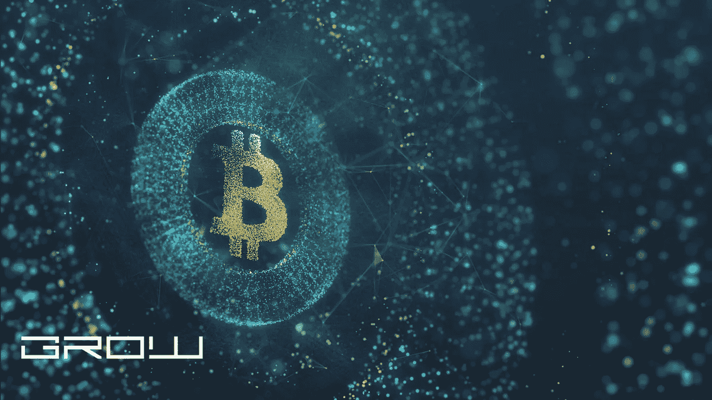

# 我如何访问我的区块链域名？

> 原文：<https://medium.com/coinmonks/how-do-i-access-my-blockchain-domain-8d14b5881002?source=collection_archive---------25----------------------->

blockchain domain

该域是许多区块链加密货币的核心，如比特币。域名是一系列字母和数字，就像钱包地址一样。每个比特币钱包都必须有一个唯一的公钥地址，它只是一个以“1”或“3”开头的字母数字字符串。

如果你试图访问你的区块链域名，那么你需要为你的域名写区块链代码来访问它。这是什么意思呢？例如:要访问装有比特币的比特币钱包，您可以键入以下内容:1 l4jtyvgn 5 BP 8 wzuxgsvmhfdaznkhi5c。

如果您想要访问一个域，那么您应该键入以下内容:c5go 5 ujz 1 QQ 7 evgfkczvcvejwgr 81n 7 lyy

输入区块链代码后，请按“输入”按钮。如果一切顺利，就会出现一个交易列表。如果没有，请随时联系我们寻求帮助。

如何向我的 blockchain.info 钱包添加资金？要从您的区块链钱包(托管钱包)汇款，请前往[https://blockchain.info/wallet/send-money](https://blockchain.info/wallet/send-money)，或点击左侧菜单栏中的汇款。

输入收件人的电子邮件地址(发送电子邮件的钱包名称)和您要发送的比特币金额。系统将生成一个新的交易供您确认。这可能需要 15 分钟，所以请耐心等待。

一旦您的交易完成并得到确认，它将出现在您的区块链钱包仪表盘的日志>支付下。有关支付的更多信息，请点击这里:[https://block chain . info/transactions/make-a-payment-or-transfer](https://blockchain.info/transactions/make-a-payment-or-transfer)

我如何创建一个帐户？在 https://blockchain.info/wallet/的[点击“新钱包”创建一个钱包。注册过程非常简单。至于费用，创建一个账户是不收费的。如上所述，目前唯一免费的是汇款。](https://blockchain.info/wallet/)

我如何付款？可以用比特币、以太币或任何其他在区块链交易的数字资产(代币)进行支付。点击左侧菜单栏中的付款，您将看到付款选项，如发送和撤回。

为什么我在付款后看到钱包里的金额不同？如果您进行了一笔交易，然后在稍后的日期发送了另一笔交易来取代之前的交易，您的余额可能在您不知情的情况下发生了变化。

为什么我的存款没有出现在我的区块链钱包里？有时，存款存入您的钱包需要比平时长一点的时间。我们建议您至少等待 3 个小时，然后再次检查。如果您的存款仍未出现，请发送电子邮件至 [support@blockchain.info](mailto:support@blockchain.info) 联系支持部门。

付款时，我需要双重身份认证(2FA)吗？不，2FA 仅在登录您的区块链账户或编辑您的支付设置时需要(【https://blockchain.info/wallet/edit-profile】T2)。在确认您的交易之前，请确保您选择了正确的帐户并输入了正确的地址。

我如何了解我的交易的更多信息？您可以通过点击左侧菜单中的“交易历史”并查看列出的交易来查看您的交易详情。

为什么没有确认付款？最有可能的是，由于打字错误或帐户地址不正确，您的付款被发送到了错误的地址。请仔细检查您是否将资金发送到正确的区块链钱包地址。如果您对此有任何疑问，请联系 [support@blockchain.info](mailto:support@blockchain.info) 。

我可以恢复我的钱包备份吗？BIP38 只允许访问你的助记种子词的私钥；如果您忘记了密码，它不提供任何恢复机制。因此，您必须记住您的密码才能访问您帐户中的资金。如果您丢失了密码并且没有备份，您将失去相关地址上的所有资金。

我如何获得报价？你可以去[https://blockchain.info/ticker](https://blockchain.info/ticker)获得包括比特币、以太币、莱特币等多种货币的准确报价。我们将展示一个表格，显示比特币和其他货币对不同法定货币的当前汇率。注意:报价至少延迟 15 分钟；这确保了我们显示的是实时价格。

我如何访问我的区块链域名？要访问您的区块链域:登录区块链账户管理器([https://blockchain.info/signin](https://blockchain.info/signin))。

对于新的区块链域，复制如下所示的所需地址并粘贴到您的浏览器中。例如，如果你想访问装有比特币的比特币钱包，那么你可以将“1l 4 jtyvgn 5 BP 8 wzuxgsvmhfdaznkhi5c”粘贴到浏览器的地址栏中。如果你想用以太坊访问一个域，比如 C5 go 5 ujz 1 QQ 7 evgfkczvcvejwgr 81n 7 lyy，那么你可以到这里:[https://blockchain.info/ticker](https://blockchain.info/ticker)复制以太坊地址，然后粘贴到你的浏览器的地址栏。

如何查看我的区块链钱包的余额？点击左侧菜单栏中的“钱包”选项，即可查看您的钱包余额。您可以在“日志”下查看您的历史交易。标题为“交易”的部分将向您显示所有最新交易及其相关金额的列表。

我如何获得交易的更多信息？要查看交易的更多信息，请登录您的区块链账户，点击左侧菜单栏中的“交易历史”。将出现一个新页面，您可以在其中查看其下列出的任何交易的详细信息。

我的乙醚存款何时会反映在我的区块链钱包中？您的乙醚存款最多需要 15 分钟才会出现在您的区块链钱包中。请耐心等待，因为这是一项安全功能。

我如何备份我的区块链钱包？前往 https://blockchain.info/wallet/backup 的[点击“创建备份”。](https://blockchain.info/wallet/backup)

如何恢复我的区块链钱包备份？如果您已经有一个备份文件，您可以通过以下简单的步骤恢复您的区块链钱包:登录您的区块链帐户，点击左侧菜单栏中的“管理钱包”。在下一页中，点击你想要恢复的钱包的标题(如“比特币”)。然后，单击页面顶部的“导入备份”。将备份文件粘贴到文本框中。当询问您是否要针对链中的所有块验证其完整性时(推荐)，选择“是”。你现在会看到你的钱包余额。点击“查看密钥”以查看您的私人密钥并管理相关地址。您必须记住您的密码才能访问您帐户中的资金；否则，你将失去所有相关地址的钱。

你也可以观看如何恢复区块链钱包的视频教程。要查看本教程，请前往 https://blockchain.info/wallet/restore[点击“恢复备份”。](https://blockchain.info/wallet/restore)

如何导入纸质钱包？登录您的区块链账户，点击左侧菜单栏中的“管理钱包”。在下一页中，点击你想要恢复的钱包的标题(如“比特币”)。然后，点击“导入纸质钱包”。这将把你带到一个页面，在那里你需要输入你的四个私人密钥。在单击“下一步”之前，请确保您记住了相关地址的密码。然后，点击“下一步”查看您的纸质钱包余额。

如何从其他区块链服务导入区块链钱包？登录您的区块链账户，点击左侧菜单栏中的“管理钱包”。在下一页中，点击要导入的钱包的标题(如“比特币”)。你现在会看到一个列表，列出了所有接受过你的比特币的服务。点击你想导入的服务，系统会提示你输入你的比特币地址。在单击“下一步”之前，您必须记住您的密码。然后，点击“下一步”查看您的区块链钱包余额。

我如何才能收到付款？登录您的区块链账户，点击左侧菜单栏中的“发送”。要选择付款方式，请使用所有红框下方的下拉框，其中包含金额、发件人姓名和地址。填写所需信息，并点击“提交”进行确认。

我如何用我的区块链钱包付款？登录您的区块链账户，点击左侧菜单栏中的“发送”。选取您想要发送的金额、收件人地址，然后输入评论。然后，点击“附加付款”并选择一个现有的地址或创建一个新的。确认信息正确后点击“提交”。

如何选择使用哪个比特币网络？区块链钱包让你完全控制你的服务所依赖的比特币网络(mainnet/testnet)。您可以通过点击区块链钱包顶部的链名来切换网络。

我的公共比特币地址是什么？你的公共比特币地址是一个唯一的标识符，允许任何人向你的区块链钱包发送比特币。这可以被共享，这样人们和服务就知道把他们的比特币送到哪里。区块链钱包在其主页上显示您钱包的地址。它还显示与您的钱包相关联的所有地址的地址。

如何查看我的公共比特币地址？查看你的公共比特币地址非常简单，只需要一次点击:登录你的区块链账户，点击左侧菜单栏中的“钱包”。单击您希望查看的地址。您会注意到屏幕顶部有一个标记为“复制地址”的链接。点击此链接，将其输入到文本或电子邮件消息中，或通过再次点击它并点击“完成”来保存它以供以后使用。

向我的区块链钱包地址发送比特币的费用是多少？区块链钱包发送比特币时不收费。

我怎样才能把比特币发到我的区块链钱包里？要将比特币发送到您的区块链钱包，请点击左侧菜单栏中的“发送”选项。选择您希望向其发送资金的地址，并输入一条消息。然后点击“发送”。

如何将乙醚存入我的区块链钱包？要将乙醚存入您的区块链，只需点击左侧菜单栏中的“存款”。输入您希望转账的金额以及可选备注，并输入您的密码(如果需要)。确认后点击“提交”。

我如何将乙醚存入区块链钱包？要将乙醚存入区块链，只需点击左侧菜单栏中的“存款”。输入您希望转账的金额以及可选备注，并输入您的密码(如果需要)。确认后点击“提交”。

我在哪里可以找到我的私人钥匙？您的私人密钥受密码保护:只有您知道访问这些密钥的密码。这意味着只有你可以花你的资金。

你的比特币地址是什么？比特币地址就像银行账号，但更容易记住。它是由一串数字和字母组成的钱包地址。

如果您有多个比特币地址，我如何查看它们？在注册区块链应用编程接口时，会为您生成一个默认的比特币地址，但您可以通过点击“查看地址历史”在“查看所有地址”列表中找到其他地址。如果一个私钥已经从这个列表中删除，只需点击一个标有“这个地址已经被删除”的链接来检索它。使用该功能时，确保选择正确的账户(如“比特币”)。任何最近未使用的地址将以红色文本显示，并标有感叹号图标。

如果从列表中删除了一个私钥，我可以找回它吗？如果这个列表中已经删除了一个私钥，可以使用 blockchain.info 的“下载比特币私钥”。请注意，私钥将被加密，区块链钱包不支持解密工具。在使用之前，您需要注册并验证您的身份。

我如何发送或请求比特币？要请求比特币或向某人发送比特币，请点击左侧菜单栏中的“存款”。输入金额和可选备注，并输入您的密码(如果需要)。确认后点击“提交”。

我如何收到付款？要接收付款，请点击左侧菜单栏中的“接收”。输入您希望接收资金的地址，并输入可选备注。然后，点击“提交”。

我如何给我的区块链钱包充值？无需担心充值区块链钱包的费用！当您将资金存入区块链账户时，您的存款将自动转换为比特币。网络费用的扣除包括在该金额中。您也可以点击左侧菜单栏中的“发送”,使用比特币为您的钱包充值。只需输入您要发送的金额，添加收件人地址，确认地址，然后单击“提交”。

我怎样才能从我的区块链钱包里取出比特币？要从您的区块链账户中提款，请点击左侧菜单栏中的“提款”。要选择提款金额，请输入金额和可选备注。然后，只需点击“提交”。

我如何发送或请求比特币现金？现在，您可以用比特币现金(BCH)接收付款，您可以使用区块链 API 轻松发送或请求比特币现金！点击此处，您可以通过我们的网站找到申请和发送 BCH 的说明。有关如何申请和发送 BCH 的详细说明，请参考我们的“BCH 文档”。

我如何发送或请求以太坊？有关请求和发送以太坊的说明，请参考我们的文档。

如果我的区块链帐户中没有足够的余额来支付我请求的金额，会发生什么情况？额外交易会向你收取少量费用(默认比特币网络费用的 1%)。这笔费用会自动从你的钱包里扣除。费用是在交易过程中实时计算的，所以你最终总是会得到你所支付的费用。

> 加入 Coinmonks [电报频道](https://t.me/coincodecap)和 [Youtube 频道](https://www.youtube.com/c/coinmonks/videos)了解加密交易和投资

# 另外，阅读

*   [印度最佳 P2P 加密交易所](https://coincodecap.com/p2p-crypto-exchanges-in-india) | [柴犬钱包](https://coincodecap.com/baby-shiba-inu-wallets)
*   [8 大加密附属计划](https://coincodecap.com/crypto-affiliate-programs) | [eToro vs 比特币基地](https://coincodecap.com/etoro-vs-coinbase)
*   [最佳以太坊钱包](https://coincodecap.com/best-ethereum-wallets) | [电报上的加密货币机器人](https://coincodecap.com/telegram-crypto-bots)
*   [交易杠杆代币的最佳交易所](https://coincodecap.com/leveraged-token-exchanges) | [购买弗洛基](https://coincodecap.com/buy-floki-inu-token)
*   [3 commas vs Pionex vs Cryptohopper](https://coincodecap.com/3commas-vs-pionex-vs-cryptohopper)|[Bingbon Review](https://coincodecap.com/bingbon-review)
*   [加密复制交易平台](/coinmonks/top-10-crypto-copy-trading-platforms-for-beginners-d0c37c7d698c) | [如何在 WazirX 上购买比特币](/coinmonks/buy-bitcoin-on-wazirx-2d12b7989af1)