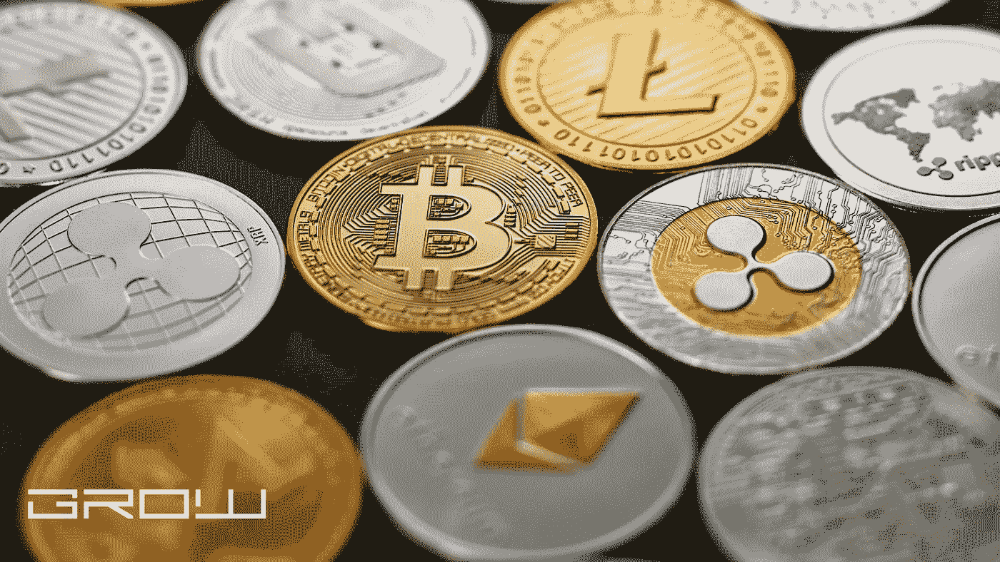

# 即使你对技术一无所知，你如何通过可观的比特币致富？

> 原文：<https://medium.com/coinmonks/how-do-you-get-rich-with-sizable-bitcoin-even-if-you-have-no-clue-about-technology-e087e35b9160?source=collection_archive---------50----------------------->

Bitcoin

你有兴趣在退休时变得富有吗？这是可能的，但是需要大量的远见和计划。幸运的是，有一些简单易行的方法可以得到一些比特币。那么，即使你对技术一无所知，如何用可观的比特币致富呢？

不可否认，比特币最近成了热门话题，以至于对这个话题一无所知的人突然问自己，如何通过使用这种基于比特币的新货币致富。那些人应该明白的是，没有一点准备，不是任何人都能做这件困难的事情。这不是在正确的时间做几笔赚钱的买卖的问题。

你还需要动作敏捷。比特币社区中的许多人都在尝试这样做，他们通常需要几年时间才能最终得到比特币！

此外，你需要对加密货币、区块链和其他相关主题有一些深入的了解。毫无疑问，购买比特币是一回事，但通过使用比特币致富需要的不止这些。如果你不能轻松熟练地处理这种事情，那么你应该暂时远离比特币。

这对于走上财务自由之路的人来说尤其必要。举个例子，如果你有一份工作，你的教育费用有债务，你用比特币致富会非常困难。要做到这一点，需要一定水平的加密货币知识和洞察力。

如果你还和我们在一起，那么有好消息给你！尽管最初对比特币相关话题及其改变世界的能力持怀疑态度，但现在很明显，越来越多的人试图使用加密货币赚钱。那么，即使你对技术一无所知，如何用可观的比特币致富呢？以下是我的建议:

1.不要花你输不起的钱。你将投资于不受政府监管的东西。如果你没有一个联系紧密的比特币朋友圈，那么你最好不要让你的朋友和家人参与这项活动。你无法保证他们的安全，尤其是如果他们也不太了解比特币的话。同样重要的是，你要明白这些投资不仅仅是单纯的投资；它们也可能导致一些损失的风险。

2.了解所有关于加密货币的知识，并在购买比特币之前查看其价格。要想从比特币中赚钱，你首先必须了解其背后的机制。一些人仍然对比特币的底层技术感到困惑，这就是为什么他们不能利用这样一个不可思议的机会赚钱。虽然你不能在没有相关知识的情况下投资比特币，但你也应该记住，你的投资永远不应该超过你能承受的损失。

如果你的经济状况已经不稳定，那么现在可能不是你开始进行大规模投资的合适时机，这将要求你承担很大的财务风险。事实是，比特币的价格很容易变化，所以你应该随时关注它。如果价格飙升，而你没有足够的钱购买大量的比特币，那么你将无法利用这种策略赚钱。

综合考虑，如果你已经决定要用比特币致富，那么现在是你开始这么做的好时机。尽管仍有许多怀疑论者拒绝相信比特币有能力改变世界(特别是在融资方面)，但这种新的加密货币正开始朝着积极的方向发展。加密货币成为热门话题已经有很长时间了，但仍有很多人从未听说过比特币或其他类似的数字货币。所有这些人都需要知道，加密货币现在正被用来通过所谓的比特币矿池赚钱。

挖掘比特币的过程一点也不困难，但在你从挖掘过程中获得任何实质性的东西之前，可能需要一些时间。然而，在你的时间范围内，你应该开始计划如何通过比特币致富。你也应该做好准备，这样你就能在你的生活中花费你赚来的比特币。如果你心中有一个坚实的计划，那么确保你准备好坚持下去。

> 加入 Coinmonks [电报频道](https://t.me/coincodecap)和 [Youtube 频道](https://www.youtube.com/c/coinmonks/videos)了解加密交易和投资

# 另外，阅读

*   [从 WazirX 切换到 CoinDCX 的 5 个理由](https://coincodecap.com/reasons-to-switch-from-wazirx-to-coindcx)
*   [Unocoin 评论](https://coincodecap.com/unocoin-review) | [最佳加密赌注硬币](https://coincodecap.com/best-crypto-staking-coins)
*   如何使用 MetaMask Wallet 获得 KCC 地址？
*   [如何获得自己的。XYZ 领域？](https://coincodecap.com/xyz-domain)
*   [最佳密码交换平台](https://coincodecap.com/best-crypto-swap-platforms) | [最佳密码交易所](https://coincodecap.com/crypto-exchange)