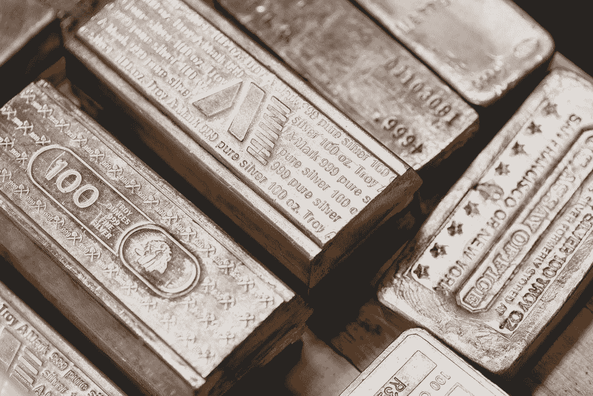
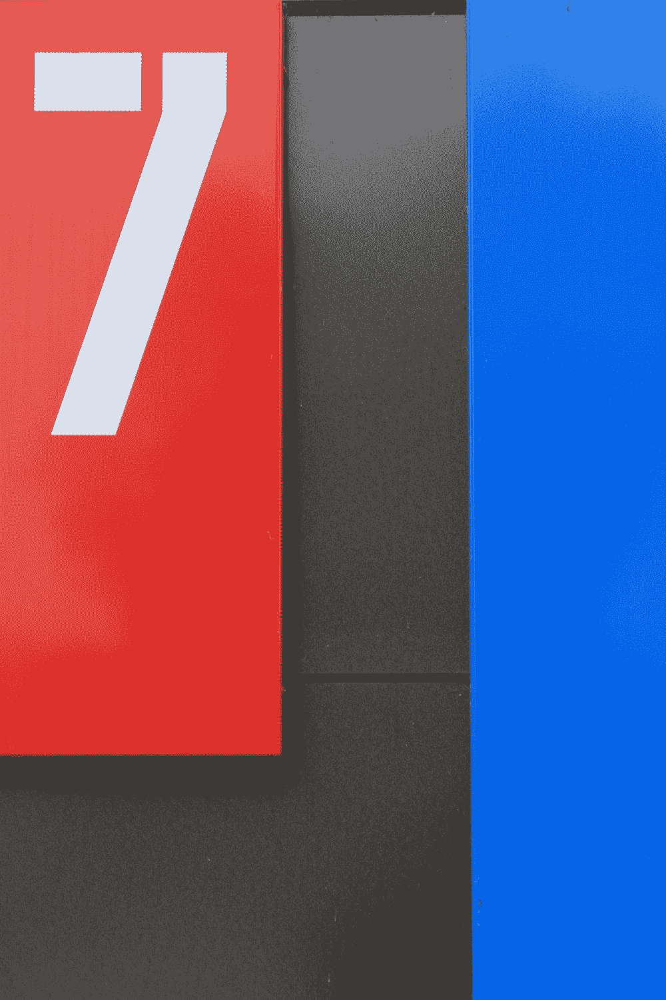
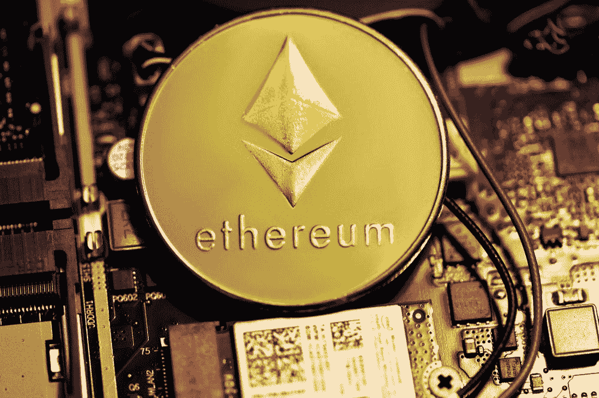
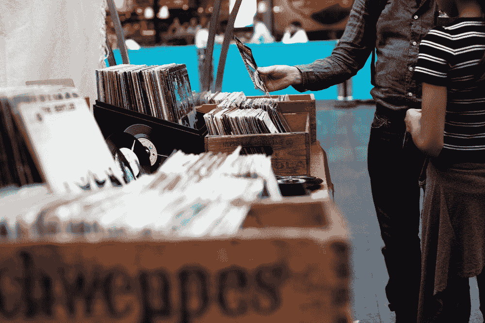
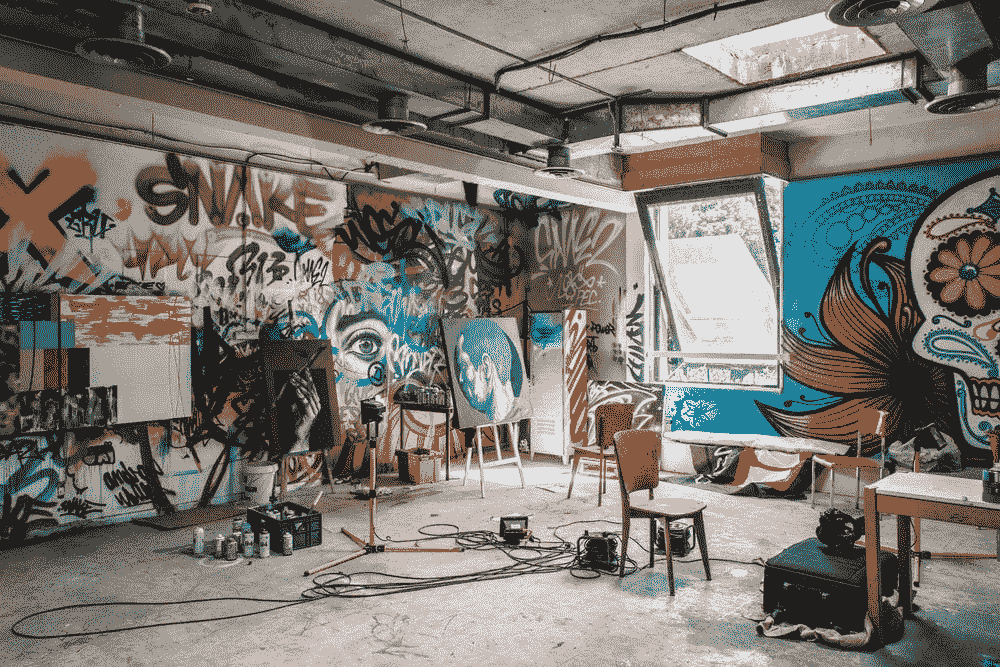

# 你是如何制造 NFT 的？

> 原文：<https://medium.com/coinmonks/how-do-you-mint-nfts-5fc41e053f6e?source=collection_archive---------40----------------------->

Photo by [Scottsdale Mint](https://unsplash.com/@scottsdalemint)

这不是财务建议。

铸造一个 NFT 意味着在区块链上第一次制造一个 NFT。你可以将艺术、音乐、活动门票和其他你已经拥有的数字资产转化为非功能性数字资产。

你们中的一些人可能想知道为什么你们想要学习如何做这件事？嗯，首先，你可能是一个艺术家，一个音乐家，或者是一个制作东西并想出售它们并从未来的销售中获得重复版税的人。或者你想从即将上市的系列中购买某一款 NFT？如果你知道如何铸造，你可以做以上任何一件事。

> “用他的技巧和建设性的想象力去看看他能为一美元付出多少，而不是他能为一美元付出多少，这样的人一定会成功。”
> 
> —亨利·福特

本文希望简化铸造 NFT 的 7 个主要步骤。在这里，我们重点介绍了常用的平台、钱包、加密货币和区块链，尽管在生态系统中有许多可行的替代方案可供您选择。

Photo by [Martin Woortman](https://unsplash.com/@martfoto1)

方法如下:

# 步骤 1:获取加密交换帐户

获得一个加密交易账户，如比特币基地或 Coinhako，是铸造你的 NFT 的第一步——或者做任何加密的事情。你将需要一个密码兑换账户来购买以太坊，以支付制造 NFT 的费用

# 第二步:购买以太坊

你需要一个 NFT 市场，就像亚马逊一样，来购买和销售 NFT。在 NFT 市场交易会产生费用。买一些以太坊来支付这些费用。

# 第三步:你需要多少以太坊？

你必须支付“汽油费”,这是在区块链进行交易的必要费用。气费多少取决于网络有多忙。每笔交易的汽油费可能价值 3 美元或 3000 美元(按今天的价格计算，0.0016 至 1.6 ETH)。有时，当汽油费太高时，人们不会去赚钱，而宁愿等到它变得更便宜

Photo by [Kanchanara](https://unsplash.com/@kanchanara)

# 第四步:买一个加密钱包

你需要一个加密钱包在 NFT 市场工作。MetaMask 是一个超过 1000 万的钱包。活跃用户。这是 Chrome 的浏览器扩展。钱包要求你设置密码和“种子短语”来保护你的钱的安全。

# 第五步:发送以太坊到你的加密钱包

*   接下来，在你的 Metamask 钱包里放一些以太币
*   要发送以太坊，请转到您的交易所的“发送”或“撤回”选项卡，这允许您将资金发送到您的元掩码。
*   你需要:
*   您要发送的以太币金额，以及
*   我们的以太坊公共广播

# 步骤 6:使用你的元掩码注册 OpenSea

*   “OpenSea”是 NFT 最大的市场
*   在您的浏览器上，使用密码解锁元掩码
*   使用安装了元掩码的同一个浏览器进入 [opensea.io](http://opensea.io)
*   转到个人资料
*   连接您的钱包(几乎完成)
*   在 OpenSea 上填写您的详细信息
*   您现在已经注册了 OpenSea(完成)

# 下一步取决于你是一个全新的 NFT 项目的创造者还是收藏家

Photo by [Artificial Photography](https://unsplash.com/@artificialphotography)

# 步骤 7A:收藏家:铸造一个 NFT 作为一个新推出的 NFT 项目的收藏家

*   找到你最喜欢的 NFT 项目
*   大多数造币厂都是在项目网站上特定的发布日/时间推出的。
*   您通常需要:
*   知道哪个区块链发生了造币厂
*   连接您的钱包
*   点击按钮铸造 NFT
*   支付造币费和汽油费

Photo by [Matthieu Comoy](https://unsplash.com/@alienwannabe)

# 步骤 7B:创造者:铸造一个 NFT 作为你自己的艺术、音乐、数字创作的创造者

*   去公海。点击“创建”。
*   上传支持的文件，如图像、视频或音乐。
*   给你的 NFT 一个名字和描述。
*   NFT 现在在公海上。若要刊登待售物品，请按「出售」。
*   OpenSea 将要求您登录您的 MetaMask 钱包进行各种操作，包括一次性钱包初始化。
*   支付造币费和汽油费

所以你有它。我希望这能让你对创建 NFT 有一个大致的了解。虽然，对于那些还没有准备好出售他们的创造性工作的人或者那些更愿意从像 OpenSea 这样的二级市场购买 NFT 的人来说；你不需要铸造它们。

> "随着年龄的增长，大多数人更爱金钱和安全，而不是创造和建设."
> 
> 约翰·梅纳德·凯恩斯

你在铸造 NFT 方面有什么经验？分享你的故事。

[# web 3](https://www.linkedin.com/feed/hashtag/web3)[# NFT](https://www.linkedin.com/feed/hashtag/nft)[#元宇宙](https://www.linkedin.com/feed/hashtag/metaverse)[#区块链](https://www.linkedin.com/feed/hashtag/blockchain)

*这不是理财建议。*

关于作者:

Norliza 是分散式的——一个向 Web3 飞跃的营销传道者。她希望通过学习 Web3、NFT、元宇宙和 Crypto 来帮助社区和生态系统。她还是一名认证信息隐私经理，在开展业务时，她对数据隐私有着深刻的理解。*关注她上*[***LinkedIn***](https://www.linkedin.com/in/norlizakassim/)*和*[*Twitter*](https://twitter.com/decentraliz_xyz)*。*

> 加入 Coinmonks [电报频道](https://t.me/coincodecap)和 [Youtube 频道](https://www.youtube.com/c/coinmonks/videos)了解加密交易和投资

# 另外，阅读

*   [无聊猿游艇俱乐部(BAYC)评论](https://coincodecap.com/bored-ape-yacht-club-bayc-review)
*   [5 款最佳加密交易终端](https://coincodecap.com/crypto-trading-terminals) | [最佳 DeFi 应用](https://coincodecap.com/best-defi-apps)
*   [在美国如何使用 BitMEX？](https://coincodecap.com/use-bitmex-in-usa) | [BitMEX 评论](https://coincodecap.com/bitmex-review)
*   [最佳期货交易信号](https://coincodecap.com/futures-trading-signals) | [流动性交易所评论](https://coincodecap.com/liquid-exchange-review)
*   [南非的加密交易所](https://coincodecap.com/crypto-exchanges-in-south-africa) | [BitMEX 加密信号](https://coincodecap.com/bitmex-crypto-signals)
*   [MoonXBT 副本交易](https://coincodecap.com/moonxbt-copy-trading) | [阿联酋](https://coincodecap.com/crypto-wallets-in-uae)的加密钱包