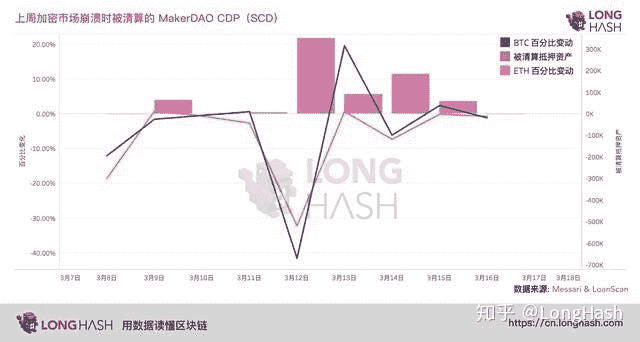

# 你如何看待以太狭窄逃离死亡？

> 原文：<https://medium.com/coinmonks/how-do-you-view-the-9-deaths-of-defi-on-etherium-714da66f2ffa?source=collection_archive---------47----------------------->

这是用户“小恐龙”在中国社交媒体应用“知乎”上写的一篇帖子，由我自己翻译成英文。主题是关于 2020 年的市场崩溃如何导致 Defi 生态系统内爆，通过当时领先的 Defi 协议 MakerDAO 的崩溃来讲述。我认为这篇文章将与那些仔细观察未来波动将如何影响去中心化金融可行性的人相关。到目前为止，它已经得到了历史的检验。事实上，Defi 在 2020 年 3 月倒闭时就已经存在，共有 1 万名用户。稳定的硬币选择，戴，经历了一个类似于我们所看到的 Terra Luna 的脱钩危机。唉，不知何故这个小家伙活了下来。

来源链接:[https://www.zhihu.com/question/380801865](https://www.zhihu.com/question/380801865)

# 如何看待以太网上 Defi 的 9 次死亡？

在过去的几个月里，分散融资被广泛认为是 Etherium 的致命用户案例。

今年早些时候，锁定在分散应用程序(dapps)中的资产总价值已经达到 10 亿美元，推动基于以太坊的金融生态系统的智能合约活动也出现了强劲增长。

这种增长的很大一部分与以高利率诱惑人们的协议有关。

在 Compound 和 dYdX 上，价值 2000 万美元的流动性被注入到他们的协议中，而比特币基地称赞 Defi 说“它是自由金融系统的基础，因为它的监管抵制，公正，可编程，任何人都可以用智能手机使用这些 dapps。

但上周的市场崩溃几乎已经摧毁了这一叙事，etherium 下跌了 50%，使 Defi 生态系统陷入混乱。作为 Defi 最大的协议，MakerDAO 无疑是他们目前情况的最好例子，即使考虑关闭操作的可能性。

# 关于马克道

谈到 DeFi，很难不提到 MakerDAO，这是一种 Defi 协议，允许用户以 DAI 的形式获得贷款，DAI 是一种与 USS 挂钩的稳定硬币，具有基于算法的利率。

对于抵押品，借款人必须以 ETH 或 BAT 的形式存入其期望贷款价值的 150%。如果 Maker 上的任何贷款(这种贷款也称为 CDP)的抵押品低于 150%的阈值，那么头寸将被清算，资产将被拍卖，以保护系统的完整性。

它的名声如此之大，以至于传奇风险投资公司 Andreessen Horowitz 向协议治理令牌 Maker 投资了 1.5 亿美元。当时，该公司的购买量占其总供应量的 6%。

由于戴在 Maker 上的贷款要求发行至少 150%的抵押品，上周的市场危机迅速暴露了 MakerDAOs 的一个漏洞。一些分析家称这种漏洞的可能性是对 Defis 生存的威胁。

# defi 上周经历了什么？

3 月 7 日，当比特币在 9200 美元时，比特币的价格跟随标准普尔 500 和其他指数反转进入价格资本化时期；所有这些都是由于期货交易所高杠杆的影响，因此比特币跌至 3800 美元。

当然，altcoins 跟随了比特币的趋势，Etherium 整流罩也好不到哪里去。根据 trading view 的数据，Eth 以 90 美元的价格触底，较前几周的高点下跌了 64%。

根据 Coinmetrics Nic Carter 的说法，由于价格暴跌，这是以太网历史上最严重的单日价格下跌，MakerDAO 现在正被拖入危机。

根据该图，一旦以太网价格开始出现极端波动，许多马克尔道贷款迅速触发其清算价格(该图显示的是单一抵押品 DAI -SCD- liquidations)。此外，数百万美元的多抵押品 Dai (MCD)贷款也触发了清算价格。

虽然贷款被清算是一件很平常的事，但问题是:清算的性质并不符合马克道自己的白皮书所规定的。

更准确地说，根据 MakersDAOs subreddit 上的一个帖子，所有被清算的个人都没有收到他们的抵押品 ETH 的任何部分，尽管理论上清算费用只有 13%左右。

通过分散的数据提供商 Defipulse，分析显示 Etheriums 崩溃与大规模交易的涌入同时发生，导致 oracle 驱动的价格馈送崩溃。Etherium 的开发者和支持者 Marc Zeller 回应了这些说法。在 Defipulse 中，他写道:

“尽管市场下跌了近 15%,但汽油费的激增导致制造商的价格上涨停滞在 166 美元

泽勒指出，2 个因素；甲骨文协议给出了不同于市场价格的价格，网络拥塞导致清算交易者无法获得抵押品。

例如，由于拥塞，协议 Keep3r 成功地使用 0 Dai 来投标价值 450 万美元的清算以太网。在 10 分钟内，0 戴被成功拍卖，因为其他出价未能加入区块链。

Keep3rs 中标后，免费获得了价值数百万美元的 Eth，但导致 Dai 抵押品出现了数百万美元的亏损。

由于这次大规模的清算事件，MakerDaos 的未来变得不确定。该协议以前从未经历过这样的损失，加密货币作为一个整体也从未经历过这样的损失(至少在其当前的“成熟”状态下)。此外，戴的价格理论上应该接近 1 美元，但是价格已经开始出现大的差异，有些交易所达到 1.20 美元。

3 月 12 日，马克尔道的基金会和它考虑完全关闭该协议，以减轻进一步的风险。关闭将冻结新增贷款，冻结债务拍卖，戴将以固定价格赎回。

据戴的支持者称，该协议从未被关闭是幸运的。相反，制造商必须找到不同的解决方案来解决抵押赤字。

在那之前，他们已经采取了一系列措施来稳定金融体系。

为了解决代币抵押品短缺的问题，马克尔道计划在 3 月 18 日(已经推迟到 19 日)拍卖新铸造的 MKR，以增加代币的流动性。这次出售应该足以弥补债务，但即使如此，这也损害了 MKR 持有者的利益，因为这将降低他们的资产价格。

由于拍卖的许多复杂细节，数据公司 Messari 可以进一步解释。

根据 Daistats 的数据，Dais 最近的赤字为 530 万，如果制造商市场资本为 2.05 亿，则供应的总增加量将上升 2.6%。

一些行业参与者，如 fiat-to-defi 平台“Dharma”和加密资产基金“Paradigm”，已经表示愿意参与拍卖，或许是为了支持 MKR 和其他创客生态系统的价值。

让我们解释一下戴对美元的价格偏离的原因。这是投资者在比特币最近的波动面前寻求安全稳定的资产所造成的供应紧张的副产品，因此人们愿意为稳定支付费用。理论上，当供给增加时，贷款利率会变得更低。

如前所述，另一个问题是被清算的人失去了所有抵押品。目前尚不清楚借款人的利益是否得到了保障。

然而，有些人认为，没有收到任何 Eth 的清算人只是自由市场的结果，而不是制造商治理问题的结果。

在撰写本文时，制造商的员工们还没有停止讨论，他们是否能成功修复这种不稳定性。

在其论坛上出现了一个主题，讨论该协议是否应该支持集中稳定的硬币，以使其成为一种抵押资产，帮助戴建立流动性，并使戴回到 1 美元挂钩。

直到最近，社区成员支持包括稳定的硬币 USDC，然而这个计划仍然没有被执行，因为社区同意必须首先进行技术升级，以确保计划的顺利实施。

根据 Coinmarketcap 的数据，当时戴的股价仍有 5%的溢价，原因是债务尚未解决，这让人们怀疑这家券商的稳定性。创客基金会及其支持者继续探索新的解决方案来改变这种状况。同时进一步降低风险。

# 没有为主流做好准备

虽然自上周崩溃以来，Defi 生态系统的健康状况已经恢复，但投资者，特别是 Defi 用户，压力并没有消失。

加密货币和区块链投资基金 Multicoin Capital 的合伙人 Tushar Jain 在一条长推文中表达了他的担忧:

今天，整个 Defi 生态系统几乎完全崩溃。一些大交易所的一些用户破产了。如果我们必须接受有一天 60%的下跌，那么它将影响技术的可能性。

其他业内人士也对波动的可能性表示担忧。

比特币的支持者对这次不幸的价格下跌特别满意，他们认为这证明了实际上分散的银行绝对无法分散，这场所谓的金融革命不值一提。闪电网络的首席开发者亚历克斯·博斯沃思写道:

“获取高风险的分散程序，提供给用户进行诈骗。6 个月后，结果是永无止境的累积损失，现在他们需要金融救助。

> 加入 Coinmonks [Telegram group](https://t.me/joinchat/Trz8jaxd6xEsBI4p) 并了解加密交易和投资

Defi 最大的焦点是它是否准备好被主流接受。正如 DappRadar 的公关总监 Jon Jordan 所说，这场危机发生在与 LongHash 会面两天后，当时他提出:

“我不相信人们会觉得这一代的 Defi 足以进入主流。如前所述，与币安的用户数量相比，Defi 协议的用户可能还不到 1 万人。”

尽管存在系统性风险的担忧，而且 Defi 的市场情绪不够成熟，但至少它似乎还活着，而且还在继续增长。根据 3 月 16 日 DappRader 上的数据，市场计算表明 Defi 应用程序仍位于前 10 名应用程序中。

尽管存在系统性风险的担忧，而且 Defi 的市场情绪不够成熟，但至少它似乎还活着，而且还在继续增长。根据 3 月 16 日 DappRader 的数据，Defi 应用仍然占据前 10 名 Etherium 应用的主导地位。

— — — — — — — — — — — — — — — — — — — — — — — — — — — — — — — —

🔴点对点加密货币交易现在是、将来也会是规避日益恶化的资本管制的最重要工具。加入点对点加密交易革命。立即报名—[https://wild-west . trade](https://www.youtube.com/redirect?event=video_description&redir_token=QUFFLUhqbEs0WWgybWhXelY1SGZoRC1mN1FYS2tyZGRFd3xBQ3Jtc0tueUt1d01FcS00ZllzQzBBTndkOXktbVZnY2Rha1c1Q0xVWHp6aVJpNjdqMXUyN0FzMmpoaWJWT3NGQm5acE84V1Qtc0lUcGpaYU9ralN0NUVINlBlNGVzb1JCV3c3RElqaVVsQXRrUm9pR0RnTEFYaw&q=https%3A%2F%2Fwild-west.trade%2F&v=snmHTbk-DSU)