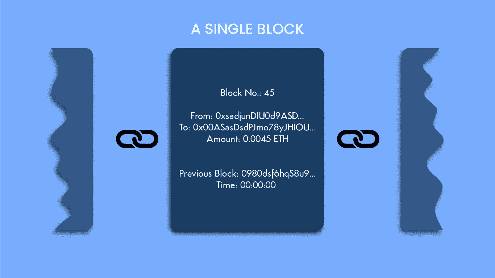
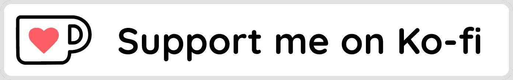
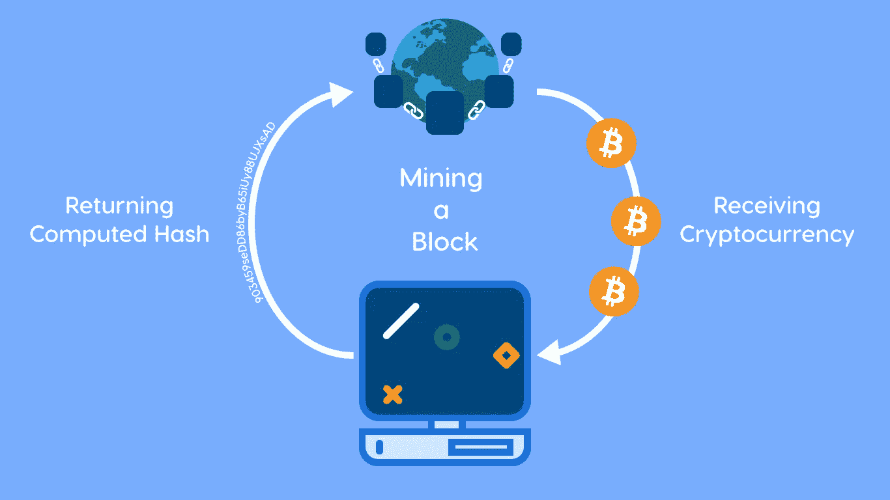
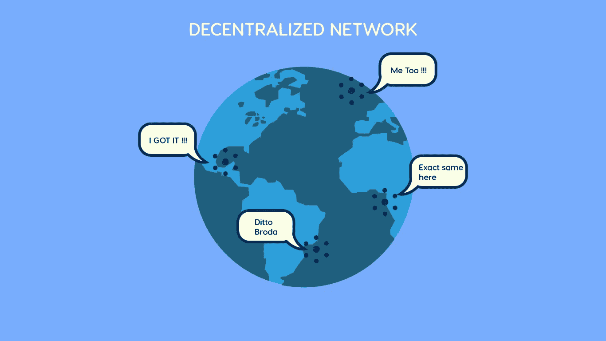

# 区块链是如何工作的？

> 原文：<https://medium.com/coinmonks/how-does-a-blockchain-work-eb1d1d227a5c?source=collection_archive---------26----------------------->

## 区块链、加密货币、挖矿、去中心化等等……

区块链技术到现在已经有十年左右了。它始于 2009 年中本聪发明的伟大的比特币。从那时起，区块链、加密货币(如 Web3)就一直被大肆宣传，今天(2022 年)这些都是每个人谈论的话题。

如果你想更多地了解 web3，你可以看看下面的文章。

 [## Web3:人工智能、加密货币和元宇宙作家字节

### 意识到世界在过去十年中变化的速度之快、程度之大，几乎令人恐惧。我们已经走了…

writersbyte.com](https://writersbyte.com/technology/web3-ai-cryptocurrency-and-the-metaverse/) 

但是人们真的了解什么是区块链吗？大家知道比特币是什么吗？大概不会。对大多数人来说，它只不过是一种可交易的资产，许多人曾因此成为百万富翁。然而，我们在这里谈论这个区块链背后的理论，以及它如何使加密货币成为可能。

## 什么是区块链？

区块链就像一个数据库系统，只是更加复杂和完全分散。我相信与数据库系统相比，区块链用于存储数据是显而易见的，但是它有什么不同呢？为了理解这一点，我们需要把它分成… *块…*😉。

*   阻碍

下图显示了区块链中单个块的外观。

每个区块包含:

1.  一个头球。

这个**头**包含重要信息，例如链中前一个块的 ***散列、块创建时的时间戳、随机数(*** *这用于区块链挖掘* ***)等。***

2.一具尸体

区块链的**主体**包含关于在该区块链上发生的交易的信息。如果交易是加密货币的转移，那么块主体将包含发起交易的**地址、金额转移到的地址和转移的金额。**

*   连接积木

随着越来越多的交易发生，新的数据块被添加到区块链，因此这就产生了…..*一串积木。这个数据库的链式结构确保了它不会被篡改(我们很快就会看到这是如何实现的)。*

如果你觉得这些内容有帮助，可以考虑在《高保真:ko-fi.com/moosaali9906》上支持我

## 块状采矿

除非你一直生活在岩石下，否则你一定在某个地方听说过区块链矿业。每个人似乎都在追逐采矿潮流，但我很确定他们中没有多少人知道采矿到底是什么(除了它给你免费的加密货币)。

*采矿是在区块链上创造一个新区块的过程。一个块不仅仅是*创建的，它需要一个复杂的过程来完成这个过程。每次创建一个块时，都需要强大的计算能力来解决所谓的“区块链问题”。**

**

*我将在另一篇文章中详细讨论挖掘。现在，你只需要明白这个“*问题”*计算量很大，需要一些时间来解决(以太坊 15 秒，比特币 10 分钟)。这种计算费用是区块链技术被认为对环境有害的原因(*你知道，因为计算机运行和使用电力，而电力需要燃烧化石燃料。！*)。*

## *煤气费*

*这或许是引入 ***气费的绝佳时机。*** 如果您从事加密交易或 NFT 交易，您必须熟悉每次进行交易(购买/出售加密或 NFTs)时必须支付的费用。想知道这笔费用是干什么用的吗？*

*嗯，每次你做一笔交易，区块链上就会产生一个区块。这需要挖掘链，因此必须消耗一些计算能力。该燃气费金额被奖励给首先解决问题并允许交易进行的节点(计算机)。*

*这就是区块链矿工赚取加密货币的方式。这真的是免费的钱，因为你所要做的就是让你的电脑工作，并收取汽油费作为奖励。*

## *区块链是去中心化的？*

**

*每当提到区块链，术语“*去中心化*”总是随之而来。这是因为区块链最大的亮点在于它是一个去中心化的网络。*

*在传统的 web 应用程序中，任何一个系统上都有一个数据库。这意味着黑客可以很容易地改变这个数据库，你会丢失所有的数据。区块链是去中心化的，这意味着整个区块链的精确副本存在于挖掘该区块链的每个节点(机器)上。这意味着，即使黑客能够操纵一个块上的链，添加或删除一些事务，其他每个节点上的区块链将保持不变，恶意更改将被捕获。*

## *工作证明与利益证明*

*这些是我将在本文中介绍的最后一些概念。这两个概念都用于将挖掘过程分配给区块链的节点。*

1.  *工作证明*

*POW 是随着比特币区块链推出的(*OG 区块链*)。在这个概念中，每当要验证一个事务时，它就被广播到所有节点，并且每个节点都将急于为该事务计算适当的散列。首先这样做的节点获得汽油费作为奖励。*

*“POW”的问题是，由于每个节点都加入了竞争，但只有一个节点提供了答案，因此在计算散列时浪费了大量资源。所以所有其他人利用的资源完全被浪费了。*

*2.利害关系证明*

*该算法是对 POW 算法的改进。利用利益相关证明方法的区块链要求其网络上的每个节点在能够加入区块链之前都要缴纳一定的费用。这个费用保证了加入者在区块链项目中拥有' ***股权*** '。*

*每当要验证交易时，区块链算法会在网络上随机选择一个节点来解决问题。不完全是随机的*，*每个区块链都有不同的选择节点的方式。一些可能实际上随机选择，一些优先选择在区块链中具有较高风险的节点。*

*虽然 POW 对任何试图进行欺诈交易人都没有惩罚，但 POS 实际上有一些惩罚措施。由于节点已经存入费用，如果一个节点被指控欺诈，网络能够取走该费用的一部分，如果不是全部的话。*

*由于 POS 需要人们实际花钱，因此网络上的节点较少，并且由于一次只选择一个节点来开采区块，因此不会浪费资源，并且对环境更有利。*

> *加入 Coinmonks [电报频道](https://t.me/coincodecap)和 [Youtube 频道](https://www.youtube.com/c/coinmonks/videos)了解加密交易和投资*

# *另外，阅读*

*   *[Bookmap 评论](https://coincodecap.com/bookmap-review-2021-best-trading-software) | [美国 5 大最佳加密交易所](https://coincodecap.com/crypto-exchange-usa)*
*   *最佳加密[硬件钱包](/coinmonks/hardware-wallets-dfa1211730c6) | [Bitbns 评论](/coinmonks/bitbns-review-38256a07e161)*
*   *[新加坡十大最佳加密交易所](https://coincodecap.com/crypto-exchange-in-singapore) | [购买 AXS](https://coincodecap.com/buy-axs-token)*
*   *[红狗赌场评论](https://coincodecap.com/red-dog-casino-review) | [Swyftx 评论](https://coincodecap.com/swyftx-review) | [CoinGate 评论](https://coincodecap.com/coingate-review)*
*   *[投资印度的最佳密码](https://coincodecap.com/best-crypto-to-invest-in-india-in-2021)|[WazirX P2P](https://coincodecap.com/wazirx-p2p)|[Hi Dollar Review](https://coincodecap.com/hi-dollar-review)*