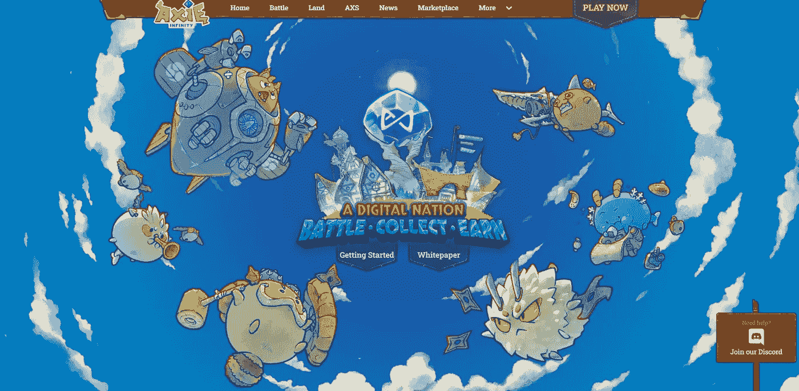

# Axie Infinity 是如何工作的？玩神奇宝贝遇见密码元宇宙游戏获得报酬！

> 原文：<https://medium.com/coinmonks/how-does-axie-infinity-work-d21476a47a3c?source=collection_archive---------32----------------------->

# 什么是 Axie Infinity？

受欢迎的加密开发商 Sky Mavis 于 2018 年在区块链以太坊推出了 Axie Infinity，作为加密爱好者和投资者的娱乐平台。Axie Infinity 最初的灵感来自 Pokémon 和 Tamagotchi 等热门游戏。

如今，带有虚拟怪物和战利品盒的游戏多如牛毛，但 Axie Infinity 对此有不同的看法，因为它的所有功能都是围绕加密货币构建的，AXS 代币是这款游戏的货币。

Axie Infinity 提供了当前加密交易平台的功能以及 Pokémon Go 的可访问性。玩家可以繁殖、饲养和战斗可爱的动物“Axies ”,以获得物品、胜利货币和战斗功能。玩家还可以通过 NFTs 形式的游戏内市场在 Axie 元宇宙购买虚拟房地产。

# Axie Infinity 是如何工作的？

在 Axie Infinity 中，玩家的 Axie 可以四处走动，探索一个虚拟世界。玩家还可以收集虚拟物品，他们可以用这些物品与其他玩家战斗或出售加密货币。

游戏设定在 Axie Infinity 元宇宙，所有数字资产都存储在区块链上，玩家通过玩游戏赚取加密货币。

玩家使用游戏中的货币“Axie Shards”来购买物品和给他们的角色充能。

另一个名为“小爱药水”的令牌是给玩家的，以换取他们在游戏上花费的时间。您可以通过击败对手的 Axie 或完成游戏中的任务来获得一些。你玩得越多，你就能积累越多的 SLP。

# 目前 AXS 的价格是多少？

[查看 AXS 的当前价格](https://coinmarketcap.com/currencies/axie-infinity/)。

# 如何开始玩 Axie Infinity

你需要一个兼容以太坊的加密钱包和足够的以太网来玩。此外，你必须从游戏市场购买至少三个轴。Sky Mavis 保留用户之间出售的所有 Axies、虚拟房地产和其他项目的一部分。游戏使用了一个独特的系统，玩家可以通过玩游戏来教他们的 Axies 如何使用技能。

如果你是游戏新手，这里有一些关于如何开始玩游戏的提示:

1)创建自己的 Axie。你从选择九种轴中的一种开始:水生，野兽，鸟，虫，黎明，黄昏，机械，植物或爬行动物。根据你的 Axie 的职业，它会有不同的属性和技能，以不同的方式帮助你。每个阶级相对于其他阶级都是弱者和强者。

2)在教程模式下学习格斗基础。在这个模式中，你将学习如何攻击、防御和治疗你的队友。

3)在世界地图中搜索包含有价值奖励的宝藏！

# 投资 Axie Infinity (AXS)需要玩吗？

不，你可以通过像比特币基地这样的交易所或者像 Uniswap 或者 SushiSwap 这样的指数来买卖 AXS。

# 投资前的一句忠告

虽然 Axie Infinity 是一款基于加密货币的新游戏，但要注意 AXS 的价格与游戏的受欢迎程度有关。因此，如果玩家转投竞争对手或失去兴趣，价格可能会下降。

 [## 你准备好迎接加密经济了吗？加密派

### 每次你打开新闻，阅读报纸，或者浏览你的推特，你很可能会看到一些故事…

www.thecryptopie.com](https://www.thecryptopie.com/) 

> 加入 Coinmonks [电报频道](https://t.me/coincodecap)和 [Youtube 频道](https://www.youtube.com/c/coinmonks/videos)了解加密交易和投资

# 另外，阅读

*   最佳[加密制图工具](/coinmonks/what-are-the-best-charting-platforms-for-cryptocurrency-trading-85aade584d80) | [最佳加密交易所](/coinmonks/crypto-exchange-dd2f9d6f3769)
*   [比斯勒评论](https://coincodecap.com/bitsler-review)|[WazirX vs coin switch vs coin dcx](https://coincodecap.com/wazirx-vs-coinswitch-vs-coindcx)
*   [7 大副本交易平台](https://coincodecap.com/copy-trading-platforms) | [BuyCoins 点评](https://coincodecap.com/buycoins-review)
*   [my constant Review](https://coincodecap.com/myconstant-review)|[8 款最佳摇摆交易机器人](https://coincodecap.com/best-swing-trading-bots)
*   [Godex.io 审核](/coinmonks/godex-io-review-7366086519fb) | [邀请审核](/coinmonks/invity-review-70f3030c0502) | [BitForex 审核](https://coincodecap.com/bitforex-review)