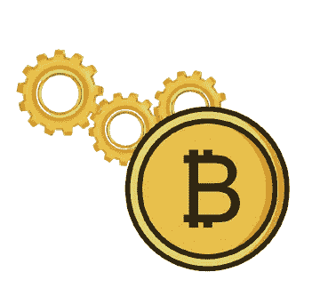
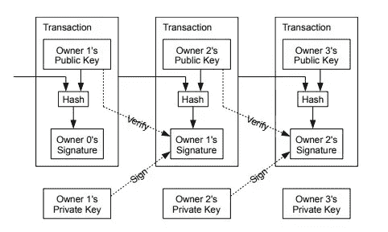
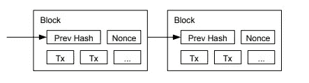
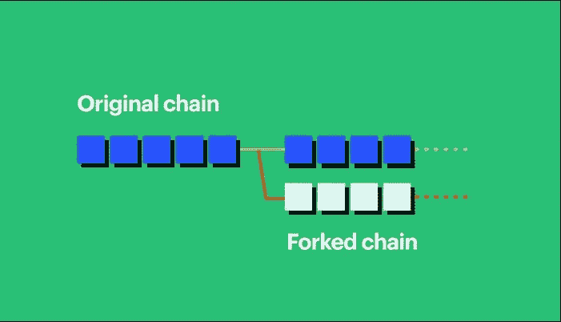

# 比特币是如何运作的？

> 原文：<https://medium.com/coinmonks/how-does-bitcoin-work-6d83d95ac8de?source=collection_archive---------24----------------------->

根据中本聪 2008 年 10 月 28 日的文章，比特币被宣传为一种点对点电子现金支付系统。他在介绍中提到，如果没有可信方，网上购物是不会被处理的。它所提供的系统中所需的信任是基于加密证据的。这样，一个完全对等的支付系统被推荐，而不需要信任。

为了简单起见，让我们来谈谈你和你的朋友保存的公共分类账的存在，每周检查交易，支付债务人，等等。任何人都可以在此分类帐中写入新的交易，并且此分类帐必须对所有人可见。这里有一个大问题。如果我们假设没有也不可能有一个大家互相信任的环境，你怎么确定别人不会代你写交易？此时，数字签名开始发挥作用。也就是说，如果你在交易结束时签名，交易就会变得可靠。

数字签名的实现是通过公钥和私钥对来完成的。虽然我们现实生活中的签名在各方面都是相同的，但数字签名却因邮件而异。所以，造假就变得困难了。当要签名的消息和您的密钥被输入到一个函数中时，就会发生签名过程。消息签名作为输出给出。验证过程包括将消息、公钥和消息签名输入到函数中。它的输出不是真就是假。[(详见本节。)](/@UludagBlockChain/blockchain-demonstration-dad0a1c0a91#2e00)

在这篇文章中，电子货币被定义为一连串的数字签名。在交易过程中，每个所有者将钱发送给下一个，用自己的数字签名签署前一次交易的哈希值和下一个所有者的公钥。这个签名加在钱的末尾，就像账本上的签名一样。接收付款的人也可以验证签名。

这里出现的问题是，收到付款的人无法核实前一个或几个所有者是否不止一次使用过这笔钱。收款人必须验证货币的先前所有者没有预先签署交易。作为对此的解决方案，它基于最早的事务进行处理。为了知道最老的事务，有必要知道所有的事务。要在分布式系统中实现这一点，所有交易都必须向分类账所有者公开宣布。也就是说，加入网络的每个人都必须维护相同的分类账。

如果在这个模型中没有额外的建议，几乎不可能在每个人都有的总账中有诚实的信息。想象一下，账本分发给你所有的朋友。将虚假交易与诚实交易区分开来，并依赖每个人都掌握着相同的信息，这将是一个错误。然后，我们需要一个系统，在这个系统中，人们可以就交易达成一致。

为了确定操作的顺序，应该在执行的事务上加上时间戳。那么时间戳应该如何设置呢？

为了就交易达成一致并验证时间戳，比特币提出的解决方案是信任做最多工作的分类账。我们在以前的一篇文章中提到的这个模型，也称为工作证明，用于时间戳服务器。该模型旨在以一定数量的 0 开始 SHA-256 算法的散列输出。为了找到一定数量的 0，需要替换块中包含的一个称为 nonce 的任意数字，并将其与找到的摘要输出进行比较。随机数包含在块中，因为块中的其他条目不能更改。例如，如果我们更改了块中的时间戳，就不可能获得事务排序和跟踪所需的数据。

由于后来添加到链中的块与先前块的散列数据一起创建散列，所以想要操作的人还必须再次计算先前的块[(详见)](/@UludagBlockChain/blockchain-demonstration-dad0a1c0a91#445a)。

在这种情况下，我们可以说大多数人应该有发言权。假设大多数人会继续这个过程，完成最多工作的最长的链将被认为是诚实的链。只要大部分处理能力被诚实的节点所覆盖，它就会击败其他链。因此，我们明白大多数人是诚实的，最长的链条属于大多数人。为了操纵事务，不诚实的节点还必须计算先前的块，并赶上诚实的节点或甚至超过诚实的节点。在这个模型中，如果块产生得非常快，则难度值增加，即哈希值中的 0 值增加，以防止冒名顶替者与诚实者竞争。

**操作该网络的步骤在文章中描述如下:**

***1)新事务被广播到所有节点。***

***2)每个节点将新事务收集到一个块中。***

***3)每个节点致力于为其块找到困难的工作证明。***

***4)当一个节点发现一个工作证明时，它向所有节点广播该块。***

5)只有当块中的所有事务都有效并且还没有被花费时，节点才接受该块。

***6)节点通过创建链中的下一个块来表达它们对该块的接受，使用被接受的块的散列作为先前的散列。***

延伸在最长的链上继续。如果两个节点同时向其他节点广播同一个块，则会发生分叉。那些试图把下一块积木放上去的人继续在第一块积木上工作。另一块也被保留，直到平局被打破。无论哪一根树枝变得更长，它都会从那里继续生长。

(Image from: [***[0]***](https://www.coinbase.com/tr/learn/crypto-basics/what-is-a-fork) )

这种用处理能力完成的工作实际上是运行系统所需的特殊过程。毕竟这些节点对货币参与流通是有效的。他们还会得到激励，因为电力被浪费了，而从事这项工作的人会形成诚实的链条。这种激励被称为块奖励，它保持节点诚实。听交易，竞争造块的人也叫‘矿工’。每开采 210，000 个区块，区块奖励减半，最初为 50BTC。那么，如果我们用数学方法表示要生产的比特币的最大数量:

**21 万*50 + 21 万*25+ 21 万*12.5 +。。。。。**(以此类推)

**= 210000 *(50+25+12.5+6.25+3.125+。。。。)**

**无穷求和的结果，210，000 旁边的部分减去 100，**

**= 210，000*(100)**

**= 2100 万**

**因此，我们知道比特币的最大生产量上限为 2100 万。**

如果不诚实的人以某种方式构成了大部分的处理能力，他可以在新的交易中操纵它们或者创造新的货币。如果它做了第一个，很明显交易者会注意到它，并说它在网络上是欺诈性的。在一个有大量受害者的网络中，金钱的有效性在多大程度上存在，尽管这一点无法证明？不诚实的人不会破坏自己财富的有效性吗？然后，他应该使用第二种方法，更喜欢按照规则来玩游戏。

> 交易新手？试试[加密交易机器人](/coinmonks/crypto-trading-bot-c2ffce8acb2a)或者[复制交易](/coinmonks/top-10-crypto-copy-trading-platforms-for-beginners-d0c37c7d698c)

## **计算**

考虑到不诚实的人建立了比诚实的链更长的链的情况，并且假设 p 是诚实的节点找到下一个块的概率，q 是冒名顶替者找到下一个块的概率，那么不诚实的人击败诚实的链所需的工作以指数方式增加，因此他的机会开始以指数方式减少。

如果不诚实的人希望用被操纵的信息欺骗购买者，购买者应该听最长的链，在这个链中投入了最多的工作。因此，不诚实的人与其他矿工产生了分歧。因为他是在努力欺骗别人，让他说的话成真。既然买家知道这个分叉，他们应该等一等，看看有没有新的区块进来。买家更喜欢已经放弃冒名顶替者链的长而诚实的链，因为冒名顶替者为获得最长的链而与其他矿工竞争的努力将需要一段时间后的指数工作，并且很难放入新的区块。

## **简单地说**

我们将在后面的文章中讨论本文中没有包括的几个部分，这篇文章是我通过解决工作的基础问题而准备的。要详细了解工作证明和区块链是如何工作的，你可以看看这篇[文章](/@UludagBlockChain/blockchain-demonstration-dad0a1c0a91)。感谢您的阅读。

# **阿里夫·埃姆雷·阿卜杜勒奥卢**

***来源:***

[***https://bitcoin.org/bitcoin.pdf***](https://bitcoin.org/bitcoin.pdf)

[***https://youtu.be/bBC-nXj3Ng4***](https://youtu.be/bBC-nXj3Ng4)***——但是比特币究竟是如何运作的呢？由 3 蓝色 1 棕色*到 **

***【0】:***[***https://www . coin base . com/tr/learn/crypto-basics/what-is-a-fork***](https://www.coinbase.com/tr/learn/crypto-basics/what-is-a-fork)

> 加入 Coinmonks [电报频道](https://t.me/coincodecap)和 [Youtube 频道](https://www.youtube.com/c/coinmonks/videos)了解加密交易和投资

# 另外，阅读

*   [密码交易机器人](/coinmonks/crypto-trading-bot-c2ffce8acb2a)|[15 大 P2E NFT 游戏](https://coincodecap.com/p2e-nft-games)
*   [币安期货交易](https://coincodecap.com/binance-futures-trading)|[3 commas vs Mudrex vs eToro](https://coincodecap.com/mudrex-3commas-etoro)
*   [如何购买 Monero](https://coincodecap.com/buy-monero) | [IDEX 评论](https://coincodecap.com/idex-review) | [BitKan 交易机器人](https://coincodecap.com/bitkan-trading-bot)
*   [尤霍德勒 vs 科恩洛 vs 霍德诺特](/coinmonks/youhodler-vs-coinloan-vs-hodlnaut-b1050acde55a) | [Cryptohopper vs 哈斯博特](https://coincodecap.com/cryptohopper-vs-haasbot)
*   [顶级付费加密货币和区块链课程](https://coincodecap.com/blockchain-courses)