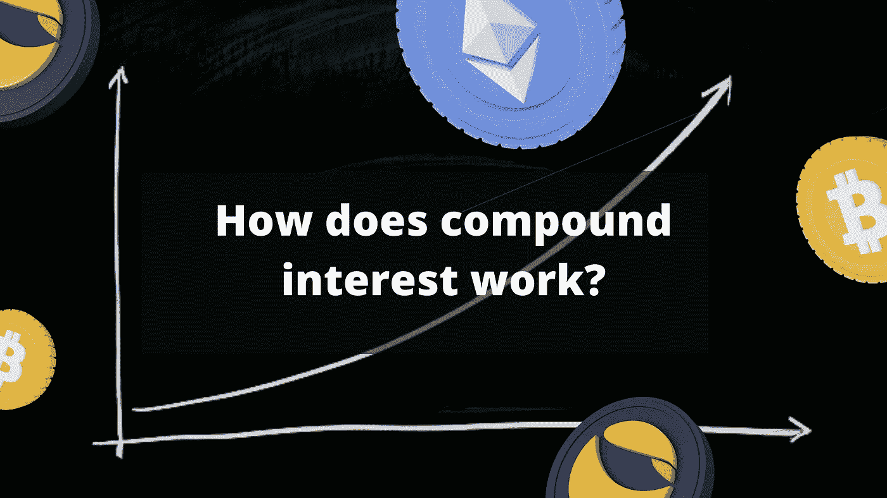
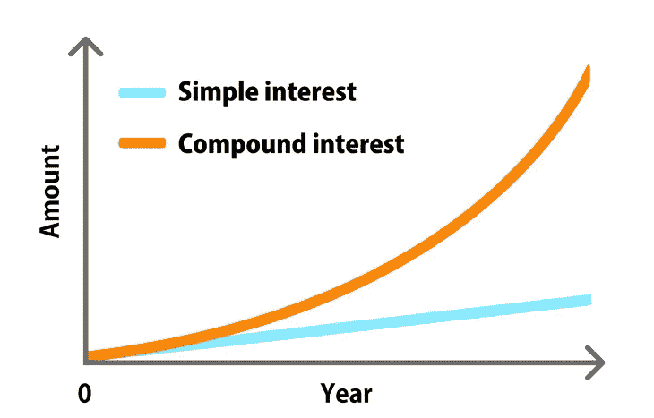
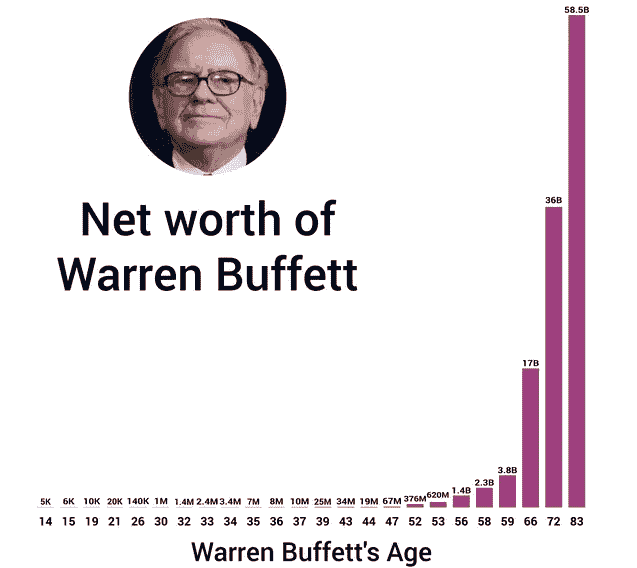
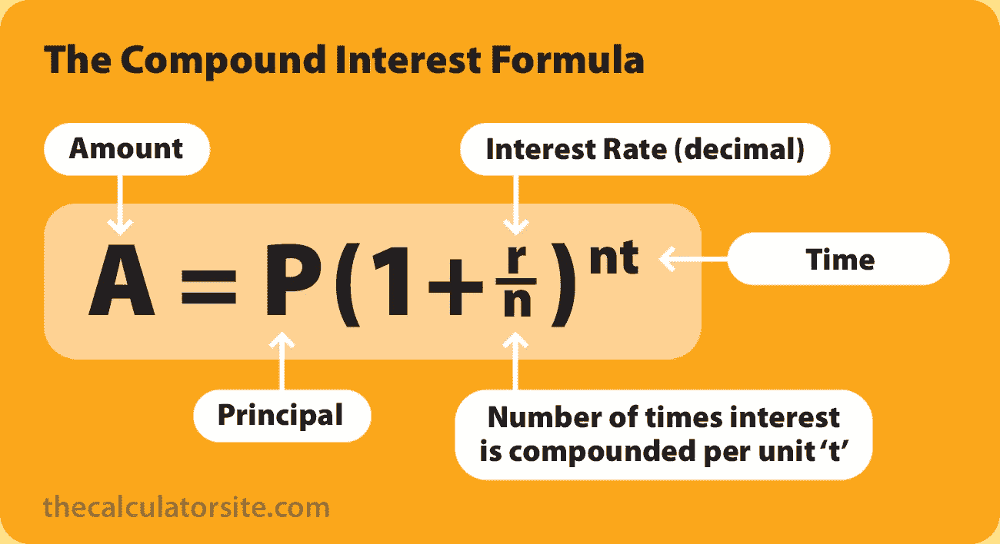
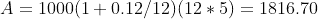
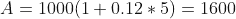

# 复利是怎么运作的？

> 原文：<https://medium.com/coinmonks/how-does-compound-interest-work-90253a7dbe81?source=collection_archive---------16----------------------->

发现复利的机制和力量，**被认为是世界第八大奇迹**。了解它如何运作以及如何优化其利益非常重要，特别是在**加密货币**领域，如 **DeFi** 领域，利益非常重要。

# 目录:

*   定义
*   复利的力量
*   计算
*   APY 对四月
*   结论

# 定义

**复利**代表贷款或存款的利息，考虑了初始本金和以前时期的累计利息。

复利可以表示为“**利息来源于利息**”。它比单利增长更快，单利只根据原始余额计算。

利息可以在任何时间间隔复利:持续，每天，每周或每年。**复利越频繁，与单利的差额就会变得越大**。

# 复利的力量

复利让你从**恒定线性增长**转变为**指数增长**。时间是一个重要的因素，复利投资越长，它与非复利投资的差异就越大。

对于寻求优化收入或财富管理的投资者来说，复利被认为是一个强有力的工具。

沃伦·巴菲特成为世界上最富有的人之一，靠的是一种耐心的策略，即在很长一段时间内以复利计算回报。

复合是一个基于长期愿景的过程。显著的结果只有在一定时间后才会出现。

这就是沃伦·巴菲特在 60 岁后赚到大部分身家的原因。

*具体？*

> 想象一下，一张纸可以折叠 42 次。会有多厚？

人类思维习惯于线性思维，很难解释这种情况。同样的线性思维限制了我们对复利真正潜力的理解。

事实上，折叠的厚度等于从地球到月球的距离，反映了复利的力量。从一张 **0.1 mm** 纸片的厚度，到仅 **42 次折叠**几十万公里(**38.4 万公里**)。

# 计算

复利累积的利率取决于复利的**频率**。复利期数越多，复利越大。

公式如下:

*Source :* [*thecalculatorsite*](https://www.thecalculatorsite.com/articles/finance/compound-interest-formula.php)

让我们以初始投资 **$1000** 为例，以年利率 **12%** 按月复利计算，为期五年。

对于复利，我们有:

没有复利，我们得到:

通过 c **分解每月**的利息，我们得到了 **216.70 美元**的差额。

这种差异在**加密货币**和 **DeFi** 生态系统中更加突出，利益可以上升到三位数。

# APY 对四月

在 **DeFi** 环境中，回报和利益支配所有协议。术语 **APY** 和**四月**经常被用户误解。

然而，这种差异对你的投资组合有重大影响，因为一方面利息是线性的，另一方面是指数的 T21。

**APY** 考虑重新注入协议的复利，以产生增量利息。

**年利率**不考虑复利。

大多数协议提升它们的 **APY** 以显示更高的速率。然而，在大多数情况下，你必须自己将利息复合才能达到这些百分比。

为了优化“汽油”费用，有允许自动复合利息的 **DeFi** 协议。**牛肉金融**就是一个例子。

# 结论

**阿尔伯特·爱因斯坦**将复利描述为“**世界第八大奇迹，宇宙中最强大的力量**”。今天，利益支配着 **DeFi** 中的不同协议，每个用户都在寻找最好的利率来回报他的投资。

准确理解它们的工作原理是获利的重要优势，也是改变我们财务前景的重要资产。

> 加入 Coinmonks [电报频道](https://t.me/coincodecap)和 [Youtube 频道](https://www.youtube.com/c/coinmonks/videos)了解加密交易和投资

# 另外，阅读

*   [NFT 十大市场造币集锦](https://coincodecap.com/nft-marketplaces)
*   [AscendEx Staking](https://coincodecap.com/ascendex-staking)|[Bot Ocean Review](https://coincodecap.com/bot-ocean-review)|[最佳比特币钱包](https://coincodecap.com/bitcoin-wallets-india)
*   [Bitget 回顾](https://coincodecap.com/bitget-review) | [双子 vs 区块链](https://coincodecap.com/gemini-vs-blockfi) | [OKEx 期货交易](https://coincodecap.com/okex-futures-trading)
*   [美国最佳加密交易机器人](https://coincodecap.com/crypto-trading-bots-in-the-us) | [经常性回顾](https://coincodecap.com/changelly-review)
*   [在印度利用加密套利赚取被动收入](https://coincodecap.com/crypto-arbitrage-in-india)