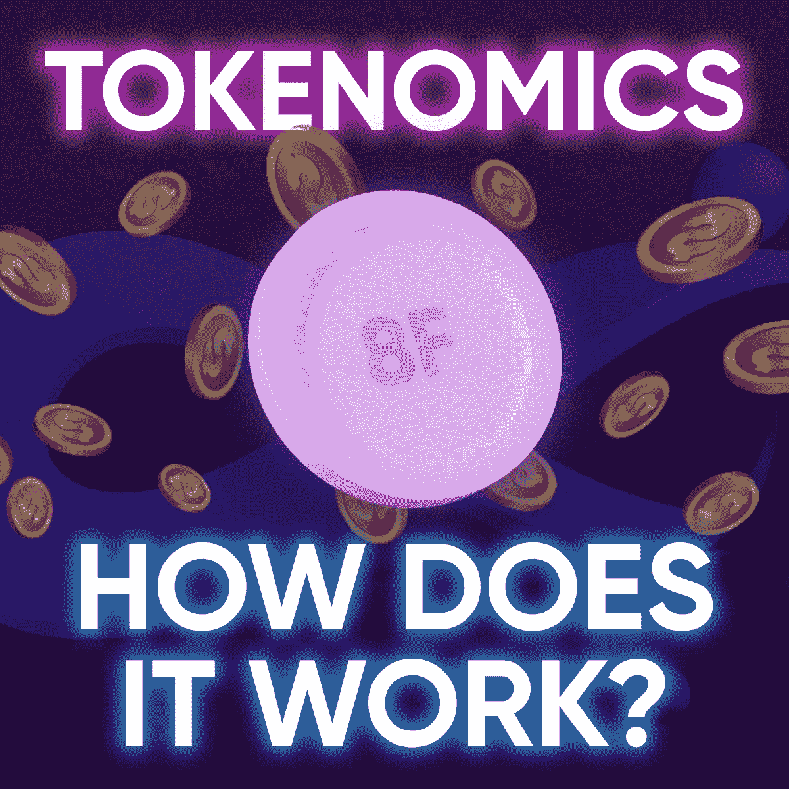
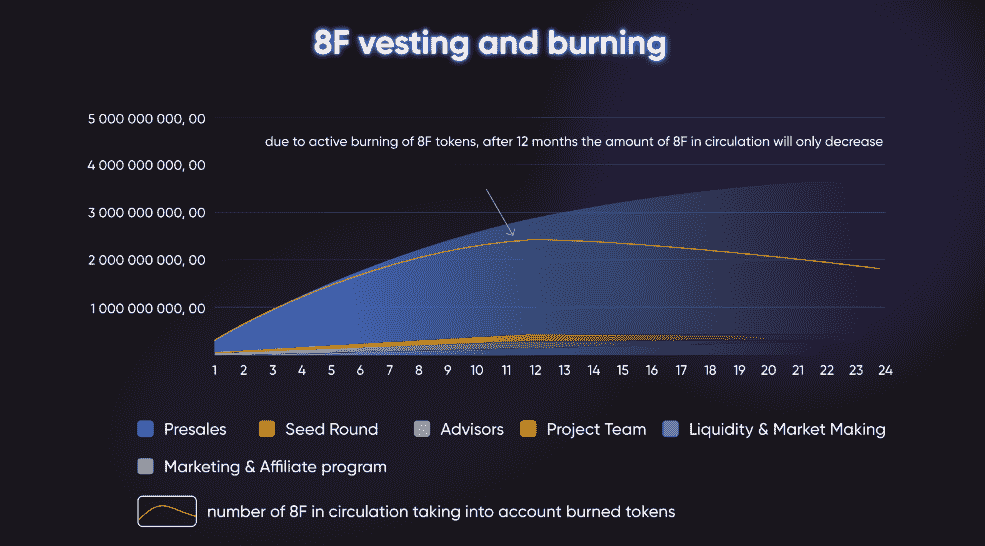
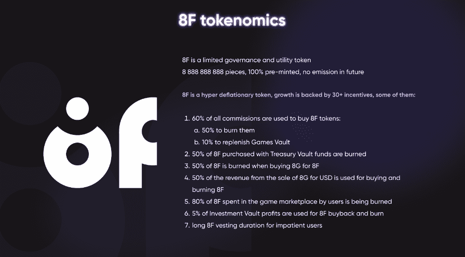

# 8 是怎么回事？金融象征经济学有用吗？

> 原文：<https://medium.com/coinmonks/how-does-the-8-finance-tokenomics-work-8d16dd23f6c4?source=collection_archive---------37----------------------->

8.金融是一个元金融平台，具有精心制作的超通缩令牌经济学，是元规则、游戏、DAOs 和 DeFi 之间协同作用的结果。

我们有来自 Garuda.ai 的教授们审计的坚实的通货紧缩象征经济学。

代币组学意味着旨在维持代币价值的 30 项措施。在项目进行 12 个月后，流通中的代币数量将减少，这将支持其未来价值的增长。

到底什么是令牌组学？简而言之，与国家经济学类似，令牌经济学是项目层面的经济学。正如中央银行发行法定货币，8。财务部门发行系统正常运行所需的令牌。

# 8F 令牌的优势:

## 1.令牌:

— (1)限量发行——永远不再发行，

—在它的帮助下，将有可能对项目开发的决策进行投票(这是一个(2)治理令牌)

—效用(3) —它有特定的用例(购买游戏中的物品、付费、付费平台服务等。)

—这是超级通缩——在令牌经济学中有 30 多个 8F 增长激励。例如，每笔费用中，至少有 50%用于兑换和焚烧 8F 代币。

## 2.该项目的特点是令人印象深刻的游戏化

免费玩游戏，用 Snake for Crypto 赢取代币。该游戏将创造额外的代币需求，游戏市场将刺激其燃烧。

## 3.с阿什巴克

用户使用 DeFi 服务支付的每一笔费用，8G 内都会有 100%返现，可以在游戏中使用。

## 4.推荐计划

不需要做任何事情，只需要分享你的链接，就可以从推荐中获得 3%的收入。如果你完成了 KPI，你甚至可以获得每月固定金额。

## 5.用户始终可见的透明天平

它用于在下跌时维持代币的价格。

# **结论**

总而言之，8 的 tokenomics。金融是以三赢的方式设计的。这意味着，每个人都将受益——玩蛇的玩家将获得代币，投资者可以确信，凭借我们坚如磐石的计算，价格在发布后不会下降，平台用户将能够通过养殖、赌注、交易、参加推荐计划和促销活动来赚取密码。

感谢阅读。订阅我们的社交媒体！

[推特](https://twitter.com/the8finance?t=RHXUDBHmgsJNYl9UILTsog&s=09) | [电报](https://t.me/the8finance) | [不和](https://discord.gg/SxN2cqG2Ed)

这篇文章中的数据已经失去了相关性；参见[手册](https://8-finance.gitbook.io/wiki-eng/about/what-is-8.finance)中的当前信息。