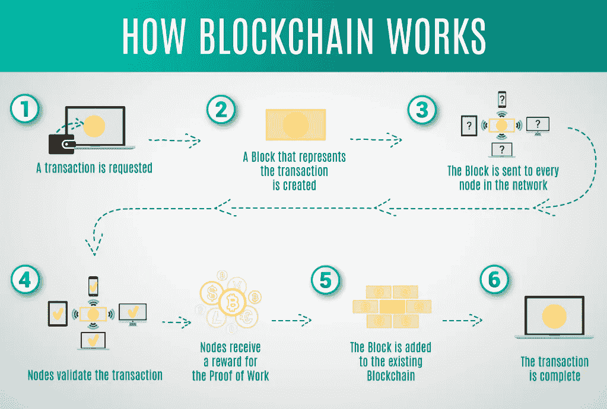

# 区块链是如何工作的？

> 原文：<https://medium.com/coinmonks/how-does-the-blockchain-work-8e0fb08b96ea?source=collection_archive---------18----------------------->

# 什么是区块链？

> 区块链是一个分散的数据库，在计算机网络节点之间共享。区块链充当数据库，以数字格式存储信息。区块链在保持比特币等加密货币系统交易的安全和分散记录方面的关键功能得到了广泛认可。区块链的新颖之处在于，它确保了数据记录的准确性和安全性，同时无需可信的第三方即可产生信任。

区块链上的数据结构不同于传统数据库。区块链将数据组织成称为块的分组，每个块包含一个数据集合。块具有特定的存储能力，当它们满了时，它们会关闭并连接到前一个块，产生一个称为区块链的数据链。在新添加的块之后添加的所有附加信息被编译成新的块，该新的块在被填满之后被添加到链中。

数据库将数据组织到表中，但是区块链将数据组织到链接在一起的块中，顾名思义。当以分散的方式实现时，这种数据结构会自动创建一个不可逆的数据时间线。当一个块被填充时，它就成为时间轴的一部分。当一个新的块被添加到链中时，它被赋予一个精确的时间戳。当链完成时，新生成的块将被添加到其中。

# 外卖很重要

> 区块链是一种共享数据库，与传统数据库的存储方式不同:数据存储在区块中，然后通过加密技术连接在一起。
> 
> 当接收到新信息时，它被输入到一个新的块中。一旦块被数据填充，它就被链接到前面的块上，形成一个按时间顺序排列的数据链。
> 
> 区块链可以保存各种数据，但迄今为止最普遍的应用是作为交易分类账。
> 
> 在比特币的例子中，区块链是以分散的方式使用的，这意味着没有一个人或组织拥有权力——相反，所有用户都拥有集体控制权。
> 
> 分散的区块链是不可变的，这意味着输入的数据不能改变。这意味着比特币交易将被永久记录，任何人都可以访问。

# 什么是区块链，它是如何工作的？

区块链的目的是在没有修改能力的情况下记录和分发数字数据。从这个意义上说，区块链是不可变分类账的基础，也就是不能被更改、删除或销毁的交易记录。区块链也因此被称为分布式账本技术(DLT)。

区块链概念最初是在 1991 年作为一个研究项目提出的，在 2009 年比特币首次广泛使用之前。众多加密货币、去中心化金融(Defi)应用、不可替代代币(NFT)和智能合约的出现，让区块链的使用在此后几年里飙升。

# 交易方法

# 区块链的权力下放。

假设一家公司有一个服务器场，其中有 10，000 台机器，用来跟踪所有客户的账户信息。该公司拥有一个仓库设施，将所有这些计算机放在一个屋檐下，并且它完全控制每台计算机及其所保存的数据。但是，这会产生单点故障。如果那个地方停电了会发生什么？如果它的互联网连接丢失了会发生什么？如果一切都付之一炬呢？如果一个坏演员用一个按键就把所有东西都擦干净了怎么办？在这两种情况下，数据要么丢失，要么损坏。

## 区块链允许数据库中的数据分布在不同位置的几个网络节点上。这不仅为数据库增加了冗余，还确保了其中包含的数据是准确的——如果数据库的一个节点被更新，其他节点不会受到影响，从而防止坏人这样做。如果一个用户篡改了比特币的交易记录，所有其他节点将相互交叉引用，从而很容易找到包含错误数据的节点。这个系统有助于建立一个精确的和可见的事件顺序。以这种方式，网络中没有一个节点可以改变它包含的数据。

因此，信息和历史(如加密货币交易)是不可逆的。区块链可以存储一系列信息，包括法律合同、州身份证明和公司的货物库存，以及交易列表(如加密货币)。

# 透明度

> 由于比特币区块链的分散结构，所有交易都可以通过运行个人节点或利用区块链探索者进行实时检查。每个节点都有自己的链副本，当添加和验证新块时，该副本会更新。这意味着，如果你愿意，你可以跟随比特币到任何地方。
> 
> 例如，交易所在过去曾遭到黑客攻击，导致交易所持有的每一枚比特币都丢失了。虽然黑客的身份可能仍然不明，但他们窃取的比特币显然是可以追踪的。如果在这些攻击中被盗的比特币被转移或花在了某个地方，那就不得而知了。
> 
> 当然，比特币区块链(以及其他大多数比特币)上的记录都是加密的。这意味着只有记录的所有者有能力对其进行解码并暴露他们的身份(使用公钥-私钥对)。因此，区块链用户可以在保持透明度的同时保持匿名。

# 区块链是安全的投资吗？

# [报价]

## 现在你有机会获得 10，000 美元！

在许多方面，区块链技术提供了分散的安全性和信任。首先，新块总是以线性和时间顺序记录。也就是说，它们总是被附加到区块链的“结尾”一旦数据块被附加到区块链的末尾，就很难返回并改变其内容，除非网络中的大多数人同意这样做。这是因为每个块都有自己的散列，以及它前面的块的散列和前面描述的时间戳。数学函数将数字数据转换成一串数字和字母，从而产生散列码。如果数据以任何方式改变，哈希代码也会改变。

假设一名黑客同时管理着区块链网络的一个节点，他想改变区块链，从其他人那里窃取比特币。如果他们改变了他们的单个副本，它将不再匹配其他所有人的副本。当其他人比较他们的副本时，他们会看到这一个脱颖而出，而那个黑客版本的链将作为无效而被丢弃。

为了成功实现这种妥协，黑客必须同时拥有并更改 51%或更多的区块链副本，确保他们的新副本成为多数副本，从而成为商定的链。像这样的攻击会花费大量的金钱和资源，因为他们必须重写所有的数据块，因为时间戳和哈希码现在已经不同了。

# 比特币 vs 区块链

Stuart Haber 和 W. Scott Stornetta 两位研究人员的目标是开发一个文档时间戳不能被操纵的系统，他们最初在 1991 年提出了区块链技术。直到 20 多年后，随着比特币在 2009 年 1 月的首次亮相，区块链才首次在现实世界中使用。

区块链是比特币协议的基础。比特币的匿名开发者中本聪在一篇介绍这种数字货币的研究论文中，将其描述为“一种完全点对点的新电子现金系统，没有可信的第三方”。

需要记住的重要一点是，比特币只是利用区块链创建了一个透明的支付分类账；然而，理论上区块链可以用来不变地记录任何数量的数据项。如前所述，这可能表现为交易、选举投票、货物清单、州身份证明、房契等等。

## 目前，成千上万的倡议正试图以多种方式使用区块链，而不仅仅是记录交易，例如作为民主选举中的安全投票系统。由于区块链的不变性，欺诈性投票将变得更加困难。例如，可以建立一个投票系统，让一个国家的每个公民都得到一枚单独的硬币或代币。然后，每个候选人将被分配一个唯一的钱包地址，选民将把他们的令牌或密码发送到他们希望投票的候选人的地址。由于区块链是透明和可追踪的，它将消除人工计票的必要性以及不良行为者干扰实际投票的能力。

## 感谢您的阅读。

> *加入 Coinmonks* [*电报频道*](https://t.me/coincodecap) *和* [*Youtube 频道*](https://www.youtube.com/c/coinmonks/videos) *了解加密交易和投资*

# 另外，阅读

*   [有哪些交易信号？](https://coincodecap.com/trading-signal) | [Bitstamp vs 比特币基地](https://coincodecap.com/bitstamp-coinbase) | [买索拉纳](https://coincodecap.com/buy-solana)
*   [ProfitFarmers 点评](https://coincodecap.com/profitfarmers-review) | [如何使用 Cornix 交易机器人](https://coincodecap.com/cornix-trading-bot)
*   [十大最佳加密货币博客](https://coincodecap.com/best-cryptocurrency-blogs) | [YouHodler 评论](https://coincodecap.com/youhodler-review)
*   [my constant Review](https://coincodecap.com/myconstant-review)|[8 款最佳摇摆交易机器人](https://coincodecap.com/best-swing-trading-bots)
*   [MXC 交易所评论](/coinmonks/mxc-exchange-review-3af0ec1cba8c) | [Pionex vs 币安](https://coincodecap.com/pionex-vs-binance) | [Pionex 套利机器人](https://coincodecap.com/pionex-arbitrage-bot)
*   [我的加密副本交易经历](/coinmonks/my-experience-with-crypto-copy-trading-d6feb2ce3ac5) | [比特币基地评论](/coinmonks/coinbase-review-6ef4e0f56064)
*   [CoinFLEX 评论](https://coincodecap.com/coinflex-review) | [AEX 交易所评论](https://coincodecap.com/aex-exchange-review) | [UPbit 评论](https://coincodecap.com/upbit-review)
*   [AscendEx 保证金交易](https://coincodecap.com/ascendex-margin-trading) | [Bitfinex 赌注](https://coincodecap.com/bitfinex-staking) | [bitFlyer 审核](https://coincodecap.com/bitflyer-review)