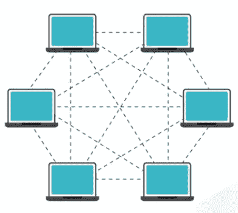

# 区块链是如何运作的？

> 原文：<https://medium.com/coinmonks/how-does-the-blockchain-work-febb672b59ae?source=collection_archive---------25----------------------->

**对区块链有什么想法？**

**嗯**，

**L** et 先来看看，什么是*区块链*！然后我们将讨论它是如何工作的。

*区块链*是分布在广阔地理区域的数百或数千甚至数百万台计算机(服务器)中存储的数据块链。这是一个完整的分类帐，保存了数字资产的所有贷项/借项交易的副本。它基于分散的技术。

比特币是区块链应用的一个很好的例子，或者我们可以说它基于去中心化的原则。这意味着当一个新的节点(服务器)被添加到比特币网络时，不可能修改或删除该节点。它工作在对等(P2P)网络上，每个对等点充当一个服务器。

该图描述了如何在区块链网络中建立 P2P 网络。

我很确定，现在你已经对区块链和 P2P 网络有所了解了。

太好了！

现在，让我们看看区块链是如何工作的。

激动吗？

我也是！

我们可以将*区块链*定义为一个系统，它允许一组连接的计算机维护一个更新的和安全的账本。我们知道*区块链*是由一个区块链组成的，对于每一个新的事务，都需要创建一个新的区块。

那么，一个块(节点)是如何在*区块链*网络内部创建的呢？

创建块的第一步是，用户必须请求将一个交易添加到*区块链*网络，该交易还必须包括一些必需的信息(如交易 id、散列 id、时间戳等)。

在交易被验证之后，第二步是，在*区块链*网络中创建一个新的块(但不添加)。

一旦创建了一个块，它就会广播到 P2P(点对点)网络。P2P 网络也是由块(节点)组成的。然后，一个 P2P 节点验证交易。

在成功验证之后，事务再次移动到下一阶段，也就是说，该网络中的其他节点也需要验证，因为所有节点都是相互链接的。

现在到了最后一个阶段，那就是

一旦事务被网络中的其他节点验证，那么块就准备好了。现在，区块(事务)被添加到现有的*区块链*网络中。

这就是区块链的工作原理。

我知道如果你是第一次来区块链，会有点困惑。但是相信我，一旦你明白了，你就会觉得很有趣。

喜欢我:)哈哈

酷！

感谢阅读我的文章。

一会儿见，新话题！

在那之前，喝着咖啡，写着代码

> 加入 Coinmonks [电报频道](https://t.me/coincodecap)和 [Youtube 频道](https://www.youtube.com/c/coinmonks/videos)了解加密交易和投资

# 另外，阅读

*   [BigONE 交易所点评](/coinmonks/bigone-exchange-review-64705d85a1d4) | [电网交易 Bot](https://coincodecap.com/grid-trading)
*   [氹欞侊贸易评论](https://coincodecap.com/anny-trade-review) | [CoinSpot 评论](https://coincodecap.com/coinspot-review)
*   [新加坡十大最佳加密交易所](https://coincodecap.com/crypto-exchange-in-singapore) | [购买 AXS](https://coincodecap.com/buy-axs-token)
*   [投资印度的最佳加密软件](https://coincodecap.com/best-crypto-to-invest-in-india-in-2021) | [WazirX P2P](https://coincodecap.com/wazirx-p2p)
*   7 个最佳零费用加密交易平台
*   [最佳网上赌场](https://coincodecap.com/best-online-casinos) | [期货交易机器人](/coinmonks/futures-trading-bots-5a282ccee3f5)