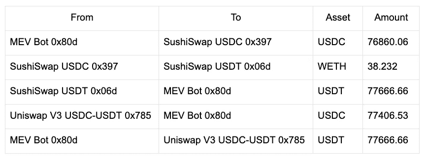
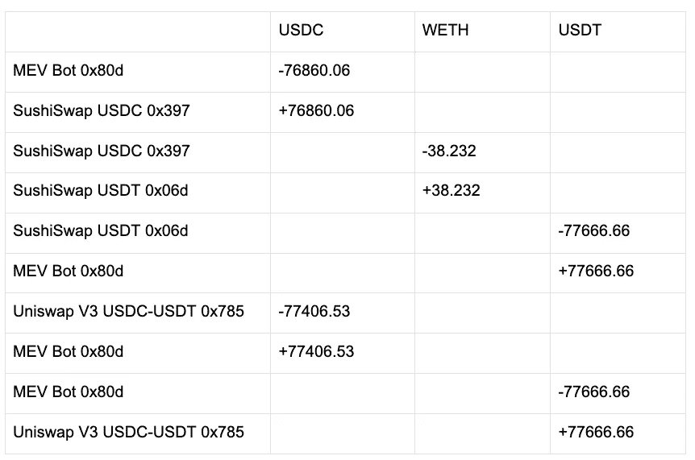
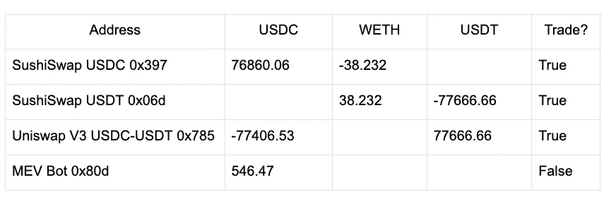
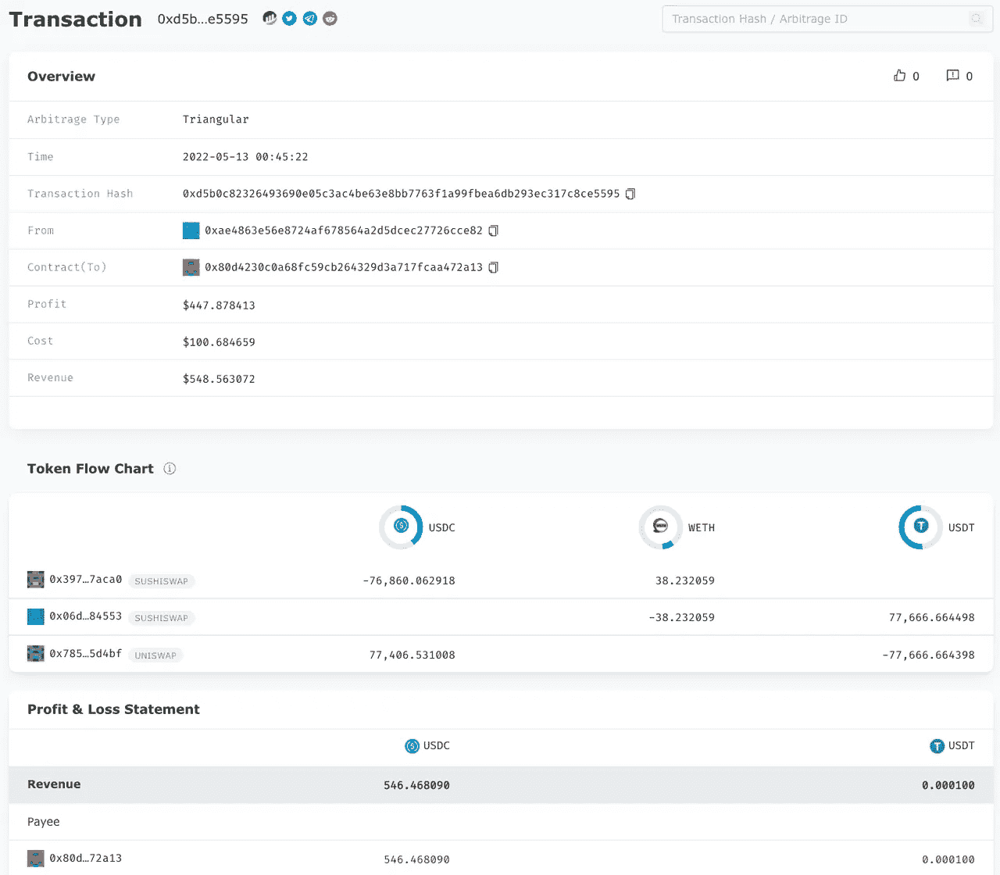

# EigenPhi 如何识别套利交易

> 原文：<https://medium.com/coinmonks/how-eigenphi-identifies-arbitrage-transactions-87dfff466535?source=collection_archive---------4----------------------->

Photo by [Marten Newhall](https://unsplash.com/@laughayette) on [Unsplash](https://unsplash.com/)

与由网页和超链接组成的传统互联网不同，DeFi 建立在智能合约及其复杂的交易交互和结构之上。智能合约、DeFi 资产及其调用方之间的相互作用是如此多样和灵活，以至于没有强大的工具就不可能破译，更不用说解码隐藏的市场信号了。

例如，考虑去年的奶油金融闪贷攻击。涉及 29 个令牌、30 个流动性池、5 个协议和 75 次转账。这些交易元素形成了行为，而行为又反过来建立了网络。

如果你想成为新世界的征服者，结构、行为和网络是你必须弄清楚的 DeFi 的无形支柱。

Photo by [Jeremy Bezanger](https://unsplash.com/@unarchive) on [Unsplash](https://unsplash.com/)

作为新一代 DeFi 数据分析平台的先驱，EigenPhi 采用的方法侧重于从全面检查智能合约形成的交易结构入手。

**通过以易于理解的方式对流动性池、eoa 和协议之间的资产转移进行严格剖析和简化呈现，EigenPhi 的行为和网络分析为帮助用户定价流动性和识别风险提供了坚实的前提，最终不仅能够了解幕后的故事，还能够了解资产的利润和收益。**

这是一条具有挑战性的道路，但也是 EigenPhi 从一开始就在努力的必经之路。我们是市场上唯一有能力做到这一点的团队。

简而言之，这是 EigenPhi 分解事务结构的方法。

## 识别原子套利交易

假设一个交易可以是任意复杂的，并且可以具有无限数量的未知交易模式，使用特定交易模式匹配的方法不能应对新的套利模式。为了确定交易中是否发生套利，我们需要一个交易的通用抽象。

以下是我们为认可而设定的原则。

我们认为交易是资产转移的集合，我们使用一套规则，通过评估这些转移的结果来判断套利是否发生。经验法则是，交易中有不止一次的转移(或互换)，交易者最终会有盈余。

## 抽象方法

一个事务可以抽象为以下行为:转移、交易以及它们的组合。TransferTable 是通过将传输合并到一个名为 Transfer Table 的表中生成的。然后我们合并 TransferTable 中地址相同的行，得到 CombinedTransferTable。

## 履行

**资产**

*   ETH 或 ERC20 令牌

**传送方式**

我们用它来描述交易中两个地址之间的资产流动。

*   转移::(起始地址、终止地址、资产、金额)
*   含义:将资产从一个地址转移到另一个地址。

**可转移**

*   makeTransferTable::[Transfer]-> Transfer table

我们用它来描述在一个交易中所有相关地址之间发生的多项资产流动的**过程**。

*   TransferTable 的列是资产。
*   TransferTable 的每一行都表示地址的资产发生了变化，正值表示增加，负值表示减少。
*   转移对应于 TransferTable 中的两行:一行对应于 from 地址，对应于负资产值，表示资产流出；另一行对应于 to 地址，对应于正资产值，表示资产流入。

**组合可转让**

我们用它来描述在一个交易中所有相关地址之间发生的多个资产流的最终结果。

我们合并 TransferTable 中具有相同地址的行，并将所有资产值相加，生成 CombinedTransferTable。

*   makeCombinedTransferTable::TransferTable-> CombinedTransferTable

**贸易**

当一个地址在交易后**以资产的变化**结束，其中一项资产**减少而另一项资产**增加时，该地址被认为已经进行了交易。

**套利识别规则**

当交易后满足以下条件时，套利被认为已经发生。

*   套利交易者在另一个地址进行了不止一笔交易。
*   交易中涉及的每项资产在各自的交易中都经历了流入和流出。
*   交易者的净盈余为正

## 例子

EigenPhi 识别的典型三角套利

*   [eigen phi 上的交易页面](https://www.eigenphi.io/ethereum/tx/0xd5b0c82326493690e05c3ac4be63e8bb7763f1a99fbea6db293ec317c8ce5595)
*   [以太网扫描上的交易页面](https://etherscan.io/tx/0xd5b0c82326493690e05c3ac4be63e8bb7763f1a99fbea6db293ec317c8ce5595)

**转会名单:**

**该交易的可转让表:**

**得到的组合可转移性:**

**判决**

*   根据合并的可转让表，我们可以看出——sushis WAP USDC 0x 397、SushiSwap USDT 0x06d 和 uni swap V3 USDC-USDT 0x 785——这三个地址进行了交易。
*   这三笔交易涉及 USDC、WETH 和 USDT，每笔资产的列都有正值和负值。
*   MEV-Bot 0x80d 无贸易，净盈余为正。

因此，我们将这笔交易定义为[套利](https://www.eigenphi.io/ethereum/tx/0xd5b0c82326493690e05c3ac4be63e8bb7763f1a99fbea6db293ec317c8ce5595)。

好了，我们已经向你介绍了 EigenPhi 识别原子套利的方法。在下一篇文章中，我们来看看如何识别一个[三明治套利](https://eigenphi.io/ethereum/sandwich)。

跟随我们通过这些来挖掘更多隐藏的 DeFi 的智慧:

*   [艾根菲的推特](https://twitter.com/eigenphi)
*   [EigenPhi 的微博提醒](https://twitter.com/eigenphi_alert)
*   [子堆栈](https://eigenphi.substack.com/)
*   [中等](/@eigenphi)
*   [Mirror.xyz](https://mirror.xyz/0xc19565163aFdEe3783FC970E4Bd0275B11848d34)
*   [电报](https://t.me/WisdomOfDeFi)
*   [不和谐](https://discord.com/invite/JXD8cyzR2a)
*   [杂志](https://www.getrevue.co/profile/EigenPhi)

> 加入 Coinmonks [电报频道](https://t.me/coincodecap)和 [Youtube 频道](https://www.youtube.com/c/coinmonks/videos)了解加密交易和投资

# 另外，阅读

*   [霍比评论](https://coincodecap.com/huobi-review) | [OKEx 保证金交易](https://coincodecap.com/okex-margin-trading) | [期货交易](https://coincodecap.com/futures-trading)
*   [麻雀交换评论](https://coincodecap.com/sparrow-exchange-review) | [纳什交换评论](https://coincodecap.com/nash-exchange-review)
*   最好的[加密税务软件](/coinmonks/best-crypto-tax-tool-for-my-money-72d4b430816b) | [硬币追踪评论](/coinmonks/cointracking-review-a-reliable-cryptocurrency-tax-software-5114e3eb5737)
*   [Stackedinvest 评论](https://coincodecap.com/stackedinvest-review) | [北海巨妖评论](/coinmonks/kraken-review-6165fc1056ac) | [bitFlyer 评论](https://coincodecap.com/bitflyer-review)
*   最佳[加密借贷平台](/coinmonks/top-5-crypto-lending-platforms-in-2020-that-you-need-to-know-a1b675cec3fa) | [杠杆令牌](/coinmonks/leveraged-token-3f5257808b22)
*   最佳[加密制图工具](/coinmonks/what-are-the-best-charting-platforms-for-cryptocurrency-trading-85aade584d80) | [最佳加密交易所](/coinmonks/crypto-exchange-dd2f9d6f3769)