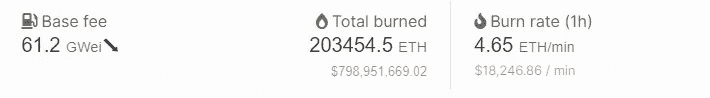
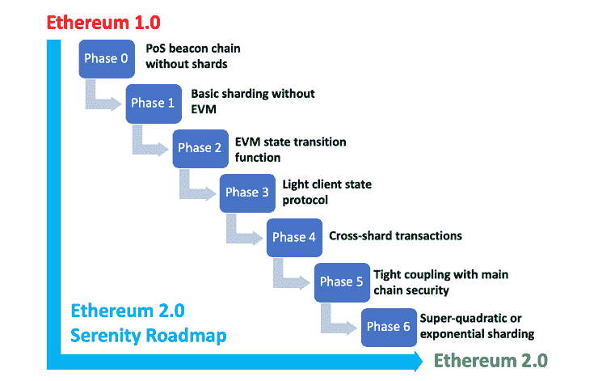
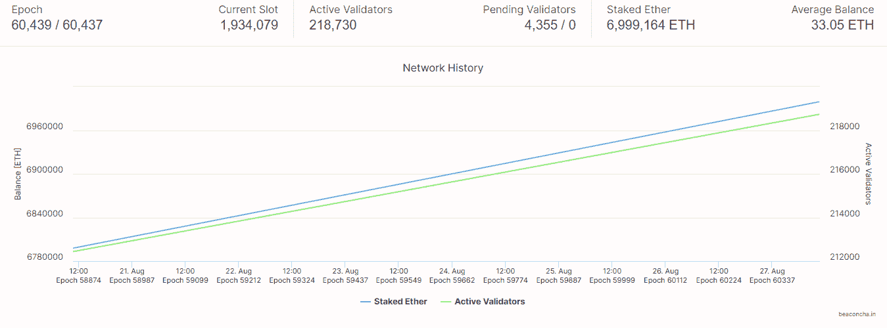

# EIP-1559 和 ETH 2.0 将如何永远改变以太坊

> 原文：<https://medium.com/coinmonks/how-eip-1559-and-eth-2-0-will-change-ethereum-forever-4f9cbc7e8118?source=collection_archive---------5----------------------->

## 这些升级会把以太坊定义为终极结算层吗？

Photo by [Pawel Czerwinski](https://unsplash.com/@pawel_czerwinski)

***回顾过去一切开始的地方。***

*你需要首先在这里听到它——以太币是健全的货币，目前* [*以 4.5 ETH/min(18500 美元)的速度*](https://etherchain.org/burn) *燃烧，自 EIP-1559 伦敦硬分叉以来，总共燃烧了 203000 ETH(79630000 美元)退出流通(在撰写本文时)。*

*自 2015 年推出以来，市值排名第二的区块链一直是一股不可忽视的力量。当然，作为市值第二大的加密货币，它花了一段时间才达到今天的地位。crypto-universe 认为它是一台由区块链支持的分布式世界计算机，连接着为应用程序提供动力的智能合约生态系统，并通过其区块链支持的智能合约集成数字资产，该智能合约允许在满足指令条件时自动执行代码。*

*如今，以太坊网络发展迅猛，超过 3000 个被称为 dApps 的分散应用* *运行在网络的区块链和智能合约上。随着更多的 dApps 继续建立在网络的区块链上；使用这些应用程序的新用户将会增加。因此，新用户数量的增加对限制施加了压力，导致更高的天然气价格和由于网络拥塞而延迟的交易结算。*

虽然以太坊的交易时间比比特币快，但高油价的问题掩盖了比特币网络的问题。为了改变这种情况，并使网络成为一个更可行的生态系统，让分散的应用程序在区块链上继续构建和创新，以太坊社区和基金会的开发人员已经走到一起，将他们所有的努力投入到设计、讨论和寻找共识中，以最好地解决当前架构上的可扩展性问题。

# 以太坊与可伸缩性的斗争

在以太坊最近推出 EIP-1559 之前，网络已经受到了多方面的挑战。目前，它正在运行一个工作证明(PoW)共识算法，为了让以太供应进入流通，以太坊矿工需要开采以太。由于以太坊 PoW mining 的基本属性，网络能够实现的交易数量是有限的。目前，这个数字很小[一个块每秒创建 30 个事务](https://www.thestreet.com/crypto/ethereum/ethereum-2-upgrade-what-you-need-to-know#:~:text=Right%20now%2C%20Ethereum%20can%20only%20handle%20around%2030%20transactions%20per%20second.)。

以太坊的可扩展性限制构成了成为结算层的威胁。大多数 dApps 建立在网络的区块链上，这将最终把以太坊标记为结算层。为了让 dapp 接收资金并与其他 dapp 和以太坊的本机令牌(Ether)互操作。2019 年，以太坊联合创始人兼 Consensys 创始人 Joe Lubin 表示:

> “以太坊是区块链最大的生态系统，为了让它继续成长为地球的基础居住层”

为了以太坊成为全球结算层；首先，它必须进行大量升级以确保高性能，从而证明其网络的灵活性、可扩展性和互操作性。

# 后 EIP 时代-1559 年

以太坊网络在以太坊改进提案(EIP)-1559 伦敦硬岔道于 2021 年 8 月 5 日在[12，965，000 号](https://www.nicehash.com/countdown/eth-forking-2021-08-04-15-00)街区发生后，真的火了(哈，这里没有双关语)。以太坊代码的新改进花了两年多一点的时间才完成并达成共识。这种代码变化的整个想法是通过增加汽油费和网络拥塞来抵消以太坊 2.0 的延迟。

这次升级实质上改变了网络交易的处理方式。以太坊网络验证块上的矿工会得到一部分奖励，剩下的烧掉。通常，当加密货币被烧毁时，它们将被发送到无法获得的钱包地址或烧毁地址。在这种情况下，以太从协议中完全消失，不再存在于网络中。

从本文撰写之时起，目前的燃烧速率已变为 4.65 ETH/min(18，246 美元)，总燃烧量为 203，454 ETH(798，951，669 美元)。

Source: Courtesy of [etherchain.org](https://etherchain.org/burn)

# 以太坊 2.0 路线图

以太坊 2.0 是以太坊上正在进行的大规模升级。预计这一实施将提高网络的可扩展性和安全性。这意味着以太坊将通过利益证明(PoS)共识算法向金融界真正展示超级计算机的能力。

当以太坊升级到以太坊 2.0 时，目前的以太坊持有者几乎不需要采取任何行动，因为以太坊 2.0 的新令牌将分发到新创世纪街区的持有者手中。所以，如果你的钱包里有“X”量的乙醚，不要烦恼，因为你需要期待的是成为今天历史时刻的一部分。

为了从‘以太坊 1.0’升级到‘以太坊 2.0’，这不会像实施 EIP-1559 升级那么容易。基金会和开发者社区需要实施一些阶段。目前，以太坊在完成第 0 阶段“信标链”的发布后，正处于第 1 阶段。

Source: [Boxmining.com](https://boxmining.com/ethereum-2/) via Consensys

基本上，信标链在其初始阶段是为了引入以太坊 2.0 的利益证明特性。以太坊的令牌持有者可以开始在信标链上标记他们的以太，并成为网络上的验证者。然而，要做到这一点，你需要下注 32 ETH 或 32 的倍数，如果你没有 32 ETH，但仍想参加——[加入赌注池](https://ethereum.org/en/eth2/staking/#stake)。为什么是 32？:嗯，它被用作验证器的信任机制——诚实且可操作，并验证网络上的交易。

根据 [beaconcha .在](https://mainnet.beaconcha.in/)总共有 6，999，164 个 ETH 在 Beacon 链上，836 个 ETH 对 700 万个在下赌注！

在撰写本文时，以太坊 2.0 是第三大加密货币，总价值为 2120 万美元。

Source: Ethereum 2.0 Beacon chain Explorer via [beaconcha.in](https://mainnet.beaconcha.in/)

# 最后的想法

以太坊一直站在允许新领域创新的最前沿。有成千上万的应用程序建立在区块链之上。

为了解决以太坊的可扩展性问题，基金会和开发者社区提出了他们的想法和努力，以确保网络有一个更好的未来。升级已经完成，更多的将会到来。以太坊 2.0 是近期目标，因此将在一个全新的水平上提高网络的可扩展性。

> 加入 Coinmonks [电报频道](https://t.me/coincodecap)和 [Youtube 频道](https://www.youtube.com/c/coinmonks/videos)了解加密交易和投资

## 另外，阅读

*   [3 商业评论](/coinmonks/3commas-review-an-excellent-crypto-trading-bot-2020-1313a58bec92) | [Pionex 评论](https://blog.coincodecap.com/pionex-review-exchange-with-crypto-trading-bot) | [Coinrule 评论](/coinmonks/coinrule-review-2021-a-beginner-friendly-crypto-trading-bot-daf0504848ba)
*   [莱杰 vs n rave](/coinmonks/ledger-vs-ngrave-zero-7e40f0c1d694)|[莱杰 nano s vs x](/coinmonks/ledger-nano-s-vs-x-battery-hardware-price-storage-59a6663fe3b0) | [币安评论](/coinmonks/binance-review-ee10d3bf3b6e)
*   [按位交换审查](/coinmonks/bybit-exchange-review-dbd570019b71) | [位码审查](https://blog.coincodecap.com/bityard-reivew)
*   [3 commas vs crypto hopper](/coinmonks/3commas-vs-pionex-vs-cryptohopper-best-crypto-bot-6a98d2baa203)|[赚取加密利息](/coinmonks/earn-crypto-interest-b10b810fdda3)
*   最好的比特币[硬件钱包](/coinmonks/hardware-wallets-dfa1211730c6) | [BitBox02 回顾](/coinmonks/bitbox02-review-your-swiss-bitcoin-hardware-wallet-c36c88fff29)
*   [block fi vs Celsius](/coinmonks/blockfi-vs-celsius-vs-hodlnaut-8a1cc8c26630)|[Hodlnaut 评审](/coinmonks/hodlnaut-review-best-way-to-hodl-is-to-earn-interest-on-your-bitcoin-6658a8c19edf) | [KuCoin 评审](https://blog.coincodecap.com/kucoin-review)
*   [Bitsgap 审查](/coinmonks/bitsgap-review-a-crypto-trading-bot-that-makes-easy-money-a5d88a336df2) | [Quadency 审查](/coinmonks/quadency-review-a-crypto-trading-automation-platform-3068eaa374e1) | [Bitbns 审查](/coinmonks/bitbns-review-38256a07e161)
*   [密码本交易平台](/coinmonks/top-10-crypto-copy-trading-platforms-for-beginners-d0c37c7d698c) | [Coinmama 审核](/coinmonks/coinmama-review-ace5641bde6e)
*   [印度加密交易所](/coinmonks/bitcoin-exchange-in-india-7f1fe79715c9) | [比特币储蓄账户](/coinmonks/bitcoin-savings-account-e65b13f92451)
*   [OKEx vs KuCoin](https://blog.coincodecap.com/okex-kucoin) | [摄氏替代度](https://blog.coincodecap.com/celsius-alternatives) | [如何购买 VeChain](https://blog.coincodecap.com/buy-vechain)
*   [币安期货交易](https://blog.coincodecap.com/binance-futures-trading)|[3 commas vs Mudrex vs eToro](https://blog.coincodecap.com/mudrex-3commas-etoro)