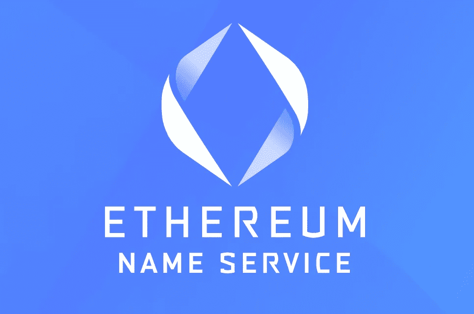

# ENS 注册如何在智能合同层上工作

> 原文：<https://medium.com/coinmonks/how-ens-registration-works-on-the-smart-contract-layer-f391bf672bab?source=collection_archive---------9----------------------->

当从 [ENS 官方 web 应用](https://ens.domains)执行 ENS 注册时，它解析为几个智能合约调用，这些调用实际上在其注册表中注册了名称。

注册服务商使用两个事务(提交和显示)来注册域名，注册一个域名只需不到 5 分钟，包括第一个和第二个事务之间的 1 分钟延迟，以防止抢注。

## **ENS as NFTs**

每个注册的 ENS 也被铸造为 ERC721 令牌。eth 名称可以作为 NFT 在交易所交易。

也可以使用 ENS 应用程序或 NFT 支持的任何工具将它们转移给其他人

## **注册人和控制人**

注册人是拥有的帐户。eth 名称。他们可以将所有权转移到另一个帐户，并且可以替换控制器地址。注册人是代表该名称的 NFT 令牌的所有者。

控制器是控制日常操作的帐户，名称为:创建子域、设置解析器和记录，等等。

## **智能合同执行**

ENS 注册的第一部分是调用 *ETH 注册控制器*契约并执行提交事务。该交易仅支付网络费用并建立注册某一 ENS 的承诺。

完成承诺事务后，应用程序必须手动运行注册事务。

ENS web app 通过从*注册控制器*中调用函数 *Register with Config* 来实现这一点。该*配置*作为*数据*参数与以下字段一起发送:

***名称*** *(字符串):域名不带’。eth'* ***所有者*** *(地址):域名所有者地址* ***持续时间*** *(uint256):域名将注册多久* ***秘密*** *(字节 32):散列秘密* ***解析器*** *(地址)*

当正确接收到这些参数时，合同通过以下步骤执行注册:

1.  注册 ENS 域[名称]。ENS 上的 eth for **x ETH**
2.  使用提供的*持续时间*设置到期日期
3.  将 ENS 作为 ERC721 令牌
4.  将令牌转移给所有者

## 已完成注册:ENS 详细信息

当所有交易确认后，我们可以通过 ENS app 看到 ENS【名称】。eth 已注册并显示以下数据:

**父级:**每个 L1 ENS 都有 **eth** 作为父级。这适用于所有的域名。eth(不适用于子域)。

**注册人:**显示域名注册人和所有者的地址。转让时，该地址会更新为新的所有者。

**控制器:**显示域控制器的地址。*有关更多详情，请参见注册人和控制人。*

**有效期:**从注册域名时的持续时间开始设置。

**解析器:**显示解析名称的*契约*的地址，换句话说，它知道 ENS 指向哪里。

## [计]元数据

每个 ENS 都有存储附加数据的能力。*控制器*地址是唯一被授权更新这些值的地址。

ENS 元数据分为 3 个部分:

**地址:**可以存储不同的钱包地址(针对不同的区块链)。目前，您只能存储一个 ETH、BTC、LTC 和 DOGE 地址。

**内容:**意为一般用途的文本字段存储。

**文字记录:**这一段是最有趣的一段。它允许控制器以键值格式存储不同的文本字段。此时，您可以存储以下字段:

*   阿凡达
*   电子邮件
*   全球资源定位器(Uniform Resource Locator)
*   描述
*   通知；注意
*   关键词
*   com .不和谐
*   com.githug
*   com.reddit
*   com.twitter
*   组织电报
*   以太网代表

> 加入 Coinmonks [电报频道](https://t.me/coincodecap)和 [Youtube 频道](https://www.youtube.com/c/coinmonks/videos)了解加密交易和投资

# 另外，阅读

*   [瓦济里克斯 NFT 评论](https://coincodecap.com/wazirx-nft-review)|[Bitsgap vs Pionex](https://coincodecap.com/bitsgap-vs-pionex)|[坦吉姆评论](https://coincodecap.com/tangem-wallet-review)
*   [如何使用 Solidity 在以太坊上创建 DApp？](https://coincodecap.com/create-a-dapp-on-ethereum-using-solidity)
*   [币安 vs FTX](https://coincodecap.com/binance-vs-ftx) | [最佳(索尔)索拉纳钱包](https://coincodecap.com/solana-wallets)
*   [如何在 Uniswap 上交换加密？](https://coincodecap.com/swap-crypto-on-uniswap) | [A-Ads 评论](https://coincodecap.com/a-ads-review)
*   [加密货币储蓄账户](/coinmonks/cryptocurrency-savings-accounts-be3bc0feffbf) | [YoBit 审核](/coinmonks/yobit-review-175464162c62)
*   [Botsfolio vs nap bots vs Mudrex](/coinmonks/botsfolio-vs-napbots-vs-mudrex-c81344970c02)|[gate . io 交流回顾](/coinmonks/gate-io-exchange-review-61bf87b7078f)