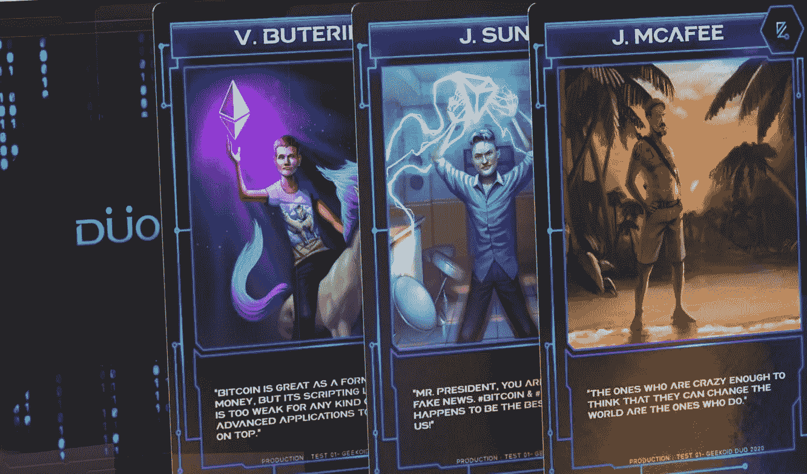
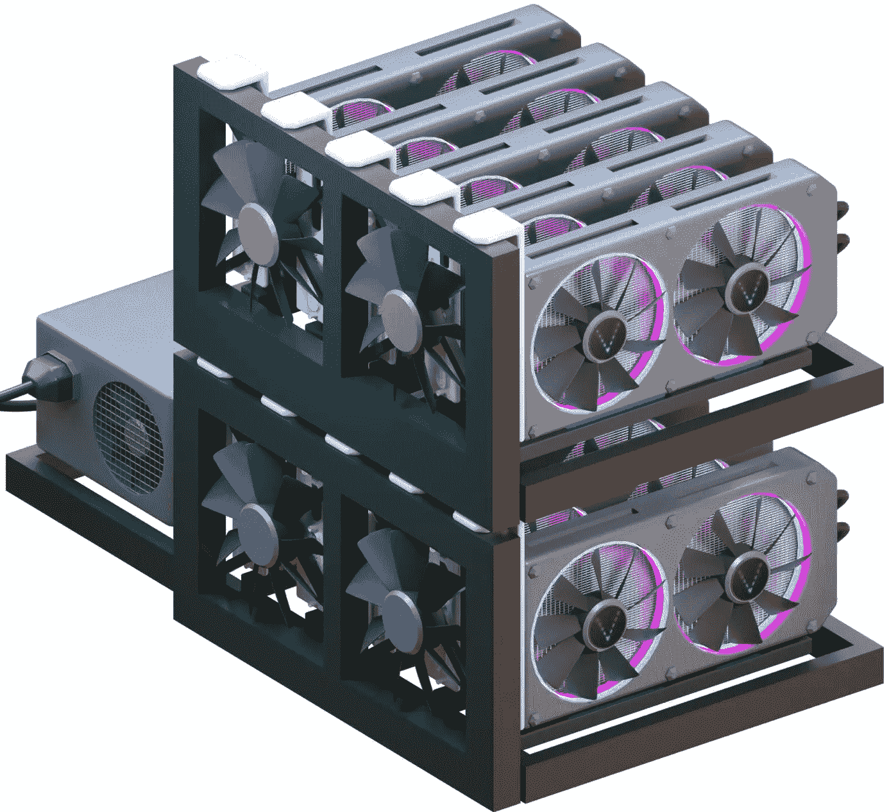

# NFT 矿业有多环保？

> 原文：<https://medium.com/coinmonks/how-environmentally-friendly-is-nft-mining-fa157a717e14?source=collection_archive---------6----------------------->

不可替代令牌(NFT)是存储在区块链(一种数字分类账)中的不可转移数据单位。虽然 NFT 分类账声称提供官方证书或所有权证明，但 NFTs 授予的法律权利可能是模糊的。换句话说，NFT 是一个令牌，可以用来代表一个独特的项目的所有权。艺术品、收藏品，甚至房地产都可以被符号化。但是你一次只能有一个官方所有者，以太坊区块链保护它。您不能更改所有权详细信息或创建新的 NFT。

当[开采 NFTs](https://www.theverge.com/22310188/nft-explainer-what-is-blockchain-crypto-art-faq) 时，你不开采区块；相反，你挖掘交易。最好能在网络中占有一席之地，因为这是一个基于共识的系统。您可以在交易所购买代币或在您的帐户中锁定一些代币。在标记令牌时，无法欺骗系统。您下注的代币数量将决定您将获得的奖励数量。不可替换令牌是以太坊区块链中的一种 ERC721 令牌。该令牌旨在保持区块链数字资产的私有性质。

因此，简而言之，NFT 矿业就是在新区块链上创造一个新的不可替代的标志的过程。这些代币可以用作所有权的证明。

**NFT 矿业和工作证明**

NFT 采矿危害环境，特别是如果你使用的是区块链的工作证明。鉴于 NFT 在大多数情况下都是数字化的，它们怎么会对环境有害呢？简单的答案是，非功能性测试是基于区块链的，它使用大量的能量进行验证。

区块链数据库使用线性块链来存储数据。每个块都有一个加密功能，可以从该块之前的块中检索信息，从而允许您验证事务链。

因此，如果有人投资或购买 NFT，出售给其他人，然后再出售给其他人，区块链可以跟踪所有这些交易。这使得原创艺术作品可以追溯到它的创作者，即使它是数字化的。单说 jpg 和动画 gif，就算别人手机或电脑里有拷贝，也只有一个原件被证明是作者卖的。一切正常，但是区块链消耗了相当多的能量。

**采矿的同时保护环境**

当在工作证明上挖掘时，你已经花了相当多的钱去采购昂贵的设备。由于涉及大量的计算，验证不能用普通的计算机来完成。然而，如果从等式中去掉消耗大量电力的昂贵设备，采矿时可以保护环境。

这方面的一个典型例子是 [DuoVerse](https://www.duoverse.io/faq/) ，一个允许用户玩在线游戏和挖掘 DuoVerse 资产令牌$VANA 的游戏平台。开采钒不需要使用昂贵的设备或技术知识。你可以在任何移动设备上立即开始挖掘$ VANA。注册很容易，而且完全免费。

而 [VMinin](https://www.duoverse.io/vmining/) g 则是一个有趣且互动的采矿模拟。区块链不需要金融投资、物理硬件或加密货币开采。智能手机、个人电脑或其他个人电子设备不用于开采“真实”区块或与区块链互动。

**VMining 与以太坊的对比**

大多数 NFT 使用以太坊区块链来设置和验证 NFT 使用的工作证明。以太坊矿工通过使用计算机解决加密难题来与其他以太坊矿工竞争。结果，他们的电脑生成各种数字，以尽快猜出谜底。

第一个得到正确答案的以太坊矿工获胜，并将方块加入区块链。问题是赢并不容易。竞争非常激烈，一个足以竞争这些区块的计算机系统大约需要 10 万美元。矿工们试图在 2021 年 4 月中旬之前每秒生产超过 170 万亿个新区块。

根据 Blockchain.com 的交易平台，到 2021 年 4 月中旬，矿工们正试图每秒产生超过 170 万亿个新块。对了，1 万亿是[1 后面跟着 18 个 0](https://www.nytimes.com/2021/04/13/climate/nft-climate-change.html)。

保持盈利能力具有挑战性，因为这一过程使用 1 吨电力，矿工支付大量电力。而且有很多竞争的计算机以最快的速度进行计算，消耗大量的电力来解决无意义的密码难题，而那些计算机中只有一台是最多的。你会很快得到正确答案。参与竞赛的这些矿工的其他计算机使用的所有能量都被完全浪费了。

化石燃料(煤、天然气、石油)、核能和可再生能源是用于发电的三种主要能源类型。蒸汽轮机产生的大部分电力来自化石燃料、核能、生物质能、地热和太阳能。

因此，区块链是不环保的，因为它浪费能源。根据《NYT》的同一篇文章，创造一辆典型的 NFT 相当于驾驶一辆普通汽油车行驶 500 英里。根据一些研究，区块链采矿消耗的电力比整个国家还多！这强调了为什么转向对环境友好的区块链很重要。

**总结**

NFT 和它们的加密货币兄弟有一个共同的负面特征:都消耗能源。但在一个大部分能源生产仍来自化石燃料的世界，批评者认为，除非立即采取行动，否则加密货币和 NFT 将继续加剧全球变暖。

> 加入 Coinmonks [电报频道](https://t.me/coincodecap)和 [Youtube 频道](https://www.youtube.com/c/coinmonks/videos)了解加密交易和投资

# 另外，阅读

*   [最好的卡达诺钱包](https://coincodecap.com/best-cardano-wallets) | [Bingbon 副本交易](https://coincodecap.com/bingbon-copy-trading)
*   [印度最佳 P2P 加密交易所](https://coincodecap.com/p2p-crypto-exchanges-in-india) | [柴犬钱包](https://coincodecap.com/baby-shiba-inu-wallets)
*   [8 大加密附属计划](https://coincodecap.com/crypto-affiliate-programs) | [eToro vs 比特币基地](https://coincodecap.com/etoro-vs-coinbase)
*   [最佳以太坊钱包](https://coincodecap.com/best-ethereum-wallets) | [电报上的加密货币机器人](https://coincodecap.com/telegram-crypto-bots)
*   [交易杠杆代币的最佳交易所](https://coincodecap.com/leveraged-token-exchanges) | [购买 Floki](https://coincodecap.com/buy-floki-inu-token)