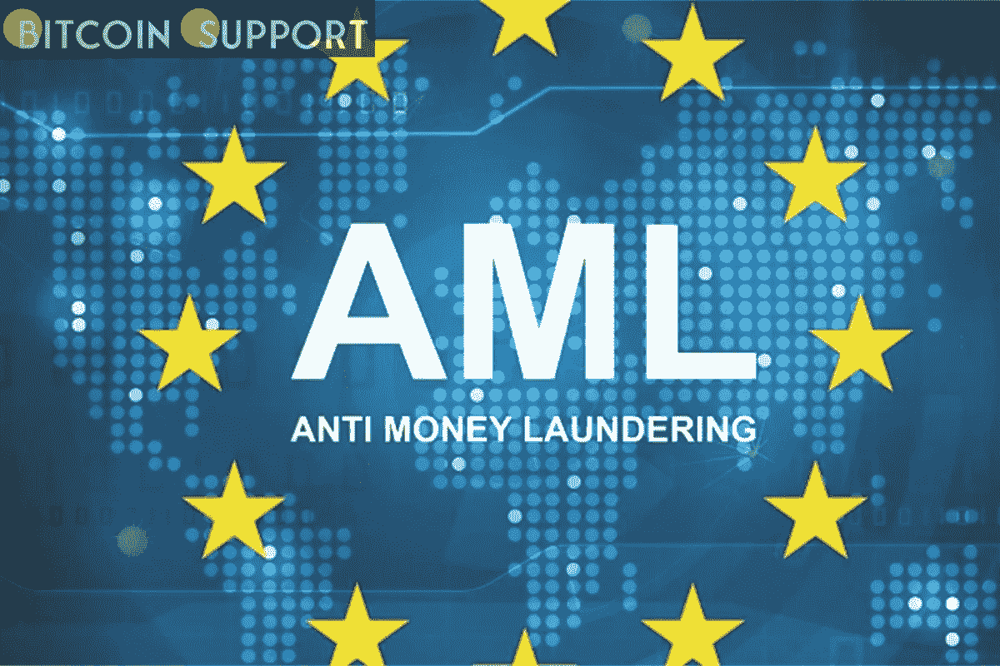

# 欧洲新的反洗钱规则将如何影响加密

> 原文：<https://medium.com/coinmonks/how-europes-new-aml-rules-may-impact-crypto-25985336974d?source=collection_archive---------85----------------------->

**Visit our website:-** [**https://bitcoinsupports.com/**](https://bitcoinsupports.com/)

With the establishment of a new authority, analysts believe the EU could adopt a more hardline stance on digital assets.

According to recent media reports, six European countries, led by Germany, are collaborating to establish an anti-money laundering (AML) organisation that will encompass the cryptocurrency sector. While details about the effort are scant, it is known that it involves Germany, Spain, Austria, Italy, Luxembourg, and the Netherlands. The committee is tasked with developing “the mandate and design” of a new worldwide anti-money laundering body with a special emphasis on crypto, and the European Commission — the EU’s chief executive institution — will serve as the primary forum for discussion. What effect will the move have on the European cryptocurrency market?

**The mandate of the watchdog**

The new task force will focus on “the most risky cross-border entities among banks, financial institutions, and service providers of crypto assets.” Currently, the initiative is awaiting formal discussion. Christian Toms, a partner in the litigation and arbitration practise division at legal firm Brown Rudnick in London, told:

“Negotiations around the agency’s remit are still ongoing, and as part of these discussions — presumably in light of growing awareness of the uses and risks associated with crypto — it is understood that specific discussions are taking place about making the agency’s role in regulating crypto and related institutions a central part of its mandate, possibly even explicitly stating such matters in its founding principles.”

This is not the first time that the media has speculated about the possibility of an EU-wide crypto task force. In July 2021, Reuters reported — citing leaked documents — that the European Commission has suggested establishing a new Anti-Money Laundering Authority that would serve as the “heart” of the European crypto regulatory architecture. Additionally, the proposals indicated above contained additional requirements for virtual asset service providers that adhered to the EU’s stringent data collecting regulations.

**Directives-based**

A frequent criticism levelled towards US crypto regulation is that it is a patchwork of organisations, including the Securities and Exchange Commission, the Commodity Futures Trading Commission, and the Financial Crimes Enforcement Network. Europe, on the other hand, has a centralised authority — instead, it is a patchwork of many state agencies, many of which have competence in digital economy-related concerns. As a result, establishing a centralised watchdog becomes more of a need than an adversarial action.

The current absence of such a body is due to the fact that the EU’s anti-money laundering measures are formed through directives, which are pieces of legislation that are not automatically necessary but must be transcribed into national law by each member state. Thibault Verbiest, head of the law firm Metalaw’s fintech and crypto finance department explained:

“While the 5th Anti-Money Laundering Directive, which took effect on January 10, 2020 and has been fully implemented by almost all member states, includes crypto service providers (notably exchanges and custodian wallet providers) as required entities, the absence of a pan-EU authority forces national regulators to enforce AML rules.”

The current state of European anti-money laundering enforcement came under fire several years ago when separate national-level investigations established that between 2007 and 2015, over 200 billion euros (approximately $227 billion) of non-resident money flowed through the Estonian branch of Denmark’s largest bank.

**Changes in the regulatory environment**

With the new enforcement authority in place, we may see a quick consolidation (and clarity) of the EU’s crypto framework. This could diminish the competitive advantage of certain outwardly friendly countries, as variations in rule translation, interpretation, and enforcement, in Verbiest’s perspective, will be sorted out. It will be increasingly challenging, if not impossible, for an EU member state to take a position distinct from the others:

“Monitoring activities and Anti-Money Laundering/Counter-Terrorist Financing regulations will be standardised and integrated across the EU. With upcoming stricter reporting requirements and increased cooperation between member states on AML/CFT issues, regulators want to establish the best possible mapping of crypto transactions in order to identify transactions associated with illicit activities and limit the erosion of the taxable base.”

The major trend of rapid regulatory consolidation is here to stay, as the issue of money laundering (which is not always related to cryptocurrency) remains extremely relevant. According to Toms, anti-money laundering rules and regulations are already being tightened in general with each new iteration of EU regulations as the war on dirty money intensifies:

“If there is a risk that certain parties will now be even more aggressively pursuing creative ways to avoid AML rules, the ongoing war in Ukraine and the sanctions against Russia may serve as a further stimulus for tighter regulation across the board.” Crypto, which has been on the EU’s radar for some time, may very easily become entangled in the problem.”

**The scenario of a hardline**

Another significant factor is the emergence of central bank and state-issued digital currency projects, which could have a negative impact on the regulatory and supervision environment, which would be unfavourable to the crypto business. If this movement gains traction across Europe, “unregulated” crypto firms and currencies risk being increasingly ostracised and perceived as a fallback option for people who do not wish to use state-authorized CBDCs for whatever reason.

Such a bleak picture is far from certain, however, given the rapid adoption of cryptocurrency at the retail and institutional levels, as well as the expanding involvement of the world’s biggest names in finance.

Finally, Europe, whose executive decision-making is probably less constrained by legislative oversight than in the United States, may adopt a stronger position on crypto. The EU is going to take a more hardline approach to criminal behaviour and consumer protection, and cryptocurrency is still viewed with mistrust.

However, the game is not one-sided: in a decentralised environment, the crypto sector will need to figure out how to manage concerns of transparency and Know Your Customer.

**Visit our website:-** [**https://bitcoinsupports.com/**](https://bitcoinsupports.com/)

**Disclaimer: These are the writer’s opinions and should not be considered investment advice. Readers should do their own research.**