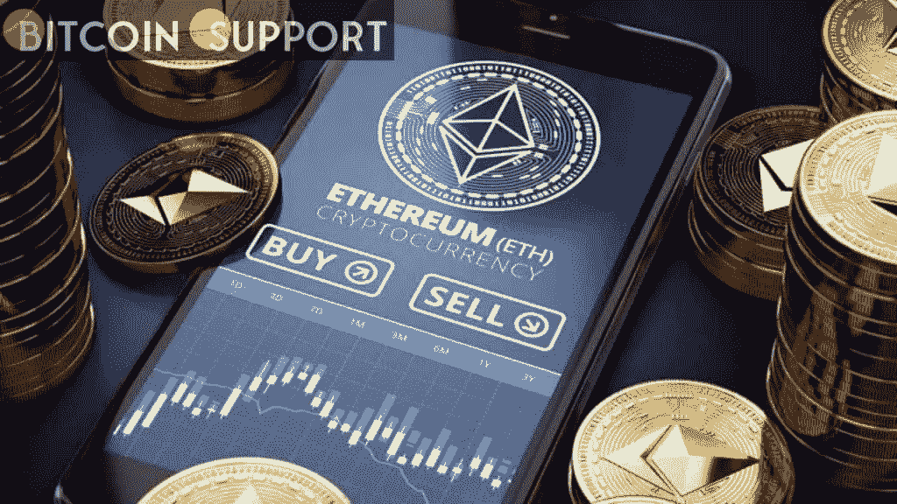
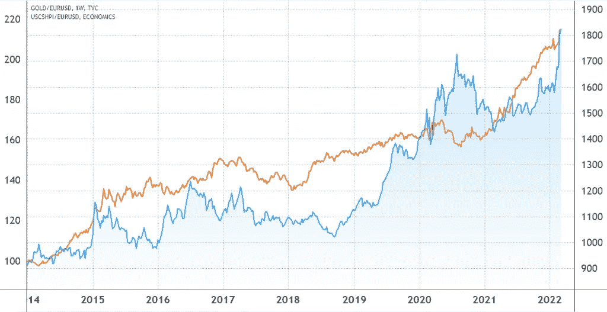
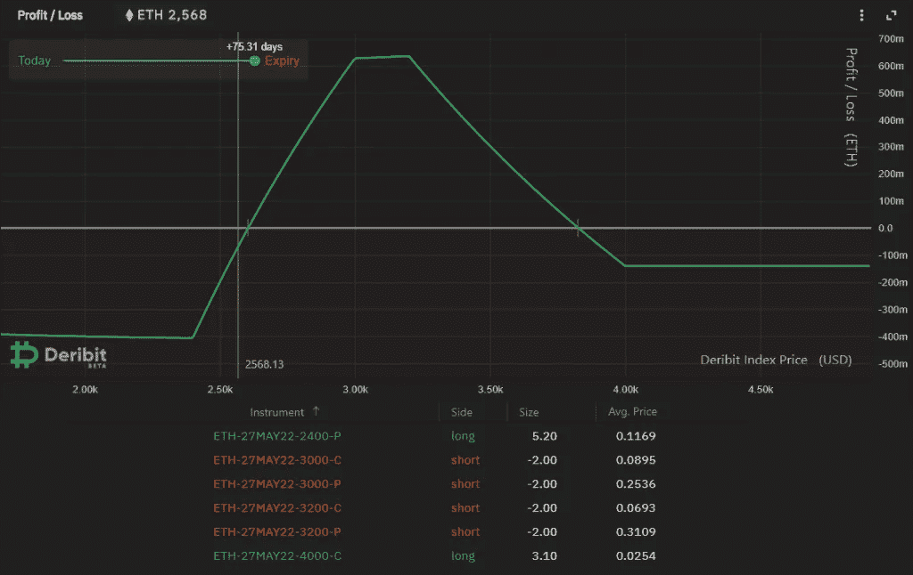

# 如何专家以太坊交易者附近看涨以太网收取赌注，同时限制损失

> 原文：<https://medium.com/coinmonks/how-expert-ethereum-traders-vicinity-bullish-eth-charge-bets-while-limiting-losses-9bf55f980ac8?source=collection_archive---------117----------------------->

**Visit our website:-** [**https://bitcoinsupports.com/**](https://bitcoinsupports.com/)

同意 ETH 的交易者会变得更好，但不太可能在 5 月之前超过 3800 美元，可以从倾斜的铁秃鹰策略中受益。过去 4 个月看涨乙醚(ETH)并未获得回报，其价格从 4600 美元下跌了 44%。推动反弹的分散融资(DeFi)目的增长逐渐消失，部分原因是网络拥堵和 30 美元及以上的普通交易费用。

冷静期还可以归因于过度的预期，因为 2021 年 8 月伦敦困难时期实施了利率燃烧机制。在大幅减少每日净发行量后，买家得出结论，乙醚最终将成为“超声波货币”
[【https://twitter.com/sassal0x/status/1453586166863728641】](https://twitter.com/sassal0x/status/1453586166863728641)

不幸的是，记录表明“硬通货”需要不止一个多年的可靠财政政策。例如，欧元外币曾于 2002 年向公众发行，尽管 2014 年和 2019 年持续发行。然而，中国的购买力未能抵御黄金或房地产等困难资产。

**Visit our website:-** [**https://bitcoinsupports.com/**](https://bitcoinsupports.com/)

在 4 个月的长期表现不佳中，人们应该在 5 月份以 68 美元的价格购买一些低价的超牛市名称(bull)4000 美元的 ETH choices。然而，还有 75 天就到期了，从目前的 2，570 美元反弹 55%的可能性很小。押注于一个巨大的利率变化似乎更为谨慎，但要格外选择你的目标范围。这正是专业交易者使用“铁鹰”替代策略的方式。

**通过限制上升空间减少损失**

总计 1020 万 ETH 已被押入 Eth2(共识层)信用评分合同，买家似乎对股权证明迁移很有把握。此外，减轻以太坊网络的最大障碍，即伸缩性，无疑会导致以太网费用飙升。通过 5 月 27 日的方式找到一个最大化积极方面高达 3600 美元的方法似乎是谨慎的。另一方面，对冲 7%的总体表现也是明智的，因为美国总统乔·拜登(Joe Biden)的加密监管努力存在不确定性。尽管 3 月 9 日签署的政府命令现在没有宣布任何限制性措施，但它无疑为更有针对性的联邦监管奠定了基础。从这个意义上说，扭曲的“铁鹰”选股策略完美地匹配了这样一个勉强乐观的场景。

**Visit our website:-** [**https://bitcoinsupports.com/**](https://bitcoinsupports.com/)

“铁秃鹰”以相同的到期费用和日期出售看涨(牛)和看跌(熊)期权。上述示例已在 Deribit 设置使用 ETH 月 27 日的选项。

**ETH 利润区间在 2600 美元到 3800 美元之间**

交易员应该借助做空(卖出)3000 美元看涨看跌期权的 2 份合约来引发变化。然后，交易者需要对 3200 美元的期权重复这个方法。为了避免剧烈的价格波动，使用了 2400 美元的屏蔽看跌期权。因此，5.20 合约将取决于价格。

最后，万一乙醚价格突破 4000 美元，消费者将需要收集 2.10 看涨期权合约，以限制该策略的可能损失。

上述情况下的各种合约追求的是最大 ETH 0.63 的收益和看似合理的 ETH 0.40 的损失。如果乙醚在 5 月 27 日的交易价格在 2600 美元到 3820 美元之间，这种方法会产生净收益。

利用铁秃鹰的偏态模型，投资者可以利用到期获利，只要以太费膨胀低于 49%。

**访问我们的网站:-**[**https://bitcoinsupports.com/**](https://bitcoinsupports.com/)

**免责声明:这些是作者的观点，不应被视为投资建议。读者应该自己做研究。**

> 加入 Coinmonks [电报频道](https://t.me/coincodecap)和 [Youtube 频道](https://www.youtube.com/c/coinmonks/videos)了解加密交易和投资

# 另外，阅读

*   [Bitsgap 审查](/coinmonks/bitsgap-review-a-crypto-trading-bot-that-makes-easy-money-a5d88a336df2) | [Quadency 审查](/coinmonks/quadency-review-a-crypto-trading-automation-platform-3068eaa374e1) | [Bitbns 审查](/coinmonks/bitbns-review-38256a07e161)
*   [加密复制交易平台](/coinmonks/top-10-crypto-copy-trading-platforms-for-beginners-d0c37c7d698c) | [Coinmama 审核](/coinmonks/coinmama-review-ace5641bde6e)
*   [印度的加密交易所](/coinmonks/bitcoin-exchange-in-india-7f1fe79715c9) | [比特币储蓄账户](/coinmonks/bitcoin-savings-account-e65b13f92451)
*   [OKEx vs KuCoin](https://coincodecap.com/okex-kucoin) | [摄氏替代度](https://coincodecap.com/celsius-alternatives) | [如何购买 VeChain](https://coincodecap.com/buy-vechain)
*   [币安期货交易](https://coincodecap.com/binance-futures-trading)|[3 commas vs Mudrex vs eToro](https://coincodecap.com/mudrex-3commas-etoro)