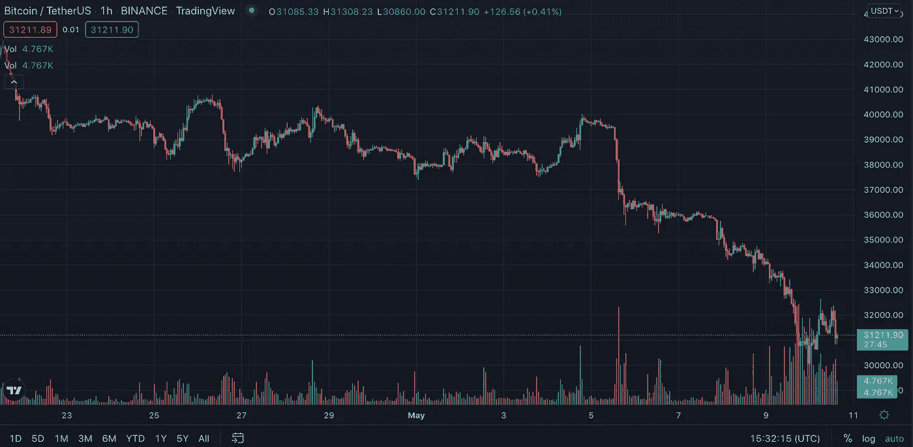
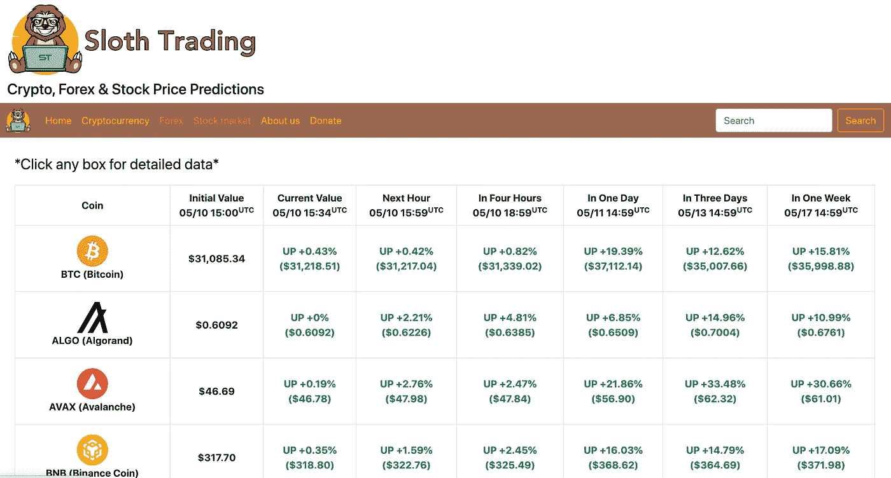

# 极端波动如何影响我的交易算法

> 原文：<https://medium.com/coinmonks/how-extreme-volatility-affects-my-trading-algorithm-835bc4491f60?source=collection_archive---------7----------------------->

自美联储宣布加息以来，已经过去了近一周时间，自那以来，整个市场都在大出血。

我在另一个[故事](/coinmonks/i-developed-a-profitable-trading-algorithm-with-proofs-24d08b1c0298)中解释了我是如何开发了一个交易算法，并在过去几个月中获得了可观的利润。

但是……有一件事对人工智能神经网络影响很坏，那就是极端波动事件。由于神经网络基于模式工作，它不能识别极端和新的事件，因此在市场大幅下跌后，它预测价格上涨。

然而，正如你现在在这张图表上看到的，情况并非如此。

Huge downtrend on BTC/USDT pair

如你所见，在短短 10 天内，比特币的价格从大约 42000 美元跌至 30000 美元以下。

现在我将向你展示我的[算法](https://slothtrading.com)正在预测什么。

正如你所看到的，它预测价格会反弹，但它在过去 3 天一直是这样预测的。

还会涨吗？我们将在一周内发现这一点，但我可以肯定地说，极端的波动性与我的交易算法格格不入。

除此之外，我必须承认这不是第一次，也不会是最后一次比特币价格的大幅下跌，到目前为止，算法已经成功处理了这些情况。

请继续关注 SlothTrading 的最新消息，我很可能会在本周发布外汇和商品价格预测。

记得查看[slot trading](https://slothtrading.com/)的其他价格预测。

在推特上关注我。

考虑给我们一笔[捐款](https://ko-fi.com/slothtrading)来继续这个项目！

> 加入 Coinmonks [电报频道](https://t.me/coincodecap)和 [Youtube 频道](https://www.youtube.com/c/coinmonks/videos)了解加密交易和投资

# 另外，阅读

*   [氹欞侊贸易评论](https://coincodecap.com/anny-trade-review) | [霍比保证金交易](/coinmonks/huobi-margin-trading-b3b06cdc1519)
*   [去中心化交易所](https://coincodecap.com/what-are-decentralized-exchanges) | [比特恩斯 FIP](https://coincodecap.com/bitbns-fip) | [Pionex 评论](https://coincodecap.com/pionex-review-exchange-with-crypto-trading-bot)
*   [用信用卡购买密码的 10 个最佳地点](https://coincodecap.com/buy-crypto-with-credit-card)
*   [最好的卡达诺钱包](https://coincodecap.com/best-cardano-wallets) | [Bingbon 副本交易](https://coincodecap.com/bingbon-copy-trading)
*   [印度最佳 P2P 加密交易所](https://coincodecap.com/p2p-crypto-exchanges-in-india) | [柴犬钱包](https://coincodecap.com/baby-shiba-inu-wallets)
*   [8 大加密附属计划](https://coincodecap.com/crypto-affiliate-programs) | [eToro vs 比特币基地](https://coincodecap.com/etoro-vs-coinbase)