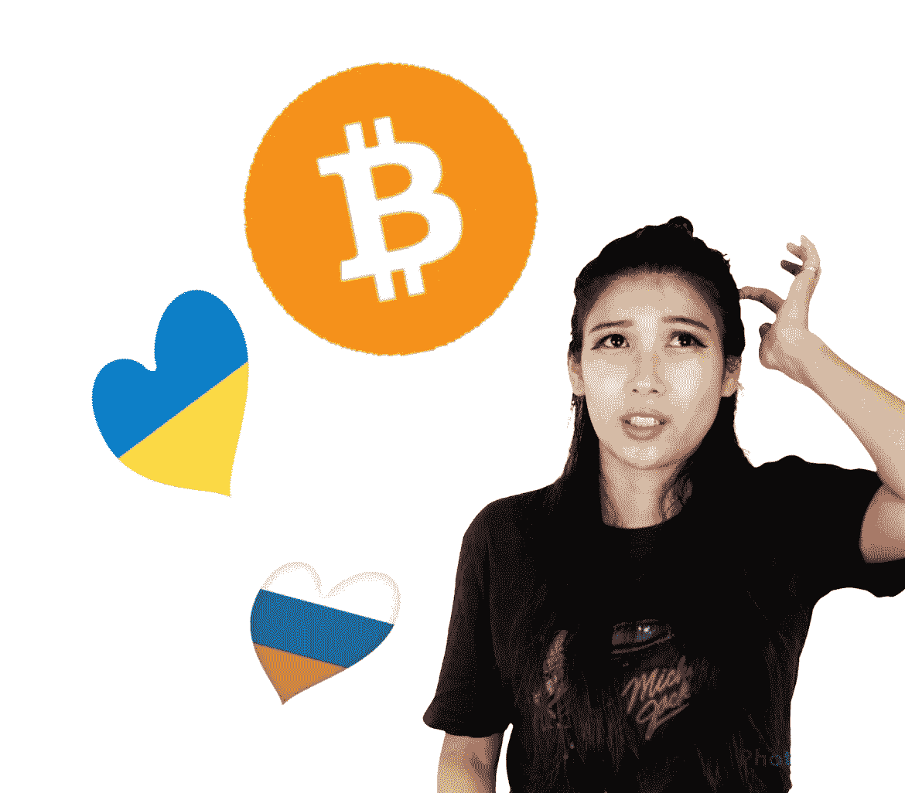

# 地缘政治动荡如何使比特币合法化

> 原文：<https://medium.com/coinmonks/how-geopolitical-turmoil-legitimized-bitcoin-7741448858a?source=collection_archive---------59----------------------->

战争。制裁。斯威夫特。比特币。

我应该就此打住。文章完毕。但那一点也不好玩。

比特币马克思主义者喜欢宣称比特币是“所有资产之母”，并轻而易举地成为过去二十年(如果不是上个世纪的话)表现最好的资产。然而，尽管比特币取得了成功，但它已经并将继续面临怀疑论者和怀疑者的激烈批评。自诞生以来，它一直遵循着繁荣和萧条的模式，在每个高峰期都被贴上了“泡沫”的标签，而在低谷期，它被宣称为“死了，再也不会回来”，结果却一次又一次地奇迹般地复活。

比特币比一只凶残的黑猫有更多的生命，同样险恶。它毁灭的人可能比它致富的人还多。早期卖家每次想到可能发生的事情都会感到恶心。一些不幸的人因为他们的不幸而声名狼藉，要么是丢失了包含数千个比特币的硬盘，要么是为两个披萨支付了 1 万个比特币。

比特币是福也是祸。

损失的故事比那些从未出售的少数幸运儿创造的难以置信的财富更能引起我们的共鸣。在早期，大多数人因为显而易见的原因而卖出，要么有收益，要么有损失。

有些是因为 FUD 才卖掉的。

是的，那时候有 FUD，但它还不叫 FUD。比特币在 FUD 存活了如此之久，以至于“FUD”一词因为比特币而变得流行起来。在比特币出现之前，没人真的会说 FUD。比特币持有者承受了比投资者应该承受的更多的恐惧、不确定性和怀疑。

“FUD”可能只是因为比特币而流行起来，但比特币无疑诞生了其中最受欢迎的加密术语——HODL。

需要一个全新的词汇来强调持有比特币的重要性。HODL。然后“钻石手”出现了，以显示一些人在 FUD 的极端时期足够强大到 HODL，他们“钻石手”他们的比特币。那些未能 HODL 的人被嘲笑为“纸手”

所有比特币投资者肯定都曾经历过怀疑。我们都在想，“也许所有的 FUD 都是真的，而这只是一个庞氏骗局。比特币真的没有任何真正的使用案例。没有人真正使用它。它不是真正的货币。这一切都只是猜测。”好吧，也许在比特币的历史上，这是第一次，所有这些担忧可能真的被埋葬了。

可悲的是，FUD 经历了一场战争才灭亡。

战争给比特币注入了新的生命。功利的生活。一些人现在实际上需要比特币和密码。“谁”也不重要。有人会说，“这是在帮助俄罗斯人颠覆制裁！”然而，我们都知道，这也有助于乌克兰人获得宝贵的援助，并有助于资助他们的国防。

比特币是软件和技术。更换现有系统的时间比预期的要长。银行和传统的电汇服务抵制它的用例，但它一直在那里，只是等待大规模采用。多亏了比特币，地缘政治动荡现在可以在一定程度上得到控制，而且不那么严重。随着战争的激烈程度，比特币继续上涨，这一点每天都在得到证明。

不。比特币的信徒既不高兴也不高兴，因为他们发动了一场战争来让世界相信。我们只是要继续去 HODL。这就是我们的工作。我们知道现在还为时过早。因为如果它现在正在上升，在战争期间，在疫情暴涨，为什么当所有这些真实的 FUD 下沉时，它会突然陨落？也许在所有这些苦难结束后，我们真的会去月球。“我们”是指那些还没有去过那里的人。你。

HODL。

> 加入 Coinmonks [电报频道](https://t.me/coincodecap)和 [Youtube 频道](https://www.youtube.com/c/coinmonks/videos)了解加密交易和投资

# 另外，阅读

*   [用信用卡购买密码的 10 个最佳地点](https://coincodecap.com/buy-crypto-with-credit-card)
*   [最好的卡达诺钱包](https://coincodecap.com/best-cardano-wallets) | [Bingbon 副本交易](https://coincodecap.com/bingbon-copy-trading)
*   [印度最佳 P2P 加密交易所](https://coincodecap.com/p2p-crypto-exchanges-in-india) | [柴犬钱包](https://coincodecap.com/baby-shiba-inu-wallets)
*   [8 大加密附属计划](https://coincodecap.com/crypto-affiliate-programs) | [eToro vs 比特币基地](https://coincodecap.com/etoro-vs-coinbase)
*   [最佳以太坊钱包](https://coincodecap.com/best-ethereum-wallets) | [电报上的加密货币机器人](https://coincodecap.com/telegram-crypto-bots)
*   [交易杠杆代币的最佳交易所](https://coincodecap.com/leveraged-token-exchanges) | [购买 Floki](https://coincodecap.com/buy-floki-inu-token)
*   [3Commas 对 Pionex 对 Cryptohopper](https://coincodecap.com/3commas-vs-pionex-vs-cryptohopper)|[Bingbon Review](https://coincodecap.com/bingbon-review)
*   [加密复制交易平台](/coinmonks/top-10-crypto-copy-trading-platforms-for-beginners-d0c37c7d698c) | [如何在 WazirX 上购买比特币](/coinmonks/buy-bitcoin-on-wazirx-2d12b7989af1)
*   [CoinLoan 评论](https://coincodecap.com/coinloan-review)|[Crypto.com 评论](/coinmonks/crypto-com-review-f143dca1f74c)