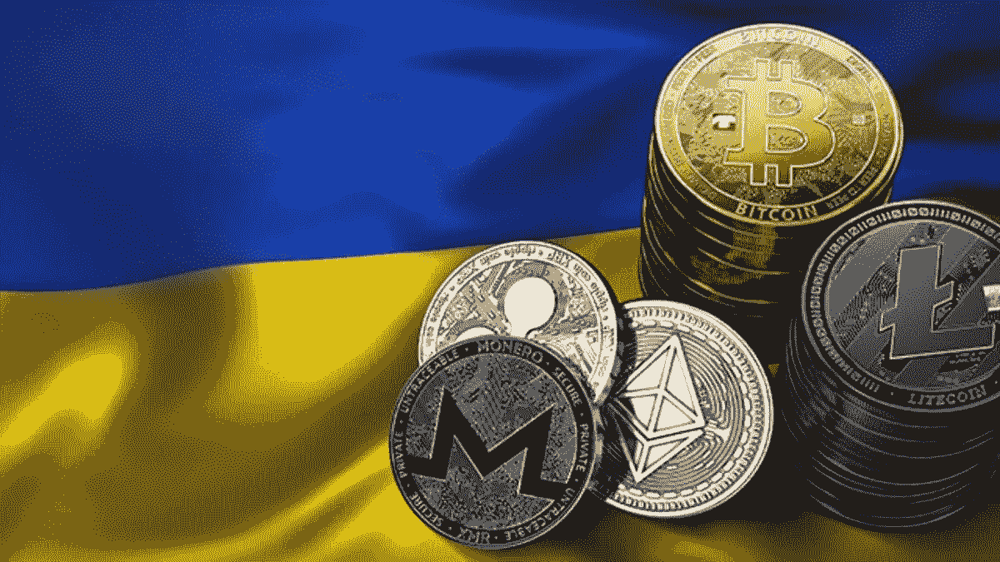

# 加密产业是如何支撑乌克兰的？

> 原文：<https://medium.com/coinmonks/how-has-the-crypto-industry-been-supporting-ukraine-bed95084bb2b?source=collection_archive---------79----------------------->

Photo from: Coingape

我们已经看到从加密领域捐赠的价值超过 1 亿美元的#cryptoassets。因此，我对向乌克兰提供支持的加密项目/公司进行了一些整合。

如果我错过了什么，请在下面评论！

1.  [FTX($ FTT)——2022 年 2 月 25 日的秘密捐赠](https://twitter.com/SBF_FTX/status/1496980981617946624?ref_src=twsrc%5Etfw%7Ctwcamp%5Etweetembed%7Ctwterm%5E1496980981617946624%7Ctwgr%5E%7Ctwcon%5Es1_&ref_url=https%3A%2F%2Fcointelegraph.com%2Fnews%2Fcrypto-community-reacts-to-russia-s-war-in-ukraine)

*   每个 FTX 的乌克兰账户持有人都有资格获得 25 美元的免费资金

[2。币安($ BNB)——2022 年 2 月 28 日加密捐赠](https://www.coindesk.com/business/2022/02/28/binance-to-donate-10m-to-ukraine-refugees-opens-crowdfunding-project/)

*   币安将向乌克兰难民和儿童捐赠 1000 万美元。该基金将通过联合国儿童基金会、联合国难民署和 iSANS 捐赠

[3。UNI WAP($ UNI)—加密捐赠渠道 1 2022 年 3 月](https://twitter.com/Uniswap/status/1498632368298541059?ref_src=twsrc%5Etfw%7Ctwcamp%5Etweetembed%7Ctwterm%5E1498632369644912643%7Ctwgr%5E%7Ctwcon%5Es2_&ref_url=https%3A%2F%2Fcointelegraph.com%2Fnews%2Funiswap-builds-interface-to-swap-altcoins-into-eth-donations-for-the-ukrainian-people)

*   创建了一个新的界面:[https://donate.uniswap.org/#/swap](https://donate.uniswap.org/#/swap)这样用户可以直接捐赠 ERC-20 代币给乌克兰政府

[4。波尔卡多特($ DOT)——加密捐赠 2022 年 3 月 1 日](https://twitter.com/Ukraine/status/1498547710697345027?ref_src=twsrc%5Etfw%7Ctwcamp%5Etweetembed%7Ctwterm%5E1498662367600779271%7Ctwgr%5E%7Ctwcon%5Es2_&ref_url=https%3A%2F%2Fcointelegraph.com%2Fnews%2Fukraine-accepts-dot-founder-gavin-wood-donates-5-8-million)

*   Polkadot 的创始人加文·伍德捐赠了大约 298367 点，约合 570 万美元

[5。乌克兰岛—2022 年 3 月 3 日加密捐赠](https://cointelegraph.com/news/ukraine-dao-raises-over-6m-via-nft-sale-to-aid-ukrainian-citizens)

*   乌克兰岛众筹了 2,188 ETH，约合 610 万美元，买了一面 1/1 的乌克兰国旗 NFT。这笔资金将分配给乌克兰的非政府组织，以帮助受战争影响的人们

[6。比特币基地——2022 年 3 月 7 日制裁](http://Coinbase blocks over 25,000 addresses related to Russian individuals or entities we believe to be engaging in illicit activity)

*   比特币基地封锁了 25，000 多个与我们认为参与非法活动的俄罗斯个人或实体有关的地址

[7。无聊猿游艇俱乐部($ Ape)——加密捐赠 2022 年 3 月 9 日](https://twitter.com/BoredApeYC/status/1501333629804244993?ref_src=twsrc%5Etfw%7Ctwcamp%5Etweetembed%7Ctwterm%5E1501333629804244993%7Ctwgr%5E%7Ctwcon%5Es1_&ref_url=https%3A%2F%2Fcointelegraph.com%2Fnews%2Ftracked-crypto-donations-to-ukraine-surge-to-108m-as-kraken-bored-ape-joins-in)

*   Bored Ape 游艇俱乐部团队捐赠 100 万美元

[8。北海巨妖——2022 年 3 月 9 日](https://twitter.com/krakenfx/status/1501506219768369155?ref_src=twsrc%5Etfw%7Ctwcamp%5Etweetembed%7Ctwterm%5E1501506219768369155%7Ctwgr%5E%7Ctwcon%5Es1_&ref_url=https%3A%2F%2Fcointelegraph.com%2Fnews%2Ftracked-crypto-donations-to-ukraine-surge-to-108m-as-kraken-bored-ape-joins-in)

*   为乌克兰的所有客户提供 1000 万美元的资金，来自基于俄罗斯的交易产生的收入。在 BTC，一个客户大概能得到 1000 美元

[9。2022 年 3 月 11 日](https://blog.chainalysis.com/reports/sanctions-screening-tools/)

*   Chainalysis 通过链上 oracles 和 API 为密码行业提供免费的筛选工具

10。FTX、库纳和 ever stake——加密捐赠频道 2022 年 3 月 15 日

*   与乌克兰政府合作推出了一个捐赠网站:donate.thedigital.gov.ua
    通过该网站，世界各地的人们可以直接向乌克兰国家银行发送密码，以帮助国家和人民

[11。互联网计算机($ term)——俄罗斯的宣传 2022 年 3 月 18 日](https://dominic-w.medium.com/proposal-to-hasten-the-end-of-attacks-on-ukraine-using-smart-contracts-and-250m-in-bitcoin-and-36f9a20b46ce)

*   一笔 2.5 亿美元的基金(以比特币和以太币形式)被分配用于激励俄罗斯民众观看有关乌克兰战争真相的“信息媒体”。互联网计算机公司的创始人建议，如果每个参与者完成视频，他们将获得 50 美元的奖励

另外，向捐赠 53，000 美元的 [Doge 社区以及捐赠价值 233，000 美元的](https://cointelegraph.com/news/dogecoin-community-donates-53k-to-ukraine-as-country-hints-at-upcoming-airdrop) [CryptoPunk #5364](https://www.coindesk.com/policy/2022/03/02/cryptopunk-nft-is-latest-donation-to-ukraines-33m-campaign/) 的匿名捐赠者大声疾呼。

让我们为乌克兰人民祈祷，希望战争尽快停止。人民在受苦，甚至是俄国人。

> 加入 Coinmonks [电报频道](https://t.me/coincodecap)和 [Youtube 频道](https://www.youtube.com/c/coinmonks/videos)了解加密交易和投资

# 另外，阅读

*   [如何在 FTX 交易所交易期货](https://coincodecap.com/ftx-futures-trading) | [OKEx vs 币安](https://coincodecap.com/okex-vs-binance)
*   [CoinLoan 评论](https://coincodecap.com/coinloan-review) | [YouHodler 评论](/coinmonks/youhodler-4-easy-ways-to-make-money-98969b9689f2) | [BlockFi 评论](https://coincodecap.com/blockfi-review)
*   [XT.COM 评论](https://coincodecap.com/profittradingapp-for-binance)币安评论 |
*   [SmithBot 评论](https://coincodecap.com/smithbot-review) | [4 款最佳免费开源交易机器人](https://coincodecap.com/free-open-source-trading-bots)
*   [比特币基地僵尸程序](/coinmonks/coinbase-bots-ac6359e897f3) | [AscendEX 审查](/coinmonks/ascendex-review-53e829cf75fa) | [OKEx 交易僵尸程序](/coinmonks/okex-trading-bots-234920f61e60)