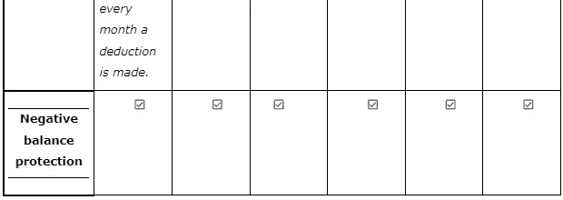

# 俄乌战争对外汇市场有何影响

> 原文：<https://medium.com/coinmonks/how-has-the-russia-ukraine-war-affected-the-forex-market-5972419982af?source=collection_archive---------22----------------------->

世界金融市场的形势仍然极不稳定。其原因是人们对无法迅速解决欧洲冲突的期望越来越高。因此，它对商品、货币和股票市场具有多向影响。

虽然战争对人们来说是出乎意料的，但外汇市场在某种程度上是有准备的，但世界市场仍然继续受到俄罗斯与乌克兰战争的影响，这场战争给它带来了破坏。

对国际资产的制裁剥夺了俄罗斯联邦中央银行进行传统外汇干预以减少卢布波动的机会。

随着西方国家因俄罗斯与乌克兰之间的持续战争而对俄罗斯实施越来越多的制裁，人们越来越担心，这可能会中断原油、天然气、钯、铂、镍、铝和小麦的出口流，而目前这些市场中的许多市场已经供应紧张，交易价格接近多年高点。

鉴于形势如何发展仍存在许多不确定性，我们预计市场将继续以相当高的风险溢价进行定价，特别是鉴于许多市场目前的紧张局势使它们更容易受到供应冲击的影响。

在德国决定暂停北溪 2 号天然气管道的审批程序后，欧洲天然气市场的走势明显增强。管道没有运行，因此不会对流量产生直接影响。然而，市场预计，一旦管道建成运行，俄罗斯将再次增加流量，并有助于缓解欧洲市场的紧张局势。相反，市场可能会进一步收紧，使欧洲容易受到另一个供暖季节的影响。对天然气市场持续吃紧的担忧反映在 TTF 远期曲线中，该曲线在 2023 年 2 月前的交易价格高于 80 欧元/兆瓦时。

# 对俄罗斯的制裁如何影响俄罗斯的经纪业务

投资组合中持有 ETF(外国证券)的投资者，交易功能可能会暂时受到限制。就目前而言，明智的做法是不要轻率出售。更合理的做法是给银行时间来规范流程。如果有必要，交易者可以使用将资产从一个经纪人转移到另一个经纪人的服务。

由于欧盟、美国、英国、日本、韩国对俄罗斯实施的所有制裁，俄罗斯经纪公司面临很大压力，而且制裁名单还在不断扩大。与俄罗斯入侵乌克兰有关的上述国家以及许多其他国家正在对该国的银行系统以及 SWIFT 系统的访问实施制裁。到目前为止，俄罗斯经纪公司没有受到牵连，但交易员应该保持警惕。因为在外国市场上不可能买卖外国证券已经存在一些困难。此外，在证券交易所也不能购买这种证券；圣彼得堡和莫斯科。没有机会在国外站点结清保证金头寸，并且向账户提款可能会伴随着严重的延迟。

几乎所有来自西方国家的限制都会影响俄罗斯经济，这也会影响国内股市。对市场参与者来说，最敏感的制裁是针对俄罗斯银行的制裁。它们也影响到它们的子公司，包括交易所交易的操作者。其中一些公司的投资者已经感受到了与证券打交道的局限性。

部门限制也同样严重，事实上，这将切断金融机构与外资流入的联系。对俄罗斯天然气工业银行、RSHB、阿尔法银行和莫斯科信贷银行实施了禁止在国外市场工作的制裁。它们将无法从外国投资者那里获得到期日超过 14 天的新债务融资，也无法配售新股。这可能会影响它们对国内投资者的吸引力。综合考虑，我们认为谨慎的做法是暂时远离俄罗斯外汇经纪商，或者换一家更可靠的经纪商，至少在对俄罗斯的制裁解除之前。

*以下是按国家和目标(公司)划分的制裁列表:*

***** [来源](https://graphics.reuters.com/UKRAINE-CRISIS/SANCTIONS/byvrjenzmve/)

**这里有几个你应该看看的外汇经纪人**

在决定与哪家经纪商合作时，有太多重要参数需要注意，尤其是在俄乌战争期间，因此很容易在所有这些数据和外汇市场快速变化的形势中混淆不清。这里的表格可以帮助你在混乱的水域中航行，在那里你可以看到所有重要的数据，并做出你自己的最终评估。

**结论**

入侵后，西方国家实施了一系列经济制裁，希望限制克里姆林宫为战争提供资金的能力，但事实证明，这并没有奏效。美国财政部冻结了俄罗斯央行在美国的资产，并制裁了大型主权财富基金俄罗斯直接投资基金(Russian Direct Investment Fund)，以及对俄罗斯银行系统和 SWIFT 系统准入的制裁。

尽管局势如何发展存在诸多不确定性，但有一点是肯定的，西方国家实施的制裁将对俄罗斯的金融体系产生长期的破坏性影响。

> *加入 Coinmonks* [*电报频道*](https://t.me/coincodecap) *和* [*Youtube 频道*](https://www.youtube.com/c/coinmonks/videos) *了解加密交易和投资*

# 另外，阅读

*   [Bookmap 评论](https://coincodecap.com/bookmap-review-2021-best-trading-software) | [美国 5 大最佳加密交易所](https://coincodecap.com/crypto-exchange-usa)
*   最佳加密[硬件钱包](/coinmonks/hardware-wallets-dfa1211730c6) | [Bitbns 评论](/coinmonks/bitbns-review-38256a07e161)
*   [新加坡十大最佳加密交易所](https://coincodecap.com/crypto-exchange-in-singapore) | [购买 AXS](https://coincodecap.com/buy-axs-token)
*   [红狗赌场评论](https://coincodecap.com/red-dog-casino-review) | [Swyftx 评论](https://coincodecap.com/swyftx-review) | [CoinGate 评论](https://coincodecap.com/coingate-review)
*   [投资印度的最佳密码](https://coincodecap.com/best-crypto-to-invest-in-india-in-2021)|[WazirX P2P](https://coincodecap.com/wazirx-p2p)|[Hi Dollar Review](https://coincodecap.com/hi-dollar-review)