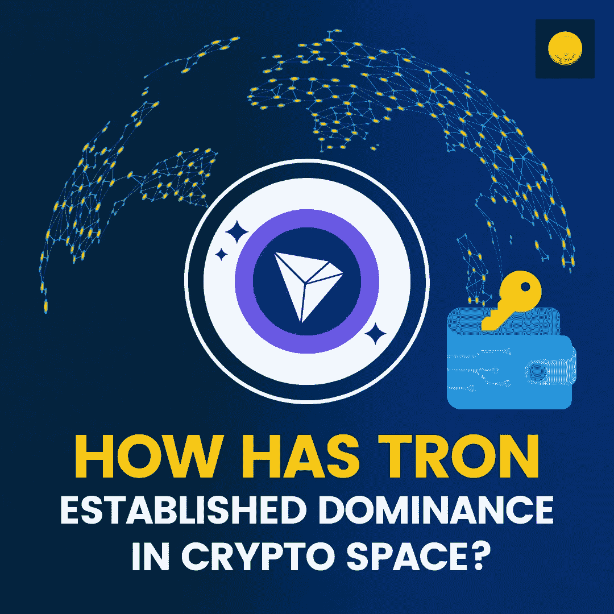

# 创是如何在密码领域占据主导地位的？

> 原文：<https://medium.com/coinmonks/how-has-tron-established-dominance-in-crypto-space-b84c43c51a18?source=collection_archive---------56----------------------->

区块链的战争已经被摧毁，生态系统正流出投资的鲜血，以在竞争中占得先机。一些生态系统承诺非常高的安全性；然而，其他公司已经承诺了较高的每秒事务量和吞吐量。也就是说，哪个区块链最适合投资加密？也许，当你需要可伸缩性、吞吐量、安全性和去中心化时，Tron 确实对用户更有意义。在这篇文章中，我们将深入了解创是什么，以及为什么它是目前加密诗中最好的区块链。

# 创是什么？

Tron 作为一个去中心化的生态系统，主要专注于以真正民主化的方式分享内容。为了实现这一目标，创区块链提供了合适的生态系统，开发者可以在其中开发 Dapps 来帮助实现这一目标。Tron 的目的是奖励内容创作者，他们迄今为止一直依赖中介来获得满足。然而，在 Tron 的出现之后，应该集中在少数人手里的媒体和娱乐的唯一议程已经被稀释，内容创作者可以通过 Tron 区块链迎来 web 3.0 时代。

# 为什么 Tron 是最好的区块链？

**强队撑腰**

目前，[区块链](https://blog.coindhan.com/2022/05/03/7-advantages-of-crypto-investing-a-beginners-guide/)空间一直在争夺最好的开发商来标记项目。在这方面，Tron 在加密领域最优秀人才的支持下已经超越了它的竞争对手。Tron 利用其开发人员的专业知识和熟练程度，成功地将生态系统与 Bittorrent 集成在一起，因此，Tron 的用例得到了突飞猛进的扩展。从而为光明的未来铺平道路！

**分散的内容分发**

Tron 设想了一种新的内容创作和传播模式。使用创区块链，内容创作者可以与消费者进行端到端的交易，并在创中获得报酬。最重要的是，Tron 与 Bittorrent 的合作是一个巨大的红利，Tron 生态系统有机会接触更广泛的受众，并推介改变分散化空间采用水平的用例。

**交易成本低**

在“区块链三难困境”的挑战下，分散的空间已经被粉碎，你可以选择两者之一，然后在下一个上妥协。换个角度来看，你要么拥有分散化和安全性，要么拥有高吞吐量。如果您需要高吞吐量，您必须满足于一般的安全性。但 Tron 通过引入分散化、吞吐量、安全性和低燃气成本的完美组合，彻底改变了游戏规则。通过这种方式，它将成为下一个用例和 Dapps 可以繁荣的最佳生态系统。

**独立区块链**

与其他由以太坊生态系统驱动的区块链不同，Tron 拥有自己的生态系统来支持其基础设施。也就是说，Dapps 和协议可以在 Tron 区块链上顺利运行，而不会受到以太坊堵塞、停机或任何其他问题的影响。目前，大多数项目都在寻找这样的解决方案，Tron 已经按时交付了。

[**经过战斗考验的用例**](https://blog.coindhan.com/2022/05/31/how-has-tron-established-dominance-in-crypto-space/)

由于娱乐、支付和内容分发行业的创新时机已经成熟，Tron 已经在经过战斗考验的用例上取得了如此大的进步。Tron 已经提前提供了它们，因此这很可能意味着 Tron 生态系统的可持续性将比预期的更深入。

因此，如果你正在寻找最好的加密货币进行投资，Tron 是一个明智的选择。但不是财务建议，因为在你涉足加密领域之前，向专家寻求咨询总是明智的。

