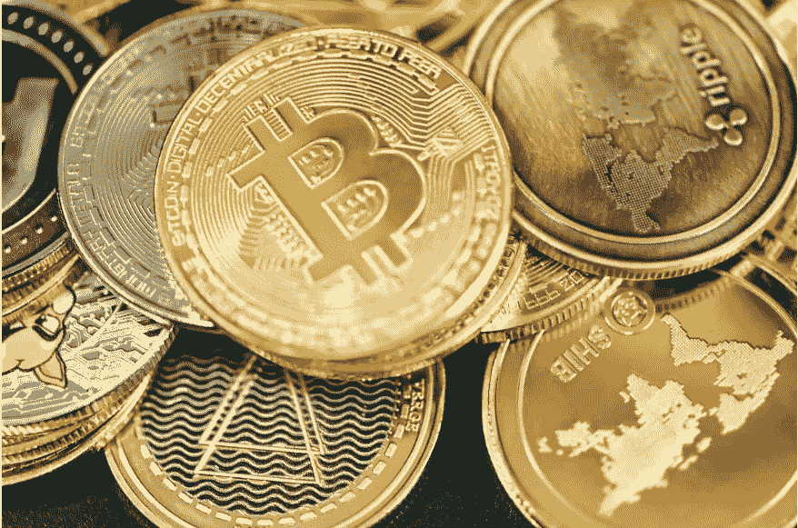

# 2022 年到目前为止，顶级 Cryptos 表现如何？

> 原文：<https://medium.com/coinmonks/how-have-the-top-cryptos-performed-so-far-in-2022-8d8b1d460b78?source=collection_archive---------7----------------------->

Image via [Unsplash.com- Quantitatives](https://images.unsplash.com/photo-1640574232355-08659783b9fb?ixlib=rb-1.2.1&ixid=MnwxMjA3fDB8MHxwaG90by1wYWdlfHx8fGVufDB8fHx8&auto=format&fit=crop&w=1172&q=80)

## 到目前为止，对于加密货币来说，这是艰难的一年，但一些最大的加密货币是如何相互竞争的呢？

从许多方面来看，2022 年已经是艰难的一年，尤其是对那些有投资的人来说。尤其是加密货币，已经容易出现规律性波动…