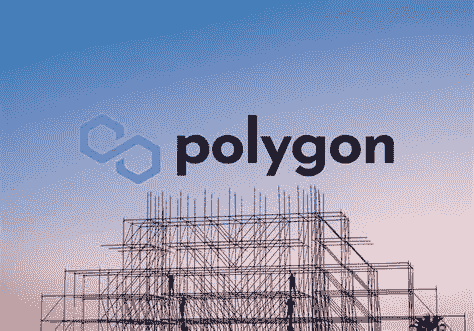

# 2022 年 Polygon 的价格可能会走多高？仅售 5 美元的 MATIC？… 10?

> 原文：<https://medium.com/coinmonks/how-high-may-the-price-of-polygon-go-in-2022-matic-for-just-5-10-6edb5ae6cc0f?source=collection_archive---------28----------------------->

Source photo [polygon matic — Bing images](https://www.bing.com/images/search?view=detailV2&ccid=ykywYifk&id=57038B7A7B0AA059F0712ED99C302082B76924C3&thid=OIP.ykywYifkV1Z7O4DP20h6VQHaFL&mediaurl=https%3a%2f%2fmorningtick.com%2fwp-content%2fuploads%2f2021%2f04%2fPolygon-Matic-price-analysis.jpg&cdnurl=https%3a%2f%2fth.bing.com%2fth%2fid%2fR.ca4cb06227e457567b3b80cfdb487a55%3frik%3dwyRpt4IgMJzZLg%26pid%3dImgRaw%26r%3d0&exph=1050&expw=1500&q=polygon+matic&simid=608014202271326268&FORM=IRPRST&ck=249BA9E0D4A5F362F2F3DDEE48074096&selectedIndex=14&ajaxhist=0&ajaxserp=0)

Polygon 作为以太坊互操作性基金会，对投资者来说是一个非常有趣的网络。随着加密货币市场的调整，Polygon 的 MATIC token 的价格在过去三个月中大幅下降。因此，MATIC 现在的价格是合理的。Polygon 的定价在 2022 年可能会继续增长。未来几年价格会达到 10 美元吗？