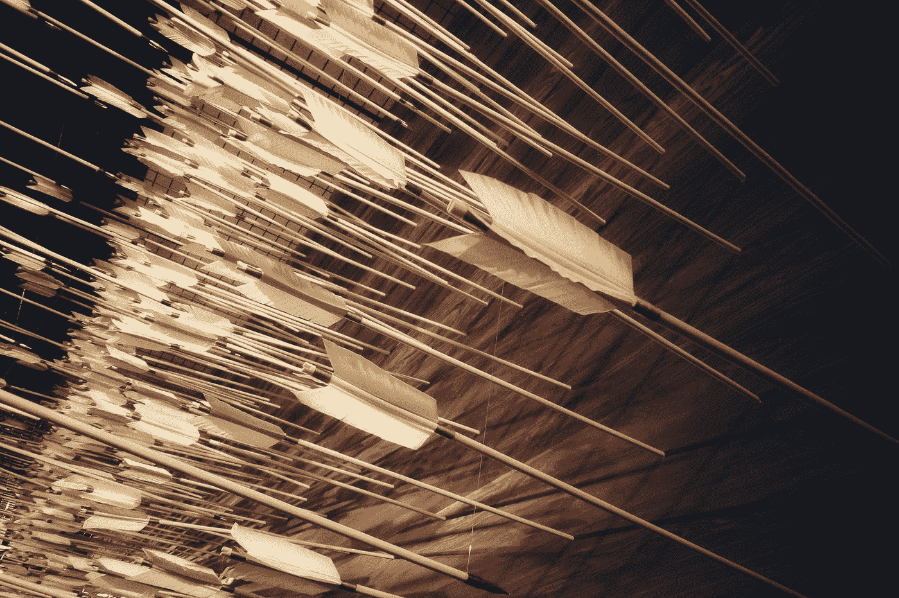

# 人类如何利用石器时代的技术超越自然

> 原文：<https://medium.com/coinmonks/how-humans-used-stone-age-technology-to-rise-above-nature-e81b8d77cb16?source=collection_archive---------26----------------------->

## 火、导弹和水力对人类进化是多么重要。

Photo by [NASA](https://unsplash.com/@nasa?utm_source=medium&utm_medium=referral) on [Unsplash](https://unsplash.com?utm_source=medium&utm_medium=referral)

通过一系列文章，我将解释我们如何实现今天的数字化转型，以及为什么这是比特币在现代世界取得成功的关键。

# **2020 年——金钱的转型之年**

我想引用苏联时代(1922-1991)的两句话来开始这篇文章:

> **莱昂托洛茨基:**你可能对战争不感兴趣，但战争对你有兴趣。
> 
> **列宁:**有几十年什么都没发生，也有几周几十年发生。

2020 年是根本性的数字转型之年，它改变了人们对货币的概念。那是两场战争的起点——Covid 和 money。

为了理解这种极端变化背后的原因，我们必须从第一原理的角度来看是什么让我们进入了数字时代。我们从人类如何成为自然界的顶级掠食者开始，然后转向石器时代的技术。

# **第一原则关注推动我们进入数字时代的历史事件。**

## 人类是自然界的顶级掠食者。

人类已经进化成为自然界的顶级掠食者，因为我们与自然抗争。大自然自有它平衡自身的方法。

Photo by [Samuel Scrimshaw](https://unsplash.com/@samscrim?utm_source=medium&utm_medium=referral) on [Unsplash](https://unsplash.com?utm_source=medium&utm_medium=referral)

我记得看见老鹰在打猎。老鹰瞄准一只小山羊，从后面抓住它，抓住它的脚，把它扔下悬崖。小山羊在下山的路上撞到了每一块石头，摔死了。这一点也不公平。

然后我看到了狮子是如何狩猎的——在一个群体中，不是一只狮子，而是八只狮子追逐 67 只瞪羚，一只瞪羚被迫离开去走另一条路。无缘无故就死了。这一点也不公平。

单独一个个体在自然界几乎没有机会。如果你是一个人，你就死定了。

**在敌对环境中生存的要求是什么**

当你想到 300 万年前——我们是如何进化成为这个星球上的顶级生物的？

我们使用了技术。我们处于现代是因为创新。

Photo by [NeONBRAND](https://unsplash.com/@neonbrand?utm_source=medium&utm_medium=referral) on [Unsplash](https://unsplash.com?utm_source=medium&utm_medium=referral)

石器时代的人明白使用大脑和思考的重要性。我们必须弄清楚如何变得更智能、更复杂、更快、更健壮。我们总是利用技术为自己服务。

## **我们利用石器时代的技术超越了自然界的动物**

对于技术，我们指的是超越人类的创新。这将我们带到人类和主导的石器时代技术的开端:

*   火
*   导弹
*   水力学

# **火:人类的主要能源网络**

我们从火开始。

在希腊神话中，普罗米修斯因藐视众神而闻名，他从众神那里窃取火种，并以技术、知识和更普遍的文明的形式给予人类。他被认为是火神。我们可以把普罗米修斯比作 Satoshi，他给了网络空间的现代火种——比特币。

Photo by [Wil Stewart](https://unsplash.com/@wilstewart3?utm_source=medium&utm_medium=referral) on [Unsplash](https://unsplash.com?utm_source=medium&utm_medium=referral)

现在让我们回到石器时代的人。火是一种能量来源，你可以用特定的方式传递它。火是我们将能量转化为物质的连锁反应。

## 你想要超越丛林。你会怎么做？

你放了一把火。它能让你不被冻死。有了火，你可以吓唬动物，用烟驱散昆虫，获得能见度，用火做饭。

Photo by [Louis Hansel](https://unsplash.com/@louishansel?utm_source=medium&utm_medium=referral) on [Unsplash](https://unsplash.com?utm_source=medium&utm_medium=referral)

人体解剖学随着火而改变。熟食会被简化，可以增加你食用食物的范围。你将食物转化为卡路里的效率提高了 10/1 或 20/1 倍。通过更有效地代谢，你的消化陷阱缩短了，当你消化食物时，你身体消耗的能量可以被重新导向大脑。

有了火，你可以看到——照亮洞穴。用火来交流。古代世界曾经有了望塔。在罗马，你有一个带火的信号系统。和在中国长城一样。信号系统被用来发送军事通信:夜间的信标(火或灯)或白天的烟雾信号

**人类是唯一能玩火的动物**

> 如果你玩火，你会被烧伤

自从玩火以来，我们进化了。遗传的，智力的，社会学的进化。

“火焰守护者”这个概念是有意义的。这是一千年前的老观点了。如果你有一个文明，你不想让火熄灭。它依赖于生命和死亡。十万年后，如果你冷了，火灭了，你会死于高热或肺癌。如果你能驾驭火，你就能开发你的大脑并长寿。

简而言之，这就是有火的人类的进化。除了火力技术，我们还有导弹技术。

# **导弹、箭和弓的意义**

人类找到了更聪明的捕猎方式。我们理解用导弹击中动物的概念。我们用甩石或箭射赢了丛林。

Photo by [Possessed Photography](https://unsplash.com/@possessedphotography?utm_source=medium&utm_medium=referral) on [Unsplash](https://unsplash.com?utm_source=medium&utm_medium=referral)

罗马人是这门艺术的大师。

## **罗马投石人 vs 高卢部落(第二次布匿战争**公元前 218—201**)**

如果你回到罗马之前 1000 年。巴利阿里时代的土著人——来自巴利阿里岛(西班牙海岸外的 4 个岛屿)——以他们使用吊索的准确性而闻名。它们由动物纤维制成，有 6-8 英尺长。通过增加杠杆，他们可以产生很大的杠杆作用。

他们从三岁开始练习。经过 15 年的练习，一个优秀的投手可以从 200-300 米的距离用一颗一英寸的 led 子弹击中你的头部。

Photo by [Nils](https://unsplash.com/@nilshuber?utm_source=medium&utm_medium=referral) on [Unsplash](https://unsplash.com?utm_source=medium&utm_medium=referral)

为了证明这一点。罗马人习惯在盔甲下远距离折断所有的瘿骨。第二次布匿战争的故事是关于投石者的。弹弓是导弹。导弹是技术。

## 重力作为技术的力量

肉搏战只有在电影中才好看。战争不仅仅是这样进行的。

人类了解重力的力量。通过结合两个因素(导弹技术和重力)，他们有了一个致命的组合。有句话叫“死从上面来”。你会待在更高的地方，在山顶上，重力与你一起工作，给你在战略战争中更大的范围，无论是对人类还是对自然。

有两种人——发现它的人和没有发现它的人，他们已经不在这里了。他们占主导地位，因为他们提供力量更快，更复杂，更强大，更聪明。

# **液压系统:来自水的动力**

第三个石器时代的技术是液压系统。

Photo by [Tim Marshall](https://unsplash.com/@timmarshall?utm_source=medium&utm_medium=referral) on [Unsplash](https://unsplash.com?utm_source=medium&utm_medium=referral)

水和波浪的作用是不可思议的能源。另一种能源是浮力。掌握水力学对人类发展至关重要。

水是生命的要素。这个池塘创造了一个充满活力的生态系统。在生态系统中，许多生物受益于生态多样性。它适合植物生活。我们低估了它的重要性。它能让你在沙漠中存活。

> **三人生存法则**:三分钟没有空气。在充满敌意的环境中三个小时无处容身。三天没喝水。三个星期没有食物，有水和住所。

## 石器时代人类对水力的使用

石器时代的人懂得利用液压技术获得更好的生存策略。

这个概念相对简单。找一条稍微高一点的小溪。淡水是更好的，这样你就可以在里面喝了。将溪流改道以形成一个池塘。创建一个锁定机制，让鱼从溪流中进入池塘。

石器时代的人不是拿着棍子追赶他们。在没有炸药可以用来捕鱼的情况下，我要把水转移，数着经过的鱼，每天拉一条鱼。这样，它才是可持续的。还有，冬天池塘结冰的时候，你挖个洞，保留食物来源。

动物倾向于做最少的事来获得最多的成就。引导能量是尽可能有益的。如果你追赶动物，你会摔断脚踝而死。

**金字塔是用水力建造的。**

古埃及人通过液压电梯利用液压建造金字塔。他们用尼罗河修建了一条管道，并注满了水。他们把石块放在试管的底部，并在上面贴上山羊皮，让它漂浮起来。

他们在运河的不同阶段设置了水闸。用水填满通道，将石头移到金字塔壁的更高处。这就是他们如何用水搬运数吨石头的方法。

罗马帝国建立在水上。

有一个原因，只有罗马贵族(马术阶级——罗马最高的 1 %)有权带马进城。没人能做到。如果他们允许其他人这样做，这将是不健康的，并且由于缺乏卫生设施，瘟疫将困扰着他们。

古代城市是建立在水力运输的基础上的——船的使用。欧洲或世界其他地方的每一个节点都有巨大的港口来保持控制。当你把船只的水力运输能力结合在一起时，没有它会有巨大的后果。

假设你看看所有的帝国。

腓尼基帝国、罗马帝国、威尼斯帝国、大英帝国控制了所有的大港口。

首先，伟大的港口开始于腓尼基港口(公元前 1000 年)。当希腊帝国崛起时，它们成了雅典的港口(公元前 500 年)。当迦太基人把他们赶走后，这里成了迦太基的港口(公元前 250 年)。后来罗马人来了，它成了一个罗马港口(公元前 150 年)。罗马帝国灭亡后，威尼斯人(公元 700 年)接管了这个港口。最终，它成为了英国的一个港口。这是许多地中海港口的故事。

控制港口至关重要，因为如果你想主宰地中海，一旦哨声响起，你需要有一个藏身的港口。如果你控制了港口网络，你的船就不会沉没。这些是航海网络。

# **总结**

石器时代的人从丛林中崛起，因为他知道如何利用技术引导能量。火、导弹和水力对发展至关重要。我们变成了更努力、更聪明、更快、更强壮的人类。我们驾驭火，加工金属，进入青铜和铁器时代。

下面的文章将解释为什么罗马帝国是人类如何与技术互动的伟大模型。

网址:【shawnmunir.com
T4 推特:[twitter.com/munirshawn](https://twitter.com/munirshawn)
insta gram:[instagram.com/shawn.munir](https://www.instagram.com/shawn.munir/)
Youtube:[www.youtube.com/shawnmunir](https://www.youtube.com/channel/UC3Ya1HmrlW5llGqNvruLQlw)
邮件:[me@shawnmunir.com](mailto:me@shawnmunir.com)
媒体:[blog.shawnmunir.com](https://blog.shawnmunir.com/)

> 加入 Coinmonks [电报频道](https://t.me/coincodecap)和 [Youtube 频道](https://www.youtube.com/c/coinmonks/videos)了解加密交易和投资

# 另外，阅读

*   [CoinLoan 评论](https://coincodecap.com/coinloan-review)|【Crypto.com 评论】T2
*   [如何在加拿大购买加密货币？](https://coincodecap.com/how-to-buy-cryptocurrency-in-canada)
*   [无聊猿游艇俱乐部(BAYC)评论](https://coincodecap.com/bored-ape-yacht-club-bayc-review)
*   [5 款最佳加密交易终端](https://coincodecap.com/crypto-trading-terminals) | [最佳 DeFi 应用](https://coincodecap.com/best-defi-apps)
*   [最佳网上赌场](https://coincodecap.com/best-online-casinos) | [币安评论](/coinmonks/binance-review-ee10d3bf3b6e) | [BitMEX 评论](https://coincodecap.com/bitmex-review)
*   [麻雀交换评论](https://coincodecap.com/sparrow-exchange-review) | [纳什交换评论](https://coincodecap.com/nash-exchange-review)
*   [美国最佳加密交易机器人](https://coincodecap.com/crypto-trading-bots-in-the-us) | [经常性回顾](https://coincodecap.com/changelly-review)
*   [在印度利用加密套利赚取被动收入](https://coincodecap.com/crypto-arbitrage-in-india)