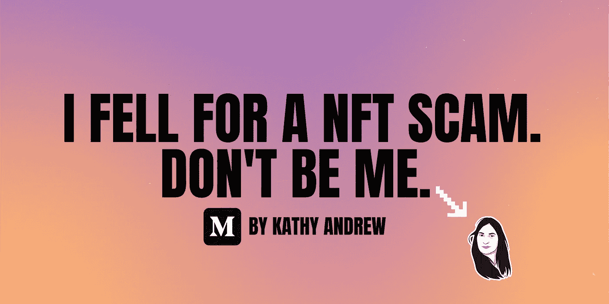

# 我如何能够阻止 NFT 骗局攻击:OPENSEA 漏洞

> 原文：<https://medium.com/coinmonks/how-i-could-have-stopped-a-nft-scam-attack-opensea-vulnerability-2d702867b5fb?source=collection_archive---------11----------------------->

## 我中了一个 NFT 骗局——别像我一样

本周早些时候，骗子偷走了我仅有的两个八位 NFT。

他们是怎么做到的？嗯，我让他们很轻松。

我“取消隐藏”,从而与空投到我的钱包和 [Opensea](https://opensea.io/) 账户的 NFT 互动。我最近参加了…