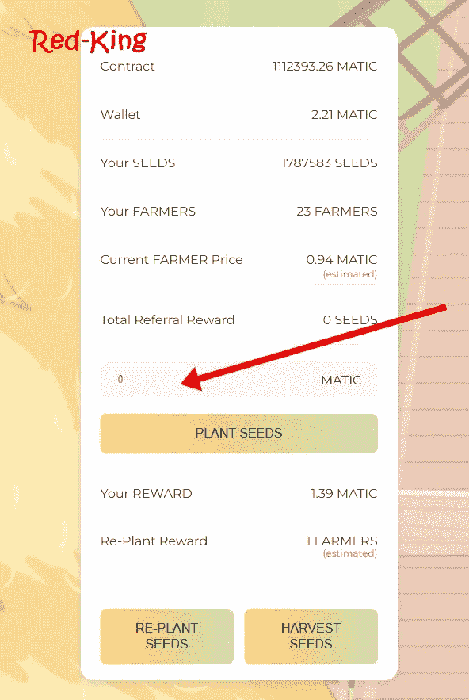

# 我如何在浏览器中轻松挖掘 Matic 被动加密收入

> 原文：<https://medium.com/coinmonks/how-i-easily-mine-matic-in-my-browser-passive-crypto-income-a606b056b179?source=collection_archive---------0----------------------->

我喜欢在多边形网络上工作，因为汽油费非常便宜，所以每当有机会打桩或养殖 Matic 时，我总是有兴趣进一步调查。

我最近偶然发现了一个农场*，它是一个 Matic Miner，所有迹象都表明这是一个潜在的巨大机会。*

**///更新:虽然网站上的合同有时会说零，但这只是 UI 问题。截至 2022 年 8 月，合同中仍有超过 76000 Matic。您可以在这里随时查看合同:*[*https://polygonscan . com/address/0 X5 ab 47 DD 39264 a5d 076566 fc 01 a 1612 a 1 a 982654 e*](https://polygonscan.com/address/0x5AB47Dd39264a5D076566FC01A1612a1a982654e)*

*在继续之前，让我澄清一下，这不是财务建议，纯粹是为了教育和通知你。已经说过**我已经投资了*农场*并且每小时都在产生自动奖励。此外，这不是一篇赞助的文章，我也没有从开发者那里得到任何报酬。***

**

*农家乐是 [***烤豆***](https://redkingadventures.com/bakedbeans) 的一个叉(我最近在[我的烤豆文章](/@Red-King/my-best-passive-income-crypto-investments-earning-up-to-8-daily-83d09d72854)里更详细的写了一下)。烘豆似乎是每个人最喜欢的矿工，它从 2021 年 11 月开始产生回报，我也很享受，但我喜欢分散投资，分散投资，特别是在不同的连锁店。*

*农舍每天都在稳步增长，这对任何现有的和潜在的投资者来说都是一个好消息。你可以在他们的合同中看到，目前 Matic 的价值为 159 万美元，并且还在继续增长。*

**

*您将需要 Metamask 将您的资金存入 [***农庄***](https://redkingadventures.com/farmhouse) 。如果你还没有设置 Metamask 钱包，你可以[阅读我的这篇文章](/@Red-King/my-best-passive-income-crypto-investments-earning-up-to-8-daily-83d09d72854)来看看如何设置。*

*别忘了切换到钱包里的多边形 Mainnet，然后点击页面上的*连接*。当你点击连接，你将能够看到所有的统计数据和合同细节。*

**

*然后你向下滚动到显示 *Matic* 的地方，输入你想投资多少 Matic，然后点击*植物种子*。*

*一旦你这样做了，你的 *Matic* 就会按照你的投资比例为你购买一定数量的*农民*。*

**

*那些农民然后生产种子。*

*现在，当你的农民创造种子时，你有两个选择:*

*你可以*重新播种*，这是他们的说法，你可以获得复利(回报)。如果你决定重新播种，他们会变成你的农民。上面写着*重新种植奖励:*显示你当前的奖励将创造多少农民。它至少需要 1，因为你不能有半个农民。*

*运筹学*

*您可以*收获*种子，这意味着您可以将您的 Matic 奖励提取到您的 Metamask 钱包中。上面写着*你的奖励*显示你目前可以获得多少奖励。*

*所以你的最终目标是建立并增加你的农民数量；现在的农民价格是 0.94 马提克，但是确实会有波动。*

*你可以在底部看到你的日回报率高达 7%。它并不总是保证 7%，它通常会在 5%和 7%之间，这个比率取决于你收割或重新种植的频率。你通常会通过遵循他们给你的这些项目的指导方针来获得最好的回报，那就是做 6 天的再种植(或复种)，然后在第 7 天收获。*

*有些人甚至在尝试一个“29+1”的计划，这意味着你重新种植(复合)29 天，然后在第 30 天收获。*

*这个项目最大的一个好处就是 dev 费只有 2%！许多这类项目的开发费用为 8%或 10%，有时甚至高达 15-16%。*

*这个项目也被审计了你可以在 https://hazecrypto.net/audit/TheFarmHouse 阅读审计，像 [***烤豆子***](https://redkingadventures.com/bakedbeans) 一样，它也被盖了正戳。这是审计的结论:*

> *THEFARMHOUSE 智能合同没有发现漏洞、后门和诈骗脚本。*
> 
> *代码通过兼容的编译器进行了测试，并针对所有已知和特定的漏洞进行了人工模拟审查。*
> 
> *因此，在多边形主网络中使用机房智能合同是安全的。*

*去看看那个农舍，做你的研究，如果你想的话，来加入吧。*

# *在其他网络上寻找其他养殖平台？*

*在这里阅读我的 Cronos 链上的[最佳农民](/coinmonks/how-to-mine-the-official-crypto-com-a49afd12045f)。*

*我在币安智能链上最好的[农民在这里](/coinmonks/how-i-get-9-bnb-daily-b59c1a49de77)。*

*我最好的[农民雪崩网络在这里](/@Red-King/the-two-avax-miners-i-am-most-excited-about-earn-8-cypto-passive-income-daily-7ad19c099191)。*

# *最后要注意的是:*

*我不是财务顾问。这不是一个财务建议，无论你在我的文章中读到什么，都完全是出于教育目的。*

*农家乐高风险高回报。*

*这份合同有一个反鲸机制，这是所有优秀矿工的标准。*

*这篇文章包含附属链接。*

*我只认可我个人投资的项目。*

*请记住，您不能取出您的初始存款；相当于买了一张存单，你锁定了你的初期投资，但是你每小时都在获得源源不断的回报。*

*如果你遵循六天补种一天收获的制度，这些项目中的大部分可以在六到八周内收回你的初始投资。*