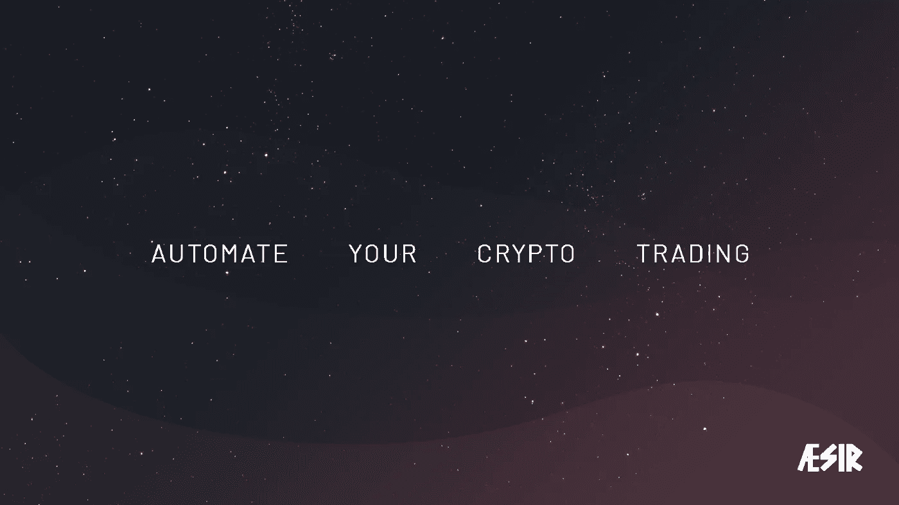

# 我是如何进入加密算法交易行业的

> 原文：<https://medium.com/coinmonks/how-i-got-into-the-crypto-algorithmic-trading-business-7c6645552cc2?source=collection_archive---------8----------------------->

交易算法本质上是一组指令，计算机可以使用它们来执行自动交易。例如，“当 MACD 指标高于 0 时购买比特币”可以被编码并作为加密交易算法的一部分来执行。

# 在算法交易平台上

我开发加密交易机器人已经有一段时间了，但直到最近我才涉足*加密算法交易平台业务*。但是等等——这到底是什么意思？你的意思是除了达到这些搜索引擎优化的目标？我很高兴你问了:

这通常指的是一个网络应用程序，它允许用户基于现有的模板或接受*参数的规则集来配置自己的交易算法。* Parameter 是一个开发人员术语，指可以给现有代码块的输入，通常需要它来返回依赖于该参数的输出。

从这个意义上说，算法交易平台是一套预先编写好的指令，其编码方式可以让终端用户根据自己的输入修改应用程序的行为。

如果我们回到之前的例子:“当 MACD 指标高于 0 时购买比特币”并替换硬编码值“比特币”、“MACD”和“0”，我们会得到更接近可配置交易算法的东西:

当**【指标】**指标为**【表情】**时购买**【币】**

# 币安波动率交易

在很大程度上，我喜欢开源我的工作——这正是我为我的一个更受欢迎的交易机器人——币安波动交易机器人所做的— [源代码在这里，如果你好奇的话](https://github.com/CyberPunkMetalHead/Binance-volatility-trading-bot)。

BVT 机器人是一个开放源代码的交易算法，允许最终用户根据自己的交易风格进行配置。默认情况下，这意味着在价格飙升之前检测和购买不稳定的硬币。例如，你可以配置它来购买币安上任何在过去的 **3 分钟内上涨至少 **5%** 的硬币。**

BVT 机器人很快在 Reddit 上获得了大量关注，超过 25000 次投票

—还有 GitHub 上的 3.1k 星星

据报道，如果最终用户的配置是恰当的，该机器人已经产生了回报。这个机器人的主要问题是，它通常需要用户有一些一般的开发人员知识:使用 git，安装 python，IDE 经验等。

这个机器人很快就聚集了一个社区，用户也为开源代码库做出了贡献。几个月来，我们一直在改进开源项目，但使用它仍然存在技术障碍。

我和对代码库最积极的贡献者决定把它变成一个真正的 SAAS。我们现在有 7 个人一起工作，利用 BVT 机器人的原始代码库，对它的工作方式进行大规模改进，添加额外的功能，并使它成为一个用户友好的网络应用程序。

我不完全确定这种情况发生的几率有多大——但我们最终在全新的组织中拥有了一个超级强大的团队和非常有才华的人。

然后我们合并了这个业务，它变成了官方的——我们正在做这个，我们正在构建一个 SAAS。

# 遇见 AESIR

AESIR[**ey**-先生， **ey** -zir ]是我们为我们全新的算法加密货币交易平台选择的名称，该平台应该能够自动化大多数交易策略。自然，它是基于 BVT 机器人，但它更强大。

我们一年前开始研究 AESIR。AESIR 现在处于后期开发阶段，我们将很快进入内部测试。

大多数加密货币算法交易平台的问题是，它们要么太难使用，要么无法为有经验的交易者提供足够的定制选项。所以我们的首要任务是通过引入*独特的交易信号*来平衡等式，你可以很容易地创建这些信号。

AESIR 将提供几种可定制的配置:

*   波动交易
*   国防通信局(Defense Communications Agency)
*   技术分析交易
*   社交/复制交易

这是当前配置页面和选项的预览——可能会随着所有前 alpha 镜头的变化而变化。

我特别感兴趣的一个特性是在复杂表达式中组合信号。

例如，您可以创建一个 DCA 配置，它将:

“如果**【MACD 指标】**为**>0】****【RSI 指标为 30】****【比特币已暴涨】【至少 3%】**在最后**【5 分钟】内买入**比特币】**【每周一次】。**

当然，你不必做得那么细致，但你可以。

# 测试我们的加密交易平台

一旦我们能够正确地运行端到端测试，我们就会花大量的时间抛出不同的配置选项和边缘情况场景，并观察应用程序将如何运行。一旦我们确认应用程序是稳定的，并且基本上做了你告诉它的事情，我们将在封闭测试模式下发布。

现在，看起来 AESIR 的封闭测试将在今年夏天进行。我们认为暂时不坚持严格的最后期限是最好的。没有人想要第二个赛博朋克版本。

如果你很好奇，想成为一名封闭的测试者，你可以在这里做。

记得给这篇文章足够的**掌声**和**关注**我更多的秘密内容。

# 我的创业社交

**电报公告**——[https://t.me/spincat_online](https://t.me/spincat_online)
**推特**——[https://twitter.com/Spincat_online](https://twitter.com/Spincat_online)
**网站**——[https://spincat.online/](https://metawars.gg/)
**不和**——[https://discord.gg/PNV6j9NBBH](https://discord.gg/PNV6j9NBBH)
**insta gram**——[http://instagram.com/spincat.online](http://instagram.com/spincat.online)

> 加入 Coinmonks [电报频道](https://t.me/coincodecap)和 [Youtube 频道](https://www.youtube.com/c/coinmonks/videos)了解加密交易和投资

# 另外，阅读

*   [分散交易所](https://coincodecap.com/what-are-decentralized-exchanges) | [比特 FIP](https://coincodecap.com/bitbns-fip) | [宾邦评论](https://coincodecap.com/bingbon-review)
*   [用信用卡购买密码的 10 个最佳地点](https://coincodecap.com/buy-crypto-with-credit-card)
*   [加拿大最佳加密交易机器人](https://coincodecap.com/5-best-crypto-trading-bots-in-canada) | [Bybit vs 币安](https://coincodecap.com/bybit-binance-moonxbt)
*   [阿联酋 5 大最佳加密交易所](https://coincodecap.com/best-crypto-exchanges-in-uae) | [SimpleSwap 评论](https://coincodecap.com/simpleswap-review)
*   购买 Dogecoin 的 7 种最佳方式
*   [最佳期货交易信号](https://coincodecap.com/futures-trading-signals) | [期交所评论](https://coincodecap.com/liquid-exchange-review)
*   [用于 Huobi 的加密交易信号](https://coincodecap.com/huobi-crypto-trading-signals) | [Swapzone 审查](/coinmonks/swapzone-review-crypto-exchange-data-aggregator-e0ad78e55ed7)