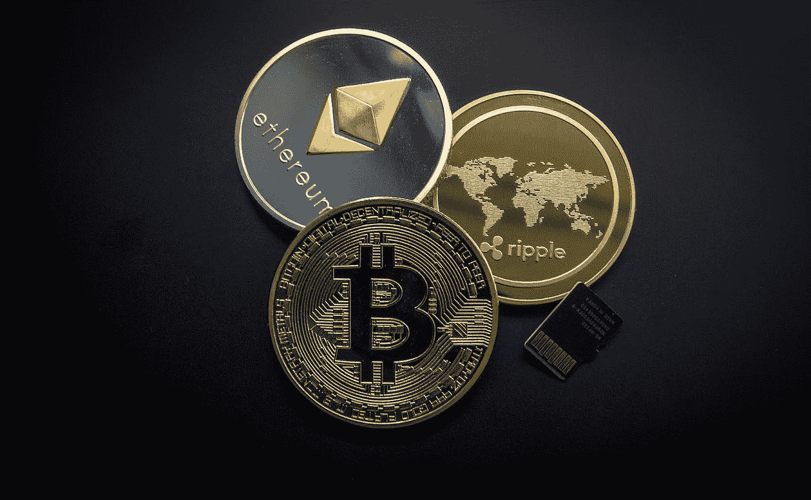

# 我如何开始使用加密货币

> 原文：<https://medium.com/coinmonks/how-i-got-started-with-cryptocurrency-278a3d037c60?source=collection_archive---------55----------------------->

# 介绍

加密是个骗局，不值得我浪费时间。当我第一次听说它的时候，我认为所有与 crypto 相关的项目和交易都是见不得光的。应该像躲避瘟疫一样躲避。

嗯，那是我过去的想法。回过头来看，是我太小心眼了，太偏心了。为什么我要对自己没有尝试过的东西投下阴影？所以今天，我将与你分享我如何开始使用 crypto 的经验以及我现在对它的想法。

我的经历将围绕这出戏来获得视角，因为那是我第一次开始的地方。作为一个狂热的游戏玩家，这个概念让我着迷。玩我喜欢的游戏，有旁门左道。

希望我的经验可以作为对开始使用 crypto 感兴趣的人的指南，特别是在赢得空间的游戏中。

*Exploring the Possibilities with Cryptocurrency | Photo by* [*Worldspectrum*](https://www.pexels.com/@worldspectrum/) *from Pexels*

在我们继续之前，这里有一个**免责声明:**

**这不是财务建议。如果你对任何形式的投资感兴趣，你应该找一个有执照的财务顾问，他会根据你的需求和风险偏好给你最好的建议。**

说完了，我们继续。

# 我在给 Crypto 遮阴

我以前没有参与任何秘密项目。同样，我只是在做我自己的事。然而，crypto 是我已经熟悉的东西，因为我看过一些 Coffeezilla 视频。当你在 Coffeezilla 视频中看到一些东西时，你可能会立即认为这是一个骗局。

我相信像密码这样没有内在价值的东西。就连著名投资家沃伦·巴菲特也说，他不会为了 25 美元接受全世界的 BTC。所以，从一个可信的人嘴里说出来，这一定是真的。

但是，经过一番思考，我认为这是不公平的。我甚至没有尝试就已经给 crypto 起了个坏名字。所以，我有过做一些秘密活动的想法，但我从未主动寻找机会。

# 实际上尝试加密来改变

直到 2021 年 10 月到来，那是我被介绍到玩耍的世界去挣钱的时候。我的一个朋友计划邀请我去看他的戏剧，这样我就可以成为一名 Axie Infinity 学者。

我起初持怀疑态度，因为我认为整个概念是一个庞氏骗局。但是，这是一件好事，我们就此进行了讨论，我的朋友解决了我所有的担忧。现在，我感兴趣并想加入公会。

这也是我真正尝试使用 crypto 而不仅仅是说它不好的机会。

但是，我的朋友说他当时没有预算，所以我必须等到 2021 年 11 月。与此同时，我想学习更多关于加密和游戏的知识来赢得空间，所以我玩了一个免费的区块链游戏“被解放的上帝”。

该游戏与另一款在线交易卡牌游戏炉石非常相似。你也可以说它类似于魔术聚会。比如支付魔法来玩法术和生物，召唤疾病的游戏机制。由于我有很多玩炉石的经验，学习《被解放的上帝》很容易。

所以，我给了 crypto 一个机会，因为它与我的一个最喜欢的爱好有关，那就是在线游戏，尤其是 TCGs。

# 当前的一天

今天我们在这里。我从 2021 年 11 月开始就能够成为公会成员。已经玩 Axie Infinity 个多月了。同样，我也能赚点外快，但我必须说支出可能会有所不同。

由于加密货币的性质，我从阿谢和顾那里获得的奖励的价值会随着时间的推移而波动。因此，我可能会收到大收入或小收入。如果你问哪个经常发生，那么它是小收入。这就是为什么我把玩赚钱这个概念看作是一种副业，而不是一种全职生活。

有些人可能会把这变成一种可持续的赚钱方式，但这是一个真正的挑战。只有少数人能做到。你最好做一份全职工作，或者做一名有高端客户的自由职业者。

现在，我正致力于玩《不受束缚的上帝》和《无限之轴》。我也在尝试其他游戏，比如 Splinterlands 和 Skyweaver，但只是偶尔为之。我觉得与顾和阿协更合拍，但也许随着时间的推移，我会喜欢上其他游戏。

此外，我想用我的数字资产赚取一些利息，所以我更多地探索了币安。从那里，我找到了币安·欧文。这是一个你可以用你的密码赚取利息的功能。

我仍在尝试建立我的收藏，但我会先从 stablecoins 开始，因为我还是个新手。稳定硬币提供可预测的回报，并且不像其他硬币那样波动，所以这是一个好的开始。从那里，我可以开始收集更不稳定的硬币，这样我就可以获得更高的收益。

但是，请再次做你自己的研究。这只是我用密码探索我的可能性。我现在做的可能不适合你。所以，请咨询专业人士。

# 关键要点

*   与了解加密的人进行讨论
*   先试一试，再下结论
*   如果可以，那就咨询一下专业人士
*   “玩即赚”游戏可被视为旁门左道

# 结论

所以，我尝试了加密，并能够赚取一些现金。不是很多，但可以认为是对你主要收入来源的补充。至于密码没有内在价值，我们只能拭目以待。

随着技术的发展，很多事情都会发生变化。但是我可以说我对 crypto 的总体体验是好的。至少我比以前更了解它了。

这就是我对加密货币和玩赚取游戏的体验。如果你想在寻找好的区块链游戏时有一个向导，那么我写了一篇文章，可能对你有帮助。点击[这里](/@mdl2294mk/how-to-check-if-a-blockchain-game-is-worth-playing-55a866bd8241)阅读。

如果你觉得这有帮助，那么请分享它。我希望我的经验可以作为新手使用密码的指南，尤其是玩游戏赚钱的人。就这样，谢谢你的阅读，并祝一切顺利。

> 加入 Coinmonks [电报集团](https://t.me/joinchat/Trz8jaxd6xEsBI4p)，了解加密交易和投资