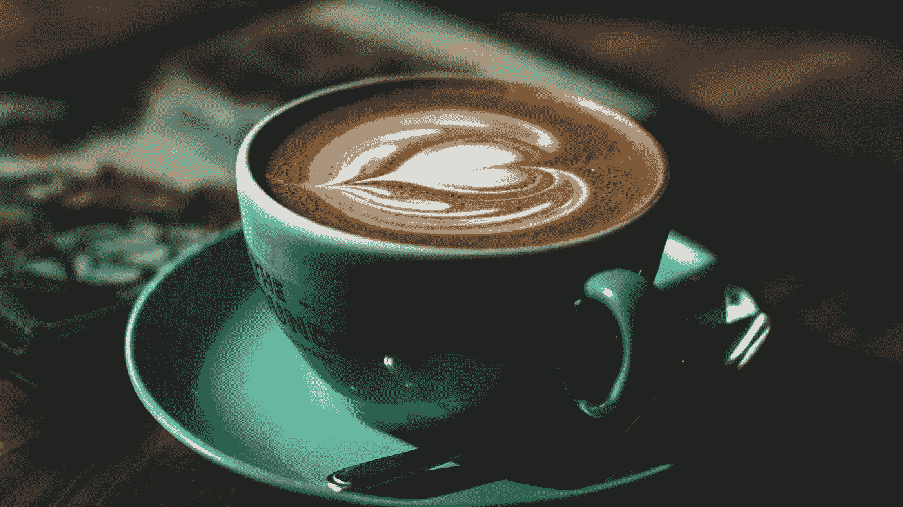
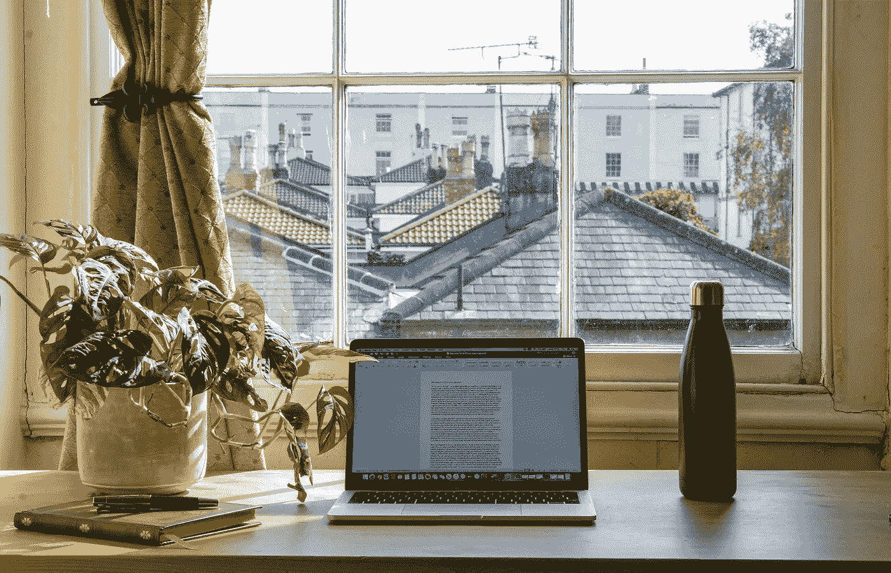

# 作为一名日内交易者，我如何改善自己的心理健康

> 原文：<https://medium.com/coinmonks/how-i-improve-my-mental-health-as-a-day-trader-f7e0b6c7601e?source=collection_archive---------43----------------------->

## 对我来说证明是成功的改善心理健康的诀窍。

> 他的文章是一篇博客风格的文章，缺乏投资建议。

# 介绍

虽然分析是交易的基础，但我敢说，我最重要的技能是生理技能:它们是关于我有多少能量，我能多好地调节自己的情绪，以及我能多清醒地保持头脑。

我认为公平地说，在交易建议中，这些生理技能的重要性被忽视了。这就是为什么我希望在本文中帮助重新平衡这种理论上的“套利”(一个暗示差异的金融术语)。这些技巧被分成几章，我试图让这篇文章成为一篇优秀的“自然读物”，讲述一个关于我自己和我的挑战的故事。

当我感觉好的时候，我的交易就好。我想得更清楚，我的想法更少飘忽不定，我更有可能在我的交易决策中感受到“我知道这是对的”的信心。

所以，以下是我改善心理健康的方法。也许你可以用它来激发你的交易潜力和个人生活方式。请记住，每个人都是不同的，我的成功因素可能不会对你产生影响。

# 早餐

你知道吗，习惯更多的是神经和自动的，而不是有意识的。即使你有改变生活方式的意愿，实际上这样做需要一段长时间的专注步骤。

习惯是获得幸福的重要工具。例如，在这篇文章的所有建议中，对我帮助最大的是建立一个稳固的日常结构。著名心理学家 Jordan Peterson 在一段视频中说，他治疗焦虑的最佳方法是简单、良好的早餐。

上帝，我感谢乔丹做了很多事情。但是，我想我最应该感谢他的这个建议。这听起来很愚蠢，但是，事实上，从听从这个建议的第一周开始，我看到我的焦虑水平奇迹般地下降了。直到今天，我还不明白每天早上以慢煮的“私人时间”早餐开始是多么深奥。

The consistency of a nice breakfast worked wonders for me

# 早晨的仪式

受乔丹·彼得森建议及其结果的驱使，我增加了一些我现在非常喜欢做的晨间习惯。它们是——如果这听起来不太傻的话——我一天中的一些亮点:

*   刷牙和呼吸
*   对着镜子里的自己微笑
*   确保我的床有点干净
*   确保良好的桌面基础设施:笔筒和其他物品随时可用

我知道一些交易者在开市前会列出一份观察名单。有些人甚至坚持只买清单上的股票。像那样严格的仪式对我来说并不奏效，但我只是想把它放在这里，这样你可以从中获得一些灵感。

# 缓慢的移动

由于我的电子游戏成瘾、多动症倾向和高新陈代谢，我一再陷入想快速完成所有事情的陷阱。这种匆忙在日内交易中是一种巨大的财富，让我充满学习的热情，但也让我容易焦虑，失去监督和其他类似的影响。所以，我经常专注于做以下事情，尤其是当我感到焦虑的时候:

*   我需要**放慢**的脚步，专注于当下。日本茶道的哲学教导我要把全部注意力放在我此刻正在做的一件事情上。即使在我很忙的时候，我也能从一天中抽出 2 分钟来专注于我的笔，在我写东西的时候深呼吸。
*   **对我做的事情进行分类:在结构中工作有助于我保持思维清晰。当我忙得不可开交时，我就陷入了做任何事情都要快速的陷阱:我失去了方向，对自己下意识地看透事物缺乏信心，这让我通过匆忙来弥补。**
*   我不得不**偶尔从交易中休息一下**，即使这会让我错过机会。当我非常焦虑或者感觉不好的时候，一个小时的户外散步真的可以创造奇迹。有时候，一整天不交易对我来说是有利可图的，虽然这听起来很可笑。在一天的晒太阳和与人交谈后，我的头脑变得如此清晰和自信…我觉得这太不可思议了。

# 一致性

我注意到改善我的生理健康和心理状态是一项每周都要做的努力。我不能靠欺骗来获得自信和健康。

健康的收益也有助于我个人的幸福，这很好:仅仅几个关键步骤就大大提高了我的整体幸福。这种利润驱动的自助让我想起了这里的一句名言:

> “交易不仅仅揭示你的性格，如果你在游戏中呆得足够久，它也会塑造你的性格”

> ~摘自 Yvan Byeajee 的《如何在面对市场不确定性时保持冷静》

这是一句让你深思的话，但我最终不同意:我的旅程是关于积极主动的。我不应该让市场引领我，但我应该只在为市场做好准备时参与。我从快乐、身体健康和精神坚韧的位置交易。

# 心理斗争

你现实生活中的事情无疑会影响你的交易能力。可能是离婚，也可能是另一件人生大事。但也可能是某种障碍，比如创伤后应激障碍。

我很幸运，我没有处理严重的心理压力。但是，偶尔抑制我的东西是，我有过度内疚的刺激。它们是我出洋相或成为别人讨厌的人的生动倒叙。

我意识到解决这些问题的唯一方法是放慢脚步(如上所述),活得更加诚实和尊重。

# 创伤释放

我处理一些创伤。但是，胜利地解决我内心的这些黑暗记忆是非常令人振奋的。像这样治愈我的灵魂有时会让我在接下来的几周里充满活力。

*   当治愈我的创伤时，我允许自己坐在痛苦中，呼吸并注意到这种痛苦不再影响我。我只是活在当下，很安全。
*   当我发现一些真正不公正的事情时，我知道最好解决它。当我不立即解决问题时，它们会成倍地合并。是的，正面对话是困难的。但是，熟能生巧。一个很好的谈话建议是，使用“这让我觉得 x”或“我觉得”这样的术语是很好的。
*   如果我心里有什么不舒服，我喜欢写下我的感受。
*   除了说和写疗法，我在更抽象的治疗形式上取得了巨大的成功。我很幸运在生活中遇到了一位身体体验治疗师。从我们第一次见面开始，我就被迷住了。他教我如何重新获得对自己身体的爱。
*   除了身体康复，还有其他的治疗方法。我喜欢表现得好像我是我的象征性动物，同时在冲动的运动中真正地将压力从我的身体中抖落出来；这些是我从美国本土文化中学到的东西。是的，这看起来很可笑，但是一旦你投入进去，我想你会笑到最后。

# 自己的节奏

重要的是要知道你是为你的钱而工作的人。一个厨房只能容纳一个厨师。虽然在某些情况下，其他人的想法可能是一种资产，但我还是总结了以下经验法则，并试图遵循这些法则:

*   我试着不去嫉妒或者拿自己和别人比较。我真的寻求真理和严谨。我也专注于发展我自己的交易风格。
*   我能听到别人的议论，但实际的分析、研究和沉思，纯粹是我这边做的。对我来说，我觉得像一个[【einzelgnger】](https://translate.google.com/?sl=de&tl=en&text=einzelg%C3%A4nger&op=translate)(独自行走的人)一样生活很不错。正如爱因斯坦所说:“我生活在孤独中，这种孤独在年轻时是痛苦的，但在成熟时是美好的”和“做一个孤独者，这给你时间去思考，去寻找真理。有神圣的好奇心。让你的人生值得活下去”。
*   此外，根据经验法则:我不参与投资讨论。我注意到谈话破坏了我头脑的清晰。因此，当我的谈话伙伴不停地紧张不安时，我会确保纯粹地思考，并在头脑中重新确认我自己的信念。
*   我不喜欢以任何方式受其他人所说的影响，因为我知道我有很好的能力以公正的方式反驳我的观点。总而言之，当与人交谈时，我有时可能会听取他们的一些意见，但我是做自己考虑的人。他们与此事无关。

# 其他提示

在心理健康技巧分类列表的最后一部分，我收集了一些关于心理健康的生活窍门。

*   周围有植物甚至看起来很自然的元素可以改善你的精神健康。在学术研究中，这被称为亲生物性。在传统的亚洲设计中，这与风水有很大关系。
*   我喜欢在任何地方都戴着耳机。总会有大声说话的人和其他恼人的事情。
*   扮演意志坚强的角色。我注意到，当我站直并“好像”我有精神毅力一样交流时，我实际上改善了我的精神状态，我说，30-40%。此外，我注意到当我行动缓慢、表现自信时，我周围的人表现得如此不同:我得到了微笑，人们实际上可能会接近我进行交谈，我强化了“没有你我也能做到”的心态。
*   照顾好你的身体。做一些老生常谈的事情，比如锻炼、吃好、喝足。就算边际收益，那也行。但是，如果你有增量边际收益，那就太棒了！这里的目标是实现体面健康生活的门槛。就是这样。
*   从长远来看，不吃糖总能提高我的能量水平。关键是要坚持一两个星期直到你的身体出现戒断症状。
*   我相信一些特定质量的产品是必须的。你不必成为下一个马克斯·布朗利，只要买一部高速手机(我的是 300 欧元)、非运动鞋(我只穿 Mammut 的 [Saentis Lows](https://www.mammut.com/us/en/products/3030-03430/saentis-low-men) )和一台功能强大的电脑。我相信像这样的事情真的能提高一个人的分析技能、风险缓解和/或便利程度。
*   一个古老的交易建议是保持旺盛的性欲。戒酒一段时间对我的能量水平总是有很好的效果。
*   旅行时，我经常确保自己有备用的水和食物。如果我有一天没有好好照顾自己，它会影响到接下来的一周。有时候，在开车时休息 10 分钟是有好处的，这样你就可以散步或吃三明治了。乘坐公共交通工具时，只需找到你想要的东西，并清楚地知道自己在做什么。这样我就减少了被烦死的风险。
*   玩得开心。享受生活。享受交易的乐趣。即使很难，也要试着享受微小的时刻。仅此而已。

Natural light and natural elements may positively affect your functioning

# 结束语

这些都是我为了成为最好的自己而使用的心理技巧。我真诚地希望你发现这种对我的方法的洞察力是鼓舞人心的，并且它能以某种形式帮助你。

*最初发表于*[*【https://www.geekystocks.com】*](https://www.geekystocks.com/articles/psychology/mental-health/mental-health-tips-for-traders)*。*

> 加入 Coinmonks [电报频道](https://t.me/coincodecap)和 [Youtube 频道](https://www.youtube.com/c/coinmonks/videos)了解加密交易和投资

# 另外，阅读

*   [加拿大最佳加密交易机器人](https://coincodecap.com/5-best-crypto-trading-bots-in-canada) | [库币评论](https://coincodecap.com/kucoin-review)
*   [火币加密交易信号](https://coincodecap.com/huobi-crypto-trading-signals) | [HitBTC 审核](/coinmonks/hitbtc-review-c5143c5d53c2)
*   [如何在 FTX 交易所交易期货](https://coincodecap.com/ftx-futures-trading) | [OKEx vs 币安](https://coincodecap.com/okex-vs-binance)
*   [OKEx vs KuCoin](https://coincodecap.com/okex-kucoin) | [摄氏替代品](https://coincodecap.com/celsius-alternatives) | [如何购买 VeChain](https://coincodecap.com/buy-vechain)
*   [ProfitFarmers 回顾](https://coincodecap.com/profitfarmers-review) | [如何使用 Cornix Trading Bot](https://coincodecap.com/cornix-trading-bot)