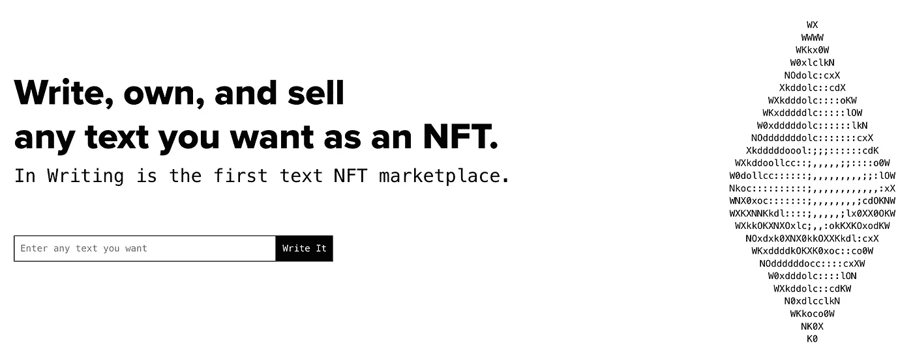

# 我如何用 NFTs 在 5 分钟内赚了 300 美元

> 原文：<https://medium.com/coinmonks/how-i-made-300-in-under-5-minutes-with-nfts-b60bf4fd6bae?source=collection_archive---------11----------------------->

NFT 仍然是一个新兴的领域，这意味着很容易赚钱，尤其是在新的平台上。[书面](http://inwriting.io)是一个[分散的基于文本的 NFT 市场](/coinmonks/this-nft-project-features-a-decentralized-marketplace-e36a9390a82a)，在这里你可以铸造、购买和出售[连锁](/coinmonks/the-value-of-on-chain-blockchain-storage-in-relation-to-nfts-e50f9c8ce546)文本 NFT。

In Writing’s home page

那么，我是怎么赚到 300 美元的？我关注了当前的社交媒体趋势。自从杰克·多西作为 NFT 的第一条推文令人失望的拍卖后，媒体已经发布了许多关于这次失败投资的报道。

于是，我决定在文字[【杰克·多西的第一条推特】](https://www.inwriting.io/text/?tokenID=47)的文字的[上造一个 NFT，这花了我不到 5 分钟就上了文字](http://inwriting.io)[的网站](https://www.inwriting.io/write)。

My NFT on In Writing

我在[分散市场](/coinmonks/this-nft-project-features-a-decentralized-marketplace-e36a9390a82a)上列出了售价为 0.11 乙醚(当时约合 320 美元)的 NFT，几天后它就卖出去了！它的售价超过了杰克·多西第一条推文的实际 NFT 的最高出价！

如果你留意新兴的项目，跟随社交媒体的趋势，你将能够不费吹灰之力就赚到钱！

> 加入 Coinmonks [电报频道](https://t.me/coincodecap)和 [Youtube 频道](https://www.youtube.com/c/coinmonks/videos)了解加密交易和投资

# 另外，阅读

*   [最佳加密交换平台](https://coincodecap.com/best-crypto-swap-platforms) | [最佳加密交易所](https://coincodecap.com/crypto-exchange)
*   [购买比特币印度](/coinmonks/buy-bitcoin-in-india-feb50ddfef94) | [Pionex 评论](/coinmonks/pionex-review-exchange-with-crypto-trading-bot-1e459d0191ea) | [加密交易机器人](/coinmonks/crypto-trading-bot-c2ffce8acb2a)
*   [n rave 零点回顾](/coinmonks/ngrave-zero-review-c465cf8307fc) | [Phemex 回顾](/coinmonks/phemex-review-4cfba0b49e28) | [PrimeXBT 回顾](/coinmonks/primexbt-review-88e0815be858)
*   最佳[区块链分析](https://bitquery.io/blog/best-blockchain-analysis-tools-and-software)工具| [赚比特币](/coinmonks/earn-bitcoin-6e8bd3c592d9)
*   [Cloudbet 赌场评论](https://coincodecap.com/cloudbet-casino-review) | [点火赌场评论](https://coincodecap.com/ignition-casino-review)