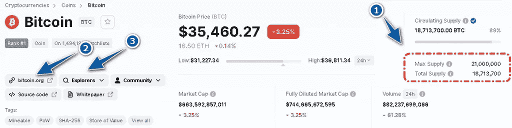
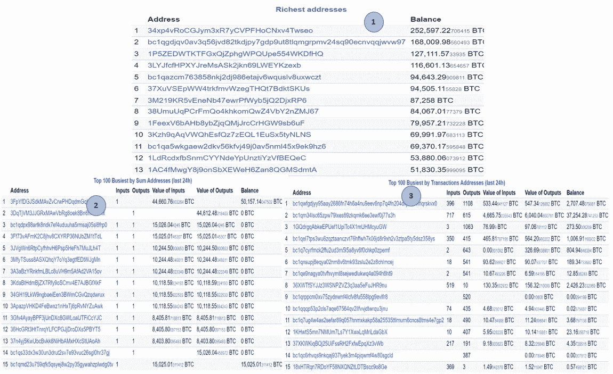
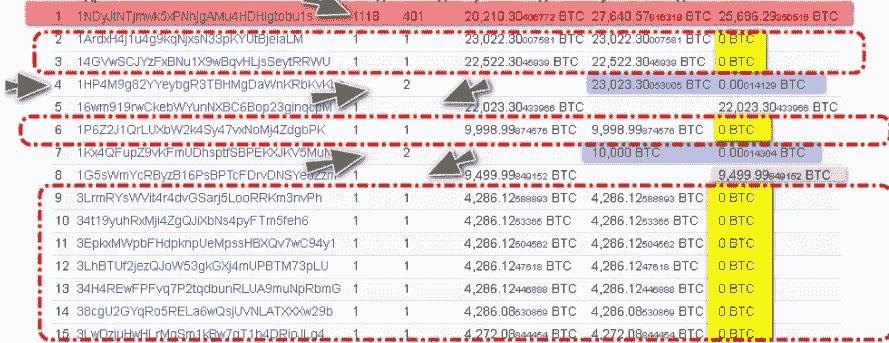
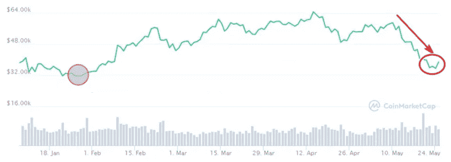
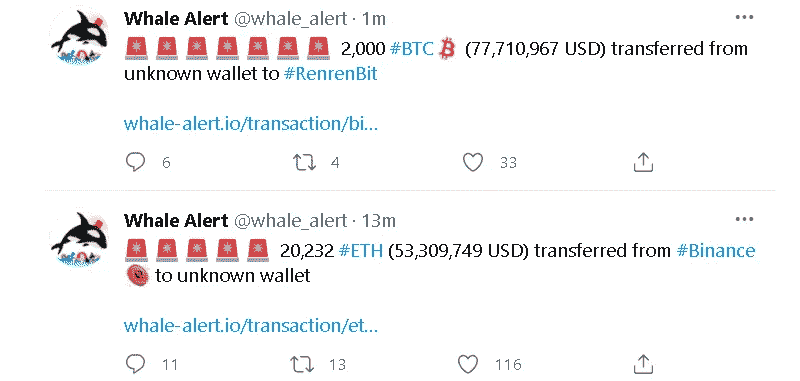
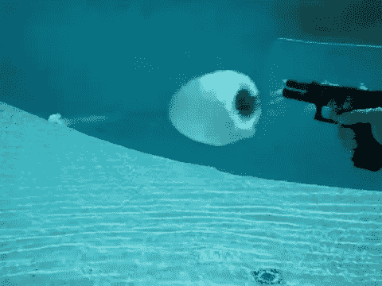

# 我如何监控影响价格的加密鲸鱼，为什么交易者要跟踪它们？

> 原文：<https://medium.com/coinmonks/how-i-monitor-crypto-whales-who-affect-the-price-and-why-should-traders-follow-them-f5ebabf3d3d3?source=collection_archive---------1----------------------->

各位交易者好！

加密货币正日益成为我们生活的一部分。在今天的主题中，我们将触及一个非常有趣的话题，与相关资产(主要是比特币)的大持有人有关。它们被称为**隐鲸**。****

****我们将分析他们是谁，如何跟踪他们的行动，并试图从这些信息中受益。****

****很难不注意到外汇市场/加密货币在经纪人工具列表中的新趋势。****

****在国际范围内，交易加密货币的外汇公司不超过 20%，但一年后我们将出现一种“寒武纪大爆发”。它包括急剧增加:****

*   ****支持数字货币的经纪人数量；****
*   ****拟议工具中加密货币的种类数量；****
*   ****衍生产品类型的数量，以及最重要的是，各种加密指数中差价合约的出现。****

****世界上最大的投资银行已经决定公开支持数字资产的交易，这些资产将来自流动性提供商，并将自动提供给货币经纪人的客户。****

****由于各种原因，我们中的许多人对这些工具持否定态度。它们在技术上很难理解，它们的增长类似于炒作，波动性大大增加了日内交易指标的使用复杂性。根本没有必要谈论基本面分析，今天比特币和替代币没有单独的经济指标。****

****尽管存在上述缺点，但几乎每种加密货币都有一个重要特征。它极大地简化了数字资产和交易的分析、预测。加密货币的一个显著特征是大型投资者的所有行动和交易的可用性和透明度，在传统市场中，大型投资者被视为内幕人士。****

# ****加密鲸、赌注者和持有者是加密货币市场生态系统的基础****

********

****数字货币，就像各国的外汇货币一样，在密码交易员的行话中被称为“法定货币”，只代表了复杂生态系统的一部分。****

****与外汇不同，加密货币没有中央银行，它们的货币政策由区块链算法决定，在特定条件下，硬币的每个所有者都有投票权。这就是所谓的**数字货币生态系统**，它包括:挖掘方法、共识类型等。****

****与法币不同——法币的利率取决于美联储、欧洲央行和其他全球金融监管机构代表的言行——通胀、发行规模甚至手中硬币的分布情况都是每个互联网用户事先知道的。****

****任何加密货币的代码都公开发布在开发者的网站上或最大的程序员网络服务 GitHub T1 上，在那里登记新硬币的最终发行和发行率，让你可以计算通货膨胀。****

****在 [CoinMarketCap](https://coinmarketcap.com/) 网站上可以找到简单易懂的相同信息以及价格统计数据。通过点击感兴趣的加密货币的名称，在打开的卡中你可以看到(例如[比特币](https://tlap-com.translate.goog/kak-torgovat-bitkoinom-na-forex/?_x_tr_sl=ru&_x_tr_tl=en&_x_tr_hl=fr&_x_tr_pto=wapp)):****

1.  ****发行的总规模和发行的硬币数量；****
2.  ****官方网站地址；****
3.  ****区块链浏览器。****

********

****后一种工具不仅有助于确定块组装的速度，还可以显示每枚硬币的交易历史、每个钱包的存款规模以及数字货币的总体走势。****

****加密货币区块链的主要原则是完全公开和透明，这为任何人计算加密鲸鱼和持有者的行动提供了机会。****

******сrypto whale(Crypto whale)**—钱包里有大量硬币的加密货币持有者。****

******持有人(所有者)**是一个更一般的概念，指所有使用“买入并持有”策略的交易者。****

****与比特币不同，许多加密货币都有“非自愿持有者”。他们被迫“冻结”资金一段时间作为抵押品(股份)。这保证了他们在确认交易时的“诚实性”,因为在操纵的情况下可能会损失资金。****

****因此，**赌注者**是某种类型的矿工，他们通过用加密货币转账组装砖块来换取作为抵押品的加密货币份额，从而获得报酬。****

****如果外汇市场交易员被迫分析订单簿或等待周五发布的 [COT 报告](https://www.cftc.gov/MarketReports/CommitmentsofTraders/HistoricalCompressed/index.htm)，那么在大多数数字货币上，跟踪大账户持有人的行动和加密资本的移动并不困难。在这方面，区块链真正充当了所有实时交易的公开分类账。****

# ****加密鲸和赌注者如何影响加密货币市场？****

********

****像股票一样，单一加密货币的汇率取决于自由流通资产的数量。隐鲸倾向于把硬币堆在钱包里，目的是长期持有。数字货币的增长率的历史证明了这一点，数字货币的增长率可以通过其总价值的动态来评估。****

****根据 CoinMarketCap 网站上现有的统计数据，可以看出 8 年前的市值为 16.3 亿美元。现在所有资产的价值大了 1900 倍，是比特币积累了 45%，前三大 altcoins 积累了 25%。****

****加密货币的千倍增长让加密猫的持有者深信不疑，他们通过购买资产和保留资产，在市场上创造了自由浮动赤字，将这一过程推向了新的高度。出于同样的原因，与区块链的数字货币正在增长，其中提供了“股份”。****

****由于市场上对加密货币的积极购买，从加密货币的“冻结”中赚钱的愿望增加了利率。赌注通常会刺激隐鲸的出现，因为根据区块链算法，存款份额的大小保证了获得奖励的频率更高。****

# ****如何分析加密货币区块链上的钱包？****

********

****加密鲸鱼钱包余额的增加是确认加密货币市场当前增长的信号，但并没有给交易者带来领先的指标优势。****

****在加密货币市场下跌时，监控大持有者的行为更为重要。如果贬值导致 crypto whales 的存款减少，在尽可能接近持仓的位置设置止损，或者尝试退出——出售 crypto whales 可能导致市场崩盘。****

****在市场下跌时,“鲸鱼”钱包里的存款的积极增加表明底部的临近。当然，当上述背离出现时，你不应该指望立即反转。交易者必须分解他的交易，并准备平仓。****

****大钱包可以在区块链探险者的统计收集中找到。这些是特殊的服务，不仅包含所有交易的历史，还包含他们自己的一套额外的研究。例如，在网站[的 bitinfocharts](https://bitinfocharts.com/) 上，大地址位于“浏览器”部分。****

********

****让我们选择比特币浏览器作为分析的例子。正如你从下面的图片中看到的，该服务已经将分析分成列表，以跟踪加密鲸鱼的行动。所有大钱包都位于最富有的地址区(1)。浏览器给出了鲸鱼的前 15 个地址，点击列表名称可以看到它们对前 100 名的详细评级。****

********

****以下是根据 24 小时内的转账金额选出的前 100 个地址(2)。正是这些统计数据被用来快速追踪隐鲸的行动。“输入”栏显示钱包收到了多少笔交易(24 小时内)。“输出”栏显示钱包的转账次数。****

****相应地，投入的总和就是所有补充的总和，产出的总和就是我们感兴趣的存款的支出。让我们仔细看看当前的表。****

****立即扔掉当天收到和花费的零余额(用黄色标记标出)。加密货币来了马上就走了，起不到任何作用。****

****不要关注每天有大量存款和支出的钱包，交易者应该对有大量存款的持有人感兴趣，他们收到一大笔交易，但一天内在任何地方都没有花掉，反之亦然——在没有收到外部资金的情况下提取了大笔资金。通过“输入”或“输出”栏中的空白字段，可以很容易地识别这些帐户:****

********

****上图显示，这个系统在 24 小时内找到了三个地址。两个地址用大量的 23 BTC 和 10 BTC 补充了钱包，一个地址提取了 9 BTC。很明显，在分析日，抛售主导了 BTC 的买入。****

****区块链允许你通过点击加密鲸钱包地址的链接来找出交易的时间。我们观察到的押金是 2021 年 1 月 30 日补的。所有者决定在 5 月 25 日 00:41 处理掉全部金额。****

********

****将这与 BTC 图表上的趋势进行比较。抛售恰逢比特币试图刷新昨日高点。值得听听隐鲸的声音，并修正一些位置。图表显示，他在今年的低点买入了 BTC，尽管下跌了 40%，他仍持有该头寸，现在在反弹时失去了该头寸。****

********

****从分析示例中可以看出，大型交易应该快速分析，在这种情况下，[交易员](https://tlap-com.translate.goog/top-10-stran-dlya-zhizni-treydera/?_x_tr_sl=ru&_x_tr_tl=en&_x_tr_hl=fr&_x_tr_pto=wapp) [鲸鱼警报](https://translate.google.com/website?sl=ru&tl=en&hl=fr&client=webapp&u=https://whale-alert.io/)服务将有所帮助，在其[推特账户](https://translate.google.com/website?sl=ru&tl=en&hl=fr&client=webapp&u=https://twitter.com/whale_alert)上发布几十种加密货币的[交易](https://tlap-com.translate.goog/prekratite-iskat-sdelki-na-grafike/?_x_tr_sl=ru&_x_tr_tl=en&_x_tr_hl=fr&_x_tr_pto=wapp)。该公司提供有关 2 万美元起转账的流媒体信息，如果钱包的收款人/汇款人已知，则为他们提供一个重要和解密的标记。****

********

# ****如何根据机构隐鲸的信号预测市场的未来走势？****

********

****在加密货币市场，机构客户在 [Tether](https://tlap-com.translate.goog/kriptodollar-tether-usdt/?_x_tr_sl=ru&_x_tr_tl=en&_x_tr_hl=fr&_x_tr_pto=wapp) 系统和灰度投资基金的信托中表现最为突出，该系统发行与[美元挂钩的 USDT 代币。](https://tlap-com.translate.goog/indeks-dollara/?_x_tr_sl=ru&_x_tr_tl=en&_x_tr_hl=fr&_x_tr_pto=wapp)尽管投资份额相对较小——仅超过 1000 亿美元——但统计数据显示，这些资本以限制发行形式的流动通常发生在主要[趋势](https://tlap-com.translate.goog/otkuda-berutsya-trendyi/?_x_tr_sl=ru&_x_tr_tl=en&_x_tr_hl=fr&_x_tr_pto=wapp)或数字货币市场转折之前。****

****Tether 值得注意的事实是，它直接与中国的大型场外交易服务合作，购买了 USDT 代币发行的 68%。他每批“留下”几个亿的大批量资金。****

****在[鲸鱼预警服务](https://translate.google.com/website?sl=ru&tl=en&hl=fr&client=webapp&u=https://whale-alert.io/)中可以跟踪大问题的发布时刻。小心:你感兴趣的是发行新硬币的事实，而不是任何交易。这种信息带有一个“铸币”的标志:****

********

****发行后的第二天，市场就开始稳步增长。以每天 10 亿 USDT 的价格发行这些拍品是值得的。低于这个阈值的任何东西都可能不会引发密码货币市场的增长。有时，尤其是当数字资产价格下跌时，这个问题会导致价格上涨一两天。如果系绳的努力不足以创造一个全面的趋势，交易者必须以止损保护他的账面利润。****

****[灰阶](https://translate.google.com/website?sl=ru&tl=en&hl=fr&client=webapp&u=https://grayscale.com/)是最大的投资基金，已经发行由真实密码货币支持的信托单位 7 年了。该公司已在美国许可了 14 家密码信托公司，这些公司只向准备投资至少 2.5 万美元、为期 6 个月或 1 年、且无权提取资金的专业投资者开放。****

****散户投资者的另一个选择是在场外市场购买这些信托的股票，发行价格与机构客户投资购买的隐币金额相当。灰度已经从美国证券委员会获得了发行三种信托股票的三个许可证:比特币、以太网和 Litecoin。****

****该公司开展完全透明的业务，在推特上发布每日报告，只跳过基金中没有资金流入/流出的日子。****

********

****你可以在每日变化的最后一栏追踪隐鲸的行动。如果 BTC 高于 5%，其他加密货币高于 10%，那么[交易员](https://tlap-com.translate.goog/vyi-dolzhnyi-myislit-inache/?_x_tr_sl=ru&_x_tr_tl=en&_x_tr_hl=fr&_x_tr_pto=wapp)应该考虑做多。与系绳分析的情况一样，这样的头寸需要后续保护账面[利润](https://tlap-com.translate.goog/kalkulyator-profita/?_x_tr_sl=ru&_x_tr_tl=en&_x_tr_hl=fr&_x_tr_pto=wapp) [，止损](https://tlap-com.translate.goog/indikator-stoplossov/?_x_tr_sl=ru&_x_tr_tl=en&_x_tr_hl=fr&_x_tr_pto=wapp)放在[盈亏平衡](https://tlap-com.translate.goog/avtomatiziruem-bezubyitok/?_x_tr_sl=ru&_x_tr_tl=en&_x_tr_hl=fr&_x_tr_pto=wapp)区域。****

# ******遗言……******

****加密货币钱包研究的考虑主题显示了新一类货币的分析与外汇技术分析的传统方法之间的显著差异。区块链的透明性和开放性使交易者能够获得数字资产世界中任何类型的资本流动的全面信息。****

****值得注意的是，这些数据比技术指标有效得多，技术指标的信号来得晚，有时甚至是部分错误的。钱包分析只是预测加密货币趋势方法的一个例子，加密货币趋势受去中心化水平、代码开发人员的活动、技术特征等影响。****

*******这篇文章是用爱和关怀写的。谢谢你的支持。现在我们来讨论一下内容！*******

> *****加入 Coinmonks* [*电报频道*](https://t.me/coincodecap) *和* [*Youtube 频道*](https://www.youtube.com/c/coinmonks/videos) *了解加密交易和投资*****

# ****另外，阅读****

*   ****最好的[加密税务软件](/coinmonks/best-crypto-tax-tool-for-my-money-72d4b430816b) | [硬币追踪评论](/coinmonks/cointracking-review-a-reliable-cryptocurrency-tax-software-5114e3eb5737)****
*   ****[Stackedinvest 评论](https://coincodecap.com/stackedinvest-review) | [北海巨妖评论](/coinmonks/kraken-review-6165fc1056ac) | [bitFlyer 评论](https://coincodecap.com/bitflyer-review)****
*   ****最佳[加密借贷平台](/coinmonks/top-5-crypto-lending-platforms-in-2020-that-you-need-to-know-a1b675cec3fa) | [杠杆令牌](/coinmonks/leveraged-token-3f5257808b22)****
*   ****最佳[加密制图工具](/coinmonks/what-are-the-best-charting-platforms-for-cryptocurrency-trading-85aade584d80) | [最佳加密交易所](/coinmonks/crypto-exchange-dd2f9d6f3769)****
*   ****[比斯勒评论](https://coincodecap.com/bitsler-review)|[WazirX vs coin switch vs coin dcx](https://coincodecap.com/wazirx-vs-coinswitch-vs-coindcx)****
*   ****[7 大副本交易平台](https://coincodecap.com/copy-trading-platforms) | [BuyCoins 点评](https://coincodecap.com/buycoins-review)****
*   ****[my constant Review](https://coincodecap.com/myconstant-review)|[8 款最佳摇摆交易机器人](https://coincodecap.com/best-swing-trading-bots)****
*   ****[Godex.io 审核](/coinmonks/godex-io-review-7366086519fb) | [邀请审核](/coinmonks/invity-review-70f3030c0502) | [BitForex 审核](https://coincodecap.com/bitforex-review)****
*   ****[10 本关于加密的最佳书籍](https://coincodecap.com/best-crypto-books) | [英国 5 个最佳加密机器人](https://coincodecap.com/uk-trading-bots)****
*   ****[ko only 回顾](https://coincodecap.com/koinly-review) | [Binaryx 回顾](https://coincodecap.com/binaryx-review)|[Hodlnaut vs CakeDefi](https://coincodecap.com/hodlnaut-vs-cakedefi-vs-celsius)****
*   ****[MoonXBT vs Bybit vs 币安](https://coincodecap.com/bybit-binance-moonxbt) | [硬件钱包](/coinmonks/hardware-wallets-dfa1211730c6)****
*   ****[火币交易机器人](https://coincodecap.com/huobi-trading-bot) | [如何购买 ADA](https://coincodecap.com/buy-ada-cardano) | [Geco。一次复习](https://coincodecap.com/geco-one-review)****
*   ****[币安 vs 比特邮票](https://coincodecap.com/binance-vs-bitstamp) | [比特熊猫 vs 比特币基地 vs Coinsbit](https://coincodecap.com/bitpanda-coinbase-coinsbit)****