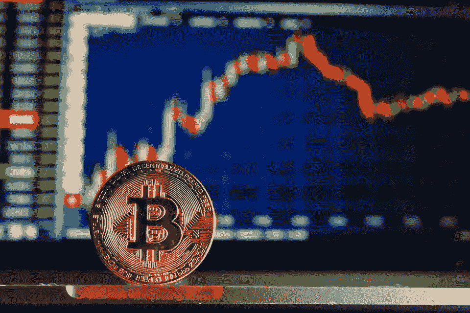

# 我是如何过度举债使自己被遗忘的——一个隐秘贪婪的故事

> 原文：<https://medium.com/coinmonks/how-i-overleveraged-myself-into-oblivion-a-story-of-crypto-greed-165353b13d70?source=collection_archive---------46----------------------->

[https://pixabay.com/service/license/](https://pixabay.com/service/license/)

我长期持有 crypto。我真诚地相信这项技术及其对世界的深远影响。自 2016 年以来，我一直在我冰冷的钱包里保存着强有力的东西，它被安全地存放在从未见过阳光的地方。

但是在 2021 年，我尝试做一些新的事情。我被关于如何使用我的密码的广告轰炸…