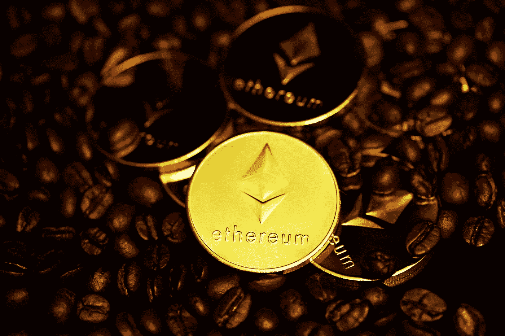

# 我如何从我的读者那里收到加密货币

> 原文：<https://medium.com/coinmonks/how-i-receive-cryptocurrency-from-my-readers-6fe5f148986?source=collection_archive---------56----------------------->

Photo by [Kanchanara](https://unsplash.com/@kanchanara?utm_source=medium&utm_medium=referral) on [Unsplash](https://unsplash.com?utm_source=medium&utm_medium=referral)

你有没有和你的读者分享过你的区块链演讲，希望他们能给你一些帮助？你不会再那样做了…

来自社区的支持是一件伟大的事情。它不仅仅意味着收入，更是对你工作的一种反馈。有专业作家和技术极客从他们发布的平台上赚钱，但海洋中除了鲸鱼还有其他鱼类(更正:鲸鱼是哺乳动物)。

如果你不想通过托管自己的网站来赚取自己或第三方的广告，如果你不是 Medium.com 的专业作家，你还是有希望从你的作品中获益的。给我买杯咖啡是个很棒的项目。我 [*使用它*](http://buymeacoffee.com/iscream) 并且非常喜欢它，但是除了它的许多好处之外，它也有一些缺点:

*   需要注册
*   你需要一个 Stripe 账户
*   存款前你必须达到一个支付限额
*   它还不支持加密货币
*   你不能把它整合到 Medium.com 这样的网站(只链接如下)

**如果我告诉你，你可以在你的文章中直接要求你的读者给你发一些乙醚，你会怎么样？**

你的读者(如果你在区块链主题中发布)可能已经用元掩码设置了他们的浏览器，他们的以太正在他们的账户上。他们需要做的只是验证(或修改)金额，点击一个按钮，并在 MetaMask 中确认交易。

为此你只需要 [*在*](https://sendeth2.me/generate) *[https://sendeth2.me](https://sendeth2.me) 上生成自己的链接* ，并分享到 Medium.com 上。通过使用“嵌入”标志，将只显示一个表单，因此它可以集成到 Medium.com(或任何其他使用[嵌入](https://embed.ly)的平台)。如果没有“embed”标志，将生成一个到 sendeth2.me 主页的链接，登录页面上的表单将使用输入的数据填充。

无论选择哪种类型，都有两种形式的链接可用。一个用于传统的查询参数，这样开发人员可以很容易地进行更改(甚至是通过编程)。而另一种类型只包含散列，这是以完整形式包含在文章中的更好方式。

您的读者不必在第三方网站上注册，他们不需要有一个 Stripe 帐户。发送以太将在他们的指尖。他们的金额会在下一个区块开采后尽快到达你的账户，只扣除 1%的“开发”费。没有额外的隐藏费用*(当然，交易将有通常的交易费用，这取决于所选网络的实际天然气价格)*。

总而言之……如果你觉得这个项目有用，或者有任何改进的想法，请发一封[邮件](mailto:kisshanzsa.software@gmail.com)告诉我。顺便说一下，如果你觉得你能从中受益，考虑支持它，以便它能进一步发展。你决定哪种方式更好:

# 普通以太坊地址

> 0x 778 bee 312 ea 9674955 c 7 c 0 ba 5d 68 b 2 e b8 e 2c 05

# SendEth2.me 链接

> 【https://sendeth2.me/db752c209fe97ad5e75460acb2263631229fedc 

# SendEth2.me 嵌入

[https://sendeth2.me/embed/db752c209fe97ad5e75460acb2263631229fedc2](https://sendeth2.me/embed/db752c209fe97ad5e75460acb2263631229fedc2)

# 给我买杯咖啡

> [http://buymeacoffee.com/iscream](http://buymeacoffee.com/iscream)

 [## 佐尔坦·基什是 Java、web、移动和区块链开发者……所有东西的开发者。

### 嘿👋我帮过你吗？如果没有，请让我知道我该如何…

buymeacoffee.com](https://buymeacoffee.com/iscream) 

> 加入 Coinmonks [Telegram group](https://t.me/joinchat/Trz8jaxd6xEsBI4p) 并了解加密交易和投资