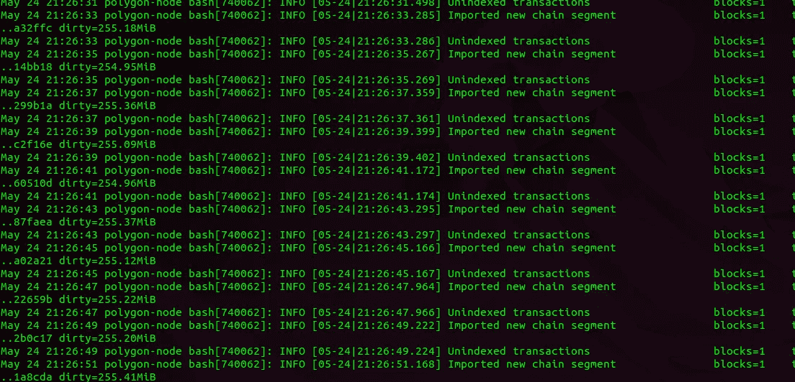

# 我如何为 Flashloan 机器人运行多边形节点

> 原文：<https://medium.com/coinmonks/how-i-run-a-polygon-node-for-flashloan-bots-71229e1a905d?source=collection_archive---------1----------------------->

## 尽可能少用固态硬盘，以节省资金

Bor Logs

## 摘要

*   设置一个多边形节点至少需要 8 个小时。
*   运行一个节点的成本是每月 470 美元。
*   使用修剪过的 Bor 快照来节省资金。