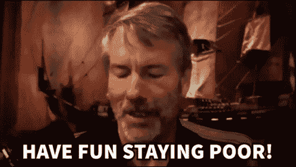
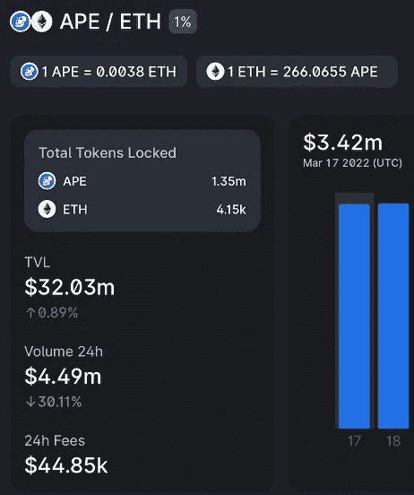
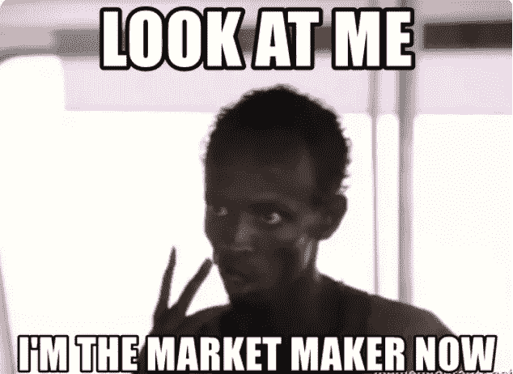

# 我如何像对待出租财产一样对待加密

> 原文：<https://medium.com/coinmonks/how-i-treat-crypto-like-rental-property-9fe1abc78323?source=collection_archive---------15----------------------->

当迈克尔·塞勒第一次谈到比特币是人类的最高财产时，我无法理解。我无法理解 crypto 的所有权如何与纽约市曼哈顿中央公园的一个街区相提并论。许多人会认为人类无法在区块链上生存。然而，随着物理世界和数字世界之间的距离越来越近，我相信有一天加密将成为我们日常生活的一部分，就像互联网连接现在是一种必需品一样。

随着 DeFi 的复兴，密码的实用性大大增加了。加密可以像属性一样对待，因为它具有类似于属性的实用配置文件。例如，最常见的财产所有权的被动收入形式是租金收入，密码也可以出租有收益。

房产的高额首付通常是从出租房产创造被动收入的主要障碍，尤其是对年轻投资者而言。然而，crypto 的所有权让拥有任何规模投资组合的虾米们获得了被动收入。

以下是我的经验，我希望它能给你一些启示和鼓励，让你开始探索 DeFi，它可能什么都不是。

一些投资者更喜欢资本收益而不是现金流，反之亦然。我个人更喜欢两者的混合。因为正现金流有助于满足我的渴望，它起到了即时满足的作用，但与此同时，我能够将这些短期收益融入我的长期投资组合。Uniswap 为我提供了每日多巴胺剂量，因为我可以随时查看我的每日回报。这可能是最好的风险调整平台，如果不是产量农业。

虽然大多数 apes 和 degens 在上市当天都变成了 ApeCoin，但 Uniswap 的流动性提供商在短短两天内就获得了总计 700 万美元的费用。

在传统金融领域，证券交易所的流动性提供者或做市商是一种合法的职业。流动性提供者有助于确保买方和卖方都能即时获得交易资产。市场上没有流动性，买卖双方就无法交易。

Uniswap 允许任何规模的散户投资者在没有大量前期资本的情况下，从流动性池中获得被动收入。这就像从房产中获得租金收入，但无需支付大笔首付，而且没有任何麻烦。

Uniswap 旨在通过自动化做市商流程在 DeFi 中创造流动性。该协议将交易费用返还给流动性提供者。该机制还取消了对用户的身份要求，任何人都可以为任何一对令牌创建流动性池。我最喜欢的是 USDC 联邦理工学院和 BTC 联邦理工学院，因为如果这些包的价格低于我设定的价格范围，我不介意拿着它们。

DeFi 就像是金融界的蛮荒之地，我没有资格评论安全风险。但是，这种方法仅适用于以下情况:

1.如果价格低于设定的范围，袋子持有弱势令牌

2.如果池中的任何一个令牌超出上限，则增益有限

3.如果你喜欢把握市场时机，那么你会从波动交易中赚更多的钱

当以太坊的价格在设定的范围内时，流动性提供者将收到交易费，然而当价格超出范围时，流动性被视为无效。无效期间不收取交易费用。这就像在空置期间，你的出租房屋里没有房客一样。因此，设定一个合适的范围至关重要。

使用 2022 年 3 月的数据说明多边形网络上 ETH/USDC 对的更合理回报。稳定在 2500 美元到 3500 美元的区间就能锁定大部分收益。在撰写本文时，预期回报率至少为 30%的年化利率(APR ),因为总会有至少 5%的流动性提供者超出范围且无效。

*参考 APR 工作链接:*[*https://docs . Google . com/spreadsheets/d/1 jbtmxbzb 9 qcxx 8 _ 3s mabl 4g ijvq-bldsv 6 udu 7 u-A/edit # GID = 0*](https://docs.google.com/spreadsheets/d/1jXBTMXbzb9qCXX8_3sSmAbl4Gijvq-bldsV6udu7U-A/edit#gid=0)

如果价格低于初始流动性池头寸设定的价格范围，我将永远不会取消我的流动性池头寸，因为这会导致流动性池无效。我只是等待价格回升，这样流动资金池就会发挥作用，继续耕种。如果它超出了这个范围，你可以移除流动性来获利，或者等到它回到这个范围，这样流动性池就会有效，并再次开始耕种。就像我不会因为我出租的房产暂时空置就卖掉它一样。

最后，像所有的 DeFi 应用程序一样，交易在几分钟内完成，而且总是不需要许可的。就我个人而言，我更喜欢探索 DeFi，而不是与房地产代理商和租户打交道。

感谢阅读，敬请关注更多 DeFi 内容！

*作为我新年决心的一部分，我将分享我与 crypto 的经历，以讲述由工作中的朋友们启发的更好的故事。*

*免费 crypto &股票连同启动你旅程的推荐:*[*https://docs . Google . com/spreadsheets/d/1 f2bx-xkvmezorxdzqavgckina1 PME _ uI9pa _ c4l 4-DM/edit？usp =共享*](https://docs.google.com/spreadsheets/d/1f2bX-xKvmEzOrxDZqAvgCkIna1pmE_uI9pa_C4l4-DM/edit?usp=sharing)

> 加入 Coinmonks [电报频道](https://t.me/coincodecap)和 [Youtube 频道](https://www.youtube.com/c/coinmonks/videos)了解加密交易和投资

# 另外，阅读

*   [MXC 交易所评论](/coinmonks/mxc-exchange-review-3af0ec1cba8c) | [Pionex vs 币安](https://coincodecap.com/pionex-vs-binance) | [Pionex 套利机器人](https://coincodecap.com/pionex-arbitrage-bot)
*   [如何在印度购买比特币？](/coinmonks/buy-bitcoin-in-india-feb50ddfef94) | [WazirX 评论](/coinmonks/wazirx-review-5c811b074f5b)
*   [联合国硬币评论](https://coincodecap.com/unocoin-review) | [最佳加密赌注硬币](https://coincodecap.com/best-crypto-staking-coins)
*   [如何使用 MetaMask Wallet 获得 KCC 地址？](https://coincodecap.com/kcc-address-metamask)
*   [如何获得自己的。XYZ 领域？](https://coincodecap.com/xyz-domain)