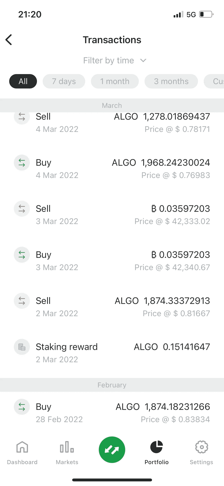
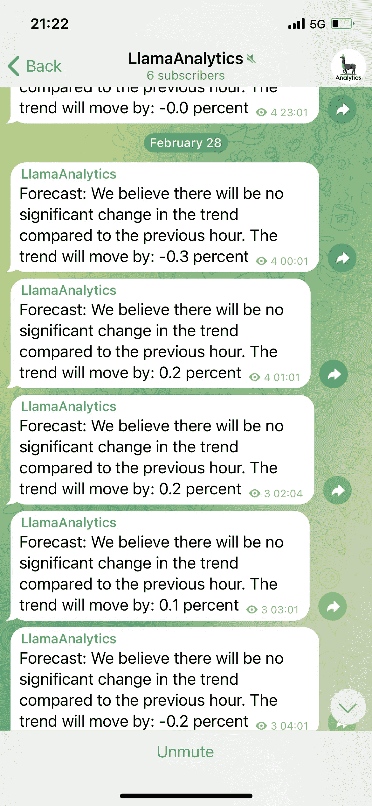
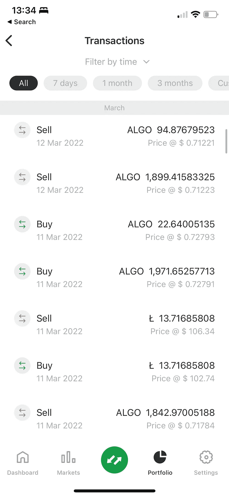
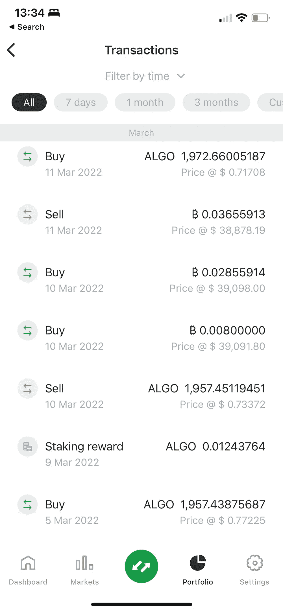

# 我是如何从 1，804 阿尔格兰德涨到 1，994 阿尔格兰德的，趋势跟随的故事(附:我一直没怎么注意)

> 原文：<https://medium.com/coinmonks/how-i-went-from-1-804-algorand-to-1-994-algorand-the-tales-of-trend-following-p-s-1ee4c7378926?source=collection_archive---------40----------------------->

这篇文章，我想知道我们是否有一个产品是可行的，或者不是在我们的免费组，因为我想知道我们正在提供人们关注我们的价值(它是免费的，但注册是困难的)。有人问我，你给我们一个信号，但我们该怎么办。

# 假设:-

所以主要模型遵循比特币我的第一个假设是，Algorand 遵循比特币的大趋势变化。

某些加密货币在一定时期内会比算法运行得更快。

在熊市(大幅下跌趋势)留在比特币，比直接在阿尔格兰德好。

# 我没有做的事情(懒惰交易):-

*   睡眠——我没有利用我所有的夜间趋势变化，除非我因为某种原因醒着。所以我大部分时间都在睡觉！！
*   没有机器人——我的一些家庭成员说他们不能创建或使用机器人，所以我没有写任何代码来利用信号中所有可能的交易或使用任何其他人的机器人。

虽然我可能在我的底层加密，但这并不意味着我在菲亚特！这个想法只是为了创造更多的密码…测试我的信念，我可以保护我的大部分法定价值。

# 目标

我的目标是利用我们创建的模型产生的趋势来增加我的潜在加密价值，表现得像一个投资者，他可能只是在特定的基础上遵循该模型，即

*   如果我忙着忽略群消息；
*   带着年幼的孩子去睡觉大多是在平时；
*   不要编码任何东西来交易，我必须承认我被诱惑了！

以上是我没有做的事情，但我觉得我需要解释为什么我选择不这样做！

# 你为什么要这么做？

所以这一点是，我想看看 1 小时信号是否可以用来保护我的加密位置。

如果你没有读过我以前的文章，我和我的团队一直对我们正在做的加密分析民主化感兴趣。也许它没有得到很好的解释，也许一些关于在下行市场出售密码的文章对一些人来说太有争议了！

# 那么发生了什么(我是怎么从 1804 阿尔格兰德涨到 1994 的)

头几天我错过了几笔交易！

这是我的交易

由于我的限制，我没有优化模型预测的波动。以下是我第一天可能做的交易的一部分

那么在 1968 年 3 月 4 日，我做了哪些交易(我很懒！)但我保护了一些我的价值？！你可以免费加入这个小组，看看我能做些什么。

# 以下是我的下一笔交易

我们可以看到，我也交易其他硬币来增加我在阿尔格兰德的头寸，有涨有跌。

# 优化我的位置:-

所以我应该在趋势变化高于/低于+/-0.5%的时候交易更多。如果我那样做了，我会增加我的算法。我也可以在醒着的时候每小时检查一次，这也会增加我潜在的 Algorand 位置。

如果你有兴趣看我以前做这个的信号，那么请加入电报组。

 [## llamaa 分析

### 使用机器学习和人工智能加密交易信号

t.me](https://t.me/LlamaAI) 

> 加入 Coinmonks [电报频道](https://t.me/coincodecap)和 [Youtube 频道](https://www.youtube.com/c/coinmonks/videos)了解加密交易和投资

# 另外，阅读

*   【Crypto.com 评论】|[【T4 评论】](/coinmonks/crypto-com-review-f143dca1f74c)
*   [如何在加拿大购买加密货币？](https://coincodecap.com/how-to-buy-cryptocurrency-in-canada)
*   [无聊猿游艇俱乐部(BAYC)评论](https://coincodecap.com/bored-ape-yacht-club-bayc-review)
*   [5 款最佳加密交易终端](https://coincodecap.com/crypto-trading-terminals) | [最佳 DeFi 应用](https://coincodecap.com/best-defi-apps)
*   [最佳网上赌场](https://coincodecap.com/best-online-casinos) | [币安评论](/coinmonks/binance-review-ee10d3bf3b6e) | [BitMEX 评论](https://coincodecap.com/bitmex-review)
*   [麻雀交换评论](https://coincodecap.com/sparrow-exchange-review) | [纳什交换评论](https://coincodecap.com/nash-exchange-review)
*   [美国最佳加密交易机器人](https://coincodecap.com/crypto-trading-bots-in-the-us) | [经常性回顾](https://coincodecap.com/changelly-review)
*   [在印度利用加密套利赚取被动收入](https://coincodecap.com/crypto-arbitrage-in-india)