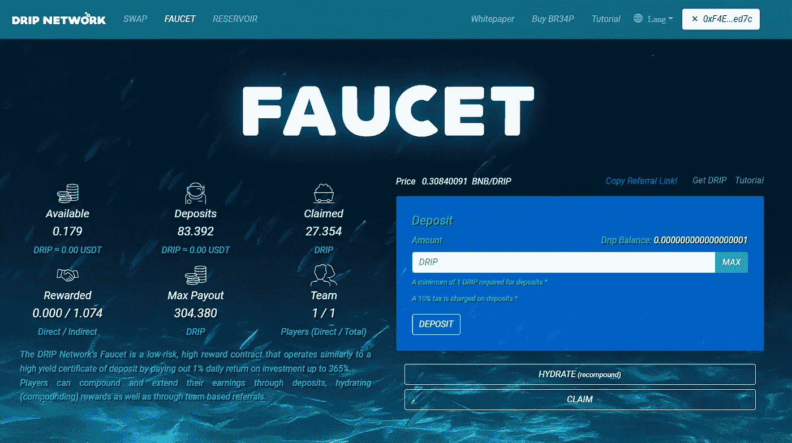
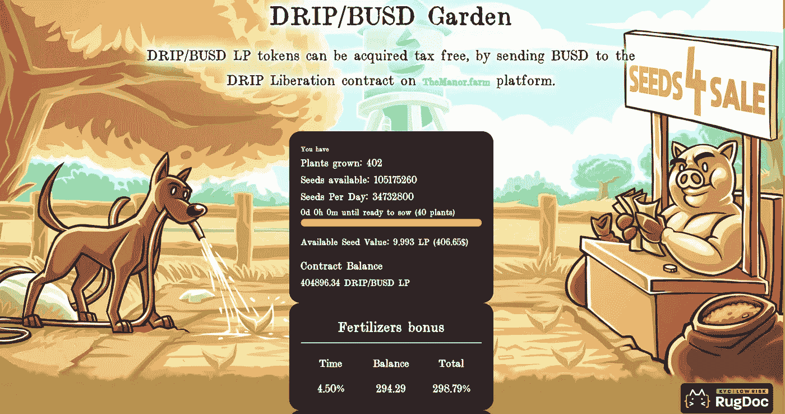
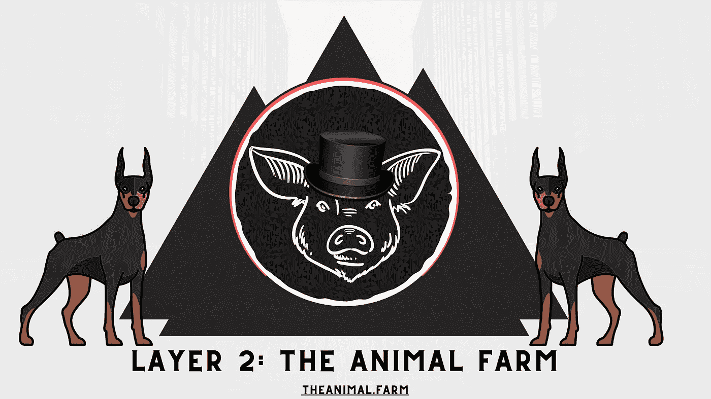
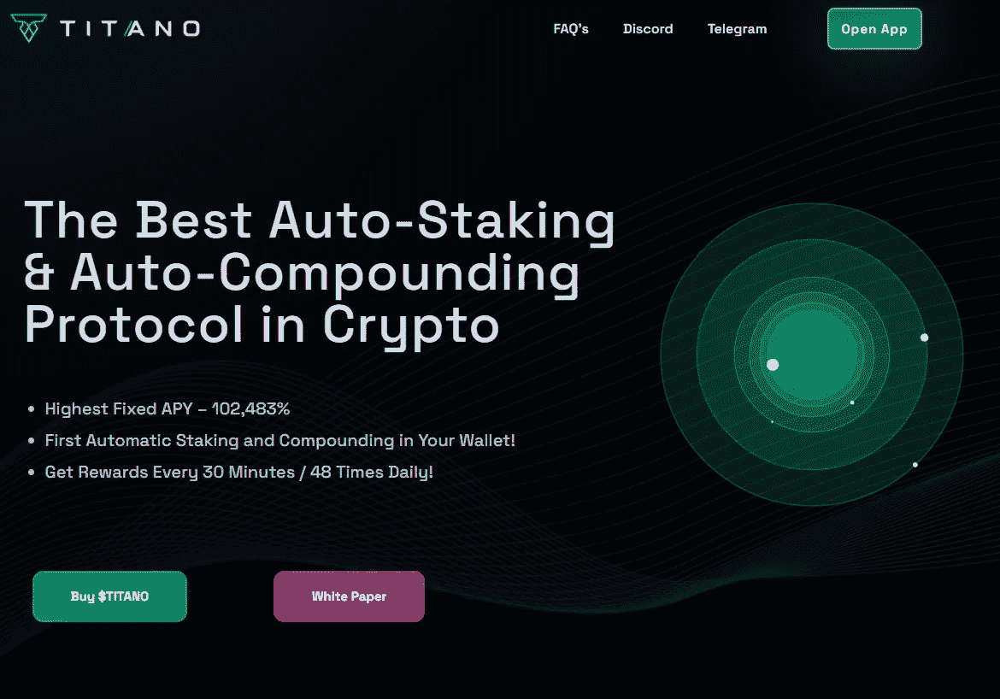
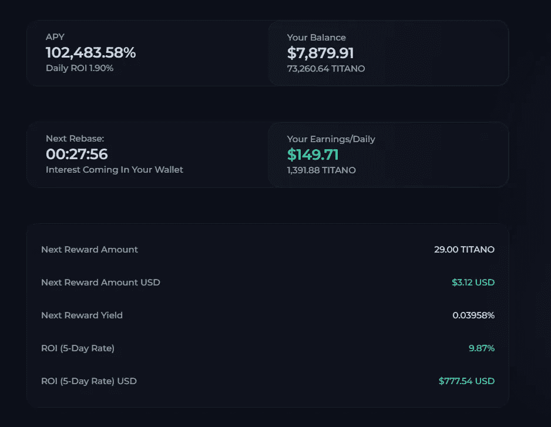

# 我是如何通过分散式融资快速接近每天 500 美元的被动收入的

> 原文：<https://medium.com/coinmonks/how-im-quickly-approaching-500-passive-income-per-day-with-decentralized-finance-1987bbb6e7f7?source=collection_archive---------0----------------------->

听起来已经像个骗局了，对吧？我明白你的意思——在看到加密货币项目带有荒谬的 apr、apy 和被动收入流后，我是过去六个月中 DeFi(去中心化金融)的最大怀疑者之一。没有什么比看到一个类似 Craigslist 的营销宣传“只存 1000 美元，30 天内获得 100 倍的收益”更让人觉得“庞氏骗局”了。

你很幸运——我喜欢冒险——并且愿意把我的钱投入到工作中。在过去的两年里，我在 NFTs、P2E 游戏和 altcoins 上取得了成功——我觉得我欠自己一份责任，至少要在自己定义的所有领域进行自我教育。

介绍滴水，滴水花园，动物农场和提塔诺。这篇文章不是为了解释战略、购买指南、令牌学或白皮书，而是简单地记录我的旅程并展示被动收入的真实证据。

# **点滴**

正如你在下图中看到的，滴滴支付的日投资回报率为 1%，最高可达 365%。玩家可以通过存款、水合(复利)奖励以及基于团队的推荐来增加和扩大他们的收入。

当价格在 40 美元左右时，我只用了 2000 美元就进入了滴滴。在把 10%的存款税放进水龙头后，我只剩下 45 英镑的启动资金。从那以后，我再也没有要求任何滴油——只有当可用余额达到 0.5 滴时，我的每日回报才会增加(补水)。

才一个多月，我的余额几乎翻了一倍。截至今天，滴滴的价格在 131 美元左右。这相当于每天约 110 美元(不含滴滴税和滴滴价格波动)。

# **滴水园**

1%的日回报率对滴滴社区来说是不够的，因为他们想要一些更激进、更冒险的东西。进入滴水园。

通过将 BUSD 发送到 [TheManor.farm](https://themanor.farm/referrals/0xF4E97404af021fda7a425359a81F195E3A70ed7c) 平台上的滴滴解放合同，可以免税获得滴滴/BUSD LP 代币。

简而言之——这是一个滴滴和 BUSD 配对的流动性池。

根据当前的采矿效率，滴滴/BUSD LP 花园游戏每天产生 3%的收益(1095%的 APR)。收获效率随着你和其他动物购买植物、收获种子和复利而上升和下降。游戏的目的是收获种子，比其他动物收获得更快更频繁。这反过来会让你收获更多的种子，收获更快。使用你的每日种子收获(滴/BUSD LP)购买更多的植物将在 30 天或更短的时间内使你的种子增加 3 倍。

我在进入水龙头后不久就进入了滴水花园，并且已经能够更快地将我的收入复合。我最初的 1000 美元存款为我带来了大约 50 株植物，我一直使用和水龙头一样的策略——将我每天的收益复合。

如你所见，我在花园里种了多达 402 株植物，并拿着 LP 代币在 2/3/22 动物农场发布时收割(在本文后面解释)。

402 工厂每天生产 13.4 株新植物，目前每株 10 美元——每天 134 美元。

# **动物农场**

[动物农场](https://theanimal.farm/referrals/0xF4E97404af021fda7a425359a81F195E3A70ed7c)冒险进一步进入滴滴生态系统——第二层将有两个本地令牌，DOGS 和猪。你将通过养猪管理代币积累你的网络份额，同时通过 substrata lending protocol 利用你的抵押资产收集高收益 BUSD 股息，而无需出售你的基础资产。

尽管 BUSD 预售、DOGS/猪预售已经结束，但随着代币找到价格，提前进入动物庄园可能会在头几天产生疯狂的回报。

动物农场将于 2 月 3 日 22 日启动。我将很快写一个简单的指南，告诉你如何在它发布前参与进来。

# **提塔诺**

还记得我说过可笑的 APYs 吗？

老实说，我不知道提塔诺会怎么样。当价格在 0.01 美元到 0.02 美元之间时，我花了大约 500 美元，打算全赔。在旁听了多个 ama，参与了不和谐的讨论，并看到我获得回报的速度有多快之后——他们让我成为了一名信徒。

固定的 APYs 浮动的红利意味着你永远不知道你会得到多少代币。其他 DeFi 协议支付的 APY 很高，一天内可能波动 90%。TAP (Titano auto-staking protocol)向$TITANO 持有者支付 1.8999%的日固定利率或 102，483.58%的年复利，这是行业最高水平。

快速调整奖励。其他流行的赌注协议每 8 小时支付一次重置奖励，这意味着如果你想取消赌注，你必须计时以获得最大奖励。Titano 自动赌注协议每 30 分钟支付一次，即每天支付 48 次，是加密中最快的自动赌注协议。

正如你所看到的自动下注的力量和轻微的价格升值，Titano 目前每天为我赚了 150 美元。

# **最终想法**

我们都看过阿尔伯特·爱因斯坦迷因谈论复利是世界第八大奇迹。一点时间加上耐心可以为你和你的家庭带来财务自由。

DeFi 真正创造了一种被动收入的手段，这种手段是中央金融永远不敢与世界其他地区分享的，以保持对银行系统的垄断。在每个加密货币 DeFI 项目中产生这些类型的奖励现实吗？可能不会——这就是为什么你应该总是做你自己的研究，并在每个项目的白皮书/记号经济学上自学。

感谢您花时间阅读我的旅程。我将继续记录我的进展，以此证明这些不是庞氏骗局，被动收入是真实的！

# 💧💧加入我的团队！💧💧

[**不和谐**](https://discord.gg/DhGNDdRUyk) :我的不和谐服务器刚刚上线！加入服务器 [**这里**](https://discord.gg/DhGNDdRUyk) 讨论滴滴、DeFi，以及任何与加密货币相关的东西。

**奖金**:加入违抗逻辑团队(下面是好友地址)，购买 1.12 滴以上(在水龙头里至少存 1 滴)，领取 **0.5 滴**报名奖金。这是我对你帮助 DeFy Logic 社区成长的感谢。消息 DeFyLogic on [Discord](https://discord.com/invite/DhGNDdRUyk) 确保您收到奖金！

**鲸鱼奖金**:买 112 滴(水龙头存 100 滴)以上，我送一个 **5 滴**签约奖金。

**好友地址:**[**0 xf4e 97404 af 021 FDA 7a 425359 a81 f 195 E3 a 70 ed 7 c**](http://drip.community/faucet?buddy=0xF4E97404af021fda7a425359a81F195E3A70ed7c)

# +奖励步骤:利用滴滴生态系统实现利润最大化

如果你真的想优化你的收入，去滴滴花园的[**themanor . farm**](https://themanor.farm/referrals/0xF4E97404af021fda7a425359a81F195E3A70ed7c)网站，在那里，使用 [**我的好友链接**](https://themanor.farm/referrals/0xF4E97404af021fda7a425359a81F195E3A70ed7c) ，你可以获得利润，随着时间的推移，你的总收入甚至可以翻一番！你可以在这里 阅读白皮书 [**。**](https://theanimal.farm/docs/The_Manor_Farm_and_The_Animal_Farm_Pre_Sale,_Farm_Mechanics_&_LP.pdf)

热爱滴滴生态系统？看看 [**动物庄园**](https://theanimal.farm/referrals/0xF4E97404af021fda7a425359a81F195E3A70ed7c) ！随着 L2 解决方案即将推出，您不想错过提前进入**的机会。**